# SQL Server

自定义登录名步骤：

1. 选择Windows身份登录
2. 选择安全性--登录名--右击登录名，选择新建登录名
3. 选择服务器角色给用户授权
4. 最后重启登录

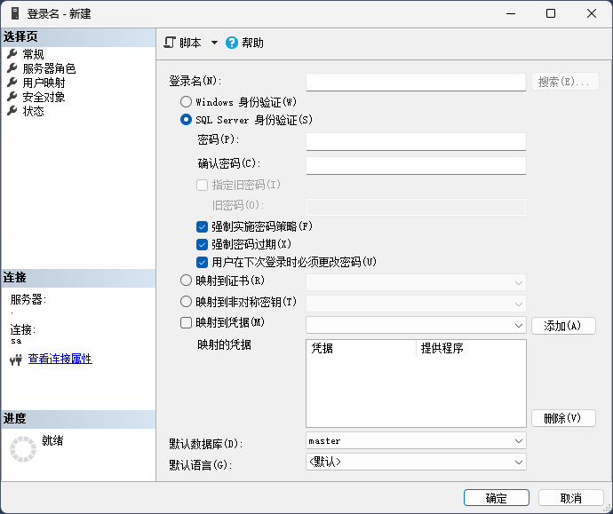

## 备份还原数据库

```sql
-- 备份数据库到指定位置
backup database test_db to disk='D:/test_db.bak'
-- 使用指定的备份我还能还原数据库
restore database test_db from disk='D:/test_db.bak'
-- 差异备份
backup database test_db to disk='D:/test_db_one_dif.bak' with differential
-- 差异备份还原--完整备份集还原
restore database test_db from disk='D:/test_db.bak' with replace,norecovery
-- 第二次差异备份还原
restore database test_db from disk='D:/test_db_on_dif.bak' with recovery
-- 事务日志备份
backup log test_db to disk='D:/test_db_log.bak'
-- 备份日志尾部
backup log test_db to disk='D:/test_db_log.bak' with init,no_truncate
-- 先试用完全备份集还原
restore database test from disk='D:/test_db.bak' with replace,norecovery
-- 通过事务日志还原到某个时间点（删除或修改数据之前）
restore database test from disk='D:/test_db.bak' with recovery,stopat='2022-10-10 10:10:10'
```

### 遇到问题


1. 在还原时可能会提示`尚未备份数据库 "db_name" 的日志尾部`，需要被日志才可执行还原：

```sql
backup log [test] to disk='D:/SQLServerBak/test_log.bak' with norecovery;
```

2. 也可能提示`无法获得对数据库的独占访问权`，需要先断开所有用户链接，并回滚所有事务：

```sql
alter database test_tb set offline with rollback immediate
```

还原完毕后让数据库上线：

```sql
alter database test_db set online
```

3. 差异还原时要先还原完整备份，在执行差异还原，并且在此之前要执行一次日志备份。

## 常用SQL语句

### 查询指定数据库的对象（表、视图、储存过程、约束）

```sql
-- 查询test数据库的所有表
select * from test..sysobjects where xtype = 'U'
-- P：储存过程
-- D：默认值
-- V：视图
-- PK：主键
-- F：外键
-- UQ：唯一键
-- TR：触发器

------------------------------------------------------
-- 查询表的所有列信息
select * from syscolumns where id = object_id('Employee')
```

### 添加约束语句

```sql
alter table table_name add constraint 约束名
primary key(column_name) / foreign key(column_name) references table_name(column_name) /
unique(column_name)/
check(逻辑表达式)
default(默认值) for column_name
```

### 修改表语句

```sql
-- 添加一列
alter table table_name add column_name nvarchar(20) null
-- 删除一列
alter table table_name drop column column_name
-- 修改一列
alter table table_name alter column column_name int null
-- 修改列名
-- 语法：sp_rename '表名.旧列名', '新列名', 'COLUMN';
EXEC sp_rename 'YourTableName.OldColumnName', 'NewColumnName', 'COLUMN';
```

### 创建索引语句

一张表只能有一个聚集索引，解决索引决定了表中数据行的物理储存顺序，它根据索引键的值对数据进行排序，数据按照这个顺序在磁盘上储存。

```sql
-- 聚集索引
create clustered index index_name on table_name(column1,column2...) 
with
(
    -- on 删除原来的，创建一个新的
    -- off不删除原来的，提示一个错误
   drop_existing=on
)
-- 唯一非聚集索引，不指定默认非聚集
create unique nonclustered index index_name on table_name(column1,column2...)
with
(
    drop_existing=on,
    pad_index=on,-- 是否索引填充，设置fillfactor才有用
    fillactor=50,-- 指定创建索引时，每个索引页的数据占索引页大小的百分比
    ignore_dup_key=on -- 唯一索引列插入重复值会忽略重复值
)
```

## 储存过程

创建语法：

```sql
create procedure/proc pro_name
(
-- 参数列表
)
as begin
-- SQL语句集合
end

-- 执行储存过程
exec pro_name
```

### 参数与局部变量

定义参数语法：

```sql
@paramName 数据类型(长度)
-- 如：
@username varchar(20)
-- 示例：
create proc addDept
@dept_name nvarchar(20),
@dept_no nvarchar(20)
as begin
insert into dept(dept_name,dept_no) values(@dept_name,@dept_no)
end
-- 调用
exec addDept '财务部','005'
```

局部变量在储存过程或触发器内部使用的变量，用户自定义，先声明赋值，再使用。

作用：程序执行过程中，暂存数据。

定义局部变量语法：

```sql
declare @变量名 数据类型(长度)
-- 如：
declare @count int
示例：
-- 修改存储过程，设置返回值
ALTER PROC addDept
    @dept_name NVARCHAR(20),
    @dept_no NVARCHAR(20)
AS
BEGIN
    DECLARE @returnValue INT;
    BEGIN TRY
        INSERT INTO Dept (dept_name, dept_no)
        VALUES (@dept_name, @dept_no);
        SET @returnValue = 1; -- 成功返回1
    END TRY
    BEGIN CATCH
        SET @returnValue = 0; -- 失败返回0
    END CATCH
    RETURN @returnValue;
END;
-- 执行存储过程并接收返回值
DECLARE @result_val INT;
EXEC @result_val = addDept '财务部', '006';
-- 查看返回值
SELECT @result_val AS '存储过程返回值';
```

### 创建视图

```sql
--创建标准视图
create view 视图名
as
  --T-SQL语句
（select UserId,UserName from UserInfos）

-- 创建索引视图
(* 必须写字段名,表名前面要所有者 dbo)
create view 视图名  with schemabinding
as
select UserId,UserName,Age from dbo.UserInfos
go
-- 索引视图创建唯一聚集索引
create unique clustered index uq_vUserInfos_Index
on vUserInfos_Index(UserId)
go
-- 分区视图 
create view vTestInfos
as
select * from Test
union all
select * from Test3
go

```


## 常用函数

- 字符串操作函数

```sql
--返回字符串中指定的子串出现的开始位置
select charindex('bc','abcdbc')  -- 2  
--返回字符串中指定的子串出现的开始位置  子串前后必须带% 
select patindex('%bc%','abcdbc')  --2
--大小写转换
select upper('ABCdefg') --ABCDEFG 
select lower('ABCDEF')  --abcdef
--去空格
select ltrim('   dbcd   ') --'dbcd   ' 去掉左边的空格
select rtrim('   dbcd   ') --'   dbcd' 去掉右边的空格
--取长度
select len('ABC')
--字符串翻转
select reverse('abcdefg') --gfedcba 
--字符串替换 
select replace('abcdefg','cd','ss') 
--用指定子串替换指定位置指定长度的子串后生成的字符串
select stuff('abcdefg',2,3,'tt') --attefg
--取子串
select left('dbcddfeef',4) --dbcd   返回字符串从左边起4个字符
select right('dbcddfeef',6)--ddfeef 返回字符串从打开边起6个字符
select substring('dbcddfeef',3,4) --cddf 返回字符串从左边起第3个开始,取4个字符
--将指定字符串重复4次后生成的字符串
select replicate('abc',4) --abcabcabcabc
```

- 类型转换函数

```sql
-- convert函数：
convert(类型(长度), 表达式)

-- cast函数：
cast(表达式 as 类型)
-- 示例：
select 'cbd'+ convert(varchar,2) --把数字转换成字符串,拼接
select convert(varchar(10),getdate(),100) ---日期格式
select cast('2019-11-13 00:00:00.000' as varchar(20)) 
select 'cbd'+ cast(2 as varchar) --要转换成的目标数据类型
```

- 日期函数

```sql
--GETDATE()	返回当前日期和时间
--DATEPART()	返回日期/时间的单独部分
--DATEADD()	在日期中添加或减去指定的时间间隔
--DATEDIFF()	返回两个日期之间的时间
--CONVERT()	用不同的格式显示日期/时间
select convert(varchar,getdate(),100)  --10 14 2021 10:23PM
select convert(varchar,getdate(),120)    --2021-10-14 22:24:14
select convert(varchar(20),getdate(),20)  --2021-10-11 22:27:05
select convert(varchar(20),getdate(),101)  --10/11/2021
select convert(varchar(20),getdate(),102)   --2021.10.14
select convert(varchar(20),getdate(),103)   --11/10/2021
select convert(varchar(20),getdate(),104)   --11.10.2021
select convert(varchar(20),getdate(),105)   --11-10-2021
select convert(varchar(20),getdate(),106)   --11 10 2021
select convert(varchar(20),getdate(),107)   --10 11, 2021
select convert(varchar(20),getdate(),108)   --22:43:05
select convert(varchar(20),getdate(),110)   --10-11-2021
select convert(varchar(20),getdate(),111)   --2021/10/11
select convert(varchar(20),getdate(),112)   --20211011
select convert(varchar(30),getdate(),121)   --2021-10-11 22:46:09.080  21
```

## 条件分支

```sql
-- if使用：
if(表达式)
begin
-- 处理逻辑
print('年轻人')
end
else if(表达式)
begin
-- 处理逻辑
print('不讲武德')
end
else
begin
-- 处理逻辑
print('搞偷袭')
end
---------------------------
-- case使用（同MySQL）：
case  
when  列名= 条件值1   then  选择项1
when  列名=条件值2    then  选项2
.......
else    默认值 end
---------------------------
-- while循环
while @a <= 10
 begin    
       select @a+1
       select @a       
 end
```

## 函数

注意点：

1. 创建的时候，指定了函数所有者，调用时必须指定函数所有者
2. 调用时，如果函数中指定了默认值，调用时，使用默认值，就直接参数就直接用default代替，如果没有默认值，返回就是null

- 标量函数

```sql
create function [函数所有者].函数名（参数名 数据类型[=默认值]）
returns 返回值类型
as
begin
   ---T-SQL语句（不可以有修改数据的操作）
   return 表达式/值
end
-- 示例：
create function [dbo].GetUserAgeNew(@userId int)
returns int
-- with encryption：对函数进行加密，任何人都无法直接查看函数的原始代码
as
begin
   declare @age int
   select @age=Age from UserInfos where UserId=@userId
   return @age
end
-- 函数调用
select dbo.GetUserAgeNew(3) as 年龄
select dbo.GetUserAgeNew(default) as 年龄--使用默认值
```

- 表值函数

功能上相当于一个参数化的视图。返回 表   没有begin  end

```sql
create function [函数所有者].函数名（参数列表  类型[=默认值]）
returns table -- 返回类型，只能是表
as
return(Select语句)
-- 示例：
create function [dbo].GetUserInfo(@userId int)
returns table
as
return (
  select UserId,UserName,Age,DeptId from UserInfos
  where UserId=@userId
)

-- 函数调用
select * from dbo.GetUserInfo(27)
```

- 声明表值函数

```sql
-- 语法：
语法 ：
create function [函数所有者].函数名（参数名  类型[=默认值],参数名  类型）
returns @users table (表结构定义)
as
begin
   -- 函数体
   Insert into @users(....) select .....
   return 
end

-- 示例：
create function [dbo].SearchUsers(@uName varchar(50))
returns @users table (
  Id int not null primary key,
  UName varchar(50) not null,
  UAge int null
)
as 
begin
   -- 函数体
   -- insert 插入
   insert into @users(Id,UName,UAge)
   select UserId,UserName,Age from UserInfos
   where UserName like '%'+@uName+'%'
   return  -- 后面什么也不跟
end

-- 调用
select * from dbo.SearchUsers('a')
```

## 游标与事务

### 游标

游标是对数据查询结果集的一种访问机制，用户对结果集进行逐条访问。可以理解为：定义在特定结果集上的指针，控制这个指针，遍历  数据集或指定特定的行。

游标的作用：定位到结果集中的某一行，对当前位置的数据进行读写。

缺点：  数据读取出来放到内存，内存空间有限，如果数据量太大，内存空间不足

适用于：数据量小的情况。

注：一般来说，能使用其他方式处理数据时，最好不要使用游标，除非是其他方式都无法处理时，才使用，不适合数据量大的情况。

- 游标分类

游标分为：静态、动态、只进、键集驱动游标。

静态游标：在打开游标时，会将结果集复制到一个临时表中。此后，游标对结果集的操作都基于这个临时表，而不直接与原始表交互。

动态游标：与静态游标相反，动态游标反映了在游标打开期间原始表中数据的所有更改。当游标滚动时，它会实时获取最新的数据。

只进游标：不支持滚动，从头读到尾，对数据库所做更改在提取时是可见的。只进不退。提取后所做的更改是不可见的

键集驱动游标：打开游标时，表中各个成员身份、顺序是固定的。结果集被一组唯一标识符标识，被标识列更改时，滚动游标时，是可见的；没被标识的列，则不可见

游标对比：

1. 只进游标 ：不支持滚动，提取时可见提取后不可见  ----只读取数据
2. 静态游标：在滚动时，检测不到表数据的变化，消耗的资源相对比较少   最佳选择
3. 动态游标 ：在滚动时，检测到表数据的变化，消耗的资源相对比较多    性能低

**游标生命周期**：

1. 声明
2. 打开
3. 读取数据
4. 关闭
5. 释放

语法：

```sql
declare 游标名  cursor  （static/dynamic )  local/global   局部/全局
for
t-sql查询语句
open 游标名    --打开游标
declare @varCursor cursor,........（变量列表）   定义游标变量
set @varCursor=游标名
-- 读取   next：下一条	prior：上一条	first：多一条	last：最后一条	absolute n：绝对位置		relative n：从当前位置开始的第n条
fetch next from 游标变量名 into 变量列表    -- 游标前进  into 赋值
while @@fetch_status=0   --判断是否执行成功
begin
    --处理
    fetch next from 游标变量名 into 变量列表   -- 游标前进  into 赋值
end
close 游标名       --关闭游标
deallocate 游标名   --释放游标

----------------------------------------------------

-- 示例：
declare employee_cursor cursor local
for
select emp_name,birthday,dept_id,gender from Employee where gender = '男'
open employee_cursor
declare @varCursor cursor,@empName nvarchar(20),@birthday date,@deptId int ,@gender char(2)
set @varCursor=employee_cursor
fetch next from @varCursor into @empName,@birthday,@deptId,@gender
while @@FETCH_STATUS=0
begin 
-- 也可修改数据
-- if @empName='李世民'
-- update employee set ...... where ......
print @empName + ',' + cast(@birthday as varchar) + ',' + cast(@deptId as varchar) + ',' + @gender
fetch next from @varCursor into  @empName,@birthday,@deptId,@gender
end
close employee_cursor
deallocate employee_cursor
```

游标可放在储存过程和函数中。

### 事务

事务分为显式事务和隐式事务，这两者使用中都需要开启-提交或回滚的过程。语法：

```sql
-- 显式事务：
begin try
begin transaction/tran  
-- 更新操作

commit transaction/tran
end try

begin catch
rollback transaction/tran
-- 其他操作
end catch
------------------------------------
-- 隐式事务
set implicit_transactions on 

set implicit_transactions off
```

- **隔离级别**

1. read committed，默认隔离级别
2. read uncommitted
3. repeatable read
4. serializable

设置隔离级别：

```sql
set transaction isolation level 隔离级别
```

# Ado.Net

Ado.Net是一种数据访问技术，使用应用程序可以连接到数据库，并以各种方式来操作其中的数据。它是一个COM组件库。

Ado.Net类封装在System.Data.dll中，System.Data命名空间，提供不同的Ado.Net类。

## Ado.Net类库组成


### Data Provider（数据提供程序）

Data Provider用于连接数据库、执行命令、检索结果。

包括：

1. SQLServer数据提供程序      System.Data.SqlClient命名空间
2. OLEDB的数据提供程序      System.Data.Oledb命名空间
3. ODBC的数据提供程序      System.Data.Odbc命名空间
4. Oracle数据提供程序      System.Data.OracleClient命名空间

MySQL提供程序需要下载第三方类库实现。

每种提供程序包括4个对象：

1. Connection：提供与数据源的连接--SqlConnection
2. Command：用于执行数据库命令的对象--SqlCommand
3. DataReader：从数据源中提供快速的、只读的数据流--SqlDataReader
4. DataAdapter：提供DataSet对象与数据源的桥梁（桥接器）--SqlDataAdappter

#### SqlConnection

SqlConnection继承与DbConnection抽象类，常用属性：

1. ConnectionString：连接字符串
2. State：连接状态（Closed、Open、Connection、Executing、Fatching、Broken）
3. DataBase连接的数据库
4. DataSource：数据源（SQLServer实例名）

常用方法：

1. Open：打开连接
2. Close：关闭连接，可再次打卡
3. Dispose：释放连接，不可再次打开，连接字符串会被重置

##### 连接字符串

它是一组被格式化的键值对，指明数据源在哪里，数据库名是什么，提供什么样访问信任级别，其他相关信息（最大、小连接数，超时等）。

格式：一组元素组成，一个元素---键值对，各个元素之间 ; 隔开。

- Sql server 身份验证

`Data Source=数据源; Initial Catalog=数据库名; User Id=账号; Password=密码`

`Server=.;DataBase=数据库名;UId=账号;Pwd=密码;Pooling=true;Max Pool Size=5;Min Pool Size=0`

连接池参数可选

- Windows身份验证

`Data Source=数据源;Initial Catalog=数据库名; Integrated Security=True/SSPI Trusted_Connection=True`

`Server=.;DataBase=数据库名;Integrated Security=true`

##### SqlCommand对象

重要属性：

1. Connection:     SqlCommand对象使用的SqlConnection对象
2. CommandText:  获取或设置要执行的T-SQL语句或存储过程名
3. CommandType:  要执行的命令的类型：CommandType.Text--执行的是一个Sql语句；CommandType.StoredProcedure --执行的是一个存储过程
4. Parameters:  SqlCommand对象的命令参数集合Transaction:  获取或设置要在其中执行的事务

三个执行方式：

1. cmd.ExecuteNonQuery();  返回受影响的行数 （适用于：insert update delete）
2. cmd.ExecuteScalar();   执行查询语句，返回第一行第一列的值 ，返回类型object
3. cmd.ExecuteReader();   执行查询语句，返回SqlDataReader数据流

- **使用示例**

```C#
internal class Program
    {
        public static void sqlReaderTest()
        {
            string connStr = "Data Source=.;Initial Catalog=test;User Id=sa;Password=123456";
            
            using (SqlConnection connection = new SqlConnection(connStr))
            {
                connection.Open();
                var sqlCommand = connection.CreateCommand();
                string sql = "select * from Employee";
                sqlCommand.CommandText = sql;
                var dr = sqlCommand.ExecuteReader(CommandBehavior.CloseConnection);
                while (dr.Read())
                {
                    //通过列名获取
                    // Console.WriteLine($"{dr["id"]}--{dr["emp_name"]}--{dr["birthday"]}--{dr["dept_id"]}--{dr["gender"]}");
                    //通过索引获取
                    // Console.WriteLine($"{dr[0]}--{dr[1]}--{dr[2]}--{dr[3]}--{dr[4]}");
                    //获取指定字段的索引
                    var idIndex = dr.GetOrdinal("id");
                    //指定返回类型
                    var id = dr.GetInt32(0);
                    var empName = dr.GetString(1);
                    var birthday = dr.GetDateTime(2);
                    var deptId = dr.GetInt32(3);
                    var gender = dr.GetString(4);
                    Console.WriteLine($"{id}--{empName}--{birthday}");
                }
                dr.Close();
            }
        }
    	// SqlParameter使用示例：
        public static void sqlParameterTest()
        {
            string sql = "select * from Employee where emp_name = @empName";
            
            string connStr = "Data Source=.;Initial Catalog=test;User Id=sa;Password=123456";
            using (SqlConnection connection = new SqlConnection(connStr))
            {
                connection.Open();
                var sqlCommand = connection.CreateCommand();
                sqlCommand.Parameters.Add(new SqlParameter("@empName", "李世民"));
                sqlCommand.CommandText = sql;
                var dr = sqlCommand.ExecuteReader();
                while (dr.Read())
                {
                    // other code
                }
                dr.Close();
            }
        }
    }
```

**SqlParameter说明**

常用属性：

1. DbType 参数的
2. SqlDbType（数据类型 数据库的类型而言）   
3. Direction  参数的类型：输入  输出  输入输出、返回值参数 ，使用存储过程是会用到
4. ParameterName 参数的名称    
5. Size  最大大小 字节为单位   
6. Value 参数的值   
7. SqlValue 作为SQL类型的参数的值

如：

```C#
SqlParameter pra1 = new SqlParameter();
pra1.ParameterName = "@userName";//参数名
pra1.SqlDbType = SqlDbType.VarChar;//数据类型
pra1.Value = "admin";//参数值
pra1.Size = 20;//大小
```

### DataSet（临时数据库）

非连接的核心组件，独立于任何数据源的数据访问，用于多种不同的数据源。

包含一个或多个DataTable对象的集合，这些对象由行、列、主键、外键、约束、关系组成。          

设计目的：为了独立于任何数据源的数据访问，可以用于不同的数据源。          

断开式连接的核心组件，可以将软件的数据库部分数据加载到DataSet中，进行暂存或二次处理等。

#### DataTable

DataTable是内存中的一个表（数据库中的一个表）；它是DataSet中的成员，可以独立创建与应用，结合DataAdapter使用

架构：列和约束来表示DataColumn列

成员：行 DataRow

构造函数：DataTable()、DataTable(表名)

常用属性：Columns列集合、Rows行集合、Contraints约束集合、DataSetDataTable所属的DataSet、PrimaryKey主键、TableName表名

方法说明：

1. AcceptChanges() 提交更改 
2.  RejectChanges() 回滚更改  
3.  Clear(）清空数据  
4. Copy() 复制架构和数据  
5. Clone() 只复制架构，不包含数据  
6. Load(IDataReader)通过提供的IDataReader，用某个数据源的值来填充DataTable
7. Merge(DataTable) 合并  指定的dt合并到当前的dt里  
8. NewRow()创建一个DataRow,与Dt具有相同的架构  
9. Reset()将dt重置到最初状态。  
10. Select()  获取dt所有的行的数组 （条件，排序）

#### DataSet

成员：一组DataTable组成，DataRelation 相互关联，一起实施了数据的完整性

结合DataAdapter使用：

1. DataAdapter将数据填充到DataSet中
2. DataAdapter将DataSet中的更改提交到数据库
3. XML文档或文本加载到DataSet中

作用：DataSet将数据加载到内存中来执行，提高了数据访问的速度，提高硬盘数据的安全性，程序运行的速度和稳定性。 

特性：独立性：不依赖于任何数据库， 离线和连接。 数据视图   数据操作：灵活性强

#### DataRelation

创建约束—— 限制数据  定义规则：

```C#
dt1.PrimaryKey = new DataColumn[] { dt1.Columns[0] };//主键 --主键约束
dt2.Constraints.Add(new UniqueConstraint("uc", dt2.Columns[1]));//添加一个唯一约束
dt1.Constraints.Add(new ForeignKeyConstraint("fk",dt2.Columns[0], dt1.Columns[3]));//外键约束 
```

创建关系 ——外键关系   一对一   一对多   多对多；默认情况，建立关系会自动在父表中添加唯一约束，子表中添加外键约束。

```C#
DataRelation relation = new DataRelation("relation", dt2.Columns[0],  dt1.Columns[3],true);
ds.Relations.Add(relation);//添加到ds.Relations中
```

使用关系——相互读取数据

```C#
DataRow[] rows = dr.GetChildRows(relation);   --通过父表读子表
DataRow row = dt1.Rows[1].GetParentRow(relation);   --通过子表读父表
```

#### 具体使用

```C#
namespace DataTableStudy
{
    internal class Program
    {
        public static void Main(string[] args)
        {
            DataTable dt1 = new DataTable();
            dt1.TableName = "sys_user";
            dt1.Columns.Add(new DataColumn("id", typeof(int)));
            dt1.Columns.Add("username", typeof(string));
            dt1.Columns.Add("dept_id", typeof(int));
            //设置主键
            dt1.PrimaryKey = new DataColumn[] { dt1.Columns[0] };
            DataTable dt2 = new DataTable("sys_dept");
            dt2.Columns.Add("id", typeof(int));
            dt2.Columns.Add("dept_name", typeof(string));
            dt2.PrimaryKey = new DataColumn[] { dt2.Columns[0] };
            //添加外键
            // dt1.Constraints.Add(new ForeignKeyConstraint("fk", dt2.Columns[0], dt1.Columns["dept_id"]));
            DataSet ds = new DataSet();
            ds.Tables.Add(dt1);
            ds.Tables.Add(dt2);
            // 添加关系
            ds.Relations.Add(new DataRelation("fkre", dt2.Columns["id"], dt1.Columns["dept_id"]));
            DataRow dr2 = dt2.NewRow();
            dr2["id"] = 1;
            dr2["dept_name"] = "销售部";
            // RowState:Added
            dt2.Rows.Add(dr2);
            var dr1 = dt1.NewRow();
            dr1["id"] = 1;
            dr1["username"] = "张居正";
            dr1["dept_id"] = 1;
            dt1.Rows.Add(dr1);
            // 通过父表读子表
            var childRows = dt2.Rows[0].GetChildRows(ds.Relations[0]);
            // 通过子表读父表
            var parentRow = dt1.Rows[0].GetParentRow(ds.Relations[0]);
            var dr11 = dt1.NewRow();
            dr11["id"] = 2;
            dr11["username"] = "司马光";
            dr11["dept_id"] = 1;
            // 在指定位置插入一行
            dt1.Rows.InsertAt(dr11,1);
            var dr12 = dt1.NewRow();
            dr12["id"] = 3;
            dr12["username"] = "霍光";
            dr12["dept_id"] = 1;
            dt1.Rows.Add(dr12);
            //RowState: Modifyed
            dt1.Rows[0]["username"] = "诸葛亮";
            // 删除指定数据
            dt1.Rows.Remove(dr1);
            // 删除指定索引数据
            dt1.Rows.RemoveAt(0);
            // 将行标记为删除状态--RowState：Deleted，这行数据依旧在Rows中
            dt1.Rows[0].Delete();
            // 提交修改；RowState：UnCHanged
            dt1.AcceptChanges();

            var dataRows = dt1.Select();
            var select = dt1.Select("id>1 and username='张居正'","id desc,username asc");
        }
    }
}
```

### SqlDataAdapter

SqlDataAdapter：桥接器或适配器，DataSet与数据库之间用于检索和保存数据的桥梁。

SqlDataAdapter 对数据的操作也是建立在SqlCommand基础之上的。

它可以通过Fill将数据填充到DataSet里，通过Update更改提交到数据库    使数据保持一致。

四个重要属性：

1. SelectCommand，查询SqlCommand
2. InsertCommand，插入记录
3. UpdateCommand，更新数据库记录
4. DeleteCommand，删除记录

具体使用：

```C#
namespace SqlDataAdapterStudy
{
    internal class Program
    {
        private static string connStr = "Server=.;DataBase=test;Uid=sa;Pwd=123456;Pooling=true;Max Pool Size=100";

        public static void Main(string[] args)
        {

        }
		// 手动配置相关命令
        public static void handleConfigParams()
        {
            string sql = "select * from Employee";
            var employee = new DataTable();
            using (SqlConnection conn = new SqlConnection(connStr))
            {
                SqlCommand cmd = new SqlCommand(sql, conn);
                SqlDataAdapter sdd = new SqlDataAdapter(cmd);
                sdd.Fill(employee);
                
                // 手动配置命令
                SqlCommand updateCommand =
                    new SqlCommand("update employee set emp_name = @empName where id = @id", conn);
                SqlParameter[] sqlParams = new SqlParameter[]
                {
                    new SqlParameter("@empName", "司马昭"),
                    new SqlParameter("@id", 5)
                };
                updateCommand.Parameters.AddRange(sqlParams);
                sdd.UpdateCommand = updateCommand;
                sdd.Update(employee);
            }
        }
        // 自动配置相关命令
        public static void autoConfigParams()
        {
            string sql = "select * from Employee";
            var employee = new DataTable();
            using (SqlConnection conn = new SqlConnection(connStr))
            {
                SqlCommand cmd = new SqlCommand(sql, conn);
                SqlDataAdapter sdd = new SqlDataAdapter(cmd);
                // 直接传入sql语句与连接字符串方式创建，效率低
                // var sdd = new SqlDataAdapter(sql,connStr);
                // 直接传入sql语句与连接方式创建
                // var sdd = new SqlDataAdapter(sql,conn);
                // 无需显式打开连接  conn.Open()
                sdd.Fill(employee);
                var first = employee.Rows[0];
                first["emp_name"] = "张亮";
                // 并没有从数据库中删除
                employee.Rows.RemoveAt(10);
                employee.Rows[5].Delete();
                var add1 = employee.NewRow();
                add1["emp_name"] = "司马懿";
                add1["birthday"] = "1010-10-10";
                add1["dept_id"] = 2;
                add1["gender"] = "男";
                employee.Rows.Add(add1);
                // 自动为adapter配置相关命令：UpdateCommand、DeleteCommand、InsertCommand
                SqlCommandBuilder builder = new SqlCommandBuilder(sdd);
            }
        }
		// 开启事务
        public static void useTransaction()
        {
            SqlTransaction tran = null;
            using (SqlConnection conn = new SqlConnection(connStr))
            {
                conn.Open();
                try
                {

                    tran = conn.BeginTransaction();
                    // do something
                    
                    tran.Commit();
                }
                catch (SqlException e)
                {
                    tran.Rollback();
                }
                
            }
        }
    }
}
```

#### SqlDataAdapter与SqlDataReander比较

相同点：执行查询，将数据读取出来，都可读取一个或多个结果集（`select * from t1;select * from t2`）;

SqlDataReader提供一种从数据库中读取数据的流的方式

SqlDataAdapter是DataSet与数据库之前的一个桥接器

性能比较：

|         | 速度               | 占用内存 | 连接状态   | 适用数量 | 读取方式           | 是否可读       |
| ------- | ------------------ | -------- | ---------- | -------- | ------------------ | -------------- |
| Reader  | 快                 | 小       | 一直占用   | 小       | 从头到尾，只进不退 | 只读，不能修改 |
| Adapter | 慢（数据小不明显） | 大       | 断开与连接 | 大       | 任意读取           | 可读可写       |

## Entity Framework

### 使用

1. 选中项目新建项

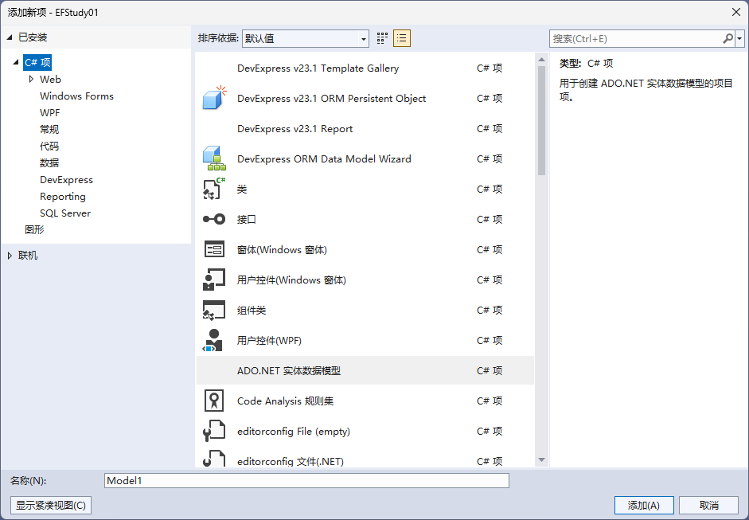


2. 选择ADO.NET实体数据模型，输入模型名称，如BookDbModel，点击添加

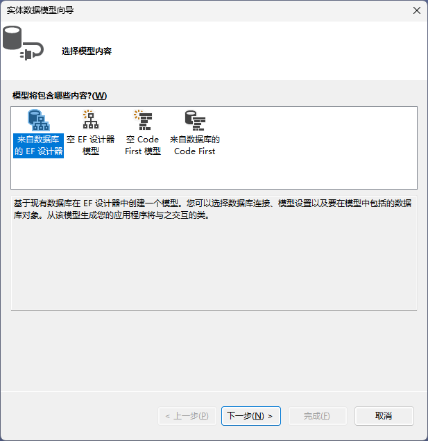

3. 选中【来自数据库的EF设计器】，下一步

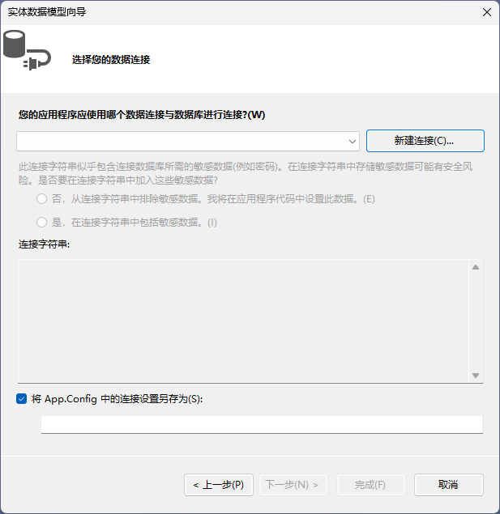

4. 新建连接

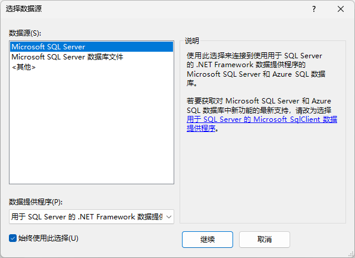

5. 选择数据源

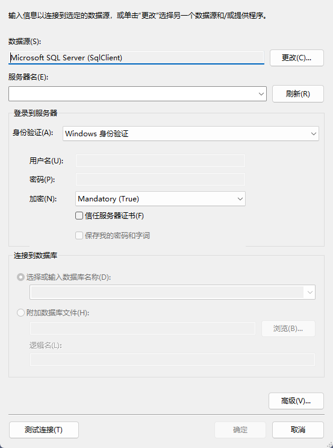

6. 输入数据库相关信息，点击确定

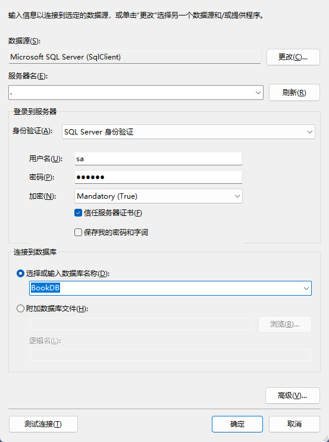

7. 之后跳转到这个页面，选择【是，在连接字符串中包括敏感数据】，点击下一步

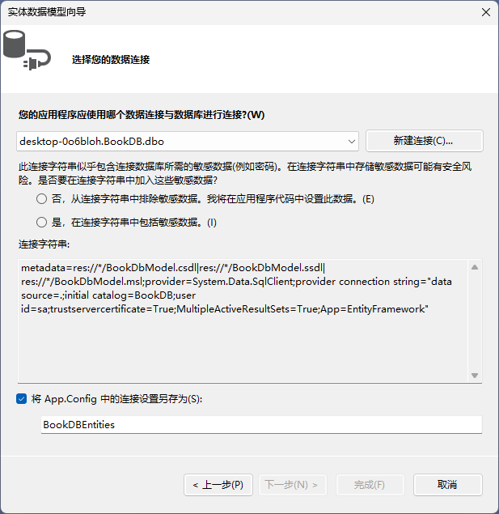

8. 选择要导入的表、视图、函数和储存过程，下面三个选项都可勾选，点击完成。

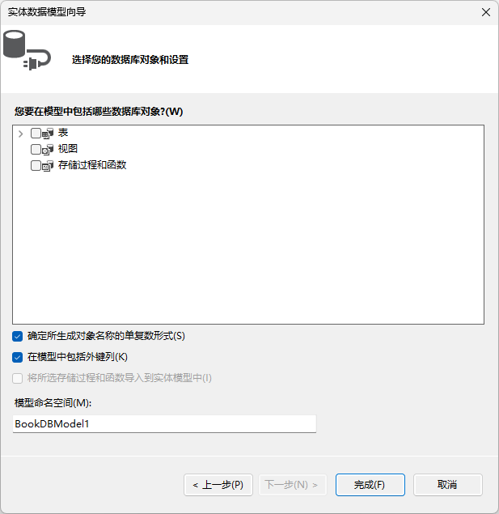

创建完成后，生成的信息如下：

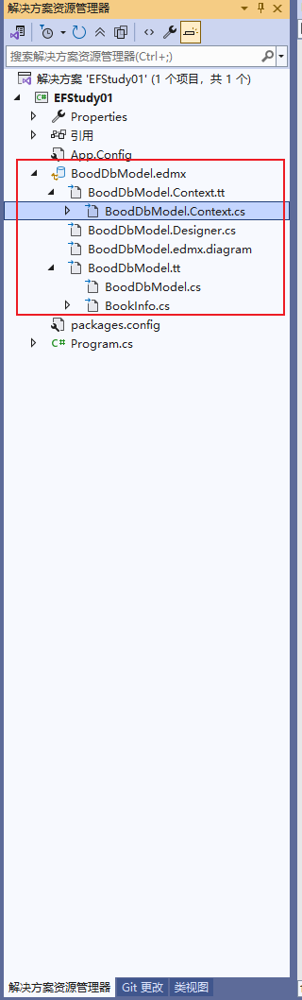

主要的类：

- BookDbModel.Context.cs

```java
namespace EFStudy01
{
    using System;
    using System.Data.Entity;
    using System.Data.Entity.Infrastructure;
    
    public partial class DbBookContext : DbContext
    {
        public DbBookContext()
            : base("name=connStr")
        {
        }
    
        protected override void OnModelCreating(DbModelBuilder modelBuilder)
        {
            throw new UnintentionalCodeFirstException();
        }
    
        public DbSet<BookInfo> BookInfoes { get; set; }
    }
}
```

它是与数据库与应用程序之间的桥梁，负责管理与数据库的交互，包括数据的查询、插入、更新和删除等操作。

`DbSet<TEntity>` 代表数据库中的一个表，这里 `BookInfoes` 属性表示 `BookInfo` 实体对应的数据库表。通过这个属性，可以对 `BookInfo` 实体进行各种数据库操作。例如，使用 `DbBookContext` 对象获取 `BookInfoes` 集合后，可以使用 LINQ 语句进行查询。

```C#
using (var context = new DbBookContext())
{
    var books = context.BookInfoes.Where(b => b.Price > 50).ToList();
}
```

### 代码使用

```C#
namespace EFStudy002
{
    internal class Program
    {
        public static void Main(string[] args)
        {
            // InsertData();
            // DeleteData();
            exeSql();
        }
        

        public static void ETUse()
        {
            using (SchoolDbContext context = new SchoolDbContext())
            {
                context.Database.Log += c => Console.WriteLine($"sql: {c}");
                // 立即执行查询
                // 立即执行查询情况：Find、遍历时、Count()、ToList();
                var teacher = context.Teachers.Find(1);
                // 延迟查询
                var queryable = context.Teachers.Where(t => t.TeacherId > 1);
                // 遍历时执行查询
                foreach (var teacher1 in queryable)
                {
                    Console.WriteLine(teacher1);
                }

                var count = context.Teachers.Count();
            }
        }

        public static void InsertData()
        {
            Teacher teacher = new Teacher()
            {
                TeacherName = "李陵",
                Department = "兵法系"
            };
            using (SchoolDbContext context = new SchoolDbContext())
            {
                context.Database.Log += c => Console.WriteLine($"sql: {c}");
                context.Teachers.Add(teacher);
                // 提交修改
                context.SaveChanges();
                Console.WriteLine(teacher);
            }
        }
        /// <summary>
        /// context.Teachers.Attach(teacher)只是附加到DataSet中，状态为UnChanged，需要修改State为Modified，提交后才会更新数据
        /// 字段为null，也会覆盖数据库的数据，只更新某个字段，需要通过指定
        ///     context.Entry<Teacher>(teacher).Property("TeacherName").IsModified = true;
        ///     context.Entry<Teacher>(teacher).Property("Department").IsModified = false;
        /// 
        /// </summary>
        public static void UpdateData()
        {
            Teacher teacher = new Teacher()
            {
                TeacherId = 12,
                TeacherName = "卫青"
            };
            using (SchoolDbContext context = new SchoolDbContext())
            {
                context.Database.Log += c => Console.WriteLine($"sql: {c}");
                // 
                context.Teachers.Attach(teacher);
                var entityState = context.Entry(teacher).State;
                // UnChanged
                Console.WriteLine($"entity state: {entityState}");
                // 修改数据状态为Modified，才会提交到数据库中修改，null字段也会覆盖数据库字段
                context.Entry(teacher).State = EntityState.Modified;
                // 指定哪些字段要修改
                context.Entry<Teacher>(teacher).Property("TeacherName").IsModified = true;
                context.Entry<Teacher>(teacher).Property("Department").IsModified = false;
                // 提交修改
                context.SaveChanges();
                Console.WriteLine(teacher);
            }
        }
        /// <summary>
        /// 调用context.Teachers.Remove，传入的对象不能是手动new出来的，要先查找
        /// 批量删除数据可以先查找出列表，然后修改实体状态为Deleted
        /// </summary>
        public static void DeleteData()
        {
            using (SchoolDbContext context = new SchoolDbContext())
            {
                context.Database.Log += c => Console.WriteLine($"sql: {c}");
                var find = context.Teachers.Find(12);
                 // Teacher teacher = new Teacher()
                 // {
                 //     TeacherId = 12,
                 //     TeacherName = "卫青",
                 //     Department = "兵法系"
                 // };
                // 抛出异常：System.InvalidOperationException: The object cannot be deleted because it was not found in the ObjectStateManager.
                // context.Teachers.Remove(teacher);
                context.Teachers.Remove(find);
                context.SaveChanges();
            }
        }

        public static void exeSql()
        {
            using (SchoolDbContext context = new SchoolDbContext())
            {
                var list = context
                    .Database
                    .SqlQuery<Teacher>("select * from Teachers where TeacherId > @id",new SqlParameter("@id", 2));
                foreach (var teacher in list)
                {
                    Console.WriteLine(teacher);
                }

                var result = context
                    .Database
                    .ExecuteSqlCommand("update Teachers set Department = @dept where TeacherId = @id",
                        new SqlParameter("@dept","建筑系"),new SqlParameter("@id",7));
                Console.WriteLine(result);

                var first = context.Database.SqlQuery<string>("select Department from Teachers").First();
                Console.WriteLine(first);
            }
        }
    }
}
```

### EF创建Code First

在选择模型时选择Code First，其余步骤同上。

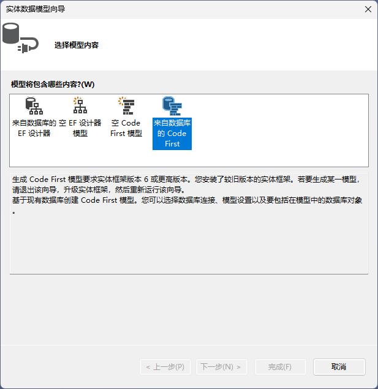

创建后代码文件如下：

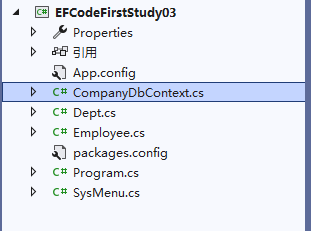

```C#
namespace EFCodeFirstStudy03
{
    public partial class CompanyDbContext : DbContext
    {
        public CompanyDbContext()
            : base("name=CompanyDbContext")
        {
        }

        public virtual DbSet<Dept> Depts { get; set; }
        public virtual DbSet<Employee> Employees { get; set; }
        public virtual DbSet<SysMenu> SysMenus { get; set; }

        protected override void OnModelCreating(DbModelBuilder modelBuilder)
        {
            modelBuilder.Entity<Dept>()
                .HasMany(e => e.Employees)
                .WithRequired(e => e.Dept)
                .WillCascadeOnDelete(false);
        }
    }
    [Table("Employee")]
public partial class Employee
{
    [Key]
    public int EmpId { get; set; }

    [Required]
    [StringLength(20)]
    public string EmpName { get; set; }

    public int DeptId { get; set; }

    [Column(TypeName = "date")]
    public DateTime? birthday { get; set; }

    public virtual Dept Dept { get; set; }
}
    [Table("Dept")]
public partial class Dept
{
    [System.Diagnostics.CodeAnalysis.SuppressMessage("Microsoft.Usage", "CA2214:DoNotCallOverridableMethodsInConstructors")]
    public Dept()
    {
        Employees = new HashSet<Employee>();
    }

    public int DeptId { get; set; }

    [StringLength(30)]
    public string DeptName { get; set; }

    [System.Diagnostics.CodeAnalysis.SuppressMessage("Microsoft.Usage", "CA2227:CollectionPropertiesShouldBeReadOnly")]
    public virtual ICollection<Employee> Employees { get; set; }
}
    [Table("SysMenu")]
public partial class SysMenu
{
    [Key]
    public int MenuId { get; set; }

    [Required]
    [StringLength(20)]
    public string MenuName { get; set; }

    public byte? MenuType { get; set; }

    [StringLength(30)]
    public string MenuIcon { get; set; }

    public DateTime? CreateTime { get; set; }

    public DateTime? UpdateTime { get; set; }

    public int? ParentId { get; set; }
}
}
```

如果需要在数据库中添加一张表：

```sql
create table Product(
	ProductId int identity(1,1) primary key,
	ProductName nvarchar(50) not null,
	Price decimal(8,2) default 0,
	Descrption nvarchar(100) 
)
```

步骤如下：

1. 创建对应实体类

```C#
namespace EFCodeFirstStudy03
{
    [Table("Product")]
    public partial class Product
    {
        [Key]
        public int ProductId { get; set; }
        [Column("Product")]//字段名与数据库列名相同可以不用写
        [Required]
        [StringLength(50)]
        public string ProductName { get; set; }
        [Column("decimal")]
        public decimal Price {  get; set; }
        [Column("Description")]
        public string Description {  get; set; }

    }
}
```

2. 修改CompanyDbContext

```C#
namespace EFCodeFirstStudy03
{
    public partial class CompanyDbContext : DbContext
    {
        public CompanyDbContext()
            : base("name=CompanyDbContext")
        {
        }

        public virtual DbSet<Dept> Depts { get; set; }
        public virtual DbSet<Employee> Employees { get; set; }
        public virtual DbSet<SysMenu> SysMenus { get; set; }
        //添加代码
        public virtual DbSet<Product> Products { get; set; }

        protected override void OnModelCreating(DbModelBuilder modelBuilder)
        {
            modelBuilder.Entity<Dept>()
                .HasMany(e => e.Employees)
                .WithRequired(e => e.Dept)
                .WillCascadeOnDelete(false);
            //也可在这配置字段映射关系
            //modelBuilder.Entity<Product>()
            //    .Property(p => p.ProductName).HasColumnName("ProductName").IsUnicode(true);
        }
    }
}
```

### 使用迁移

打开步骤：

1. 选择视图->其他工具->程序包管理控制台

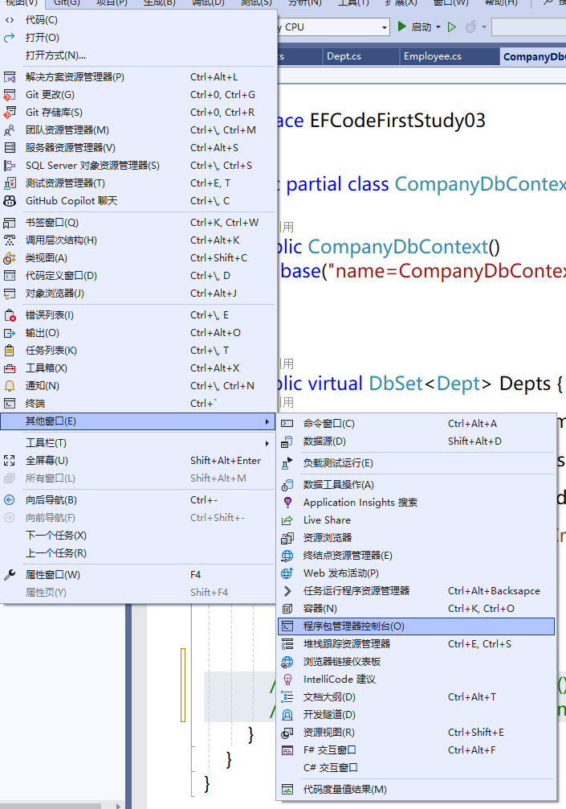

2. 输入`enable-migrations -force`。`-force`如果已经启动了，就强制启动

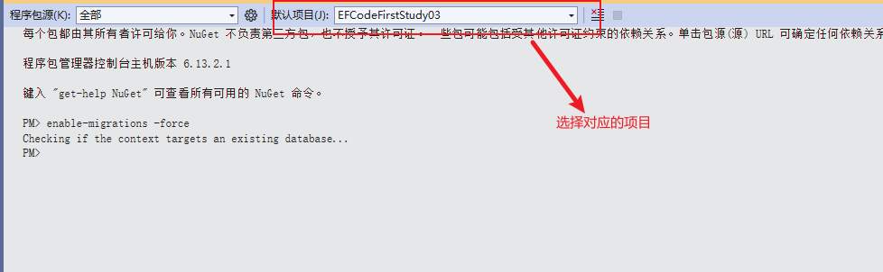

3. 添加一个版本：`add-migration v1`。`v1`版本名称

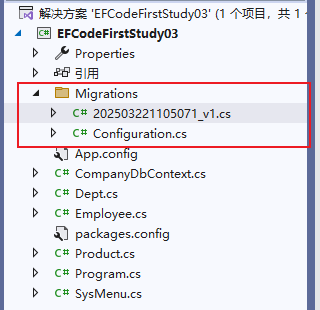

在版本描述文件中描述了向下向上还原的步骤：

```C#
namespace EFCodeFirstStudy03.Migrations
{
    using System;
    using System.Data.Entity.Migrations;
    
    public partial class v1 : DbMigration
    {	
        // 表已创建，此方法中代码可以删除
        public override void Up()
        {
            CreateTable(
                "dbo.Dept",
                c => new
                    {
                        DeptId = c.Int(nullable: false, identity: true),
                        DeptName = c.String(maxLength: 30),
                    })
                .PrimaryKey(t => t.DeptId);
            
            CreateTable(
                "dbo.Employee",
                c => new
                    {
                        EmpId = c.Int(nullable: false, identity: true),
                        EmpName = c.String(nullable: false, maxLength: 20),
                        DeptId = c.Int(nullable: false),
                        birthday = c.DateTime(storeType: "date"),
                    })
                .PrimaryKey(t => t.EmpId)
                .ForeignKey("dbo.Dept", t => t.DeptId)
                .Index(t => t.DeptId);
            
            CreateTable(
                "dbo.Product",
                c => new
                    {
                        ProductId = c.Int(nullable: false, identity: true),
                        Product = c.String(nullable: false, maxLength: 50),
                        _decimal = c.Decimal(name: "decimal", nullable: false, precision: 18, scale: 2),
                        Description = c.String(),
                    })
                .PrimaryKey(t => t.ProductId);
            
            CreateTable(
                "dbo.SysMenu",
                c => new
                    {
                        MenuId = c.Int(nullable: false, identity: true),
                        MenuName = c.String(nullable: false, maxLength: 20),
                        MenuType = c.Byte(),
                        MenuIcon = c.String(maxLength: 30),
                        CreateTime = c.DateTime(),
                        UpdateTime = c.DateTime(),
                        ParentId = c.Int(),
                    })
                .PrimaryKey(t => t.MenuId);
            
        }
        
        public override void Down()
        {
            DropForeignKey("dbo.Employee", "DeptId", "dbo.Dept");
            DropIndex("dbo.Employee", new[] { "DeptId" });
            DropTable("dbo.SysMenu");
            DropTable("dbo.Product");
            DropTable("dbo.Employee");
            DropTable("dbo.Dept");
        }
    }
}

```

修改配置文件：

```C#
namespace EFCodeFirstStudy03.Migrations
{
    using System;
    using System.Data.Entity;
    using System.Data.Entity.Migrations;
    using System.Linq;

    internal sealed class Configuration : DbMigrationsConfiguration<EFCodeFirstStudy03.CompanyDbContext>
    {
        public Configuration()
        {
            // 默认是false，修改为true，自动迁移
            AutomaticMigrationsEnabled = true;
            // 允许自动迁移时的数据丢失，如删除一个字段
            AutomaticMigrationDataLossAllowed = true;
        }

        protected override void Seed(EFCodeFirstStudy03.CompanyDbContext context)
        {
            //  This method will be called after migrating to the latest version.

            //  You can use the DbSet<T>.AddOrUpdate() helper extension method
            //  to avoid creating duplicate seed data.
        }
    }
}
```

表或表结构修改同步到数据库：`update-database`

恢复到指定版本命令：`update-database -targetmigration:202503221121585_v1`

使用迁移也会在数据库中生成对应的表：

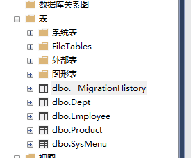

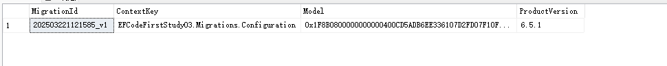

### 本地缓存

直接使用`context.ModelName.ToList()`，返回的数据会缓存在本地，`context.ModelName.Find(params)`会优先查找本地缓存。

其余Select、Where方法不会将数据缓存在本地。

`context.ModelName.AsNoTracking.ToList()`不将数据缓存在本地

### 导航属性

```c#
namespace EFCodeFirstStudy04.Models
{
    [Table("VehicleBrand")]
    public partial class VehicleBrand
    {
        [Key]
        // 自增属性
        [DatabaseGenerated(DatabaseGeneratedOption.Identity)]
        public int BrandId { get; set; }
        public string BrandName { get; set; }
        public string BrandCompany{ get; set; }
        // 导航属性
        public virtual ICollection<OpVehicle> OpVehicles { get; set; }
    }
    [Table("OpVehicle")]
    public partial class OpVehicle
    {
        [Key]
        [DatabaseGenerated(DatabaseGeneratedOption.None)]
        public int VehicleCode { get; set; }

        [StringLength(12)]
        public string DevCode { get; set; }

        public double? Lat { get; set; }
        public double? Lng { get; set; }
        public int Status { get; set; }
        // 外键名字为导航属性
        [ForeignKey("VehicleBrand")]
        public int BrandId { get; set; }
        // 导航属性
        public virtual VehicleBrand VehicleBrand { get; set; }
    }
}
```

**导航属性一定要用virtual修饰**，否则无法获取到关联数据。

ef延迟加载默认是启用的，如果关闭了延迟加载与无法获取到关联数据。

可通过如下代码获取关联数据：

```c#
namespace EFCodeFirstStudy04
{
    internal class Program
    {
        static void Main(string[] args)
        {
            using (WeshareBikeContext context = new WeshareBikeContext())
            {
                context.Configuration.LazyLoadingEnabled = false;
                context.Database.Log += s => Console.WriteLine("sql: {0}", s);
                var vehicles = context.OpVehicles.Where(d => d.VehicleCode > 0).Include("VehicleBrand").ToList();
                //或者
                var brands = context.VehicleBrands;
                // 一对多
                foreach (var brand in brands)
                {
                    context.Entry(brand).Collection(t => t.OpVehicles).Load();
                }
                // 多对一
                foreach (var ve in context.OpVehicles)
                {
                    context.Entry(ve).Reference(v => v.VehicleBrand).Load();
                }
            }
        }
    }
}

```


# Win Form

## Program类

Program类是程序的入口

```C#
namespace WinFormStudy01
{
    internal static class Program
    {
        /// <summary>
        /// 应用程序的主入口点。
        /// </summary>
        [STAThread]//指示应用程序的COM线程模型时单线程模型
        static void Main()
        {
            //启动应用程序的可视样式
            Application.EnableVisualStyles();
            Application.SetCompatibleTextRenderingDefault(false);
            //程序中要启动的窗体
            Application.Run(new Form1());
        }
    }
}
```

## 控件

输入或操作数据的对象，控件有自己的属性、方法、事件。控件都派生于Control

**控件开发**：

1. 复合控件，各种控件组合起来，形成一个控件
2. 拓展控件，现有控件上派生出一个新的控件，为原有空间增加新的功能
3. 自定义控件，Control类派生，提供入门性能

**控件分类**

1. 用户界面控件：Button、Label、TextBox等
2. 容器：Panel、GroupBox、TabControl等
3. 数据：DataGridView
4. 菜单和工具：ContextMMenuStrip、MenuStrip、ToolStrip、StatusStrip
5. 组件：Timer、ImageList等

### Form

**属性**：

1. Name：控件的名字，在程序中通过Name来引用控件
2. WindowState：控件的状态，是最大化、最小化还是正常
3. StartPosition：运行时窗体的起始位置
4. Text：标题栏显示的文本
5. Icon：窗体左上角的图标
6. TopMost：是否显示其他未设置这个属性为true的窗体之上
7. FormBorderStyle：窗体的边框和标题栏的外观行为，如窗体大小是否可调整
8. ControlBox：是否显示控制框（右上角最大化、最小化、关闭按钮）
9. AcceptButton：接受按钮，启动窗体后按回车键触发的按钮
10. CancelButton：取消按钮，启动窗体后按ESC触发的按钮
11. BackColor
12. BackgroundImage
13. ContextMenuStrip：鼠标右键显示的菜单
14. Cursor：鼠标在窗体的样式
15. Force：窗体字体颜色
16. IsMdiContainer：是否最为窗体容器

**常用方法**：

1. Show()：显示窗体
2. ShowDialog()：窗体显示未模式对话框
3. Hide()：隐藏
4. Activate()：激活窗体并给予焦点
5. Close()：关闭窗体

**常用事件**：

1. Load：加载窗体时发生
2. Activated：激活时发生
3. Deactivate：停用时发生
4. VisibleChanged：Visible属性发生改变时发生
5. FormClosing：正在关闭时发生

### ListBox、CheckedListBox（复选按钮）、ComboBox（下拉框）

复选按钮和下拉框都是从ListBox演变而来的，所以事件和方法大致一样；复选按钮和下拉框会有自己特有的事件

使用：

```C#
// ListBox、CheckedListBox设置数据源、设置值和显示文本方式相同
// 通过这种方式添加项，选中项的值和索引值都是null，需要通过数据绑定
listBox.Items.Add(数据项);
// 直接绑定数据
listBox1.DataSource = dataList;
listBox.ValueMember = "值字段名";
listBox.DisplayMemeber = "显示字段名";
// 选中的项
var item = listBox.SelectedItem;

// 选中项的值
var selectValue = listBox1.SelectedValue;
// 选中项的索引
var selectIndex = listBox1.SelectedIndex;
// 多选选中的项
var items = listBox1.SelectedItems;
// 多选选中的项的索引
var indexs = listBox1.SelectedIndices;
```

**CheckedListBox--ItemCheck事件说**

ItemCheck事件：项选中状态将要发生改变时触发，触发该事件后才更改状态

```C#
// 将要改变项当前是否被选中；e.Index将要改变项的索引
bool bl = checkedListBox1.GetItemChecked(e.Index);
// 选项将要改变成的状态
CheckState newState = e.NewValue;
// 选项当前的状态
CheckState current = e.CurrentValue;
// 设置选项的状态
checkedListBox1.SetItemChecked(e.Index, false);
```

### DateTimePicker（日期选择器）

自定义日期格式设置：

1. 在CustomerFormat输入日期格式
2. 将Format修改为Customer

### NumericUpDown

得到的值是一个decimal类型的值

**属性**：

1. Increment：增量
2. Maximum：最大值
3. Minimum：最小值
4. DecimalPlaces：显示的小数位数

### PictureBox

如果使用相对目录，需要修改图片属性【复制到输出目录】改为【始终复制】

 **属性**：

1. SizeModel：图片如何填充
2. ImageLocation：可设置相对路径

### Timer计时器

Win Form的计时器使用的是ui主线程，所以在它的逻辑中可以修改UI页面。

**属性**：

1. Enabled：是否启动
2. Interval：频率，单位毫秒

**事件**：

Tick：计时器的处理逻辑，逻辑代码中如果有操作耗时超过了Interval，ui界面会卡，上一次的执行会影响下一次执行

### System.Timers.Timer计时器

它是使用线程池来引发`Elapsed`事件的，如果上一个事件超时了，它会启用另一个线程来执行下一个时间，使用它不会让UI线程卡顿。

使用：

```C#
private void Form1_Load(object sender, EventArgs e)
{
    this.timer2 = new System.Timers.Timer();
	timer2.Interval = 1000;
	// 是否重复引发Elapsed事件
	timer2.AutoReset = true;
    // 启动定时器
	timer2.Enabled = true;
	timer2.Elapsed += Timer2_Elapsed;
}
// 定时执行的操作
private void Timer2_Elapsed(object sender, System.Timers.ElapsedEventArgs e)
{
    //切换到UI线程
    this.Invoke(new Action(() =>
    {
        textBox1.Text = DateTime.Now.ToString();
    }));
}
```

上述两个定时器也可以使用`timer.Start()`启动，`timer.Stop()`停止。

### System.Threading.Timer定时器

使用：

```C#
private void Form1_Load(object sender, EventArgs e)
{
    timer3 = new System.Threading.Timer(new System.Threading.TimerCallback(o =>
	{
    	// 切换UI线程
    	this.Invoke(new Action(() =>
    	{
			//业务逻辑
    	}));
    	// 100：延迟100毫秒后启动
    	// 1000：间隔时间
		}), null, 100, 1000);
}
```

停止定时器`timer3.Dispose()`

### ListView

**属性**：

1. FullRowSelect：选中整行，默认第一列

2. GridLines：是否显示网格
3. AllowDrop：是否允许拖动
4. HoverSelection：是否允许鼠标悬停在项上来选择项
5. ShowGroups：是否以组的形式来显示项

**使用**：

```C#
// 添加组
ListView listView = new ListView();
listView.Group group = new ListViewGroup(key,headerText);
listView.Groups.Add(group);
//或者
listView.Groups.Add(key,HeaderText);
// 添加项/添加一行，按指定索引填充列
ListViewItem item = new ListViewItem();
item.Text = stu.StuName;
item.SubItems.Add(stu.StuId.ToString());
item.SubItems.Add(stu.Phone);
item.SubItems.Add(stu.Sex);
listView.Items.Add(item);
// 将此列添加进指定组
ListGroup g = listView.Groups[key];
g.Items.Add(item)
```

**事件**：

1. ItemDrag：用户拖拽时发生
2. DragDrop：拖拽完成时发生
3. DragEnter：拖拽某项进入该工作区时发生

**枚举类**：

1. DragDropEffects：选中项被拖拽时的效果
2. View：ListView显示的样式

## Graphics

创建方式：

1. 每个控件都有`CreateGraphics()`方法，通过调用此方法创建
2. 通过`Graphics.FromXX`创建，如从指定图片创建`Graphics.FromImage(image对象)`

**GraphicsPath**

表示一系列连接的直线或曲线，如果收尾不相连，会用一条直线闭合。


# IO与Excel

## IO

**常用类**：File、FileInfo、Directory、DirectoryInfo、Path、StreamReader、StreamWriter、FileStream、MemoryStream、BufferedStream、BinaryReader、BinaryWriter、StringReader、StringWriter、Stream、TextReader、TextWriter

### File、FileInfo

File：提供用于创建、复制、删除、移动和打开文件的静态方法，并协助创建FileStream对象

FileInfo：提供功能通File类，但是是实例方法。

FileMode：打开文件的方式，Create、CreateNew、Append、Open、OpenOrCreate

FileAccess：文件访问全向，Read、Write、ReadWrite

### Stream

提供字节序列的一般视图，它是所有流的抽象基类。提供了以字节的形式从流中读取内容。

StreamReader、StreamWriter帮我们实现在流上读写字符串的功能。

常用的Stream子类：

1. MemoryStream，储存在内存中的字节流
2. FileStream储存在文件系统的字节流
3. BufferedStream为其他流提供缓冲的流

**Steam属性**：

CanRead：当在派生类中重写时，获取指示当前流是否支持读取的值

CanSeek：当在派生类中重写时，获取指示当前流是否支持查找功能的值

Length：当在派生类中重写时，获取流的长度（以字节为单位）

Position：当在派生类中重写时，获取或设置当前流中的位置

**方法**：

Close：封闭当前流并释放与之相关的所有资源

Flush：清除该流的所有缓冲区，并使得所有缓冲区的流被写入到基础设备

Read：从电流读取字节序列，并将此流中的位置提升读取的字节数

Seek：设置当前流中的位置

Write：向当前流中写入字节序列，并将此流中的当前位置提升写入的字节数

#### TextReader

表示可读取有序字符系列的读取器。抽象类，不能直接进行实例化。此类实现了IDisposable接口，可以通过using进行释放StreamReader派生自TextReader,并提供成员的实现以从流中读取字符。StringReader也派生自TextReader,从字符串中读取字符。

**方法**：

Close()关闭TextReader，并释放与它相关的所有系统资源。

Dispose()释放TextReader对象所有资源。

Peek() 读取下一个字符，而不更改读取器状态或字符源。

Read() 读取文本读取器中的下一个字符并使该字符的位置提升一个字符。

Read(Char[],int32,int32) 从当前读取器中读取指定数目的字符并从指定索引开始将该数据写入缓冲区。

ReadAsync(Char[], Int32, Int32) 异步

ReadLine() 从文本读取器中读取一行字符并将数据作为字符串返回。

ReadToEnd() 读取从当前位置到文本读取器末尾的所有字符并将它们作为一个字符串返回。


- **StreamReader：** 派生自TextReader,以一种特定的编码从字节流中读取字符默认为 UTF-8 编码.    默认情况下，StreamReader 不是线程安全的。

Read(Char[], Int32, Int32) 读取 指定的字符数

Write(Char[], Int32, Int32) 写入指定的字符数。

 它们将与 BufferedStream.Read 和 BufferedStream.Write区分开来，它们可读取和写入 count 参数指定的字节数。 

使用 BufferedStream 方法仅用于读取和写入整数个字节数组元素。

#### TextWriter

可以编写一个有序字符系列的编写器   抽象类.    实现了IDisposable接口。StreamWriter与StringWriter 派生自TextWriter。分别将字符写入流和字符串。

- **StreamWriter**：以一种特定的编码向流中写入字符

默认情况下，TextWriter是线程不安全的。

**方法：**

Close()    Dispose()，关闭当前流

Flush() 清理当前编写器的所有缓冲区，使所有缓冲数据写入基础设备。

Write(各种类型的数据) 将字符写入文本流

WriteLine(各种类型的数据) 将字符写入文本流，并跟上终止符。

#### FileStream

对文件系统中的文件进行读取、写入、打开和关闭，使用 Read、Write、CopyTo和 Flush 方法来执行同步操作，或使用 ReadAsync、WriteAsync、CopyToAsync和 FlushAsync 方法执行异步操作。 

使用异步方法来执行占用大量资源的文件操作，而不会阻止主线程。

**构造函数**：

FileStream(String, FileMode)    

FileStream(String, FileMode, FileAccess)    

FileStream(String, FileMode, FileAccess, FileShare)    

FileStream(String, FileMode, FileAccess, FileShare, Int32)

第一个参数是文件路径，第二个参数是文件模式，表示以何种方式打开或创建文件；第三个是文件的访问方式，第四个：文件的共享方式，第五个：缓冲区大小共享

#### MemoryStream

MemoryStream 创建一个流，其后备存储为内存。 

内存流：数据以无符号字节数组的形式保存在内存中，系统可以直接访问这些封装的数据而不必读取磁盘文件。更加贴近底层数据，读取的效率更高(读取速度更快，和文件流的主要区别)，内存流可以降低系统对临时缓冲区和临时文件的需要。

因此我们编程中常常用内存流作为中转，与其他流进行数据交换。(如利用MemoryStream操作文件，然后传给FileStream中)。

内存流到文件流的转换：将数据写入内存流，再转给文件流，再写入文件。

#### BufferedStream

缓冲流，给另一个流添加一个缓冲区，以进行读写操作。

BufferdStream比StreamReader和StreamWriter的效率更高，特别是对于大文件，对于txt文件StreamReader和StreamWriter来讲可以以一行一行的方式进行操作，但是对于其他类型的文件这种方式就显得无能为力了，此时使用BufferedStream可以方便的实现，同样对于可以有一行一行进行操作的文件类型，使用BufferedStream也有更高的效率。

缓冲区是内存中用于缓存数据的字节块, 缓冲数据能够减少对操作系统的调用次数，缓冲数据主要存储在缓冲区中。 缓冲区提高读写性能。 缓冲区可用于读取或写入, 但不能同时使用这两种方法。BufferedStream 用于在不需要缓冲区时防止缓冲区降低输入和输出速度。

#### BinaryReader、 BinaryWriter  

有的时候我们还是需要在字节级上操作文件，却又不是一个字节 一个字节的操作，通常是2个、4个或8个字节这样操作—— BinaryWriter和BinaryReader类。   BinaryWriter和BinaryReader：将一个字符或数字按指定个数字节写入，也可以一次读取指定个数字节转为字符或数字。

> BinaryReader 用特定的编码将基元数据类型读作二进制值。
>
> BinaryWriter 以二进制形式将基元类型写入流，并支持用特定的编码写入字符串。

BinaryReader有ReadByte,ReadBytes,Read方法,它们读取出来的是原生态的二进制值,像ReadInt32,ReadDouble它们相当于多了一步处理,将二进制值转换成相应的数据类型.

## Excel导入导出

**导入导出Excel的方式：**

1. Ado.net Oledb提供程序导入，StreamWrite写入Excel（导出）。

2. 基于NPOI组件读取Excel
3. Office组件方式，本地必须有Office组件（速度慢，效率低，问题多——抛弃）---了解

### Oledb提供程序导入

这种导入方式，类似于将数据库中的一张表填充到DataTable中。这种方式，加载速度快，但受版本限制，不同版本的Excel文件，连接字符串有差别。

```C#
//如果是.xls 即07以下的版本，连接字符串   excel_path：Excel文件路径
strConn = @"Provider=Microsoft.Jet.OLEDB.4.0;Data Source=" + excel_path + ";Extended Properties='Excel 8.0;HDR=YES;IMEX=1'";
//如果是.xlsx 07即以上的版本
strConn = @"Provider=Microsoft.ACE.OLEDB.12.0;Data Source=" + excel_path + ";Extended Properties='Excel 12.0;HDR=YES;IMEX=1'";
//IMEX=0 表示 Excel只能用作写入  1 只能作读取  2 读写都可
//HDR =Yes 第一行是标题，No 第一行是数据，不是标题

```

