# 常用控件

## 布局控件

### Grid

**Grid** 是 WPF 中**最强大的布局容器**，通过行列划分的网格系统，精准控制子元素的布局位置和尺寸。其灵活性和功能丰富性使其成为复杂 UI 设计的首选容器。

#### **1. Grid 的核心特性**

- **网格化布局**：通过 `行（RowDefinitions）` 和 `列（ColumnDefinitions）` 定义二维布局结构。
- **灵活尺寸控制**：支持固定值、比例分配（`*`）和自适应内容（`Auto`）。
- **单元格合并**：子控件可跨多行多列（`Grid.RowSpan`、`Grid.ColumnSpan`）。
- **对齐与边距**：通过 `HorizontalAlignment`、`VerticalAlignment` 和 `Margin` 微调控件位置。

#### **2. 基础用法**

**(1) 定义行与列**

```xaml
<Grid>
    <!-- 定义3行：固定高度、按比例分配、自适应内容 -->
    <Grid.RowDefinitions>
        <RowDefinition Height="50"/>               <!-- 固定高度 -->
        <RowDefinition Height="2*"/>               <!-- 比例分配（占剩余空间2/3） -->
        <RowDefinition Height="Auto"/>             <!-- 高度自适应内容 -->
    </Grid.RowDefinitions>

    <!-- 定义2列：按比例分配、固定宽度 -->
    <Grid.ColumnDefinitions>
        <ColumnDefinition Width="3*"/>             <!-- 宽度占剩余空间3/4 -->
        <ColumnDefinition Width="200"/>            <!-- 固定宽度 -->
    </Grid.ColumnDefinitions>
</Grid>
```

**(2) 放置控件到指定单元格**

```xaml
<Grid>
    <!-- ...（行列定义同上）... -->
    
    <!-- 放置按钮到第0行第0列 -->
    <Button Content="按钮1" Grid.Row="0" Grid.Column="0"/>

    <!-- 文本框跨两列（第1行，列0到1） -->
    <TextBox Grid.Row="1" Grid.Column="0" Grid.ColumnSpan="2" Text="跨列示例"/>
</Grid>
```

#### **3. 关键属性与技巧**

**(1) 尺寸单位**

- **固定值**：`Height="100"`
- **比例分配**：`Width="2*"`（按比例分配剩余空间）
- **自适应内容**：`Height="Auto"`（高度由子控件决定）

```xaml
<Button 
    Grid.Row="0" 
    Grid.Column="0"
    HorizontalAlignment="Center"  <!-- 水平居中 -->
    VerticalAlignment="Bottom"   <!-- 垂直底部对齐 -->
    Margin="10"                  <!-- 外边距 -->
/>
```

**(3) 行列间距**

通过 `Grid.RowSpacing` 和 `Grid.ColumnSpacing`（WPF 4.6+）设置行列间距：

```xaml
<Grid RowSpacing="10" ColumnSpacing="5">
    <!-- 行列定义 -->
</Grid>
```

#### **3. 关键属性与技巧**

**(1) 尺寸单位**

- **固定值**：`Height="100"`
- **比例分配**：`Width="2*"`（按比例分配剩余空间）
- **自适应内容**：`Height="Auto"`（高度由子控件决定）

**(2) 对齐与边距**

```xaml
<Button 
    Grid.Row="0" 
    Grid.Column="0"
    HorizontalAlignment="Center"  <!-- 水平居中 -->
    VerticalAlignment="Bottom"   <!-- 垂直底部对齐 -->
    Margin="10"                  <!-- 外边距 -->
/>
```

**(3) 行列间距**

通过 `Grid.RowSpacing` 和 `Grid.ColumnSpacing`（WPF 4.6+）设置行列间距：

```xaml
<Grid RowSpacing="10" ColumnSpacing="5">
    <!-- 行列定义 -->
</Grid>
```

#### **4. 典型应用场景**

**(1) 表单布局**

```xaml
<Grid>
    <Grid.RowDefinitions>
        <RowDefinition Height="Auto"/>
        <RowDefinition Height="Auto"/>
        <RowDefinition Height="Auto"/>
    </Grid.RowDefinitions>
    <Grid.ColumnDefinitions>
        <ColumnDefinition Width="Auto"/>
        <ColumnDefinition Width="*"/>
    </Grid.ColumnDefinitions>

    <TextBlock Text="用户名:" Grid.Row="0" Grid.Column="0"/>
    <TextBox Grid.Row="0" Grid.Column="1" Margin="5"/>

    <TextBlock Text="密码:" Grid.Row="1" Grid.Column="0"/>
    <PasswordBox Grid.Row="1" Grid.Column="1" Margin="5"/>

    <Button Content="登录" Grid.Row="2" Grid.ColumnSpan="2" Width="100" Margin="5"/>
</Grid>
```

**(2) 仪表盘或复杂面板**

```xaml
<Grid>
    <Grid.RowDefinitions>
        <RowDefinition Height="*"/>
        <RowDefinition Height="*"/>
    </Grid.RowDefinitions>
    <Grid.ColumnDefinitions>
        <ColumnDefinition Width="*"/>
        <ColumnDefinition Width="*"/>
    </Grid.ColumnDefinitions>

    <ChartControl Grid.Row="0" Grid.Column="0"/>  <!-- 左上图表 -->
    <DataGrid Grid.Row="0" Grid.Column="1"/>      <!-- 右上表格 -->
    <StatusPanel Grid.Row="1" Grid.ColumnSpan="2"/><!-- 底部状态栏 -->
</Grid>
```

**(3) 响应式布局**

通过比例分配实现窗口缩放时元素自适应：

```xaml
<Grid>
    <Grid.ColumnDefinitions>
        <ColumnDefinition Width="200"/>          <!-- 左侧导航栏固定宽度 -->
        <ColumnDefinition Width="*"/>            <!-- 右侧内容区自适应 -->
    </Grid.ColumnDefinitions>
    
    <NavigationMenu Grid.Column="0"/>
    <ContentArea Grid.Column="1"/>
</Grid>
```


### StackPanel

`StackPanel` 是一个容器控件，它可以将子元素沿**垂直方向（默认）\**或\**水平方向**依次堆叠排列。所有子元素会按添加顺序排列，且不会自动换行。如果内容超出范围，需结合 `ScrollViewer` 实现滚动。

### DockPanel

与WinForm的Dock属性类似，通过设置Dock停靠进行布局。

**主要属性**：

1. 基本属性：LastChildFill，布尔值，设置最后一个元素是否填充剩余部分
2. 附加属性：Docker.Dock，值有Left、Top、Right、Bottom，在子元素中设置

填充内容时与元素的顺序有关。

**使用场景**：主窗口功能区域划分。

示例：

```xaml
<Window x:Class="WpfStudy01.DockPanel"
        xmlns="http://schemas.microsoft.com/winfx/2006/xaml/presentation"
        xmlns:x="http://schemas.microsoft.com/winfx/2006/xaml"
        xmlns:mc="http://schemas.openxmlformats.org/markup-compatibility/2006"
        xmlns:d="http://schemas.microsoft.com/expression/blend/2008"
        xmlns:local="clr-namespace:WpfStudy01"
        mc:Ignorable="d"
        Title="DockPanel" Height="450" Width="800">
    <Grid>
        <DockPanel>
            <Button DockPanel.Dock="Top">button1</Button>
            <Button DockPanel.Dock="Left">button2</Button>
            <Button DockPanel.Dock="Right">button3</Button>
            <Button DockPanel.Dock="Bottom">button4</Button>
            <Button>button5</Button>
        </DockPanel>
    </Grid>
</Window>

```

效果：

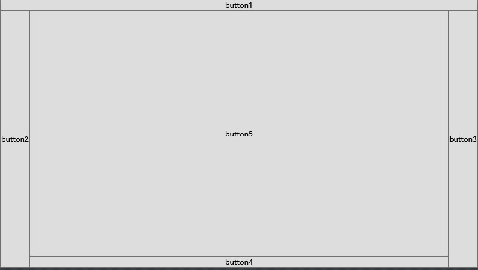

### WrapPanel

唯一一个不能被Grid替代的布局控件，按行排列，尺寸不够时换行；按列排列，尺寸不够时折行。

**主要属性：**Orientation（布局方向）

**使用场景**：界面图表式布局

示例：

```xaml
<Window x:Class="WpfStudy01.WrapPanelWin"
        xmlns="http://schemas.microsoft.com/winfx/2006/xaml/presentation"
        xmlns:x="http://schemas.microsoft.com/winfx/2006/xaml"
        xmlns:mc="http://schemas.openxmlformats.org/markup-compatibility/2006"
        xmlns:d="http://schemas.microsoft.com/expression/blend/2008"
        xmlns:local="clr-namespace:WpfStudy01"
        mc:Ignorable="d"
        FontSize="20"
        Title="WrapPanelWin" Height="450" Width="800">
    <WrapPanel Orientation="Horizontal">
        <Button Width="150">按钮1</Button>
        <Button Width="160">按钮2</Button>
        <Button Width="180">按钮3</Button>
        <Button Width="190">按钮4</Button>
        <Button Width="200">按钮5</Button>
        <Button Width="210">按钮6</Button>
        <Button Width="220">按钮7</Button>
        <Button Width="220">按钮8</Button>
    </WrapPanel>
</Window>
```

效果：

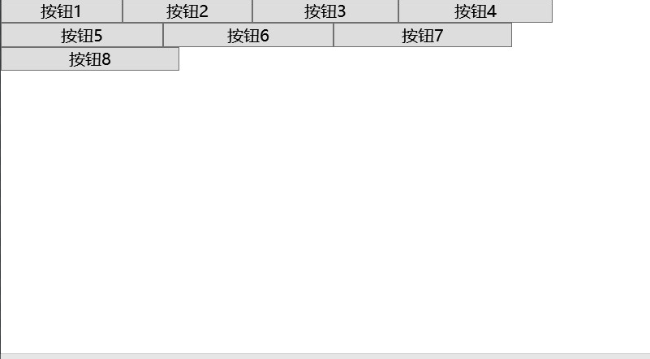

如果是按列排列，列宽默认为子元素最大宽度。

### UniFormGrid

另一种行列风格布局，自动生成统一一致的行列。

主要属性：Rows、Columns

**使用场景：**仪表盘、驾驶舱

经常被Grid代替

### Canvas

通过精确坐标定位放置子元素。

**主要属性**：

附加属性：Canvas.Left、Canvas.Top、Canvas.Right、Canvas.Bottom，设置距离x、y的距离

**使用场景：**编辑场景

子元素不设置定位，默认在（0,0）位置，在设置附加属性时，Canvas.Left优先于Canvas.Right，Canvas.Top优先于Canvas.Bottom

### InkCanvas

支持任意笔画输入的画布组件

**主要属性**：

基本属性：EditingModel、Stroks（获取所有笔记）、DefaultDrawingAttributes（设置笔记样式）

附加属性：InkCanvas.Left、InkCanvas.Top、InkCanvas.Right、InkCanvas.Bottom、

**使用场景：**画板

**示例**：

```xaml
<Window x:Class="WpfStudy01.InkCanvasWin"
        xmlns="http://schemas.microsoft.com/winfx/2006/xaml/presentation"
        xmlns:x="http://schemas.microsoft.com/winfx/2006/xaml"
        xmlns:mc="http://schemas.openxmlformats.org/markup-compatibility/2006"
        xmlns:d="http://schemas.microsoft.com/expression/blend/2008"
        xmlns:local="clr-namespace:WpfStudy01"
        mc:Ignorable="d"
        Title="InkCanvasWin" Height="450" Width="800">
    <InkCanvas EditingMode="Ink">
        <InkCanvas.DefaultDrawingAttributes>
            <DrawingAttributes Color="Aqua" Width="10"/>
        </InkCanvas.DefaultDrawingAttributes>
    </InkCanvas>
</Window>
```

效果：

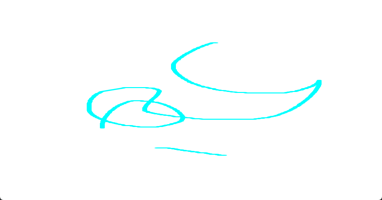

### Border

最基础的装饰。

**主要属性：**BorderBrush、BorderThinkness、Background、CornerRadius

**使用场景：**绘制边线、背景色、圆角

### 其他控件

#### 拓展布局控件

- TabControl、TabItem、TabPanel

  TabControl同Tab选项页，TabItem为选项页的选项卡，TabPanel为TabItem的容器

- ToolBarPanel、ToolBarOverflowPanel

  ToolBarPanel：工具栏；

  ToolBarOverflowPanel：一行显示不下折行，基于StackPanel

- VirtualizingStackPanel

  虚拟化的StackPanel，呈现上同StackPanel，性能上有稍微提升；呈现在视觉区域的内容它才会加载，类似于懒加载。

#### 特殊容器

- ScrollViewer

  超出的内容提供滚动条

- GroupBox

  同WinForm

- Expander

  类似于手风琴或折叠面板，可以展开和收起内容，如菜单、子菜单。


### 层级显示

所有容器都支持通过`Panel.ZIndex`调整层级。

### 自定义Panel

代码如下：

```C#
public class CustomerWrapPanel: Panel
{
    // 子元素最大宽度
    private double maxWidth = 0;
    protected override Size MeasureOverride(Size availableSize)
    {
        double totalHeight = 0;
        foreach (FrameworkElement internalChild in this.InternalChildren)
        {
            // 测量元素所需宽高
            internalChild.Measure(availableSize);
            if (internalChild.DesiredSize.Width > maxWidth)
            {
                maxWidth = internalChild.DesiredSize.Width;
            }

            totalHeight += internalChild.DesiredSize.Height;
        }

        return availableSize;
    }

    protected override Size ArrangeOverride(Size finalSize)
    {
        //元素坐标
        double x = 0;
        double y = 0;
        // 所在行
        int rowIndex = 1;
        // 所在列
        int columnIndex = 0;
        double currentColumnHeight = 0;
        foreach (FrameworkElement child in this.InternalChildren)
        {
            var width = child.DesiredSize.Width;
            var height = child.DesiredSize.Height;
            // 剩下高度不足以放下元素，折行
            if (currentColumnHeight + height > finalSize.Height)
            {
                columnIndex += 1;
                currentColumnHeight = height;
                rowIndex = 0;
                x = columnIndex * maxWidth;
                y = 0;
            }
            else
            {
                currentColumnHeight += height;
            }
            // 设置元素坐标，宽高
            child.Arrange(new Rect(x,y,width, height));
            y += height;
            rowIndex++;
        }

        return finalSize;
    }
}
```

```xaml
<Window x:Class="WpfStudy01.CustomerStackPanelWin"
        xmlns="http://schemas.microsoft.com/winfx/2006/xaml/presentation"
        xmlns:x="http://schemas.microsoft.com/winfx/2006/xaml"
        xmlns:mc="http://schemas.openxmlformats.org/markup-compatibility/2006"
        xmlns:d="http://schemas.microsoft.com/expression/blend/2008"
        xmlns:local="clr-namespace:WpfStudy01"
        mc:Ignorable="d"
        Title="CustomerStackPanelWin" Height="450" Width="800">
    <local:CustomerWrapPanel>
        <Button Height="150" Width="200">按钮1</Button>
        <Button Height="150" Width="200">按钮2</Button>
        <Button Height="150" Width="200">按钮3</Button>
        <Button Height="150" Width="200">按钮4</Button>
        <Button Height="150" Width="200">按钮5</Button>
    </local:CustomerWrapPanel>
</Window>
```

效果：

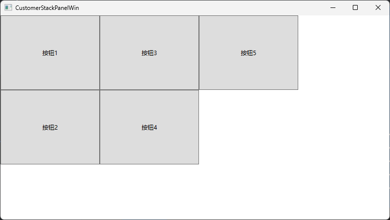

### WPF 窗体处理

**主要属性：**

WindowStartupLocation：窗体显示位置

WindowStyle：设置边框属性 

WindowState：最大化最小化

AllowsTransparency：区域是否支持透明度（Background为Transparent时 ）。值为true时，WindowStyle必须设置为None


默认情况下最大化会将任务栏也遮挡住，如果不想遮挡任务栏，可以在加载窗体之后再最大化。

#### WindowChrom

用于**自定义窗口的非客户区（Non-Client Area，标题栏、最大化、最小化、关闭栏）外观**，同时保留 Windows 原生窗口行为（如拖动调整大小、窗口命令等）。

**属性：**

| 属性                    | 说明                                                         |
| :---------------------- | :----------------------------------------------------------- |
| `GlassFrameThickness`   | 设置窗口边缘的“玻璃效果”区域厚度（需系统支持 Aero 效果）。   |
| `ResizeBorderThickness` | 定义窗口边缘可拖动调整大小的区域宽度。                       |
| `CaptionHeight`         | 定义标题栏的高度（用于支持双击最大化/还原的区域）。          |
| `CornerRadius`          | 设置窗口圆角半径（需结合透明背景使用）。                     |
| `UseAeroCaptionButtons` | 是否显示原生系统按钮（默认 `false`，通常隐藏以替换为自定义按钮）。 |

**示例**：

```xaml
<Window x:Class="WpfStudy01.WindowChromeWin"
        xmlns="http://schemas.microsoft.com/winfx/2006/xaml/presentation"
        xmlns:x="http://schemas.microsoft.com/winfx/2006/xaml"
        xmlns:mc="http://schemas.openxmlformats.org/markup-compatibility/2006"
        xmlns:d="http://schemas.microsoft.com/expression/blend/2008"
        xmlns:local="clr-namespace:WpfStudy01"
        mc:Ignorable="d"
        Title="WindowChromeWin" Height="450" Width="800">
    <WindowChrome.WindowChrome>
        <WindowChrome UseAeroCaptionButtons="false" CornerRadius="5" />
    </WindowChrome.WindowChrome>
    <Grid>
    </Grid>
</Window>
```

#### Window.Clip

用于定义窗口（或任何 `UIElement`）的**可见区域**。通过设置该属性，可以将窗口内容限制在某个几何形状内，超出该形状的部分会被**剪切（隐藏）**

示例：

```xaml
<Window x:Class="WpfStudy01.ClipWin"
        xmlns="http://schemas.microsoft.com/winfx/2006/xaml/presentation"
        xmlns:x="http://schemas.microsoft.com/winfx/2006/xaml"
        xmlns:mc="http://schemas.openxmlformats.org/markup-compatibility/2006"
        xmlns:d="http://schemas.microsoft.com/expression/blend/2008"
        xmlns:local="clr-namespace:WpfStudy01"
        mc:Ignorable="d"
        Background="Transparent"
        AllowsTransparency="True"
        WindowStartupLocation="CenterScreen"
        WindowStyle="None"
        Title="ClipWin" Height="450" Width="800">
    <!--裁剪成一个圆-->
    <Window.Clip>
        <EllipseGeometry Center="150,150" RadiusX="150" RadiusY="150"></EllipseGeometry>
    </Window.Clip>
    <Grid Background="Aqua">
        
    </Grid>
</Window>
```

效果：


### 布局实际操作

代码：

```xaml
<Window x:Class="WpfStudy01.LayoutWin"
        xmlns="http://schemas.microsoft.com/winfx/2006/xaml/presentation"
        xmlns:x="http://schemas.microsoft.com/winfx/2006/xaml"
        xmlns:mc="http://schemas.openxmlformats.org/markup-compatibility/2006"
        xmlns:d="http://schemas.microsoft.com/expression/blend/2008"
        xmlns:local="clr-namespace:WpfStudy01"
        mc:Ignorable="d"
        Title="LayoutWin" Height="450" Width="800">
    <DockPanel>
        <Grid DockPanel.Dock="Top" Background="Aqua" Height="30"></Grid>
        <Grid DockPanel.Dock="Bottom" Background="Yellow" Height="30"></Grid>
        <Grid Background="DarkGreen">
            <Grid.RowDefinitions>
                <RowDefinition Height="30"/>
                <RowDefinition/>
            </Grid.RowDefinitions>
            <Border Grid.Row="0" Background="Beige"></Border>
            <Grid Grid.Row="1" Background="Brown">
                <DockPanel>
                    <Border DockPanel.Dock="Right" Background="Coral" Width="150"></Border>
                    <Border DockPanel.Dock="Bottom" Height="150" Background="Cyan"></Border>
                    <ScrollViewer DockPanel.Dock="Left" Width="130" Background="Gainsboro">
                        <UniformGrid Columns="2">
                            <Border Height="30" Width="30" Margin="5" Background="Beige"></Border>
                            <Border Height="30" Width="30" Margin="5" Background="Beige"></Border>
                            <Border Height="30" Width="30" Margin="5" Background="Beige"></Border>
                            <Border Height="30" Width="30" Margin="5" Background="Beige"></Border>
                            <Border Height="30" Width="30" Margin="5" Background="Beige"></Border>
                            <Border Height="30" Width="30" Margin="5" Background="Beige"></Border>
                            <Border Height="30" Width="30" Margin="5" Background="Beige"></Border>
                            <Border Height="30" Width="30" Margin="5" Background="Beige"></Border>
                            <Border Height="30" Width="30" Margin="5" Background="Beige"></Border>
                            <Border Height="30" Width="30" Margin="5" Background="Beige"></Border>
                            <Border Height="30" Width="30" Margin="5" Background="Beige"></Border>
                            <Border Height="30" Width="30" Margin="5" Background="Beige"></Border>
                        </UniformGrid>
                    </ScrollViewer>
                    <Border></Border>
                </DockPanel>
            </Grid>
        </Grid>
    </DockPanel>
</Window>
```

效果：

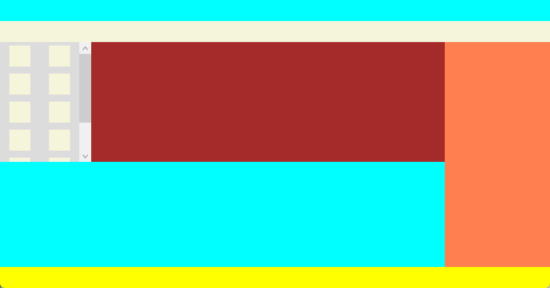

## 资源管理

### 文件资源管理

**复制到输出目录选项区别：**

| 选项           | 触发复制条件     | 适用场景                 | 性能影响       |
| -------------- | ---------------- | ------------------------ | -------------- |
| 不复制         | 永不复制         | 设计时使用、外部路径引用 | 无             |
| 始终复制       | 每次编译         | 频繁修改的动态资源       | 较高（大文件） |
| 如果较新则复制 | 仅当源文件更新时 | 静态资源、优化构建速度   | 较低           |

**生成操作选择资源和不选择资源区别：**

| 选项 | 优点                                                         | 缺点                                                         |
| ---- | ------------------------------------------------------------ | ------------------------------------------------------------ |
| 资源 | 资源随程序集一起部署，无需担心文件丢失或路径问题，安全性和部署便捷性较高。同时，嵌入资源在一定程度上可以保护图片资源不被轻易修改 | 会增加程序集的大小，如果有大量或较大的图片资源，可能导致程序集体积显著增大，影响下载和启动速度 |
| 无   | 程序集大小不会因图片资源而显著增加，适用于图片资源较大或较多的情况，对程序启动和下载速度影响较小。此外，以文件形式存在便于在运行时对图片进行动态替换或修改。 | 依赖文件系统路径，部署时需要确保图片文件正确放置在相应位置，否则可能出现加载失败的问题。同时，图片文件相对容易被外部修改或误删除。 |

如果图片生成操作设置为资源（嵌入到程序集中），通常**无需复制到输出目录**，可通过 `Pack URI` 引用：

```xaml
<Image Source="pack://application:,,,/程序集名称;component/Images/photo.jpg"/>
```


在.Net Framework中，如果直接将图片复制到项目目录，默认不显示，需要点击显示所有文件，再将文件添加进项目

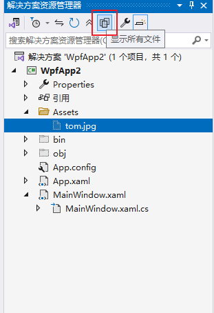

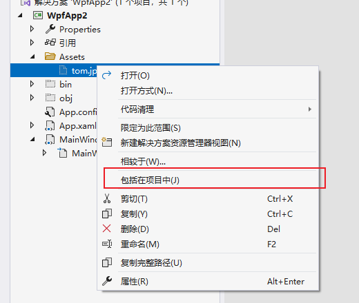

文件添加到项目，它的属性生成操作默认是资源：

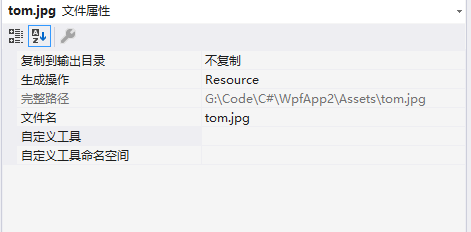

### 对象资源管理

在 WPF 中，**对象资源管理**是通过 **资源字典（Resource Dictionary）** 机制实现的，它允许你定义可重用的对象（如样式、模板、画笔、动画等），并在应用程序的不同位置共享这些资源

#### **资源的定义**

资源可以定义在以下作用域中：

- **控件级**（局部资源）：在某个控件（如 `Grid`、`Window`）的 `Resources` 属性中定义，仅该控件及其子元素可用。
- **窗口/页面级**：在 `Window` 或 `Page` 的 `Resources` 中定义，整个窗口或页面可用。
- **应用程序级**：在 `App.xaml` 的 `Application.Resources` 中定义，全局可用。
- **外部资源字典**：在独立的 XAML 文件中定义，通过合并字典引用。

```xaml
<ResourceDictionary xmlns="http://schemas.microsoft.com/winfx/2006/xaml/presentation"
                    xmlns:x="http://schemas.microsoft.com/winfx/2006/xaml"
                    xmlns:sys="clr-namespace:System;assembly=System.Runtime"
                    >
    <!--导入所需要的命名空间xmlns:sys="clr-namespace:System;assembly=System.Runtime"-->
    <sys:Double x:Key="BtnWidth">100</sys:Double>
    <sys:Double x:Key="BtnHeight">30</sys:Double>
</ResourceDictionary>
```

使用：

```xaml
<Window x:Class="WpfStudy01.UseDictWin"
        xmlns="http://schemas.microsoft.com/winfx/2006/xaml/presentation"
        xmlns:x="http://schemas.microsoft.com/winfx/2006/xaml"
        xmlns:mc="http://schemas.openxmlformats.org/markup-compatibility/2006"
        xmlns:d="http://schemas.microsoft.com/expression/blend/2008"
        xmlns:local="clr-namespace:WpfStudy01"
        mc:Ignorable="d"
        Title="UseDictWin" Height="450" Width="800">
    <!--导入资源-->
    <Window.Resources>
        <ResourceDictionary Source="pack://application:,,,/WpfStudy01;component/Res.xaml"></ResourceDictionary>
    </Window.Resources>
    <Grid>
        <Button Width="{StaticResource BtnWidth}" Height="{StaticResource BtnHeight}" Content="Click Me"></Button>
    </Grid>
</Window>

```

定义的资源类型必须有无参构造函数，C#中的所有对象都可以在资源中定义，需要在xml中引入命名空间。

如果是全局资源，可以在`App.xaml`中导入。

**资源层级**：自身资源->父级资源->。。。->窗口资源-> 应用程序资源-> 框架资源

#### 资源合并

在窗体文件中，`Window.Resources`下只能定义一个`ResourceDictionary`，如果要导入多个资源，则需要使用资源合并，如下：

```xaml
<Window x:Class="WpfStudy01.UseDictWin"
        xmlns="http://schemas.microsoft.com/winfx/2006/xaml/presentation"
        xmlns:x="http://schemas.microsoft.com/winfx/2006/xaml"
        xmlns:mc="http://schemas.openxmlformats.org/markup-compatibility/2006"
        xmlns:d="http://schemas.microsoft.com/expression/blend/2008"
        xmlns:local="clr-namespace:WpfStudy01"
        mc:Ignorable="d"
        Title="UseDictWin" Height="450" Width="800">
    <!--导入资源-->
    <Window.Resources>
        <ResourceDictionary>
            <ResourceDictionary.MergedDictionaries>
                <ResourceDictionary Source="pack://application:,,,/WpfStudy01;component/Res.xaml"></ResourceDictionary>
            </ResourceDictionary.MergedDictionaries>
        </ResourceDictionary>
    </Window.Resources>
    <Grid>
        <Button Width="{StaticResource BtnWidth}" Height="{StaticResource BtnHeight}" Content="Click Me"></Button>
    </Grid>
</Window>
```

`ResourceDictionary.MergedDictionaries`下可以定义多个`ResourceDictionary`，如果多个文件中定义了相同变量，则后导入的资源会覆盖前面的

#### 静态资源与动态资源

静态资源：程序编译时确定

动态资源：运行时可监听资源变化，使用`DynamicResource 变量名`来使用动态资源

#### 定义样式

代码：

```xaml
<ResourceDictionary xmlns="http://schemas.microsoft.com/winfx/2006/xaml/presentation"
                    xmlns:x="http://schemas.microsoft.com/winfx/2006/xaml"
                    xmlns:sys="clr-namespace:System;assembly=System.Runtime"
                    >
    
        <!--
        TargetType：指定样式目标
        Setter：设置某个属性的值
    -->
    <Style x:Key="ButtonStyle" TargetType="Button">
        <Setter Property="Width" Value="100"/>
        <Setter Property="Height" Value="30"/>
    </Style>
</ResourceDictionary>
```

- 在Style中引入其他Style样式

```xaml
<ResourceDictionary xmlns="http://schemas.microsoft.com/winfx/2006/xaml/presentation"
                    xmlns:x="http://schemas.microsoft.com/winfx/2006/xaml"
                    xmlns:sys="clr-namespace:System;assembly=System.Runtime"
                    >

    <Style x:Key="BaseStyle" TargetType="Button">
        <Setter Property="Background" Value="Aqua"/>
    </Style>
    <!--
        TargetType：指定样式目标
        Setter：设置某个属性的值
    -->
    <Style x:Key="ButtonStyle" TargetType="Button" BasedOn="{StaticResource BaseStyle}">
        <Setter Property="Width" Value="100"/>
        <Setter Property="Height" Value="30"/>
    </Style>
</ResourceDictionary>
```

#### 样式优先级与触发器

##### 样式优先级

样式优先级同CSS。

如果在窗体中定义了组件样式，而组件没有指定样式，将默认使用窗体文件中定义的样式：

```xaml
<Window x:Class="WpfStudy01.UseResWin"
        xmlns="http://schemas.microsoft.com/winfx/2006/xaml/presentation"
        xmlns:x="http://schemas.microsoft.com/winfx/2006/xaml"
        xmlns:mc="http://schemas.openxmlformats.org/markup-compatibility/2006"
        xmlns:d="http://schemas.microsoft.com/expression/blend/2008"
        xmlns:local="clr-namespace:WpfStudy01"
        mc:Ignorable="d"
        Title="UseResWin" Height="450" Width="800">
    <Window.Resources>
        <ResourceDictionary>
            <ResourceDictionary.MergedDictionaries>
                <ResourceDictionary Source="pack://application:,,,/WpfStudy01;component/Res.xaml" />
                <ResourceDictionary>
                    <Style TargetType="Button">
                        <Setter Property="Background" Value="Aquamarine"></Setter>
                    </Style>
                </ResourceDictionary>
            </ResourceDictionary.MergedDictionaries>
        </ResourceDictionary>
    </Window.Resources>
    <Grid>
        <Button>提交</Button>
    </Grid>
</Window>
```

此窗体中的Button背景颜色将使用`Aquamarine`；如果只是外部导入，没有给目标元素指定不会应用：

```xaml
<Window x:Class="WpfStudy01.UseResWin"
        xmlns="http://schemas.microsoft.com/winfx/2006/xaml/presentation"
        xmlns:x="http://schemas.microsoft.com/winfx/2006/xaml"
        xmlns:mc="http://schemas.openxmlformats.org/markup-compatibility/2006"
        xmlns:d="http://schemas.microsoft.com/expression/blend/2008"
        xmlns:local="clr-namespace:WpfStudy01"
        mc:Ignorable="d"
        Title="UseResWin" Height="450" Width="800">
    <Window.Resources>
        <ResourceDictionary>
            <ResourceDictionary.MergedDictionaries>
                <ResourceDictionary Source="pack://application:,,,/WpfStudy01;component/Res.xaml" />
            </ResourceDictionary.MergedDictionaries>
        </ResourceDictionary>
    </Window.Resources>
    <Grid>
        <Button>提交</Button>
    </Grid>
</Window>
```

##### 触发器

代码如下：

```xaml
<Window x:Class="WpfStudy01.UseResWin"
        xmlns="http://schemas.microsoft.com/winfx/2006/xaml/presentation"
        xmlns:x="http://schemas.microsoft.com/winfx/2006/xaml"
        xmlns:mc="http://schemas.openxmlformats.org/markup-compatibility/2006"
        xmlns:d="http://schemas.microsoft.com/expression/blend/2008"
        xmlns:local="clr-namespace:WpfStudy01"
        mc:Ignorable="d"
        Title="UseResWin" Height="450" Width="800">
    <Window.Resources>
        <ResourceDictionary>
            <ResourceDictionary.MergedDictionaries>
                <ResourceDictionary>
                    <Style TargetType="CheckBox" x:Key="CheckBoxStyle">
                        <Style.Triggers>
                            <Trigger Property="IsChecked" Value="True">
                                <Setter Property="Foreground" Value="Red"></Setter>
                            </Trigger>
                        </Style.Triggers>
                    </Style>
                </ResourceDictionary>
            </ResourceDictionary.MergedDictionaries>
        </ResourceDictionary>
        
    </Window.Resources>
    <Grid>
        <Button>提交</Button>
        <CheckBox Content="男" IsChecked="False" Style="{StaticResource CheckBoxStyle}"></CheckBox>
    </Grid>
</Window>
```

当CheckBox选中时，它的字体颜色就会变成红色。

**多条件触发**：

```xaml
<Window x:Class="WpfStudy01.UseResWin"
        xmlns="http://schemas.microsoft.com/winfx/2006/xaml/presentation"
        xmlns:x="http://schemas.microsoft.com/winfx/2006/xaml"
        xmlns:mc="http://schemas.openxmlformats.org/markup-compatibility/2006"
        xmlns:d="http://schemas.microsoft.com/expression/blend/2008"
        xmlns:local="clr-namespace:WpfStudy01"
        mc:Ignorable="d"
        Title="UseResWin" Height="450" Width="800">
    <Window.Resources>
        <ResourceDictionary>
            <ResourceDictionary.MergedDictionaries>
                <ResourceDictionary Source="pack://application:,,,/WpfStudy01;component/Res.xaml" />
                <ResourceDictionary>
                    <Style TargetType="CheckBox" x:Key="CheckBoxStyle">
                        <Setter Property="Width" Value="100"></Setter>
                        <Setter Property="Height" Value="30"></Setter>
                        <Style.Triggers>
                            <Trigger Property="IsChecked" Value="True">
                                <Setter Property="Foreground" Value="Red"></Setter>
                            </Trigger>
                        </Style.Triggers>
                    </Style>
                    <Style TargetType="Button" x:Key="TriBtn">
                        <Setter Property="Width" Value="100"/>
                        <Setter Property="Height" Value="30"/>
                        <Style.Triggers>
                            <MultiTrigger>
                                <MultiTrigger.Conditions>
                                    <Condition Property="IsPressed" Value="True"/>
                                    <Condition Property="Width" Value="100"/>
                                </MultiTrigger.Conditions>
                                <MultiTrigger.Setters>
                                    <Setter Property="Foreground" Value="Chartreuse"></Setter>
                                </MultiTrigger.Setters>
                            </MultiTrigger>
                        </Style.Triggers>
                    </Style>
                </ResourceDictionary>
            </ResourceDictionary.MergedDictionaries>
        </ResourceDictionary>
        
    </Window.Resources>
    <Grid>
        <Button Style="{StaticResource TriBtn}" >提交</Button>
        <CheckBox Content="男" IsChecked="False" Style="{StaticResource CheckBoxStyle}" VerticalAlignment="Top"></CheckBox>
    </Grid>
</Window>
```

当按钮被点击并且宽度为100时，才触发，修改字体颜色。

- 事件触发器

```xaml
<Window.Triggers>
        <!--
        RoutedEvent：指定事件
        SourceName：指定元素名字
-->
        <EventTrigger RoutedEvent="Button.Click" SourceName="confirmBtn">
            <!--逻辑处理-->
        </EventTrigger>
    </Window.Triggers>
```

动画时会用到。

### 一个bug

代码：

```C#
public partial class ShowBugWin : Window
{
    public List<string> Datas { get; set; } = new List<string>();
    public ShowBugWin()
    {
        InitializeComponent();
        Datas.Add("AAA");
        Datas.Add("AAA");
        Datas.Add("AAA");
        Datas.Add("AAA");
        Datas.Add("AAA");
        this.DataContext = this;
    }
}
```


```xaml
<Window x:Class="WpfStudy01.ShowBugWin"
        xmlns="http://schemas.microsoft.com/winfx/2006/xaml/presentation"
        xmlns:x="http://schemas.microsoft.com/winfx/2006/xaml"
        xmlns:mc="http://schemas.openxmlformats.org/markup-compatibility/2006"
        xmlns:d="http://schemas.microsoft.com/expression/blend/2008"
        xmlns:local="clr-namespace:WpfStudy01"
        mc:Ignorable="d"
        Title="ShowBugWin" Height="450" Width="800">
    <Window.Resources>
        <ResourceDictionary>
            <ResourceDictionary.MergedDictionaries>
                <ResourceDictionary>
                    <Style TargetType="TreeViewItem">
                        <Setter Property="Foreground" Value="GreenYellow"></Setter>
                        <Setter Property="FontSize" Value="30"></Setter>
                    </Style>
                </ResourceDictionary>
            </ResourceDictionary.MergedDictionaries>
        </ResourceDictionary>
    </Window.Resources>
    <Grid>
        <TreeView ItemsSource="{Binding Datas}">
        </TreeView>
    </Grid>
</Window>

```

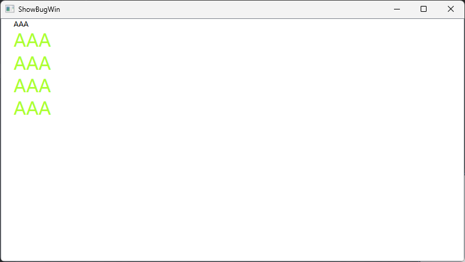

样式放在`ResourceDictionary.MergedDictionaries`中，数据源是集合并且是动态生成的，都会有这个问题。

# 模板

## 控件模板

在 WPF 中，**控件模板（ControlTemplate）** 是定义控件**视觉外观和结构**的核心机制。它允许开发者完全重写控件的默认呈现方式，同时保留控件的原有功能（如事件、数据绑定等）。

### 1. 控件模板的核心作用

- **自定义控件外观**：打破默认样式，实现独特的视觉效果（如圆角按钮、自定义滑块轨道）。
- **分离视觉与逻辑**：保持控件的功能（点击、拖拽）不变，仅修改其视觉表现。
- **动态交互支持**：通过模板内的触发器（Triggers）实现状态变化（如鼠标悬停、选中状态）。

### **2. 控件模板的基本结构**

控件模板通过 `ControlTemplate` 类定义，通常包含以下部分：

```xaml
<ControlTemplate TargetType="{x:Type 控件类型}">
    <!-- 可视化树：定义控件的视觉结构 -->
    <Border Background="{TemplateBinding Background}"
            CornerRadius="5">
        <ContentPresenter/> <!-- 显示控件的内容 -->
    </Border>
    <!-- 触发器（可选） -->
    <ControlTemplate.Triggers>
        <Trigger Property="IsMouseOver" Value="True">
            <!-- 鼠标悬停时的效果 -->
        </Trigger>
    </ControlTemplate.Triggers>
</ControlTemplate>
```

- **`TargetType`**：指定模板适用的控件类型（如 `Button`、`Slider`）。
- **可视化树**：通过 XAML 元素（如 `Border`、`Grid`）定义控件的视觉层次。
- **`TemplateBinding`**：将模板内元素的属性与控件的属性绑定（如背景色、字体大小）。
- **`ContentPresenter`**：占位符，用于显示控件的 `Content`（如按钮文本、图像）。

### 3. 如何使用控件模板？

#### **(1) 直接为控件指定模板**

```xaml
<Button Content="Click Me">
    <Button.Template>
        <ControlTemplate TargetType="Button">
            <Border Background="LightBlue" CornerRadius="10" Padding="10">
                <ContentPresenter HorizontalAlignment="Center" VerticalAlignment="Center"/>
            </Border>
        </ControlTemplate>
    </Button.Template>
</Button>
```

#### (2) 通过样式定义模板（推荐）

```xaml
<Window.Resources>
    <Style TargetType="Button">
        <Setter Property="Template">
            <Setter.Value>
                <ControlTemplate TargetType="Button">
                    <Border Background="{TemplateBinding Background}"
                            CornerRadius="8"
                            BorderThickness="1"
                            BorderBrush="Gray">
                        <ContentPresenter Margin="10"/>
                    </Border>
                </ControlTemplate>
            </Setter.Value>
        </Setter>
    </Style>
</Window.Resources>
```

### 4. 控件模板的关键技术

#### **(1) 模板绑定（TemplateBinding）**

- 将模板内部元素的属性与控件的属性同步。
- 示例：`Background="{TemplateBinding Background}"` 表示使用按钮的 `Background` 属性值。

#### **(2) 触发器（Triggers）**

在模板内定义交互逻辑：

```xaml
<ControlTemplate.Triggers>
    <!-- 鼠标悬停时改变背景色 -->
    <Trigger Property="IsMouseOver" Value="True">
        <Setter TargetName="border" Property="Background" Value="LightGreen"/>
    </Trigger>
    <!-- 按钮按下时缩小 -->
    <Trigger Property="IsPressed" Value="True">
        <Setter TargetName="border" Property="RenderTransform">
            <Setter.Value>
                <ScaleTransform ScaleX="0.95" ScaleY="0.95"/>
            </Setter.Value>
        </Setter>
    </Trigger>
</ControlTemplate.Triggers>
```

#### (3) 命名元素（x:Name）

```xaml
<Border x:Name="border" ...>
```

## 数据模板

**数据模板（DataTemplate）** 是一种用于定义**数据对象如何可视化呈现**的机制。它解决了数据与界面之间的“最后一公里”问题，允许开发者将抽象的数据模型（如对象、集合）转化为直观的 UI 元素。以下是其核心要点：

------

### **1. 数据模板的本质**

- **数据 → UI 的转换器**：
  将数据对象的属性（如 `Person.Name`、`Product.Price`）映射到界面元素（如 `TextBlock`、`Image`）。
- **声明式设计**：通过 XAML 定义，无需编写代码逻辑即可完成数据绑定。

------

### **2. 为什么要用数据模板？**

- **解耦数据与界面**：同一数据对象可以有不同的展示方式（如列表项、详情卡片）。
- **动态适配**：根据数据类型或状态自动切换 UI 布局（如管理员与普通用户的不同视图）。
- **简化集合控件开发**：在 `ListBox`、`ListView` 等控件中高效渲染复杂数据项。

### **3. 核心应用场景**

#### **(1) 集合控件中的项模板（ItemTemplate）**

```xaml
<ListBox ItemsSource="{Binding Employees}">
    <ListBox.ItemTemplate>
        <DataTemplate>
            <StackPanel>
                <Image Source="{Binding AvatarUrl}" Width="50"/>
                <TextBlock Text="{Binding Name}" FontWeight="Bold"/>
            </StackPanel>
        </DataTemplate>
    </ListBox.ItemTemplate>
</ListBox>
```

- **作用**：定义列表中每一项的显示样式。

#### **(2) 内容控件中的内容模板（ContentTemplate）**

```xaml
<ContentControl Content="{Binding SelectedProduct}">
    <ContentControl.ContentTemplate>
        <DataTemplate>
            <Border Background="#FFF5E6" Padding="10">
                <TextBlock Text="{Binding Description}"/>
            </Border>
        </DataTemplate>
    </ContentControl.ContentTemplate>
</ContentControl>
```

- **作用**：定义单个对象的展示方式（如详情页）。

### **4. 关键特性**

#### **(1) 隐式数据模板（按类型自动匹配）**

- 通过 `DataType` 指定适用的数据类型，无需手动关联：

```xaml
<DataTemplate DataType="{x:Type local:Book}">
    <TextBlock Text="{Binding Title}" Foreground="DarkBlue"/>
</DataTemplate>
```

- **效果**：所有绑定到 `Book` 类型对象的控件会自动应用此模板。

#### **(2) 显式数据模板（通过 Key 手动选择）**

- 定义带 `x:Key` 的模板，按需引用：

```xaml
<DataTemplate x:Key="CompactView">
    <TextBlock Text="{Binding Title}"/>
</DataTemplate>

<!-- 使用 -->
<ListBox ItemTemplate="{StaticResource CompactView}"/>
```

#### **(3) 动态模板选择（DataTemplateSelector）**

- 根据业务逻辑动态切换模板：

```c#
public class RoleTemplateSelector : DataTemplateSelector {
    public DataTemplate AdminTemplate { get; set; }
    public DataTemplate UserTemplate { get; set; }
    
    public override DataTemplate SelectTemplate(object item, DependencyObject container) {
        return (item as User).IsAdmin ? AdminTemplate : UserTemplate;
    }
}
```

### **5. 与控件模板（ControlTemplate）的区别**

| **特性**     | **数据模板（DataTemplate）**       | **控件模板（ControlTemplate）**    |
| :----------- | :--------------------------------- | :--------------------------------- |
| **作用对象** | 数据对象（如 `Person`、`Product`） | 控件本身（如 `Button`、`ListBox`） |
| **核心目的** | 数据如何显示                       | 控件外观如何绘制                   |
| **绑定方式** | 使用 `{Binding}`                   | 使用 `{TemplateBinding}`           |
| **典型场景** | 列表项展示、详情页面               | 自定义按钮形状、重写进度条样式     |

------

### **6. 数据模板的灵魂：数据绑定**

- **单向绑定**：数据 → UI（默认）

```xaml
<TextBlock Text="{Binding Price}"/>
```

- **双向绑定**：数据 ↔ UI（用于可编辑控件）

```xaml
<TextBox Text="{Binding Name, Mode=TwoWay}"/>
```

- **格式化绑定**：动态转换显示格式

```xaml
<TextBlock Text="{Binding Date, StringFormat='yyyy-MM-dd'}"/>
```

### 7.应用实例

#### 1.自定义数据模板

代码如下：

```xaml
<Window x:Class="WpfStudy02.DataTmpWin"
        xmlns="http://schemas.microsoft.com/winfx/2006/xaml/presentation"
        xmlns:x="http://schemas.microsoft.com/winfx/2006/xaml"
        xmlns:mc="http://schemas.openxmlformats.org/markup-compatibility/2006"
        xmlns:d="http://schemas.microsoft.com/expression/blend/2008"
        xmlns:local="clr-namespace:WpfStudy02"
        xmlns:models="clr-namespace:WpfStudy02.Models"
        mc:Ignorable="d"
        Title="DataTmpWin" Height="450" Width="800">
    <Window.Resources>
        <ControlTemplate TargetType="ItemsControl" x:Key="ControlTemplate">
            <Border BorderBrush="Bisque" BorderThickness="1">
                <ItemsPresenter />
            </Border>
        </ControlTemplate>
        <DataTemplate DataType="{x:Type models:Person}">
            <Grid>
                <Grid.ColumnDefinitions>
                    <ColumnDefinition/>
                    <ColumnDefinition/>
                    <ColumnDefinition/>
                </Grid.ColumnDefinitions>
                <TextBox TextAlignment="Center" Grid.Column="0" Text="{Binding Name}"></TextBox>
                <TextBox TextAlignment="Center" Grid.Column="1" Text="{Binding Age}"></TextBox>
                <TextBox TextAlignment="Center" Grid.Column="2" Text="{Binding Gender}"></TextBox>
            </Grid>
        </DataTemplate>
    </Window.Resources>
    <Grid>
        <ItemsControl ItemsSource="{Binding Persons}">
           
        </ItemsControl>
    </Grid>
</Window>
```

```C#
public class Person
{
    public string Name { get; set; } = "";
    public int Age { get; set; } = 0;
    public string Gender { get; set; } = "男";
}
public partial class DataTmpWin : Window
{
    public List<Person> Persons { get; set; } = new List<Person>();
    public DataTmpWin()
    {
        InitializeComponent();
        Persons.Add(new Person(){Name = "张珊",Age = 21,Gender = "男"});
        Persons.Add(new Person(){Name = "张珊",Age = 22,Gender = "女"});
        Persons.Add(new Person(){Name = "张珊",Age = 21,Gender = "男"});
        Persons.Add(new Person(){Name = "张珊",Age = 21,Gender = "男"});
        this.DataContext = this;
    }
}
```

显示效果：

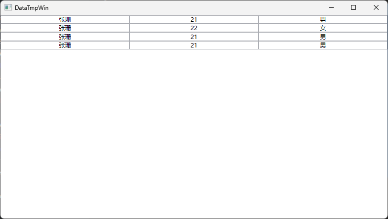

#### 2.数据模板选择

代码：

```C#
public class ListViewTmpSelector:DataTemplateSelector
{
    public DataTemplate NormalTemplate { get; set; }
    public DataTemplate FemaleTemplate { get; set; }
    public override DataTemplate? SelectTemplate(object? item, DependencyObject container)
    {
        Person person = item as Person;
        if (person.Gender == "女")
        {
            return FemaleTemplate;
        }
        return NormalTemplate;
    }
}
public partial class TmpSelectWin : Window
{
    public List<Person> Persons { get; set; } = new List<Person>();
    public TmpSelectWin()
    {
        InitializeComponent();
        Persons.Add(new Person(){Name="张居正" ,Age=21, Gender="男"});
        Persons.Add(new Person(){Name="上官婉儿", Age=21, Gender="女"});
        Persons.Add(new Person(){Name="诸葛亮", Age=23, Gender="男"});
        Persons.Add(new Person(){Name="独孤伽罗", Age=42, Gender="女"});
        Persons.Add(new Person(){Name="长孙无忌", Age=21, Gender="男"});
        Persons.Add(new Person(){Name="张三", Age=32, Gender="男"});
        DataContext = this;
    }
}
```

```xaml
<Window x:Class="WpfStudy02.TmpSelectWin"
        xmlns="http://schemas.microsoft.com/winfx/2006/xaml/presentation"
        xmlns:x="http://schemas.microsoft.com/winfx/2006/xaml"
        xmlns:mc="http://schemas.openxmlformats.org/markup-compatibility/2006"
        xmlns:d="http://schemas.microsoft.com/expression/blend/2008"
        xmlns:sys="clr-namespace:System.Runtime;assembly=System.Runtime"
        xmlns:local="clr-namespace:WpfStudy02"
        xmlns:models="clr-namespace:WpfStudy02.Models"
        mc:Ignorable="d"
        Title="TmpSelectWin" Height="450" Width="800">
    <Window.Resources>
        
        <DataTemplate DataType="{x:Type models:Person}" x:Key="NormalTmp">
            <StackPanel Orientation="Horizontal">
                <TextBox Text="{Binding Name}"></TextBox>
                <TextBox Text="{Binding Age}"></TextBox>
                <TextBox Text="{Binding Gender}"></TextBox>
            </StackPanel>
        </DataTemplate>
        <DataTemplate DataType="{x:Type models:Person}" x:Key="Female">
                <StackPanel Orientation="Horizontal"> 
                    <TextBox Text="{Binding Name}" Foreground="HotPink"></TextBox>
                    <TextBox Text="{Binding Age}"></TextBox>
                    <TextBox Text="{Binding Gender}"></TextBox>
                </StackPanel>
        </DataTemplate>
    </Window.Resources>
    <Grid>
        <ListView ItemsSource="{Binding Persons}">
            <ListView.ItemTemplateSelector>
                <local:ListViewTmpSelector FemaleTemplate="{StaticResource Female}" NormalTemplate="{StaticResource NormalTmp}"></local:ListViewTmpSelector>
            </ListView.ItemTemplateSelector>
        </ListView>
    </Grid>
</Window>
```

效果：

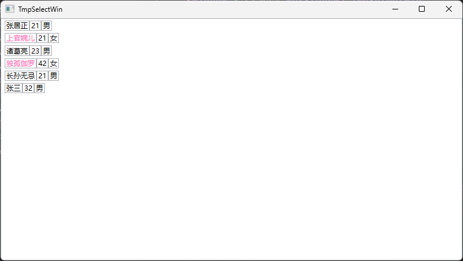

同理还有样式选择器。

# 依赖属性与附加属性

## 依赖属性

#### **1. 依赖属性是什么？**

依赖属性（Dependency Property）是 WPF 中一种**增强版的属性系统**，它扩展了传统的 CLR（公共语言运行时）属性功能，支持动态值分配、继承、绑定和高效资源管理。依赖属性是 WPF 实现数据驱动界面（如数据绑定、样式、动画）的核心基础。

#### **2. 依赖属性的作用**

依赖属性解决了传统属性的以下局限性，并提供了以下关键功能：

| **功能**           | **解决的问题**                                               |
| :----------------- | :----------------------------------------------------------- |
| **动态值优先级**   | 支持多个值来源（如本地值、样式、继承值），按优先级自动选择生效值。 |
| **数据绑定与动画** | 与 WPF 的绑定系统无缝集成，支持双向绑定和动画驱动的值变更。  |
| **资源优化**       | 仅存储被显式修改的值，未赋值的属性共享默认值，减少内存占用。 |
| **属性值继承**     | 子元素可继承父容器的属性值（如 `FontFamily`、`DataContext`）。 |
| **元数据扩展**     | 支持通过元数据定义默认值、值变更回调、绑定验证等高级行为。   |

------

#### **3. 依赖属性的元数据（Metadata）**

依赖属性的元数据通过 `PropertyMetadata` 或其子类（如 `FrameworkPropertyMetadata`）定义，用于描述属性的行为和特性。元数据包含以下关键信息：

##### **(1) 默认值（Default Value）**

- 定义依赖属性的初始值，当未显式赋值时生效。
- 示例：

```C#
new FrameworkPropertyMetadata("Default Text")
```

##### **(2) 属性变更回调（PropertyChangedCallback）**

- 当属性值变化时触发的回调方法，用于更新 UI 或执行逻辑。
- 示例：

```c#
new FrameworkPropertyMetadata(
    defaultValue: 0,
    propertyChangedCallback: (d, e) => 
    {
        var control = d as MyControl;
        control?.OnValueChanged(e.OldValue, e.NewValue);
    }
)
```

##### **(3) 强制值回调（CoerceValueCallback）**

- 在属性值被设置前对其进行验证或修正（如限制数值范围）。
- 示例：

```C#
new FrameworkPropertyMetadata(
    defaultValue: 0,
    coerceValueCallback: (d, value) => 
    {
        return Math.Max(0, (int)value); // 确保值不小于0
    }
)
```

##### **(4) 其他标志（Flags）**

依赖属性的元数据标志位通过 `FrameworkPropertyMetadataOptions` 枚举定义，用于控制属性的行为和交互逻辑。以下是常用标志位的说明：

| 枚举值                         | 作用                                                         | 典型场景                                                     |
| ------------------------------ | ------------------------------------------------------------ | ------------------------------------------------------------ |
| None                           | 依赖属性使用默认行为，不应用任何特殊选项。                   | 简单的、不需要特殊处理的依赖属性，例如一个用于计数且对 WPF 布局、数据绑定等无特殊影响的属性。 |
| Inherits                       | 使依赖属性的值能够从父元素传递到子元素，具有继承性。         | 如设置一个`StackPanel`的`Foreground`属性为红色，`StackPanel`内的所有文本元素（如`TextBlock`）会自动继承该红色前景色。 |
| OverridesInheritanceBehavior   | 覆盖依赖属性的继承行为，阻止该属性从父元素继承值。           | 在特定的`TextBlock`控件中，不想继承其父容器设置的`FontSize`属性，可通过此选项实现。 |
| AffectsMeasure                 | 当此依赖属性的值发生改变时，会促使元素重新进行测量，即调用`MeasureOverride`方法。 | 比如改变`Grid`中某一行的`Height`属性，会导致`Grid`重新测量其子元素以确定布局。 |
| AffectsArrange                 | 当该依赖属性值改变时，会触发元素重新进行排列，即调用`ArrangeOverride`方法。 | 若改变`Canvas`中某个元素的`Margin`属性，会影响该元素在`Canvas`中的排列位置，此时会触发重新排列。 |
| AffectsRender                  | 当依赖属性的值更改时，会引起元素重新渲染。                   | 例如修改`Rectangle`的`Fill`属性，改变其填充颜色，就需要重新渲染该矩形以显示新颜色。 |
| NotDataBindable                | 表明该依赖属性不支持数据绑定。                               | 一些仅用于控件内部逻辑，不希望通过数据绑定进行访问或修改的属性，如控件内部用于临时状态标记的属性。 |
| BindTwoWayByDefault            | 将依赖属性的默认绑定模式设定为双向绑定。                     | `Slider`的`Value`属性，用户拖动滑块改变值时，绑定的数据源值也改变；数据源值改变时，滑块位置也相应更新。 |
| Journal                        | 使依赖属性的值被记录在导航历史中，以便在导航回退时恢复到之前的值。 | 在多页面应用中，用户在某个页面设置了特定的主题颜色，导航回退时希望恢复该颜色设置的场景。 |
| SubPropertiesDoNotAffectRender | 意味着该属性的子属性发生变化时，不会导致元素重新渲染。       | 对于一个复杂的`Geometry`属性，它包含多个子属性（如点坐标等），通常子属性变化不直接触发渲染更新。 |
| DefaultValueInitialized        | 指示依赖属性的默认值已初始化，这一过程通常由系统自动处理。   | 系统内部用于标记依赖属性默认值已完成初始化，开发人员在常规开发中一般无需手动操作。 |

#### **4. 如何定义依赖属性？**

以下是一个完整的依赖属性定义示例：

```C#
public class CustomControl : Control
{
    // 1. 注册依赖属性
    public static readonly DependencyProperty TextProperty = 
        DependencyProperty.Register(
            name: "Text",                              // 属性名称
            propertyType: typeof(string),              // 属性类型
            ownerType: typeof(CustomControl),          // 所属类型
            typeMetadata: new FrameworkPropertyMetadata(
                defaultValue: "Default",               // 默认值
                flags: FrameworkPropertyMetadataOptions.AffectsRender, // 元数据标志
                propertyChangedCallback: OnTextChanged // 值变更回调
            )
        );

    // 2. 属性变更回调方法
    private static void OnTextChanged(DependencyObject d, DependencyPropertyChangedEventArgs e)
    {
        var control = (CustomControl)d;
        control.UpdateDisplay(); // 自定义逻辑
    }

    // 3. CLR 包装器（可选但推荐）
    public string Text
    {
        get => (string)GetValue(TextProperty);
        set => SetValue(TextProperty, value);
    }
}
```

#### **5. 依赖属性的使用场景**

##### **(1) 数据绑定**

```xaml
<CustomControl Text="{Binding UserName, Mode=TwoWay}"/>
```

##### **(2) 样式与模板**

```xaml
<Style TargetType="CustomControl">
    <Setter Property="Text" Value="Hello WPF"/>
    <Style.Triggers>
        <Trigger Property="IsFocused" Value="True">
            <Setter Property="Text" Value="Focused!"/>
        </Trigger>
    </Style.Triggers>
</Style>
```

##### **(3) 动画驱动**

```xaml
<Storyboard>
    <StringAnimationUsingKeyFrames 
        Storyboard.TargetProperty="Text"
        Duration="0:0:3">
        <DiscreteStringKeyFrame Value="Loading..." KeyTime="0:0:0"/>
        <DiscreteStringKeyFrame Value="Complete!" KeyTime="0:0:3"/>
    </StringAnimationUsingKeyFrames>
</Storyboard>
```

##### **(4) 自定义控件开发**

- 为控件暴露可绑定的属性（如 `Chart.DataPoints`）。
- 支持动态资源引用和样式覆盖。

#### **6. 依赖属性的优先级链**

当多个来源为依赖属性赋值时，按以下优先级生效（从高到低）：

| **优先级层级**          | **描述**                                                 | **示例**                                                     |
| :---------------------- | :------------------------------------------------------- | :----------------------------------------------------------- |
| **1. 本地值**           | 直接在控件上设置的值（XAML 或代码）。                    | `<Button Content="OK"/>`                                     |
| **2. 活动动画**         | 正在运行的动画（如 `Storyboard`）。                      | `<DoubleAnimation Storyboard.TargetProperty="Opacity" To="0.5"/>` |
| **3. 模板触发器**       | 控件模板中的触发器（如 `ControlTemplate.Triggers`）。    | `<Trigger Property="IsMouseOver" Value="True"> ... </Trigger>` |
| **4. 隐式样式触发器**   | 通过 `Style.Triggers` 定义的触发器。                     | `<Style.Triggers><Trigger .../></Style.Triggers>`            |
| **5. 模板生成的本地值** | 由控件模板生成的默认值（如 `ContentPresenter` 的内容）。 | `<ControlTemplate><ContentPresenter/></ControlTemplate>`     |
| **6. 隐式样式**         | 通过 `TargetType` 自动应用的样式（无 `x:Key`）。         | `<Style TargetType="Button"> ... </Style>`                   |
| **7. 样式继承**         | 通过 `BasedOn` 继承自父样式。                            | `<Style TargetType="Button" BasedOn="{StaticResource BaseStyle}"/>` |
| **8. 默认值**           | 依赖属性注册时定义的默认值。                             | `new FrameworkPropertyMetadata("Default")`                   |

## 附加属性

在 WPF 中，**附加属性（Attached Properties）** 是一种特殊类型的依赖属性，允许一个类为其他类定义额外的属性。以下是附加属性的核心概念、作用及使用方式的详细说明：

### **一、附加属性的定义**

附加属性通过以下步骤定义：

1. **注册附加属性**：使用 `DependencyProperty.RegisterAttached` 方法。
2. **提供静态访问器**：定义 `Get` 和 `Set` 方法以便 XAML 和代码访问。

#### **示例：定义一个 `Angle` 附加属性**

```C#
public class CirclePanel : Panel
{
    // 1. 注册附加属性
    public static readonly DependencyProperty AngleProperty =
        DependencyProperty.RegisterAttached(
            "Angle",
            typeof(double),
            typeof(CirclePanel),
            new FrameworkPropertyMetadata(0.0, FrameworkPropertyMetadataOptions.AffectsParentArrange)
        );

    // 2. 静态 Get 方法
    public static double GetAngle(UIElement element)
    {
        return (double)element.GetValue(AngleProperty);
    }

    // 3. 静态 Set 方法
    public static void SetAngle(UIElement element, double value)
    {
        element.SetValue(AngleProperty, value);
    }

    // 布局逻辑（使用附加属性排列子元素）
    protected override Size ArrangeOverride(Size finalSize)
    {
        foreach (UIElement child in Children)
        {
            double angle = GetAngle(child);
            // 根据角度计算位置并排列
        }
        return finalSize;
    }
}
```

#### 2. **命名规范与目标类型限制**

- **字段命名强制规则**
  注册的静态字段名称必须为 ​**`PropertyName + "Property"`**​（如 `ShowBorderProperty`），否则运行时将无法识别属性
- **参数类型需明确具体**
  - `Get/Set` 方法的第一个参数类型应限定为具体类型（如 `UIElement`），而非宽泛的 `DependencyObject`，避免非预期对象设置属性

### **二、附加属性的核心作用**

1. **扩展元素功能**
   允许控件或布局容器为子元素添加额外的属性。
   **示例**：
   - `Grid.Row`、`Grid.Column`（Grid 布局的行列位置）
   - `Canvas.Left`、`Canvas.Top`（Canvas 布局的绝对坐标）
2. **解耦属性与元素**
   属性定义在服务类中，与目标元素无关。
   **示例**：
   - `ToolTipService.ToolTip`（工具提示服务，可附加到任何控件）
3. **支持数据绑定与动画**
   附加属性是依赖属性，天然支持 WPF 的高级特性。
   **示例**：

```xaml
<Button Canvas.Left="{Binding XPos}" Canvas.Top="{Binding YPos}"/>
```

### **三、附加属性的使用场景**

#### **1. 布局容器**

- **Grid 布局**：

```xaml
<Grid>
    <Button Grid.Row="0" Grid.Column="1" Content="OK"/>
</Grid>
```

- **Canvas 布局**：

```xaml
<Canvas>
    <Ellipse Canvas.Left="50" Canvas.Top="100" Width="50" Height="50"/>
</Canvas>
```

#### **2. 服务类**

- **工具提示服务**：

```xaml
<Button ToolTipService.ToolTip="点击提交" Content="提交"/>
```

- **拖放支持**：

```xaml
<TextBox AllowDrop="True" 
         PreviewDragOver="TextBox_PreviewDragOver"
         PreviewDrop="TextBox_PreviewDrop"/>
```

#### **3. 自定义布局或行为**

- **自定义环形布局**：

```xaml
<local:CirclePanel>
    <Button local:CirclePanel.Angle="45" Content="A"/>
    <Button local:CirclePanel.Angle="90" Content="B"/>
</local:CirclePanel>
```

### **四、附加属性与普通依赖属性的区别**

| **特性**      | **附加属性**                 | **普通依赖属性**     |
| :------------ | :--------------------------- | :------------------- |
| **定义位置**  | 在一个类中定义，供其他类使用 | 在定义它的类中使用   |
| **访问方式**  | 通过静态 `Get`/`Set` 方法    | 通过实例属性直接访问 |
| **典型应用**  | 布局、服务、扩展行为         | 控件自身的状态或外观 |
| **XAML 语法** | `附加类.属性名="值"`         | `属性名="值"`        |

------

### **五、附加属性的优先级与继承**

- **优先级链**：附加属性遵循依赖属性的优先级链（本地值 > 样式 > 继承值等）。
- **值继承**：通过 `FrameworkPropertyMetadata.Inherits` 标志实现跨层级继承。

## 类型转换器

在 WPF 中，依赖属性（Dependency Properties）和附加属性（Attached Properties）的 **类型转换器（Type Converter）** 用于在 XAML 中将字符串值转换为目标类型的对象（或反向操作）。

### **一、类型转换器的作用**

1. **XAML 字符串到对象的转换**
   将 XAML 中的字符串（如 `"Red"`）转换为对应的对象（如 `SolidColorBrush`）。
2. **设计时支持**
   在设计器（如 Visual Studio、Blend）中预览属性值。
3. **简化数据绑定**
   支持通过字符串直接绑定到复杂对象。

### **二、内置类型转换器示例**

WPF 内置了许多常用类型的转换器，例如：

- **颜色**：`"Red"` → `SolidColorBrush`（通过 `ColorConverter`）。
- **几何路径**：`"M0,0 L10,10"` → `PathGeometry`（通过 `GeometryConverter`）。
- **布局值**：`"2*"` → `GridLength`（通过 `GridLengthConverter`）。

### **三、依赖属性与类型转换器**

#### **1. 默认类型转换**

若依赖属性的类型已注册类型转换器，XAML 会自动调用它。例如：

```
// 定义依赖属性（类型为 Point）
public static readonly DependencyProperty PositionProperty = 
    DependencyProperty.Register("Position", typeof(Point), typeof(MyControl));

// XAML 中使用（自动转换字符串）
<local:MyControl Position="10,20"/>
```

- **底层逻辑**：WPF 使用 `PointConverter` 将 `"10,20"` 转换为 `Point` 对象。

#### **2. 显式指定类型转换器**

若类型未注册转换器，需通过 `TypeConverterAttribute` 标记：

```C#
[TypeConverter(typeof(MyCustomConverter))]
public class MyData
{
    public string Value { get; set; }
}

public static readonly DependencyProperty DataProperty = 
    DependencyProperty.Register("Data", typeof(MyData), typeof(MyControl));
```

### **四、附加属性与类型转换器**

附加属性的类型转换逻辑与依赖属性相同：

```
// 定义附加属性
public class MyAttachedProps
{
    public static readonly DependencyProperty TagProperty = 
        DependencyProperty.RegisterAttached("Tag", typeof(MyData), typeof(MyAttachedProps));

    public static MyData GetTag(UIElement obj) => (MyData)obj.GetValue(TagProperty);
    public static void SetTag(UIElement obj, MyData value) => obj.SetValue(TagProperty, value);
}

// XAML 中使用
<Button local:MyAttachedProps.Tag="Special"/>
```

- **转换逻辑**：若 `MyData` 已注册 `TypeConverter`，`"Special"` 会被自动转换。

### **五、自定义类型转换器**

#### **1. 实现步骤**

##### **(1) 创建转换器类**

继承 `TypeConverter`，重写关键方法：

```C#
public class Point3DConverter : TypeConverter
{
    // 支持从字符串转换
    public override bool CanConvertFrom(ITypeDescriptorContext context, Type sourceType) 
        => sourceType == typeof(string);

    // 转换逻辑
    public override object ConvertFrom(ITypeDescriptorContext context, CultureInfo culture, object value)
    {
        if (value is string str)
        {
            string[] parts = str.Split(',');
            if (parts.Length == 3)
            {
                double x = double.Parse(parts[0], culture);
                double y = double.Parse(parts[1], culture);
                double z = double.Parse(parts[2], culture);
                return new Point3D(x, y, z);
            }
        }
        throw new FormatException("Invalid Point3D format.");
    }

    // 可选：支持转换到字符串（用于序列化）
    public override bool CanConvertTo(ITypeDescriptorContext context, Type destinationType) 
        => destinationType == typeof(string);

    public override object ConvertTo(ITypeDescriptorContext context, CultureInfo culture, object value, Type destinationType)
    {
        if (value is Point3D point)
        {
            return $"{point.X},{point.Y},{point.Z}";
        }
        throw new NotSupportedException();
    }
}
```

##### **(2) 应用转换器**

通过 `TypeConverterAttribute` 标记目标类型：

```C#
[TypeConverter(typeof(Point3DConverter))]
public struct Point3D
{
    public double X { get; set; }
    public double Y { get; set; }
    public double Z { get; set; }
}
```

##### **(3) 在 XAML 中使用**

```xaml
<local:MyControl Position3D="10,20,30"/>
```

### **六、注意事项**

1. **文化敏感性**
   使用 `CultureInfo` 正确处理数字格式（如小数点符号）。
2. **错误处理**
   转换失败时抛出 `FormatException` 或提供默认值。
3. **设计器支持**
   确保转换器在设计时程序集中可用。


# 数据绑定

## 基础概念

#### **1. 数据绑定的核心概念**

数据绑定（Data Binding）是 WPF 中实现 **数据驱动 UI** 的核心机制，通过建立数据源（如对象、集合）与 UI 元素之间的自动同步关系，减少手动更新界面的代码量。

- **绑定方向**：控制数据流动方式（单向、双向等）。
- **绑定路径**：指定数据源中的属性或子属性。
- **数据上下文**：为 UI 元素指定默认数据源（`DataContext`）。

#### **2. 数据绑定的四大要素**

| **要素**     | **描述**                                                     |
| :----------- | :----------------------------------------------------------- |
| **数据源**   | 绑定的数据提供者（如对象、集合、数据库）。                   |
| **目标对象** | 接收数据的 UI 元素（如 `TextBox`、`ListBox`）。              |
| **绑定模式** | 控制数据流向（`OneWay`、`TwoWay`、`OneTime`、`OneWayToSource`）。 |
| **转换器**   | 处理数据在源和目标之间的格式转换（如日期格式化）。           |

------

#### **3. 绑定模式（Binding Mode）**

| **模式**           | **行为**                                                  |
| :----------------- | :-------------------------------------------------------- |
| **OneWay**         | 数据源 → 目标（默认）。适用于只读展示（如标签显示文本）。 |
| **TwoWay**         | 数据源 ↔ 目标。适用于可编辑控件（如 `TextBox`）。         |
| **OneTime**        | 仅初始时同步一次，后续不更新。适用于静态数据。            |
| **OneWayToSource** | 目标 → 数据源（反向绑定）。适用于从 UI 收集数据。         |

------

#### **4. 基础语法与实现**

##### **(1) XAML 绑定**

```xaml
<!-- 绑定到 DataContext 的 Name 属性 -->
<TextBlock Text="{Binding Name}" />

<!-- 显式指定源和路径 -->
<TextBlock Text="{Binding Source={StaticResource user}, Path=Age}" />

<!-- 双向绑定 -->
<TextBox Text="{Binding Title, Mode=TwoWay, UpdateSourceTrigger=PropertyChanged}" />
```

##### **(2) 代码绑定**

```C#
Binding binding = new Binding("Price");
binding.Source = product;
binding.Mode = BindingMode.TwoWay;
textBox.SetBinding(TextBox.TextProperty, binding);
```

#### **5. 数据上下文（DataContext）**

- **继承机制**：子元素默认继承父容器的 `DataContext`。
- **显式设置**：

```xaml
<StackPanel DataContext="{Binding UserProfile}">
    <TextBlock Text="{Binding Name}" />  <!-- 绑定到 UserProfile.Name -->
</StackPanel>
```

#### **6. 绑定路径（Path）**

- **属性链**：支持多级属性访问（如 `Address.City`）。
- **集合索引**：绑定到集合的特定项（如 `Items[0].Name`）。
- **特殊符号**：
  - `{Binding}`：绑定整个数据源。
  - `{Binding .}`：绑定当前数据源本身。

#### **7. 高级绑定功能**

##### **(1) 数据模板（DataTemplate）**

为复杂数据类型定义可视化方式：

```xaml
<ListBox ItemsSource="{Binding Employees}">
    <ListBox.ItemTemplate>
        <DataTemplate>
            <StackPanel>
                <TextBlock Text="{Binding Name}" FontWeight="Bold"/>
                <TextBlock Text="{Binding Position}"/>
            </StackPanel>
        </DataTemplate>
    </ListBox.ItemTemplate>
</ListBox>
```

##### **(2) 值转换器（IValueConverter）**

自定义数据格式转换逻辑：

```C#
public class CustomerValueConverter: IValueConverter
{   
    /// <summary>
    /// 将绑定源的值转换为适合绑定目标属性的类型
    /// </summary>
    /// <param name="value">从绑定源获取的值</param>
    /// <param name="targetType">绑定目标属性所期望的数据类型</param>
    /// <param name="parameter">这是一个可选参数，可以在 XAML 绑定中通过 ConverterParameter 属性设置</param>
    /// <param name="culture">用于提供与文化相关的信息，例如日期时间格式、数字格式等</param>
    /// <returns>返回转换后的值，该值的类型应该与 targetType 兼容，以便可以设置到绑定目标属性上。</returns>
    public object? Convert(object? value, Type targetType, object? parameter, CultureInfo culture)
    {
        throw new NotImplementedException();
    }
    /// <summary>
    /// 与 Convert 方法相反，当数据从绑定目标流向绑定源（例如在双向绑定中，用户在 TextBox 中输入值后，需要将该值转换为适合绑定源属性的类型）时，会调用此方法
    /// </summary>
    /// <param name="value">从绑定目标获取的值，其类型取决于绑定目标属性的类型</param>
    /// <param name="targetType">绑定源属性所期望的数据类型</param>
    /// <param name="parameter"></param>
    /// <param name="culture"></param>
    /// <returns>返回转换后的值，该值的类型应该与绑定源属性的类型兼容</returns>
    /// <exception cref="NotImplementedException"></exception>
    public object? ConvertBack(object? value, Type targetType, object? parameter, CultureInfo culture)
    {
        throw new NotImplementedException();
    }
}

// XAML 中使用
<CheckBox IsChecked="{Binding IsVisible}"/>
<TextBlock Visibility="{Binding IsVisible, Converter={StaticResource CustomerValueConverter}}"/>
```

##### **(3) 数据验证与错误处理**

通过 `ValidationRules` 或 `INotifyDataErrorInfo` 实现输入验证：

```xaml
<TextBox>
    <TextBox.Text>
        <Binding Path="Age">
            <Binding.ValidationRules>
                <local:AgeValidationRule Min="18" Max="100"/>
            </Binding.ValidationRules>
        </Binding>
    </TextBox.Text>
</TextBox>
```

#### **8. 集合绑定**

##### **(1) 绑定到 ObservableCollection**

实现动态集合更新：

```C#
public class ViewModel
{
    public ObservableCollection<string> Items { get; } = new ObservableCollection<string>();
}

// XAML 中绑定
<ListBox ItemsSource="{Binding Items}"/>
```

##### **(2) 主从视图（Master-Detail）**

```xaml
<ListBox ItemsSource="{Binding Users}" DisplayMemberPath="Name"
         SelectedItem="{Binding SelectedUser}"/>
<StackPanel DataContext="{Binding SelectedUser}">
    <TextBlock Text="{Binding Age}"/>
    <TextBlock Text="{Binding Email}"/>
</StackPanel>
```

#### **9. 命令绑定（Command Binding）**

将 UI 操作（如按钮点击）绑定到 ViewModel 中的逻辑：

```C#
public class ViewModel
{
    public ICommand SaveCommand => new RelayCommand(Save);

    private void Save()
    {
        // 保存逻辑
    }
}

// XAML 中绑定
<Button Content="保存" Command="{Binding SaveCommand}"/>
```

#### **10. 调试数据绑定**

- **输出窗口查看绑定错误**：WPF 会自动输出绑定失败信息。
- **使用转换器调试**：临时添加转换器输出中间值。
- **工具辅助**：使用第三方工具（如 Snoop、WPF Inspector）实时查看绑定状态。

------

#### **11. 性能优化**

- **虚拟化容器**：对大数据量集合使用 `VirtualizingStackPanel`。
- **延迟绑定**：通过 `IsAsync=True` 延迟加载耗时数据。
- **避免频繁更新**：合理使用 `UpdateSourceTrigger`（如设为 `LostFocus`）。

------

#### **12. 常见问题与解决**

- **绑定未生效**：检查 `DataContext` 是否正确、属性是否实现 `INotifyPropertyChanged`。
- **类型不匹配**：使用转换器处理格式差异。
- **集合更新不刷新**：使用 `ObservableCollection` 替代 `List`。

## 绑定路径

#### ** 绑定表达式的基本结构**

WPF 的绑定表达式通过 `{Binding ...}` 语法在 XAML 中声明，其核心语法如下：

```xaml
<TargetProperty="{Binding 
    Path=PropertyName, 
    Mode=TwoWay, 
    UpdateSourceTrigger=PropertyChanged,
    Converter={StaticResource MyConverter},
    RelativeSource={RelativeSource Mode=FindAncestor, AncestorType=Window},
    ElementName=SomeElement,
    StringFormat='Value: {0}'
}" />
```

每个参数控制绑定的不同行为。以下是关键属性的详细说明：

------

#### **2. 核心属性解析**

##### **(1) `Path`：绑定路径**

- **作用**：指定数据源中的属性或子属性。
- **示例**：

```xaml
<!-- 绑定到当前 DataContext 的 Name 属性 -->
<TextBlock Text="{Binding Path=Name}"/>

<!-- 绑定到子属性或集合项 -->
<TextBlock Text="{Binding Path=Address.City}"/>
<TextBlock Text="{Binding Path=Items[0].Title}"/>

<!-- 绑定整个对象（用于对象属性绑定） -->
<ContentControl Content="{Binding}"/>
```

##### **(2) `Mode`：绑定模式**

- **可选值**：

  | 模式             | 描述                                                        |
  | :--------------- | :---------------------------------------------------------- |
  | `OneWay`         | 数据源 → 目标（默认），适用于只读展示（如标签）。           |
  | `TwoWay`         | 数据源 ↔ 目标，适用于可编辑控件（如 `TextBox`、`Slider`）。 |
  | `OneTime`        | 仅初始时同步一次，后续不更新（适用于静态数据）。            |
  | `OneWayToSource` | 目标 → 数据源（反向绑定，如从 UI 收集数据）。               |

- **示例**：

```xaml
<TextBox Text="{Binding Path=Age, Mode=TwoWay}"/>
```

##### **(3) `UpdateSourceTrigger`：更新触发时机**

- **可选值**：

  | 触发时机          | 描述                                                     |
  | :---------------- | :------------------------------------------------------- |
  | `PropertyChanged` | 目标属性变化时立即更新源（实时更新，适用于输入验证）。   |
  | `LostFocus`       | 目标失去焦点时更新源（默认行为，适用于大多数输入控件）。 |
  | `Explicit`        | 需手动调用 `UpdateSource()` 更新源。                     |

- **示例**：

```xaml
<TextBox Text="{Binding Path=SearchText, UpdateSourceTrigger=PropertyChanged}"/>
```

##### **(4) `Converter` 与 `ConverterParameter`：值转换器**

- **作用**：在源与目标之间转换数据格式或类型。
- **示例**：

```C#
public class BoolToVisibilityConverter : IValueConverter
{
    public object Convert(object value, Type targetType, object parameter, CultureInfo culture)
    {
        bool isVisible = (bool)value;
        return isVisible ? Visibility.Visible : Visibility.Collapsed;
    }
    // ConvertBack 略...
}
```

```xaml
<Window.Resources>
    <local:BoolToVisibilityConverter x:Key="BoolToVisibility"/>
</Window.Resources>

<CheckBox IsChecked="{Binding IsVisible}"/>
<TextBlock Visibility="{Binding IsVisible, Converter={StaticResource BoolToVisibility}}"/>
```

##### **(5) `StringFormat`：字符串格式化**

- **作用**：将数据格式化为特定字符串（类似 `String.Format`）。
- **示例**：

```xaml
<!-- 格式化数字 -->
<TextBlock Text="{Binding Price, StringFormat=C}"/> <!-- 输出：¥100.00 -->

<!-- 组合文本 -->
<TextBlock Text="{Binding Name, StringFormat='Hello, {0}!'}"/> 

<!-- 格式化日期 -->
<TextBlock Text="{Binding BirthDate, StringFormat=yyyy-MM-dd}"/>
```

##### **(6) `RelativeSource`：相对源绑定**

- **相对源**：基于绑定目标元素自身的位置和层次结构来确定源，而不是依赖于绝对的数据源引用。

- **作用**：绑定到当前元素的关联对象（如父容器、自身）。

- **常见模式**：

  | 模式              | 描述                                     | 示例                                                         |
  | :---------------- | :--------------------------------------- | :----------------------------------------------------------- |
  | `Self`            | 绑定到当前元素自身。                     | `<Slider Value="{Binding RelativeSource={RelativeSource Self}, Path=Maximum}"/>` |
  | `FindAncestor`    | 绑定到某个祖先元素。                     | `<TextBlock Text="{Binding RelativeSource={RelativeSource AncestorType=Window}, Path=Title}"/>` |
  | `TemplatedParent` | 绑定到应用模板的父元素（用于控件模板）。 | `<TextBlock Text="{Binding RelativeSource={RelativeSource TemplatedParent}, Path=Content}"/>` |

- **示例**：

```xaml
<!-- 绑定到父级 StackPanel 的 Tag -->
<TextBlock Text="{Binding 
    RelativeSource={RelativeSource Mode=FindAncestor, AncestorType=StackPanel}, 
    Path=Tag}"/>
```

##### **(7) `ElementName`：跨元素绑定**

- **作用**：直接绑定到界面中其他命名元素。
- **示例**：

```xaml
<Slider x:Name="slider" Minimum="0" Maximum="100"/>
<TextBlock Text="{Binding ElementName=slider, Path=Value}"/>
```

##### **(8) `FallbackValue` 与 `TargetNullValue`：容错处理**

- **`FallbackValue`**：当绑定路径无效时显示的默认值。
- **`TargetNullValue`**：当绑定源为 `null` 时显示的默认值。
- **示例**：

```xaml
<TextBlock Text="{Binding Path=InvalidProperty, FallbackValue='N/A'}"/>
<TextBlock Text="{Binding Path=NullableProperty, TargetNullValue='No Data'}"/>
```

#### **3. 高级绑定场景**

##### **(1) 多绑定（MultiBinding）**

- **作用**：将多个数据源合并为一个输出。
- **示例**（结合 `IMultiValueConverter`）：

```C#
public class FullNameConverter : IMultiValueConverter
{
    public object Convert(object[] values, Type targetType, object parameter, CultureInfo culture)
    {
        return $"{values[0]} {values[1]}";
    }
    // ConvertBack 略...
}
```

```xaml
<TextBlock>
    <TextBlock.Text>
        <MultiBinding Converter="{StaticResource FullNameConverter}">
            <Binding Path="FirstName"/>
            <Binding Path="LastName"/>
        </MultiBinding>
    </TextBlock.Text>
</TextBlock>
```

##### **(2) 动态资源绑定**

- **作用**：将绑定与动态资源结合。
- **示例**：

```xaml
<TextBlock Text="{Binding Path=Title, Source={StaticResource AppStrings}}"/>
```

##### **(3) 绑定到方法**

- **限制**：WPF 原生不支持直接绑定到方法，但可通过 `ObjectDataProvider` 或转换器间接实现。
- **示例**（通过 `ObjectDataProvider`）：

```xaml
<Window.Resources>
    <ObjectDataProvider x:Key="math" ObjectType="{x:Type sys:Math}" MethodName="Sqrt">
        <ObjectDataProvider.MethodParameters>
            <sys:Double>64</sys:Double>
        </ObjectDataProvider.MethodParameters>
    </ObjectDataProvider>
</Window.Resources>

<TextBlock Text="{Binding Source={StaticResource math}}"/> <!-- 输出：8 -->
```

#### **4. 绑定表达式的最佳实践**

1. **明确数据上下文**：
   合理设置 `DataContext`，避免过度依赖隐式继承。
2. **优先使用 `OneWay` 模式**：
   仅在需要用户输入时使用 `TwoWay`，减少不必要的更新。
3. **优化性能**：
   - 对大数据量集合启用虚拟化（`VirtualizingStackPanel`）。
   - 避免频繁触发的绑定（如 `UpdateSourceTrigger=PropertyChanged` 结合复杂逻辑）。
4. **处理绑定错误**：
   - 使用 `FallbackValue` 和 `TargetNullValue` 提供友好提示。
   - 监控输出窗口的绑定错误日志。
5. **合理使用转换器**：
   将格式化、类型转换等逻辑封装到转换器中，保持 XAML 简洁。

------

#### **5. 调试绑定表达式**

- **查看输出窗口**：WPF 会输出绑定错误信息（如路径错误、类型不匹配）。
- **使用调试转换器**：临时添加转换器输出中间值。
- **工具辅助**：
  - **Snoop**：实时查看元素的数据上下文和绑定值。
  - **WPF Inspector**：检查绑定状态和可视化树。

## 示例代码

### 静态属性绑定

代码：

```xaml
<Window x:Class="WpfStudy02.StaticBindWin"
        xmlns="http://schemas.microsoft.com/winfx/2006/xaml/presentation"
        xmlns:x="http://schemas.microsoft.com/winfx/2006/xaml"
        xmlns:mc="http://schemas.openxmlformats.org/markup-compatibility/2006"
        xmlns:d="http://schemas.microsoft.com/expression/blend/2008"
        xmlns:local="clr-namespace:WpfStudy02"
        mc:Ignorable="d"
        Title="StaticBindWin" Height="450" Width="800">
    <Grid>
        <TextBox Text="{Binding Path=(local:StaticClassTest.TestValue1)}" FontSize="20"></TextBox>
        <TextBox Text="{Binding Path=(local:StaticClassTest.TestValue2)}" FontSize="20"></TextBox>
        <TextBox Text="{Binding Path=(local:StaticClassTest.TestValue3)}" FontSize="20"></TextBox>
    </Grid>
</Window>
```

```C#
public partial class StaticBindWin : Window
{
    public StaticBindWin()
    {
        InitializeComponent();
        this.Dispatcher.Invoke(() =>
        {
            Task.Run(async () =>
            {
                while (true)
                {
                    await Task.Delay(200);
                    StaticClassTest.TestValue2 = new Random().Next(1000).ToString();
                }
            });
        });
    }
}

public class StaticClassTest
{
    
    public static event PropertyChangedEventHandler? StaticPropertyChanged;
    public static event PropertyChangedEventHandler? Test1ValueChanged;
    public static event PropertyChangedEventHandler? TestValueChanged;
    
    private static string _value1 = "1234";
    public static string TestValue1
    {
        get
        {
            return _value1;
        }
        set
        {
            _value1 = value;
            //ui界面能更新值
            Test1ValueChanged?.Invoke(null, new PropertyChangedEventArgs(""));
        }
    }

    private static string _value2 = "555";
    public static string TestValue2
    {
        get
        {
            return _value2;
        }
        set
        {
            _value2 = value;
            //ui界面能更新值
            StaticPropertyChanged?.Invoke(null,new PropertyChangedEventArgs(""));
        }
    }

    private static string _value3 = "555";
    public static string TestValue3
    {
        get
        {
            return _value3;
        }
        set
        {
            _value3 = value;
            //ui界面不能更新值
            TestValueChanged?.Invoke(null,new PropertyChangedEventArgs(""));
        }
    }
}
```

### 属性校验异常捕获

```C#
public partial class TestValidateWin : Window
{
    public TestValidateWin()
    {
        InitializeComponent();
        this.DataContext = this;
    }

    public static readonly DependencyProperty MyContentProperty = DependencyProperty.Register("MyContent", typeof(string),
        typeof(TestValidateWin), new FrameworkPropertyMetadata("null"), OnValidateValueCallback);

    private static bool OnValidateValueCallback(object? value)
    {
        if (value == null)
        {
            return true;
        }

        string str = value as string;
        if (str.Length > 11)
        {
            return false;
        }

        return true;
    }

    public string MyContent
    {
        get => (string)this.GetValue(MyContentProperty);
        set => this.SetValue(MyContentProperty,value);
    }
}
```

```xaml
<Window x:Class="DataBindStudy.TestValidateWin"
        xmlns="http://schemas.microsoft.com/winfx/2006/xaml/presentation"
        xmlns:x="http://schemas.microsoft.com/winfx/2006/xaml"
        xmlns:mc="http://schemas.openxmlformats.org/markup-compatibility/2006"
        xmlns:d="http://schemas.microsoft.com/expression/blend/2008"
        xmlns:local="clr-namespace:DataBindStudy"
        mc:Ignorable="d"
        Title="TestValidateWin" Height="450" Width="800">
    <StackPanel Orientation="Vertical">
        <Border BorderThickness="2" BorderBrush="Chartreuse">
            <TextBox Name="tb">
                <TextBox.Text>
                    <Binding Path="MyContent" UpdateSourceTrigger="PropertyChanged">
                        <Binding.ValidationRules>
                            <!--用于捕获在绑定值转换或更新过程中抛出的异常-->
                            <ExceptionValidationRule />
                            <!--用于验证实现了 IDataErrorInfo 接口的绑定源对象-->
                            <!-- <DataErrorValidationRule/> -->
                            <!--用于验证实现了 INotifyDataErrorInfo 接口的绑定源对象-->
                            <!-- <NotifyDataErrorValidationRule/>-->
                        </Binding.ValidationRules>
                    </Binding>
                </TextBox.Text>
            </TextBox>
        </Border>
        <Border BorderThickness="2" BorderBrush="Brown">
            <TextBox Text="{Binding Path=(Validation.Errors)[0].ErrorContent, ElementName= tb}"></TextBox>
        </Border>
        <Button Content="Get Error" Click="ButtonBase_OnClick"></Button>
    </StackPanel>
</Window>
```

### 实现IDataErrorInfo接口

```C#
public class UserViewModel : IDataErrorInfo
    {
        private string _username = "root";
        
        [CustomerStringLength(minLength:2,maxLength:20)]
        public string Username
        {
            get { return _username; }
            set { _username = value; }
        }
        
        private int _age = 0;
        public int Age
        {
            get
            {
                return this._age;
            }
            set
            {
                _age = value;
            }
        }

        public string Error => null;

        public string this[string columnName]
        {
            get
            {
                var propertyInfo = this.GetType().GetProperty(columnName);
                if (propertyInfo != null && propertyInfo.IsDefined(typeof(CustomerStringLength),false))
                {
                    CustomerStringLength stringLength = (CustomerStringLength)propertyInfo.GetCustomAttribute(typeof(CustomerStringLength));
                    var stringLengthMinLength = stringLength.MinLength;
                    var stringLengthMaxLength = stringLength.MaxLength;
                    var value = propertyInfo.GetValue(this, null) as string;
                    if (value != null && !(value.Length > stringLengthMinLength && value.Length < stringLengthMaxLength))
                    {
                        return $"{columnName} length must be between {stringLengthMinLength} and {stringLengthMaxLength}.";
                    }
                }
                return null;
            }
        }
    }
[AttributeUsage(AttributeTargets.Property | AttributeTargets.Field)]
    public class CustomerStringLength: Attribute
    {
        public int MaxLength { get; set; }
        public int MinLength { get; set; }

        public CustomerStringLength(int minLength, int maxLength)
        {
            this.MaxLength = maxLength;
            this.MinLength = minLength;
        }
    }
```

```xaml
<Window x:Class="DataBindStudy.MainWindow"
        xmlns="http://schemas.microsoft.com/winfx/2006/xaml/presentation"
        xmlns:x="http://schemas.microsoft.com/winfx/2006/xaml"
        xmlns:d="http://schemas.microsoft.com/expression/blend/2008"
        xmlns:mc="http://schemas.openxmlformats.org/markup-compatibility/2006"
        xmlns:local="clr-namespace:DataBindStudy"
        xmlns:model="clr-namespace:DataBindStudy.Models"
        mc:Ignorable="d"
        Title="MainWindow" Height="450" Width="800">
    <Window.DataContext>
        <model:UserViewModel></model:UserViewModel>
    </Window.DataContext>
    <Grid>
        <Grid.RowDefinitions>
            <RowDefinition Height="30"/>
            <RowDefinition/>
            <RowDefinition/>
        </Grid.RowDefinitions>
      
        <StackPanel Grid.Row="0" Orientation="Horizontal" VerticalAlignment="Center">
            <Label Content="用户名："></Label>
            <TextBox Name="UsernameBox" Text="{Binding Path =Username,ValidatesOnDataErrors=True,UpdateSourceTrigger=PropertyChanged}" Width="150" VerticalAlignment="Center"></TextBox>
            <TextBlock Foreground="OrangeRed" Margin="5,0" VerticalAlignment="Center" Text="{Binding Path=(Validation.Errors)[0].ErrorContent,ElementName=UsernameBox}"></TextBlock>
        </StackPanel>
    </Grid>
</Window>
```

# 图形控件

## 图形控件基础介绍

### **1. 基本形状控件**

#### **Ellipse（椭圆/圆形）**

- **功能**：绘制椭圆或正圆。
- **关键属性**：
  - `Width`/`Height`：定义形状尺寸。
  - `Fill`：填充颜色或画刷。
  - `Stroke`：边框颜色。
  - `StrokeThickness`：边框粗细。
- **示例**：

```xaml
<Ellipse Width="100" Height="60" Fill="Blue" Stroke="Black" StrokeThickness="2"/>
```

- **场景**：按钮背景、圆形图标、数据可视化中的节点。

#### **Rectangle（矩形/正方形）**

- **功能**：绘制矩形或正方形。
- **关键属性**：
  - `RadiusX`/`RadiusY`：圆角半径。
- **示例**：

```xaml
<Rectangle Width="120" Height="80" Fill="Green" RadiusX="10" RadiusY="10"/>
```

- **场景**：卡片式布局、进度条背景、自定义按钮。

#### **Line（直线）**

- **功能**：绘制直线。
- **关键属性**：
  - `X1`/`Y1`：起点坐标。
  - `X2`/`Y2`：终点坐标。
- **示例**：

```xaml
<Line X1="0" Y1="0" X2="200" Y2="50" Stroke="Red" StrokeThickness="3"/>
```

- **场景**：图表中的轴线、分隔线、简单图形连线。

#### **Polygon（多边形）**

- **功能**：绘制闭合多边形。
- **关键属性**：
  - `Points`：顶点坐标集合（如 `"0,0 100,0 50,100"`）。
- **示例**：

```xaml
<Polygon Points="0,0 100,0 50,100" Fill="Orange" Stroke="Black"/>
```

- **场景**：自定义图标、几何图形绘制。

#### **Polyline（多段线）**

- **功能**：绘制非闭合的多段线。
- **示例**：

```xaml
<Polyline Points="0,0 50,30 100,10" Stroke="Purple" StrokeThickness="2"/>
```

- **场景**：折线图、手绘路径。

### **2. Path（路径）**

- **功能**：绘制复杂矢量图形，支持贝塞尔曲线、弧线等。
- **关键属性**：
  - `Data`：使用路径标记语法（如 `M0,0 L100,100`）。
  - `StrokeDashArray`：虚线样式。
- **示例**：

```xaml
<Path Data="M0,0 L100,50 C150,100 200,0 300,50"
      Stroke="Blue" StrokeThickness="3"/>
```

- **路径语法**：
  - `M`：移动起点。
  - `L`：直线。
  - `C`：三次贝塞尔曲线。
  - `A`：弧线。
- **场景**：图标设计、复杂几何图形、动态生成的形状。 

### **3.几何图形与路径标记**

#### **Geometry（几何图形）**

- **类型**：
  - `LineGeometry`：直线几何。
  - `RectangleGeometry`：矩形几何。
  - `EllipseGeometry`：椭圆几何。
  - `PathGeometry`：复杂路径几何。
- **示例**：

```xaml
<Path Fill="Green">
    <Path.Data>
        <PathGeometry>
            <PathFigure StartPoint="0,0">
                <LineSegment Point="100,0"/>
                <ArcSegment Point="200,50" Size="50,50" SweepDirection="Clockwise"/>
            </PathFigure>
        </PathGeometry>
    </Path.Data>
</Path>
```

## Path微语言

在 WPF 中，**Path 微语言（Path Mini-Language）** 是一种简洁的字符串语法，用于描述复杂的几何路径（`PathGeometry`）。通过该语法，可以高效地定义直线、曲线、弧线等图形，而无需编写冗长的 XAML 元素。以下是其核心语法和用法的详细说明：

### **1. 语法结构**

Path 微语言通过 `Path.Data` 属性的字符串值定义，基本格式如下：
`"命令1 参数1 参数2 ... 命令2 参数1 ..."`
每个命令由 **单个字母** 表示，参数为数值或坐标点。

------

### **2. 基础命令**

#### **(1) 移动命令（Move To）**

- **`M` 或 `m`**：将起点移动到指定坐标。
  - **大写 `M`**：绝对坐标（相对于画布原点）。
  - **小写 `m`**：相对坐标（相对于当前点）。

**示例**：

```xaml
<!-- 绝对坐标：移动到 (10,20) -->
<Path Data="M 10,20 ..." />

<!-- 相对坐标：向右移动 30，向下移动 40 -->
<Path Data="m 30,40 ..." />
```

#### **(2) 直线命令（Line To）**

- **`L` 或 `l`**：从当前点绘制直线到目标点。
- **`H`/`h`**：水平直线（仅指定 x 坐标）。
- **`V`/`v`**：垂直直线（仅指定 y 坐标）。

**示例**：

```xaml
<!-- 绝对坐标：从 (10,20) 到 (50,60) -->
<Path Data="M 10,20 L 50,60" Stroke="Black"/>

<!-- 相对坐标：向右画 40，向下画 30 -->
<Path Data="M 10,20 l 40,30" Stroke="Black"/>
```

#### **(3) 闭合命令（Close）**

- **`Z` 或 `z`**：闭合路径（从当前点绘制直线到起点）。

**示例**：

```xaml
<!-- 绘制三角形 -->
<Path Data="M 0,0 L 100,0 L 50,100 Z" Fill="Blue"/>
```

### **3. 曲线命令**

#### **(1) 三次贝塞尔曲线（Cubic Bezier）**

- **`C` 或 `c`**：定义三次贝塞尔曲线，需要两个控制点和一个终点。
  **格式**：`C 控制点1 控制点2 终点`

**示例**：

```xaml
<!-- 从 (0,0) 到 (100,0)，控制点 (20,50) 和 (80,50) -->
<Path Data="M 0,0 C 20,50 80,50 100,0" Stroke="Red"/>
```

#### **(2) 二次贝塞尔曲线（Quadratic Bezier）**

- **`Q` 或 `q`**：定义二次贝塞尔曲线，需要一个控制点和一个终点。
  **格式**：`Q 控制点 终点`

**示例**：

```xaml
<!-- 从 (0,0) 到 (100,0)，控制点 (50,80) -->
<Path Data="M 0,0 Q 50,80 100,0" Stroke="Green"/>
```

#### **(3) 椭圆弧（Arc）**

- **`A` 或 `a`**：绘制椭圆弧，参数较多。
  **格式**：
  `A 椭圆半径X 椭圆半径Y 旋转角度 是否大弧 是否顺时针 终点`

**参数详解**：

- **半径X/Y**：椭圆的长半轴和短半轴。
- **旋转角度**：椭圆相对于坐标轴的旋转角度（度数）。
- **是否大弧**：`0`（小弧）或 `1`（大弧）。
- **是否顺时针**：`0`（逆时针）或 `1`（顺时针）。
- **终点**：弧的终点坐标。

**示例**：

```xaml
<!-- 从 (0,0) 到 (100,0)，绘制半圆 -->
<Path Data="M 0,0 A 50,50 0 1 1 100,0" Stroke="Purple"/>
```

### **5. 注意事项**

1. **坐标系统**：原点 `(0,0)` 在左上角，x 向右递增，y 向下递增。
2. **闭合路径**：使用 `Z` 命令确保路径闭合，否则可能无法正确填充。
3. **性能优化**：复杂路径建议用 `StreamGeometry` 替代字符串语法（性能更高）。
4. **工具支持**：可使用 Blend 或在线工具（如 Path Editor）生成路径数据。

## 对象基本变形操作

### **WPF 对象基本变形操作详解**

在 WPF 中，**变形（Transform）** 是修改对象位置、大小、旋转和倾斜的核心机制。通过变换操作，可以实现动态的视觉效果（如动画、交互反馈），而无需直接修改控件的布局属性。以下是变形操作的分类、核心属性及使用场景的全面解析：

#### **1. 变形类型与核心属性**

WPF 提供 6 种基本变形类型，均继承自 `Transform` 类：

| **变形类型**           | **作用**                   | **关键属性**                                                 |
| :--------------------- | :------------------------- | :----------------------------------------------------------- |
| **TranslateTransform** | 平移（位移）               | `X`：水平偏移量；`Y`：垂直偏移量。                           |
| **RotateTransform**    | 旋转                       | `Angle`：旋转角度（度数）；`CenterX/Y`：旋转中心点。         |
| **ScaleTransform**     | 缩放                       | `ScaleX/Y`：缩放比例；`CenterX/Y`：缩放中心点。              |
| **SkewTransform**      | 斜切（倾斜）               | `AngleX/Y`：X/Y轴倾斜角度；`CenterX/Y`：倾斜中心点。         |
| **MatrixTransform**    | 矩阵变换（自定义任意变形） | `Matrix`：定义变换矩阵（6个参数：M11, M12, M21, M22, OffsetX, OffsetY）。 |
| **TransformGroup**     | 组合多个变形               | `Children`：包含多个变形对象的集合。                         |

------

##### **(1) 平移（TranslateTransform）**

- **功能**：沿 X/Y 轴移动对象。
- **示例**：

```xaml
<Rectangle Width="100" Height="50" Fill="Blue">
    <Rectangle.RenderTransform>
        <TranslateTransform X="20" Y="30"/>
    </Rectangle.RenderTransform>
</Rectangle>
```

- **场景**：实现拖拽动画、元素位置微调。

##### **(2) 旋转（RotateTransform）**

- **功能**：绕指定中心点旋转对象。

- **示例**：

  ```xaml
  <Button Content="旋转按钮">
      <Button.RenderTransform>
          <RotateTransform Angle="45" CenterX="50" CenterY="15"/>
      </Button.RenderTransform>
  </Button>
  ```

- **场景**：仪表盘指针、动态图标、卡片翻转效果。

##### **(3) 缩放（ScaleTransform）**

- **功能**：按比例放大或缩小对象。
- **示例**：

```xaml
<Image Source="logo.png">
    <Image.RenderTransform>
        <ScaleTransform ScaleX="1.5" ScaleY="1.5" CenterX="0" CenterY="0"/>
    </Image.RenderTransform>
</Image>
```

##### **(4) 斜切（SkewTransform）**

- **功能**：沿 X/Y 轴倾斜对象，产生平行四边形效果。
- **示例**：

```xaml
<Border Width="100" Height="50" Background="Green">
    <Border.RenderTransform>
        <SkewTransform AngleX="30" AngleY="0"/>
    </Border.RenderTransform>
</Border>
```

##### **(5) 矩阵变换（MatrixTransform）**

- **功能**：通过矩阵定义任意复杂变换（平移、旋转、缩放、斜切的组合）。
- **矩阵参数**：

```xaml
| M11  		M12  	0 |
| M21  		M22  	0 |
| OffsetX  OffsetY  1 |
```

|     参数      |        作用        |                数学意义                 | 默认值 |            示例场景            |
| :-----------: | :----------------: | :-------------------------------------: | :----: | :----------------------------: |
|   **`M11`**   | X 轴缩放与旋转因子 | 控制 X 轴缩放和旋转的余弦分量（`cosθ`） | `1.0`  |   `M11=2` 表示 X 轴放大 2 倍   |
|   **`M12`**   | X 轴倾斜与旋转因子 | 控制 X 轴倾斜和旋转的正弦分量（`sinθ`） | `0.0`  | `M12=0.5` 表示 X 轴倾斜 26.6°  |
|   **`M21`**   | Y 轴倾斜与旋转因子 |   控制 Y 轴倾斜的正弦分量（`-sinθ`）    | `0.0`  | `M21=0.5` 表示 Y 轴逆时针倾斜  |
|   **`M22`**   | Y 轴缩放与旋转因子 | 控制 Y 轴缩放和旋转的余弦分量（`cosθ`） | `1.0`  |  `M22=0.5` 表示 Y 轴缩小 50%   |
| **`OffsetX`** |     X 轴平移量     |       控制水平位移（单位：像素）        | `0.0`  | `OffsetX=50` 向右移动 50 像素  |
| **`OffsetY`** |     Y 轴平移量     |       控制垂直位移（单位：像素）        | `0.0`  | `OffsetY=-30` 向上移动 30 像素 |

- **示例**：

```xaml
<Path Data="M0,0 L50,0 25,50 Z" Fill="Red">
    <Path.RenderTransform>
        <MatrixTransform Matrix="1, 0.5, 0, 1, 20, 0"/>
    </Path.RenderTransform>
</Path>
```

##### **(6) 组合变换（TransformGroup）**

- **功能**：按顺序应用多个变换（顺序影响最终效果）。
- **示例**：

```xaml
<Ellipse Width="80" Height="80" Fill="Orange">
    <Ellipse.RenderTransform>
        <TransformGroup>
            <RotateTransform Angle="30"/>
            <ScaleTransform ScaleX="1.2" ScaleY="0.8"/>
        </TransformGroup>
    </Ellipse.RenderTransform>
</Ellipse>
```

#### **2. 核心变形操作详解**

##### **(1) 平移（TranslateTransform）**

- **功能**：沿 X/Y 轴移动对象。
- **示例**：

```xaml
<Rectangle Width="100" Height="50" Fill="Blue">
    <Rectangle.RenderTransform>
        <TranslateTransform X="20" Y="30"/>
    </Rectangle.RenderTransform>
</Rectangle>
```

##### **(2) 旋转（RotateTransform）**

- **功能**：绕指定中心点旋转对象。
- **示例**：

```xaml
<Button Content="旋转按钮">
    <Button.RenderTransform>
        <RotateTransform Angle="45" CenterX="50" CenterY="15"/>
    </Button.RenderTransform>
</Button>
```

- **场景**：仪表盘指针、动态图标、卡片翻转效果。

##### **(3) 缩放（ScaleTransform）**

- **功能**：按比例放大或缩小对象。
- **示例**：

```xaml
<Image Source="logo.png">
    <Image.RenderTransform>
        <ScaleTransform ScaleX="1.5" ScaleY="1.5" CenterX="0" CenterY="0"/>
    </Image.RenderTransform>
</Image>
```

- **场景**：鼠标悬停放大效果、响应式布局适配。

##### **(4) 斜切（SkewTransform）**

- **功能**：沿 X/Y 轴倾斜对象，产生平行四边形效果。
- **示例**：

```xaml
<Border Width="100" Height="50" Background="Green">
    <Border.RenderTransform>
        <SkewTransform AngleX="30" AngleY="0"/>
    </Border.RenderTransform>
</Border>
```

- **场景**：创意图标、动态阴影效果。

##### **(5) 矩阵变换（MatrixTransform）**

- **功能**：通过矩阵定义任意复杂变换（平移、旋转、缩放、斜切的组合）。
- **矩阵参数**：

| **`M11`**     | X 轴缩放与旋转因子 | 控制 X 轴缩放和旋转的余弦分量（`cosθ`） | `1.0` | `M11=2` 表示 X 轴放大 2 倍     |
| ------------- | ------------------ | --------------------------------------- | ----- | ------------------------------ |
| **`M12`**     | X 轴倾斜与旋转因子 | 控制 X 轴倾斜和旋转的正弦分量（`sinθ`） | `0.0` | `M12=0.5` 表示 X 轴倾斜 26.6°  |
| **`M21`**     | Y 轴倾斜与旋转因子 | 控制 Y 轴倾斜的正弦分量（`-sinθ`）      | `0.0` | `M21=0.5` 表示 Y 轴逆时针倾斜  |
| **`M22`**     | Y 轴缩放与旋转因子 | 控制 Y 轴缩放和旋转的余弦分量（`cosθ`） | `1.0` | `M22=0.5` 表示 Y 轴缩小 50%    |
| **`OffsetX`** | X 轴平移量         | 控制水平位移（单位：像素）              | `0.0` | `OffsetX=50` 向右移动 50 像素  |
| **`OffsetY`** | Y 轴平移量         | 控制垂直位移（单位：像素）              | `0.0` | `OffsetY=-30` 向上移动 30 像素 |

```xaml
<Path Data="M0,0 L50,0 25,50 Z" Fill="Red">
    <Path.RenderTransform>
        <MatrixTransform Matrix="1, 0.5, 0, 1, 20, 0"/>
    </Path.RenderTransform>
</Path>
```

##### **(6) 组合变换（TransformGroup）**

- **功能**：按顺序应用多个变换（顺序影响最终效果）。
- **示例**：

```xaml
<Ellipse Width="80" Height="80" Fill="Orange">
    <Ellipse.RenderTransform>
        <TransformGroup>
            <RotateTransform Angle="30"/>
            <ScaleTransform ScaleX="1.2" ScaleY="0.8"/>
        </TransformGroup>
    </Ellipse.RenderTransform>
</Ellipse>
```


#### **3. 变形操作的核心概念**

##### **(1) 变换中心点（CenterX/Y）**

- **默认值**：所有变换的默认中心点为对象左上角 `(0,0)`。
- **调整效果**：通过设置 `CenterX/Y` 可改变变换的基准点（如绕中心旋转）。

```xaml
<!-- 围绕中心点旋转 -->
<RotateTransform Angle="45" CenterX="50" CenterY="50"/>
```

##### **(2) RenderTransform 与 LayoutTransform**

- **RenderTransform**：
  - **作用**：仅影响渲染位置，不改变布局计算。
  - **性能**：高效，适合动画和视觉调整。
  - **示例**：按钮悬停放大效果。
- **LayoutTransform**：
  - **作用**：影响布局系统，会触发重新布局。
  - **性能**：开销较大，适合需要布局适配的场景（如旋转后自动调整容器大小）。
  - **示例**：文本旋转后自动扩展父容器。

##### **(3) 变换的数学基础**

所有变换均可表示为 **3x3 变换矩阵**，最终通过矩阵乘法组合。
例如，以下两个操作等价：

```xaml
<!-- 方式1：组合变换 -->
<TransformGroup>
    <ScaleTransform ScaleX="2" ScaleY="1"/>
    <SkewTransform AngleX="30"/>
</TransformGroup>

<!-- 方式2：矩阵变换 -->
<MatrixTransform Matrix="2, 0, 0.577, 1, 0, 0"/>
```

#### **4. 性能优化与最佳实践**

##### **(1) 冻结变换对象（Freeze）**

对静态变换使用 `Freeze()` 提升性能：

```C#
var transform = new RotateTransform(45);
transform.Freeze(); // 变为不可修改，减少内存开销
```

##### **(2) 硬件加速**

- 启用 GPU 加速：确保 `RenderOptions.ProcessRenderMode` 设置为 `Default` 或 `Hardware`。
- 避免过度复杂变换：复杂矩阵运算可能降低帧率。

##### **(3) 动画优化**

- 使用 `DoubleAnimation` 直接操作变换属性：

```xaml
<Storyboard>
    <DoubleAnimation 
        Storyboard.TargetProperty="(Button.RenderTransform).(RotateTransform.Angle)"
        To="360" Duration="0:0:2"/>
</Storyboard>
```

## Brush填充

以下是 WPF 中 **Brush（画刷）** 的完整参数解析，涵盖所有子类及其属性，结合技术文档与实际应用场景整理：

------

### 一、Brush 基类核心属性

所有画刷均继承自 `System.Windows.Media.Brush`，共享以下通用属性：

|       **参数**        |  **类型**   | **默认值** |                           **说明**                           |
| :-------------------: | :---------: | :--------: | :----------------------------------------------------------: |
|      **Opacity**      |  `double`   |   `1.0`    |       画刷的不透明度（0.0 完全透明，1.0 完全不透明）。       |
|     **Transform**     | `Transform` |   `null`   | 应用几何变换（如旋转、缩放），影响画刷的渲染效果，但不改变布局系统。 |
| **RelativeTransform** | `Transform` |   `null`   | 相对于画刷输出区域的变换（归一化坐标，如 `(0,0)` 到 `(1,1)`）。 |

### 二、SolidColorBrush（纯色画刷）

专用于单一颜色填充。

| **参数**  | **类型** | **默认值**  |                           **说明**                           |
| :-------: | :------: | :---------: | :----------------------------------------------------------: |
| **Color** | `Color`  | `#00000000` | 填充颜色，支持多种格式： - 预定义名称（`Red`、`Blue`） - HEX值（`#AARRGGBB`） - RGB分量（`Color.FromRgb(255,0,0)`） |

**示例**：

```xaml
<Rectangle>
    <Rectangle.Fill>
        <SolidColorBrush Color="#FFFF0000"/> <!-- 红色，不透明 -->
    </Rectangle.Fill>
</Rectangle>
```

### 三、GradientBrush 基类

渐变画刷（`LinearGradientBrush` 和 `RadialGradientBrush`）共享以下属性：

|          **参数**          |         **类型**         |        **默认值**         |                           **说明**                           |
| :------------------------: | :----------------------: | :-----------------------: | :----------------------------------------------------------: |
|     **GradientStops**      | `GradientStopCollection` |          空集合           | 颜色过渡点集合，每个 `GradientStop` 包含 `Color` 和 `Offset`（0.0 到 1.0）。 |
|      **SpreadMethod**      |  `GradientSpreadMethod`  |           `Pad`           | 渐变范围外的填充方式： - `Pad`：延伸边缘颜色 - `Reflect`：镜像重复 - `Repeat`：平铺重复 |
| **ColorInterpolationMode** | `ColorInterpolationMode` | `SRgbLinearInterpolation` |   颜色插值模式（`SRgb*` 或 `ScRgbLinearInterpolation`）。    |
|      **MappingMode**       |    `BrushMappingMode`    |  `RelativeToBoundingBox`  | 坐标系模式： - `RelativeToBoundingBox`：归一化坐标（0.0-1.0） - `Absolute`：物理像素坐标 |

------

#### 1. **LinearGradientBrush（线性渐变）**

|    **参数**    | **类型** | **默认值** |                        **说明**                         |
| :------------: | :------: | :--------: | :-----------------------------------------------------: |
| **StartPoint** | `Point`  |  `(0,0)`   | 渐变起点（相对坐标或绝对坐标，由 `MappingMode` 决定）。 |
|  **EndPoint**  | `Point`  |  `(1,1)`   |             渐变终点（默认从左上到右下）。              |

**示例**：

```xaml
<Rectangle Width="200" Height="100">
    <Rectangle.Fill>
        <LinearGradientBrush StartPoint="0,0" EndPoint="1,0">
            <GradientStop Color="Yellow" Offset="0"/>
            <GradientStop Color="Red" Offset="1"/>
        </LinearGradientBrush>
    </Rectangle.Fill>
</Rectangle>
```

#### 2. **RadialGradientBrush（径向渐变）**

|      **参数**      | **类型** | **默认值**  |                      **说明**                      |
| :----------------: | :------: | :---------: | :------------------------------------------------: |
|     **Center**     | `Point`  | `(0.5,0.5)` |             渐变椭圆中心（相对坐标）。             |
| **GradientOrigin** | `Point`  | `(0.5,0.5)` | 渐变起点（通常与 `Center` 不同以创建非对称效果）。 |
|    **RadiusX**     | `double` |    `0.5`    |               水平半径（相对尺寸）。               |
|    **RadiusY**     | `double` |    `0.5`    |               垂直半径（相对尺寸）。               |

**示例**：

```xaml
<Ellipse Width="150" Height="150">
    <Ellipse.Fill>
        <RadialGradientBrush Center="0.5,0.5" RadiusX="0.5" RadiusY="0.5">
            <GradientStop Color="White" Offset="0"/>
            <GradientStop Color="Blue" Offset="1"/>
        </RadialGradientBrush>
    </Ellipse.Fill>
</Ellipse>
```

### 四、ImageBrush（图像画刷）

用图像填充区域。

|     **参数**      |      **类型**      |       **默认值**        |                           **说明**                           |
| :---------------: | :----------------: | :---------------------: | :----------------------------------------------------------: |
|  **ImageSource**  |   `ImageSource`    |         `null`          |        图像资源（`BitmapImage`、`DrawingImage` 等）。        |
|    **Stretch**    |     `Stretch`      |         `Fill`          | 图像拉伸模式： - `None`：原始尺寸 - `Fill`：填充区域（可能变形） - `Uniform`：等比缩放 - `UniformToFill`：等比填满 |
|   **TileMode**    |     `TileMode`     |         `None`          | 平铺方式： - `None`：不重复 - `Tile`：平铺 - `FlipX/Y/XY`：镜像平铺 |
|   **Viewport**    |       `Rect`       |       `(0,0,1,1)`       |               定义平铺区域（相对或绝对坐标）。               |
| **ViewportUnits** | `BrushMappingMode` | `RelativeToBoundingBox` |                    `Viewport` 坐标模式。                     |
| **AlignmentX/Y**  |   `AlignmentX/Y`   |        `Center`         | 图像对齐方式（`Left/Center/Right` 或 `Top/Center/Bottom`）。 |

**示例**：

```xaml
<Rectangle Width="300" Height="200">
    <Rectangle.Fill>
        <ImageBrush ImageSource="texture.jpg" Stretch="UniformToFill"/>
    </Rectangle.Fill>
</Rectangle>
```

### 五、VisualBrush（视觉画刷）

用另一个视觉元素（如控件、形状）填充区域。

|       **参数**        |      **类型**      |       **默认值**        |                           **说明**                           |
| :-------------------: | :----------------: | :---------------------: | :----------------------------------------------------------: |
|      **Visual**       |      `Visual`      |         `null`          | 引用的视觉元素（如 `{Binding ElementName=sourceControl}`）。 |
| **AutoLayoutContent** |       `bool`       |         `false`         |       是否自动布局引用内容（需配合 `Viewbox` 使用）。        |
|      **Viewbox**      |       `Rect`       |       `(0,0,1,1)`       |          定义引用内容的可见区域（相对或绝对坐标）。          |
|   **ViewboxUnits**    | `BrushMappingMode` | `RelativeToBoundingBox` |                     `Viewbox` 坐标模式。                     |

**示例**：

```xaml
<Rectangle Width="200" Height="200">
    <Rectangle.Fill>
        <VisualBrush Visual="{Binding ElementName=sourceElement}"/>
    </Rectangle.Fill>
</Rectangle>
<TextBlock x:Name="sourceElement" Text="Hello, WPF!" FontSize="24"/>
```

### **六、BitmapCacheBrush** （**位图缓存**）

是将一个视觉元素（如控件、图形或布局）渲染为位图并缓存，后续绘制时直接复用缓存位图，从而减少实时渲染的计算开销。

#### **1.BitmapCacheBrush 的关键属性**

|       **属性**        |   **类型**    | **默认值** |                           **说明**                           |
| :-------------------: | :-----------: | :--------: | :----------------------------------------------------------: |
|      **Target**       |   `Visual`    |   `null`   |              绑定的源视觉元素（如控件、容器）。              |
| **AutoLayoutContent** |    `bool`     |  `false`   | 是否自动更新缓存： `true`=源元素布局变化时自动刷新缓存；`false`=需在C#代码中手动调用 `Invalidate()`。 |
|    **BitmapCache**    | `BitmapCache` |   `null`   |          位图缓存的详细配置（如分辨率、缓存策略）。          |

#### **2.BitmapCacheBrush 的代码示例**

```xaml
<Grid>
    <!-- 源视觉元素（复杂图形） -->
    <Canvas x:Name="sourceCanvas" Width="200" Height="200">
        <Path Fill="Blue">
            <Path.Data>
                <GeometryGroup>
                    <!-- 复杂几何图形 -->
                    <EllipseGeometry Center="100,100" RadiusX="80" RadiusY="80"/>
                    <RectangleGeometry Rect="50,50,100,100"/>
                </GeometryGroup>
            </Path.Data>
        </Path>
    </Canvas>

    <!-- 使用 BitmapCacheBrush 绘制缓存 -->
    <Rectangle Width="400" Height="400">
        <Rectangle.Fill>
            <BitmapCacheBrush 
                Target="{Binding ElementName=sourceCanvas}"
                AutoLayoutContent="True"/>
        </Rectangle.Fill>
    </Rectangle>
</Grid>
```

#### **3.与 VisualBrush 的对比**

|   **特性**   |    **BitmapCacheBrush**    |             **VisualBrush**              |
| :----------: | :------------------------: | :--------------------------------------: |
| **渲染方式** | 基于位图缓存（静态快照）。 |       实时渲染源元素（动态更新）。       |
|   **性能**   |    高（适合静态内容）。    |       低（复杂动态内容可能卡顿）。       |
|   **内存**   |      高（存储位图）。      |              低（无缓存）。              |
| **适用场景** | 静态/低频更新的复杂元素。  | 需要实时同步的动态效果（如反射、动画）。 |

### 七、DrawingBrush（绘图画刷）

用矢量图形（几何图形、图像组合）填充区域。

|   **参数**   | **类型**  | **默认值**  |                           **说明**                           |
| :----------: | :-------: | :---------: | :----------------------------------------------------------: |
| **Drawing**  | `Drawing` |   `null`    | 包含绘图内容（`GeometryDrawing`、`ImageDrawing`、`VideoDrawing` 等）。 |
| **Viewbox**  |  `Rect`   | `(0,0,1,1)` |             定义绘图可见区域（相对或绝对坐标）。             |
| **Viewport** |  `Rect`   | `(0,0,1,1)` |             定义平铺区域（需启用 `TileMode`）。              |

**示例**：

```xaml
<Rectangle Width="100" Height="100">
    <Rectangle.Fill>
        <DrawingBrush>
            <DrawingBrush.Drawing>
                <DrawingGroup>
                    <GeometryDrawing Brush="LightBlue">
                        <GeometryDrawing.Geometry>
                            <EllipseGeometry Center="50,50" RadiusX="40" RadiusY="40"/>
                        </GeometryDrawing.Geometry>
                    </GeometryDrawing>
                </DrawingGroup>
            </DrawingBrush.Drawing>
        </DrawingBrush>
    </Rectangle.Fill>
</Rectangle>
```

### 八、高级参数与性能优化

#### 1. **TileMode 详解**

|  **值**  |       **效果**       | **适用场景** |
| :------: | :------------------: | :----------: |
|  `None`  | 不重复，仅显示一次。 |   单次填充   |
|  `Tile`  |    平铺重复图像。    | 无缝纹理背景 |
| `FlipX`  |    水平镜像平铺。    |   对称图案   |
| `FlipY`  |    垂直镜像平铺。    |   对称图案   |
| `FlipXY` | 水平和垂直镜像平铺。 | 复杂对称纹理 |

#### 2. **Stretch 模式对比**

|    **模式**     |            **效果**            |    **适用场景**    |
| :-------------: | :----------------------------: | :----------------: |
|     `None`      | 保持原始尺寸，可能不填满区域。 |  精确控制图像尺寸  |
|     `Fill`      |    拉伸填满区域，可能变形。    |      快速填充      |
|    `Uniform`    |    等比缩放，确保完整显示。    | 保持比例的图像展示 |
| `UniformToFill` |  等比缩放填满区域，可能裁剪。  |     封面图效果     |

## Effect

### 一、Effect 的本质与作用

#### 1. **定义**

- **Effect** 是 WPF 中用于为 UI 元素（如控件、图形）添加 **GPU 加速的视觉效果** 的类，继承自 `System.Windows.Media.Effects.Effect`。
- 通过像素着色器（Pixel Shader）实现，支持动态渲染优化。

#### 2. **核心用途**

1. **视觉增强**：添加阴影、模糊、发光等效果，提升界面质感。
2. **交互反馈**：高亮焦点元素，动态响应操作（如悬停、点击）。
3. **非破坏性叠加**：不修改原始元素内容，仅叠加渲染层效果。

### 二、内置 Effect 参数全表

#### 1. **`DropShadowEffect`（投影效果，阴影）**

|    **参数**     |    **类型**     | **默认值**  |                           **说明**                           |
| :-------------: | :-------------: | :---------: | :----------------------------------------------------------: |
|     `Color`     |     `Color`     | `#FF000000` |   投影颜色（支持透明度，如 `#800000FF` 表示半透明蓝色）。    |
|   `Direction`   |    `double`     |    `315`    | 光源方向（角度：0=右侧，顺时针增加）。示例： 0°→右，90°→下，180°→左，270°→上。 |
|  `ShadowDepth`  |    `double`     |     `5`     |              投影距离（像素），值越大投影越远。              |
|  `BlurRadius`   |    `double`     |     `5`     |       模糊半径（像素，范围 0-100），值越大边缘越模糊。       |
|    `Opacity`    |    `double`     |    `1.0`    |            不透明度（0.0 完全透明，1.0 不透明）。            |
| `RenderingBias` | `RenderingBias` |  `Quality`  | 渲染质量模式： `Quality`（高质量，性能消耗高）或 `Performance`（快速渲染）。 |

**示例**：

```xaml
<Button Content="Projection">
    <Button.Effect>
        <DropShadowEffect Color="#800000FF" Direction="45" ShadowDepth="10" BlurRadius="15"/>
    </Button.Effect>
</Button>
```

#### 2. **`BlurEffect`（模糊效果）**

|   **参数**   |   **类型**   | **默认值** |                           **说明**                           |
| :----------: | :----------: | :--------: | :----------------------------------------------------------: |
|   `Radius`   |   `double`   |    `5`     | 模糊半径（像素，范围 0-100）。值越大越模糊，超过 50 可能显著降低性能。 |
| `KernelType` | `KernelType` | `Gaussian` | 模糊算法： `Gaussian`（平滑高斯模糊）或 `Box`（快速但锯齿明显）。 |

**示例**：

```xaml
<Image Source="background.jpg">
    <Image.Effect>
        <BlurEffect Radius="20" KernelType="Gaussian"/>
    </Image.Effect>
</Image>
```

#### 3. **`ShaderEffect`（自定义着色器效果）**

|   **参数**    |   **类型**    |                           **说明**                           |
| :-----------: | :-----------: | :----------------------------------------------------------: |
| `PixelShader` | `PixelShader` |    编译后的像素着色器（`.ps` 文件），通过 HLSL 代码生成。    |
|    `Input`    |    `Brush`    | 输入图像或颜色，通过 `RegisterPixelShaderSamplerProperty` 注册采样器。 |

### 三、Effect 的通用特性

#### 1. **继承与组合**

- **多效果叠加**：通过 `EffectGroup` 组合多个效果：

```xaml
<Button.Effect>
    <BitmapEffectGroup>
        <DropShadowEffect BlurRadius="10"/>
        <BlurEffect Radius="5"/>
    </BitmapEffectGroup>
</Button.Effect>
```

#### 2. **性能优化**

- **硬件检测**：

```C#
if (RenderCapability.IsPixelShaderVersionSupported(2, 0)) {
    // 应用效果
} else {
    // 降级处理
}
```

### 五、注意事项与最佳实践

1. **性能敏感参数**：
   - `BlurRadius` 和 `ShadowDepth` 超过 `50` 可能导致性能显著下降。
   - 避免在频繁更新的元素（如动画中的控件）上使用高模糊或复杂着色器。
2. **硬件兼容性**：
   - 确保目标设备支持 DirectX 9.0c 和像素着色器 2.0+。
3. **视觉效果层级**：
   - 优先使用内置效果（`DropShadowEffect`、`BlurEffect`），仅在必要时使用自定义 `ShaderEffect`。
4. **资源管理**：
   - 对静态效果调用 `Freeze()` 冻结对象以提升性能

```csharp
var effect = new DropShadowEffect();
effect.Freeze(); // 禁止后续修改
```

## 3D图形（了解）

### 一、WPF 3D 的核心概念

WPF 的 3D 图形基于 DirectX 的软件渲染层实现，通过 **Viewport3D** 容器实现 3D 内容的集成。其核心组件包括：

- **Model3DGroup**：3D 模型容器，组合多个几何体。
- **GeometryModel3D**：将几何数据（顶点、三角形）与材质关联。
- **MeshGeometry3D**：定义 3D 网格的几何数据（顶点坐标、三角形索引、法线等）。
- **Camera**：定义观察视角（透视或正交投影）。
- **Light**：光源（环境光、方向光、点光源等）。
- **Material**：表面材质（颜色、纹理、反射属性）。

### 二、3D 图形的绘制原理

#### 1. **3D 渲染管线流程**

- **顶点处理**：将模型顶点从 **模型坐标系** 转换到 **世界坐标系**（通过 `Transform` 矩阵）。
- **视图变换**：世界坐标系 → **相机坐标系**（由 `Camera` 定义观察位置和方向）。
- **投影变换**：相机坐标系 → **屏幕坐标系**（透视或正交投影）。
- **光栅化**：将三角形转换为像素，计算颜色（基于材质和光照）。
- **像素处理**：应用材质、纹理和光照效果，最终输出到屏幕。

#### 2. **坐标系统**

- **模型坐标系**：模型自身的局部坐标。
- **世界坐标系**：所有模型统一的空间坐标（通过 `Model3D.Transform` 转换）。
- **相机坐标系**：以相机为原点的观察空间。
- **屏幕坐标系**：2D 投影后的最终显示坐标。

------

### 三、核心参数与属性详解

#### 1. **MeshGeometry3D（网格几何数据）**

|       **参数**       |       **类型**       |                           **说明**                           |
| :------------------: | :------------------: | :----------------------------------------------------------: |
|     `Positions`      | `Point3DCollection`  |    顶点坐标集合，定义模型的每个顶点位置（例如 `0,0,0`）。    |
|  `TriangleIndices`   |  `Int32Collection`   | 三角形索引，每3个整数表示一个三角形的顶点顺序（例如 `0,1,2`）。 |
|      `Normals`       | `Vector3DCollection` |    顶点法线向量，用于光照计算（若未指定，WPF 自动计算）。    |
| `TextureCoordinates` |  `PointCollection`   | 纹理坐标（UV 映射），将纹理图像映射到表面（例如 `0,0` 表示纹理左上角）。 |

#### 2. **Material（材质）**

|       类型       |       关键参数       |                    说明                     |
| :--------------: | :------------------: | :-----------------------------------------: |
| DiffuseMaterial  |        Brush         |               漫反射颜色/纹理               |
| SpecularMaterial | Brush, SpecularPower | 镜面反射高光（SpecularPower值越大光斑越小） |
| EmissiveMaterial |        Brush         |                 自发光效果                  |
|  MaterialGroup   |       Children       |                多种材质叠加                 |

#### 3. **Light（光源）**

|       类型       |                          关键参数                          |                      说明                      |
| :--------------: | :--------------------------------------------------------: | :--------------------------------------------: |
|   AmbientLight   |                           Color                            |           环境光（均匀照亮所有表面）           |
| DirectionalLight |                      Color, Direction                      | 平行光（类似太阳光） Direction示例：`"0,0,-1"` |
|    PointLight    |                   Color, Position, Range                   |               点光源（类似灯泡）               |
|    SpotLight     | Color, Position, Direction, InnerConeAngle, OuterConeAngle |             聚光灯（锥形照明区域）             |

#### 4. **Camera（相机）**

|        类型        |                           关键参数                           |           说明           |
| :----------------: | :----------------------------------------------------------: | :----------------------: |
| PerspectiveCamera  | Position, LookDirection, UpDirection, FieldOfView, NearPlaneDistance, FarPlaneDistance | 透视投影（模拟人眼视角） |
| OrthographicCamera | Position, LookDirection, UpDirection, Width, NearPlaneDistance, FarPlaneDistance |  正交投影（无透视变形）  |

### 四、完整示例代码

```xaml
<Window x:Class="Wpf3DDemo.MainWindow"
        xmlns="http://schemas.microsoft.com/winfx/2006/xaml/presentation"
        xmlns:x="http://schemas.microsoft.com/winfx/2006/xaml"
        Title="WPF 3D Demo" Height="600" Width="800">
    <Grid>
        <!-- 3D 视口容器 -->
        <Viewport3D>
            
            <!-- 相机设置 -->
            <Viewport3D.Camera>
                <PerspectiveCamera 
                    Position="0,0,5" 
                    LookDirection="0,0,-1" 
                    UpDirection="0,1,0" 
                    FieldOfView="60"
                    NearPlaneDistance="1"
                    FarPlaneDistance="100"/>
            </Viewport3D.Camera>

            <!-- 光源系统 -->
            <ModelVisual3D>
                <ModelVisual3D.Content>
                    <Model3DGroup>
                        <AmbientLight Color="#404040"/>
                        <DirectionalLight Color="#FFFFFF" Direction="-1,-1,-1"/>
                    </Model3DGroup>
                </ModelVisual3D.Content>
            </ModelVisual3D>

            <!-- 3D 模型 -->
            <ModelVisual3D>
                <ModelVisual3D.Content>
                    <Model3DGroup>
                        
                        <!-- 立方体几何 -->
                        <GeometryModel3D>
                            <GeometryModel3D.Geometry>
                                <MeshGeometry3D 
                                    Positions="-1,-1,1 1,-1,1 1,1,1 -1,1,1  // 前表面
                                              -1,-1,-1 1,-1,-1 1,1,-1 -1,1,-1 // 后表面
                                              -1,-1,1 1,-1,1 1,-1,-1 -1,-1,-1 // 底面
                                              -1,1,1 1,1,1 1,1,-1 -1,1,-1     // 顶面
                                              -1,-1,1 -1,1,1 -1,1,-1 -1,-1,-1 // 左面
                                              1,-1,1 1,1,1 1,1,-1 1,-1,-1"    // 右面
                                    TriangleIndices="0,1,2 2,3,0   // 前表面
                                                    4,5,6 6,7,4   // 后表面
                                                    8,9,10 10,11,8 // 底面
                                                    12,13,14 14,15,12 // 顶面
                                                    16,17,18 18,19,16 // 左面
                                                    20,21,22 22,23,20" // 右面
                                    TextureCoordinates="0,0 1,0 1,1 0,1   // 每个面的UV坐标
                                                        0,0 1,0 1,1 0,1
                                                        0,0 1,0 1,1 0,1
                                                        0,0 1,0 1,1 0,1
                                                        0,0 1,0 1,1 0,1
                                                        0,0 1,0 1,1 0,1"/>
                            </GeometryModel3D.Geometry>

                            <!-- 材质组合 -->
                            <GeometryModel3D.Material>
                                <MaterialGroup>
                                    <DiffuseMaterial>
                                        <DiffuseMaterial.Brush>
                                            <ImageBrush ImageSource="texture.jpg"/>
                                        </DiffuseMaterial.Brush>
                                    </DiffuseMaterial>
                                    <SpecularMaterial Brush="White" SpecularPower="100"/>
                                </MaterialGroup>
                            </GeometryModel3D.Material>

                            <!-- 变换系统 -->
                            <GeometryModel3D.Transform>
                                <Transform3DGroup>
                                    <RotateTransform3D>
                                        <RotateTransform3D.Rotation>
                                            <AxisAngleRotation3D Axis="0,1,0" Angle="{Binding ElementName=slider, Path=Value}"/>
                                        </RotateTransform3D.Rotation>
                                    </RotateTransform3D>
                                    <TranslateTransform3D OffsetX="0" OffsetY="0" OffsetZ="0"/>
                                </Transform3DGroup>
                            </GeometryModel3D.Transform>
                        </GeometryModel3D>
                    </Model3DGroup>
                </ModelVisual3D.Content>
            </ModelVisual3D>
        </Viewport3D>

        <!-- 交互控制 -->
        <StackPanel VerticalAlignment="Bottom" Margin="10">
            <Slider x:Name="slider" Minimum="0" Maximum="360" Value="30"/>
            <TextBlock Text="{Binding ElementName=slider, Path=Value, StringFormat=Rotation Angle: {0}°}"/>
        </StackPanel>
    </Grid>
</Window> 
```

```xaml
<Window x:Class="ShapeControlStudy.Test3DWin"
        xmlns="http://schemas.microsoft.com/winfx/2006/xaml/presentation"
        xmlns:x="http://schemas.microsoft.com/winfx/2006/xaml"
        xmlns:mc="http://schemas.openxmlformats.org/markup-compatibility/2006"
        xmlns:d="http://schemas.microsoft.com/expression/blend/2008"
        xmlns:local="clr-namespace:ShapeControlStudy"
        mc:Ignorable="d"
        Title="Test3DWin" Height="1000" Width="1200">
    <Grid>
        <!-- 3D 视口容器 -->
        <Viewport3D>
            <!-- 相机设置 -->
            <Viewport3D.Camera>
                <PerspectiveCamera 
                    Position="5,5,5" 
                    LookDirection="-1,-1,-1"
                    UpDirection="0,1,0" 
                    FieldOfView="60"
                    NearPlaneDistance="1"
                    FarPlaneDistance="100"/>
            </Viewport3D.Camera>

            <!-- 光源系统 -->
            <ModelVisual3D>
                <ModelVisual3D.Content>
                    <Model3DGroup>
                        <AmbientLight Color="#808080"/>
                        <DirectionalLight Color="White" Direction="-1,-1,-1"/>
                    </Model3DGroup>
                </ModelVisual3D.Content>
            </ModelVisual3D>

            <!-- 立方体模型 -->
            <ModelVisual3D>
                <ModelVisual3D.Content>
                    <Model3DGroup>
                        <!-- 立方体几何数据（8顶点 + 12三角形） -->
                        <GeometryModel3D>
                            <GeometryModel3D.Geometry>
                                <MeshGeometry3D 
                                    Positions="
                                        0,0,0 3,0,0 3,2,0 0,2,0  
                                        0,0,1 3,0,1 3,2,1 0,2,1 
                                    "
                                    TriangleIndices="
                                        0,1,2 0,2,3
                                        4,5,6 4,6,7
                                        0,1,5 0,5,4
                                        3,2,6 3,6,7
                                        0,4,7 0,7,3
                                        1,5,6 1,6,2
                                    "
                                    TextureCoordinates="
                                        0,0 1,0 1,1 0,1
                                        0,0 1,0 1,1 0,1
                                        0,0 1,0 1,1 0,1
                                        0,0 1,0 1,1 0,1
                                        0,0 1,0 1,1 0,1
                                        0,0 1,0 1,1 0,1"/>
                            </GeometryModel3D.Geometry>

                            <!-- 材质 -->
                            <GeometryModel3D.Material>
                                <DiffuseMaterial>
                                    <DiffuseMaterial.Brush>
                                        <LinearGradientBrush>
                                            <GradientStop Color="Blue" Offset="0"/>
                                            <GradientStop Color="LightBlue" Offset="1"/>
                                        </LinearGradientBrush>
                                    </DiffuseMaterial.Brush>
                                </DiffuseMaterial>
                            </GeometryModel3D.Material>
                            <GeometryModel3D.BackMaterial>
                                <DiffuseMaterial>
                                    <DiffuseMaterial.Brush>
                                        <SolidColorBrush Color="Red"/>
                                    </DiffuseMaterial.Brush>
                                </DiffuseMaterial>
                            </GeometryModel3D.BackMaterial>

                            <!-- 旋转变换（动态效果） -->
                            <GeometryModel3D.Transform>
                                <RotateTransform3D>
                                    <RotateTransform3D.Rotation>
                                        <AxisAngleRotation3D 
                                            Axis="0,1,0" 
                                            Angle="{Binding ElementName=slider, Path=Value}"/>
                                    </RotateTransform3D.Rotation>
                                </RotateTransform3D>
                            </GeometryModel3D.Transform>
                        </GeometryModel3D>
                    </Model3DGroup>
                </ModelVisual3D.Content>
            </ModelVisual3D>
        </Viewport3D>

        <!-- 交互控制 -->
        <StackPanel VerticalAlignment="Bottom" Margin="10">
            <Slider x:Name="slider" Minimum="0" Maximum="360" Value="0"/>
            <TextBlock Text="{Binding ElementName=slider, Path=Value, StringFormat=Rotation Angle: {0}°}"/>
        </StackPanel>
    </Grid>
</Window>
```


## 示例代码

```xaml
<Window x:Class="ShapeControlStudy.TestGeometryWin"
        xmlns="http://schemas.microsoft.com/winfx/2006/xaml/presentation"
        xmlns:x="http://schemas.microsoft.com/winfx/2006/xaml"
        xmlns:mc="http://schemas.openxmlformats.org/markup-compatibility/2006"
        xmlns:d="http://schemas.microsoft.com/expression/blend/2008"
        xmlns:local="clr-namespace:ShapeControlStudy"
        mc:Ignorable="d"
        Title="TestGeometryWin" Height="800" Width="800">
    <StackPanel>
        <Path Stroke="Aquamarine" StrokeThickness="2">
            <Path.Data>
                <LineGeometry StartPoint="15,15" EndPoint="300,100"></LineGeometry>
            </Path.Data>
        </Path>
        <Path Stroke="Brown" StrokeThickness="2">
            <Path.Data>
                <!--X,Y,width,height-->
                <RectangleGeometry Rect="50,10,100,150"></RectangleGeometry>
            </Path.Data>
        </Path>
        <Path Stroke="Brown" StrokeThickness="2" Margin="150,0,0,0">
            <Path.Data>
                <EllipseGeometry Center="0,0" RadiusX="100" RadiusY="50"></EllipseGeometry>
            </Path.Data>
        </Path>
        <Path Stroke="Gray" StrokeThickness="2">
            <Path.Data>
                <PathGeometry>
                    <PathFigure StartPoint="0,0">
                        <LineSegment Point="100,30"></LineSegment>
                        <LineSegment Point="90,10"></LineSegment>
                        <!--point：结束位置-->
                        <!--RotationAngle：旋转角度-->
                        <!--SweepDirection：顺时针还是逆时针-->
                        <!--IsLargeArc：大弧还是小弧-->
                        <ArcSegment  Point="100 100" Size="100,50" RotationAngle="45" SweepDirection="Clockwise" IsLargeArc="True"></ArcSegment>
                    </PathFigure>
                </PathGeometry>
            </Path.Data>
        </Path>
        <Path Stroke="Firebrick">
            <Path.Data>
                <GeometryGroup>
                    <EllipseGeometry Center="150,50" RadiusX="100" RadiusY="50"></EllipseGeometry>
                    <RectangleGeometry Rect="50,0,100,100"></RectangleGeometry>
                    <LineGeometry StartPoint="50,50" EndPoint="100,50"></LineGeometry>
                </GeometryGroup>
            </Path.Data>
        </Path>
        <Path Stroke="CornflowerBlue" Fill="CornflowerBlue">
            <Path.Data>
                <!--GeometryCombineMode：此属性指定要对 Geometry1 和 Geometry2 执行的布尔运算模式，取值为 Union、Intersect、Xor 或 Exclude-->
                <CombinedGeometry GeometryCombineMode="Xor">
                    <CombinedGeometry.Geometry1>
                        <!--RadiusX、RadiusY：椭圆的宽高-->
                        <EllipseGeometry Center="50,50" RadiusX="50" RadiusY="50"></EllipseGeometry>
                    </CombinedGeometry.Geometry1>
                    <CombinedGeometry.Geometry2>
                        <!--RadiusX、RadiusY：x轴方向和y轴方向圆角-->
                        <RectangleGeometry Rect="100,25,50,50" RadiusX="30" RadiusY="5"></RectangleGeometry>
                    </CombinedGeometry.Geometry2>
                </CombinedGeometry>
            </Path.Data>
        </Path>
    </StackPanel>
</Window>
```

```xaml
<Window x:Class="ShapeControlStudy.TestGeometryWin"
        xmlns="http://schemas.microsoft.com/winfx/2006/xaml/presentation"
        xmlns:x="http://schemas.microsoft.com/winfx/2006/xaml"
        xmlns:mc="http://schemas.openxmlformats.org/markup-compatibility/2006"
        xmlns:d="http://schemas.microsoft.com/expression/blend/2008"
        xmlns:local="clr-namespace:ShapeControlStudy"
        mc:Ignorable="d"
        Title="TestGeometryWin" Height="1000" Width="800">
    <StackPanel>
        <Path Stroke="Aquamarine" StrokeThickness="2">
            <Path.Data>
                <LineGeometry StartPoint="15,15" EndPoint="300,100"></LineGeometry>
            </Path.Data>
        </Path>
        <Path Stroke="Brown" StrokeThickness="2">
            <Path.Data>
                <!--X,Y,width,height-->
                <RectangleGeometry Rect="50,10,100,150"></RectangleGeometry>
            </Path.Data>
        </Path>
        <Path Stroke="Brown" StrokeThickness="2" Margin="150,0,0,0">
            <Path.Data>
                <EllipseGeometry Center="0,0" RadiusX="100" RadiusY="50"></EllipseGeometry>
            </Path.Data>
        </Path>
        <Path Stroke="Gray" StrokeThickness="2">
            <Path.Data>
                <PathGeometry>
                    <PathFigure StartPoint="0,0">
                        <LineSegment Point="100,30"></LineSegment>
                        <LineSegment Point="90,10"></LineSegment>
                        <!--point：结束位置-->
                        <!--RotationAngle：旋转角度-->
                        <!--SweepDirection：顺时针还是逆时针-->
                        <!--IsLargeArc：大弧还是小弧-->
                        <ArcSegment  Point="100 100" Size="100,50" RotationAngle="45" SweepDirection="Clockwise" IsLargeArc="True"></ArcSegment>
                    </PathFigure>
                </PathGeometry>
            </Path.Data>
        </Path>
        <Path Stroke="Firebrick">
            <Path.Data>
                <GeometryGroup>
                    <EllipseGeometry Center="150,50" RadiusX="100" RadiusY="50"></EllipseGeometry>
                    <RectangleGeometry Rect="50,0,100,100"></RectangleGeometry>
                    <LineGeometry StartPoint="50,50" EndPoint="100,50"></LineGeometry>
                </GeometryGroup>
            </Path.Data>
        </Path>
        <Path Stroke="CornflowerBlue" Fill="CornflowerBlue">
            <Path.Data>
                <!--GeometryCombineMode：此属性指定要对 Geometry1 和 Geometry2 执行的布尔运算模式，取值为 Union、Intersect、Xor 或 Exclude-->
                <CombinedGeometry GeometryCombineMode="Xor">
                    <CombinedGeometry.Geometry1>
                        <!--RadiusX、RadiusY：椭圆的宽高-->
                        <EllipseGeometry Center="50,50" RadiusX="50" RadiusY="50"></EllipseGeometry>
                    </CombinedGeometry.Geometry1>
                    <CombinedGeometry.Geometry2>
                        <!--RadiusX、RadiusY：x轴方向和y轴方向圆角-->
                        <RectangleGeometry Rect="100,25,50,50" RadiusX="30" RadiusY="5"></RectangleGeometry>
                    </CombinedGeometry.Geometry2>
                </CombinedGeometry>
            </Path.Data>
        </Path>
        <Path Data="M0,0L100,50M100,50A110,50 0 1 1 150,100Q10,200 200,200M150,100T50,150 200,200" Stroke="Aqua" StrokeThickness="2"></Path>
        <!-- <Path Data="M100,-25C10,-50 200,50 100,100z" Stroke="CornflowerBlue" StrokeThickness="2"></Path> -->
        <Path Data="M 24,4 
          A 10,10 0 0 1 24,44 
          A 10,10 0 0 1 24,4 
          L 4,24 
          A 10,10 0 0 0 44,24 
          Z"
              Fill="Red"/>
    </StackPanel>
</Window>

```

# 事件与生命周期

## App生命周期

WPF 应用程序的生命周期由 **`Application` 类** 和 **`Window` 类** 的事件组成，每个事件对应特定的阶段。

### **一、应用程序级别事件（Application Class）**

#### **1. `Startup` 事件**

- **触发时机**：应用程序启动时，**主窗口实例化之前**。
- **用途**：初始化全局资源、处理命令行参数、配置服务等。

#### **2. `Activated` 事件**

- **触发时机**：应用程序从后台切换到前台（如用户点击任务栏图标）。
- **用途**：恢复暂停的操作或更新 UI。

#### **3. `Deactivated` 事件**

- **触发时机**：应用程序切换到后台（如用户最小化窗口或切换程序）。
- **用途**：暂停耗时操作或保存临时数据。

#### **4. `SessionEnding` 事件**

- **触发时机**：用户注销或关闭操作系统时。
- **用途**：紧急保存数据。

#### **5. `Exit` 事件**

- **触发时机**：应用程序关闭时（所有窗口已关闭或调用 `Shutdown()`）。
- **用途**：释放全局资源（如数据库连接、文件句柄）。

----

#### 监听示例：

```csharp
public partial class App : Application
{
    public App()
    {
        //应用程序启动时，​​主窗口实例化之前​​。
        this.Startup += App_Startup;
        //应用程序从后台切换到前台
        this.Activated += OnActivated;
        //应用程序切换到后台
        this.Deactivated += App_Deactivated;
        //用户注销或关闭操作系统时。
        this.SessionEnding += App_SessionEnding;
        //应用程序关闭时（所有窗口已关闭或调用 Shutdown()）
        this.Exit += OnExit;
    }

 
    private void OnExit(object sender, ExitEventArgs e)
    {
        throw new NotImplementedException();
    }

    private void App_SessionEnding(object sender, SessionEndingCancelEventArgs e)
    {
        throw new NotImplementedException();
    }

    private void App_Deactivated(object? sender, EventArgs e)
    {
        throw new NotImplementedException();
    }

    private void OnActivated(object? sender, EventArgs e)
    {
        
    }

    private void App_Startup(object sender, StartupEventArgs e)
    {
        throw new NotImplementedException();
    }
}
```

### **二、窗口级别事件（Window Class）**

#### **1. `Initialized` 事件**

- **触发时机**：窗口的 XAML 解析完成，但尚未布局或渲染。
- **用途**：访问 XAML 元素或初始化逻辑。

#### **2. `SourceInitialized` 事件**

- **触发时机**：窗口的 Win32 句柄（HWND）创建后，首次显示前。
- **用途**：与 Win32 API 交互（如设置窗口图标）。

#### **3. `Loaded` 事件**

- **触发时机**：窗口布局和渲染完成，即将显示。
- **用途**：加载数据、启动动画、订阅事件。

#### **4. `ContentRendered` 事件**

- **触发时机**：窗口内容首次完成渲染（仅触发一次）。
- **用途**：执行依赖完整 UI 的操作（如截图）。

#### **5. `Closing` 事件**

- **触发时机**：窗口即将关闭，但尚未释放资源。
- **用途**：验证数据、提示保存或取消关闭。

#### **6. `Closed` 事件**

- **触发时机**：窗口已关闭，资源已释放。
- **用途**：解绑事件、释放非托管资源。

----

#### 监听示例：

```csharp
 public partial class MainWindow : Window
 {
     public MainWindow()
     {
         InitializeComponent();
         this.Initialized += OnInitialized;
         this.SourceInitialized += MainWindow_SourceInitialized;
         this.Loaded += OnLoaded;
         this.ContentRendered += MainWindow_ContentRendered;
         this.Closed += OnClosed;
     }

     private void MainWindow_ContentRendered(object? sender, EventArgs e)
     {
         throw new NotImplementedException();
     }

     private void OnLoaded(object sender, RoutedEventArgs e)
     {
         throw new NotImplementedException();
     }

     private void MainWindow_SourceInitialized(object? sender, EventArgs e)
     {
         throw new NotImplementedException();
     }

     private void OnInitialized(object? sender, EventArgs e)
     {
         throw new NotImplementedException();
     }

     private void OnClosed(object? sender, EventArgs e)
     {
         throw new NotImplementedException();
     }
 }
```

### **三、全局事件与异常处理**

在 WPF 中，全局事件与异常捕获需要区分 **UI 线程**和**非 UI 线程（多线程/任务）**的处理方式。

#### **1.UI 线程的全局异常捕获**

##### **`DispatcherUnhandledException` 事件**

- **作用**：捕获 UI 线程（主线程）未处理的异常。
- **触发条件**：任何未在 UI 线程代码中 `try-catch` 的异常。

- 注意事项：
  - 设置 `e.Handled = true` 可防止应用崩溃，但需确保异常不会导致后续逻辑错误。
  - 仅能捕获 UI 线程异常，**无法捕获后台线程或 Task 的异常**。

#### **2.非 UI 线程（多线程/任务）的异常捕获**

##### **`TaskScheduler.UnobservedTaskException` 事件**

- **作用**：捕获未观察到的 `Task` 异常（未调用 `await` 或未访问 `Task.Exception`）。
- **触发时机**：当垃圾回收器回收未处理异常的 `Task` 时触发（通常延迟触发）。
- 关键点：
  - 默认情况下，未观察的 `Task` 异常会导致进程崩溃（.NET 4.5 之前）。
  - 从 .NET 4.5 开始，未观察的异常不会立即崩溃应用，但建议显式处理。

#### **3.全局异常捕获的完整方案**

##### **(1)组合所有异常捕获方式**

```csharp
public partial class App : Application {
    protected override void OnStartup(StartupEventArgs e) {
        // UI线程异常
        DispatcherUnhandledException += OnUIThreadUnhandledException;
        
        // Task异常
        TaskScheduler.UnobservedTaskException += OnTaskUnhandledException;
        
        // 其他全局异常处理（如 AppDomain）
        AppDomain.CurrentDomain.UnhandledException += OnDomainUnhandledException;
    }

    // UI线程异常处理
    private void OnUIThreadUnhandledException(object sender, DispatcherUnhandledExceptionEventArgs e) {
        HandleException(e.Exception);
        e.Handled = true;
    }

    // Task异常处理
    private void OnTaskUnhandledException(object sender, UnobservedTaskExceptionEventArgs e) {
        HandleException(e.Exception);
        e.SetObserved();
    }

    // 非托管线程异常处理（如通过ThreadPool）
    private void OnDomainUnhandledException(object sender, UnhandledExceptionEventArgs e) {
        if (e.ExceptionObject is Exception ex) {
            HandleException(ex);
        }
    }

    // 统一异常处理逻辑
    private void HandleException(Exception ex) {
        Logger.Error(ex, "全局异常");
        Dispatcher.Invoke(() => 
            MessageBox.Show($"错误: {ex.Message}", "全局错误", MessageBoxButton.OK));
    }
}
```

##### **(2)异常处理原则**

- **UI 线程**：通过 `DispatcherUnhandledException` 捕获，避免闪退。
- **Task**：优先使用 `await` 或 `ContinueWith` 显式处理，其次用 `UnobservedTaskException` 兜底。
- **非托管线程**：通过 `AppDomain.CurrentDomain.UnhandledException` 捕获，但无法阻止进程终止。

### **四、生命周期管理最佳实践**

1. **避免在构造函数中执行耗时操作**
   构造函数应仅初始化变量和 UI 元素，耗时操作放在 `Loaded` 事件中。
2. **资源释放**
   - 在 `Closed` 事件中释放非托管资源（文件流、网络连接）。
   - 使用 `IDisposable` 接口管理托管资源。
3. **事件解绑**
   在 `Closed` 事件中取消订阅外部事件，防止内存泄漏：

```csharp
Loaded += OnLoaded;
Closed += (s, e) => Loaded -= OnLoaded;
```

4. **控制关闭行为**
   通过 `ShutdownMode` 控制应用程序退出逻辑：

```xaml
<Application ShutdownMode="OnMainWindowClose" />
```

## 事件

#### **一、路由事件的核心概念**

路由事件（Routed Event）是 WPF 中特有的事件机制，允许事件在可视化树（Visual Tree）中沿特定方向传播，使得多个元素可以响应同一个事件。与传统事件不同，路由事件具有以下特点：

- **传播方向**：支持冒泡（Bubbling）、隧道（Tunneling）和直接（Direct）三种策略。
- **多元素处理**：一个事件可以被多个元素处理。
- **灵活控制**：通过 `e.Handled = true` 可终止事件传递。

#### **二、路由事件的三种策略**

1. **冒泡事件（Bubbling）**
   事件从源元素向父级元素逐级传递，直到根元素（如Window）。例如`MouseUp`。
2. **隧道事件（Tunneling）**
   事件从根元素向子元素逐级传递，直到源元素。隧道事件通常以`Preview`开头，如`PreviewMouseDown`。
3. **直接事件（Direct）**
   仅在触发元素处理（如 `MouseEnter`）。

#### **三、内置路由事件示例**

以下示例展示隧道事件和冒泡事件的触发顺序。

##### **1. XAML 结构**

```xaml
<Window x:Class="RoutedEventDemo.MainWindow"
        xmlns="http://schemas.microsoft.com/winfx/2006/xaml/presentation"
        xmlns:x="http://schemas.microsoft.com/winfx/2006/xaml"
        Title="路由事件示例" Height="300" Width="400"
        PreviewMouseDown="Window_PreviewMouseDown"
        MouseDown="Window_MouseDown">
    <Grid PreviewMouseDown="Grid_PreviewMouseDown" MouseDown="Grid_MouseDown">
        <Button Content="点击我" 
                PreviewMouseDown="Button_PreviewMouseDown" 
                MouseDown="Button_MouseDown"
                Click="Button_Click"/>
    </Grid>
</Window>
```

##### **2. 事件处理代码**

```csharp
using System.Diagnostics;
using System.Windows;
using System.Windows.Input;

namespace RoutedEventDemo {
    public partial class MainWindow : Window {
        public MainWindow() {
            InitializeComponent();
        }

        // 隧道事件处理（父级优先）
        private void Window_PreviewMouseDown(object sender, MouseButtonEventArgs e) {
            Debug.WriteLine($"隧道事件: Window");
        }

        private void Grid_PreviewMouseDown(object sender, MouseButtonEventArgs e) {
            Debug.WriteLine($"隧道事件: Grid");
        }

        private void Button_PreviewMouseDown(object sender, MouseButtonEventArgs e) {
            Debug.WriteLine($"隧道事件: Button");
        }

        // 冒泡事件处理（子级优先）
        private void Window_MouseDown(object sender, MouseButtonEventArgs e) {
            Debug.WriteLine($"冒泡事件: Window");
        }

        private void Grid_MouseDown(object sender, MouseButtonEventArgs e) {
            Debug.WriteLine($"冒泡事件: Grid");
        }

        private void Button_MouseDown(object sender, MouseButtonEventArgs e) {
            Debug.WriteLine($"冒泡事件: Button");
            // e.Handled = true; // 阻止事件继续冒泡
        }

        // Click事件（直接事件）
        private void Button_Click(object sender, RoutedEventArgs e) {
            Debug.WriteLine("Click事件: Button");
        }
    }
}
```

##### **3. 输出结果**

点击按钮时，输出顺序为：

```
隧道事件: Window
隧道事件: Grid
隧道事件: Button
冒泡事件: Button
冒泡事件: Grid
冒泡事件: Window
Click事件: Button
```

##### **4. 关键点说明**

- **事件顺序**：隧道事件（`Preview*`）先于冒泡事件触发。
- **事件源**：`e.Source` 是逻辑触发源（如 `Button`），`e.OriginalSource` 是实际触发元素（如 `Button` 内部的 `TextBlock`）。
- **终止传递**：在 `Button_MouseDown` 中设置 `e.Handled = true` 会阻止后续冒泡事件。

------

#### **四、自定义路由事件示例**

以下示例展示如何创建自定义冒泡事件 `ValueChanged`。

```csharp
using System.Windows;
using System.Windows.Controls;
using System.Windows.Controls.Primitives;

public class CustomSlider : Slider {
    // 1. 注册路由事件
    public static readonly RoutedEvent ValueChangedEvent =
        EventManager.RegisterRoutedEvent(
            name: "ValueChanged",                      // 事件名称
            routingStrategy: RoutingStrategy.Bubble,   //策略（冒泡）
            handlerType: typeof(RoutedPropertyChangedEventHandler<double>), // 处理程序类型
            ownerType: typeof(CustomSlider)            // 所属类型
        );

    // 2. 定义CLR事件包装器
    public event RoutedPropertyChangedEventHandler<double> ValueChanged {
        add { AddHandler(ValueChangedEvent, value); }   // 订阅事件
        remove { RemoveHandler(ValueChangedEvent, value); } // 取消订阅
    }

    // 3. 触发事件的方法
    protected override void OnValueChanged(double oldValue, double newValue) {
        // 创建事件参数
        RoutedPropertyChangedEventArgs<double> args = 
            new RoutedPropertyChangedEventArgs<double>(oldValue, newValue) {
                RoutedEvent = ValueChangedEvent // 关联路由事件
            };
        
        // 触发事件
        RaiseEvent(args);
    }

   
}
```

```xaml
<Window x:Class="RoutedEventDemo.MainWindow"
        xmlns="http://schemas.microsoft.com/winfx/2006/xaml/presentation"
        xmlns:x="http://schemas.microsoft.com/winfx/2006/xaml"
        xmlns:local="clr-namespace:RoutedEventDemo"
        Title="自定义路由事件" Height="200" Width="300">
    <Grid>
        <local:CustomSlider Minimum="0" Maximum="100" 
                           ValueChanged="CustomSlider_ValueChanged"/>
    </Grid>
</Window>
```

```csharp
private void CustomSlider_ValueChanged(object sender, RoutedPropertyChangedEventArgs<double> e) {
    Debug.WriteLine($"值已改变: {e.OldValue} → {e.NewValue}");
}
```

#### **五、动态订阅路由事件**

通过 `AddHandler` 监听事件，包括已处理的事件。

```csharp
public MainWindow() {
    InitializeComponent();
    // 动态订阅Button的Click事件（即使已被标记为已处理）
    this.AddHandler(
        Button.ClickEvent,
        new RoutedEventHandler(GlobalButtonClick),
        handledEventsToo: true
    );
}

private void GlobalButtonClick(object sender, RoutedEventArgs e) {
    Debug.WriteLine($"全局点击: {((Button)e.OriginalSource).Content}");
}
```

##### **1. `routedEvent`（路由事件类型）**

- **作用**：指定要订阅的**路由事件**（必须是 `RoutedEvent` 类型的静态字段）。

- 

  示例

  ：

  - `Button.ClickEvent`
  - `Mouse.MouseDownEvent`
  - 自定义路由事件（如 `MyCustomControl.ValueChangedEvent`）。

- **注意**：需通过 `EventManager` 注册的路由事件，不能是普通 CLR 事件。

------

##### **2. `handler`（事件处理程序）**

- **作用**：绑定到事件的**委托方法**，方法签名必须与路由事件的委托类型匹配。

- 

  示例

  ：

  - `RoutedEventHandler`：处理无附加数据的事件（如 `Click`）。
  - `MouseButtonEventHandler`：处理鼠标事件（如 `MouseDown`）。
  - 自定义委托类型（如 `RoutedPropertyChangedEventHandler<double>`）。

- **正确示例**

```csharp
// 方法签名需匹配
private void OnButtonClick(object sender, RoutedEventArgs e) { /* ... */ }

// 订阅 Click 事件
this.AddHandler(Button.ClickEvent, new RoutedEventHandler(OnButtonClick));
```

##### **3. `handledEventsToo`（是否处理已处理的事件）**

- **作用**：若设为 `true`，即使事件已被其他元素标记为 `e.Handled = true`，仍会触发当前处理程序。
- **默认值**：`false`（不处理已标记为“已处理”的事件，如Button.MouseLeftButtonDownEvent）。
- 典型场景：
  - 父容器需要全局监听所有子元素的点击事件，即使子元素已处理该事件。
  - 需要强制拦截已被其他逻辑处理的事件。

# 动画


### **一、WPF 动画基础概念与核心参数**

------

#### **1. 动画的本质**

WPF 动画是通过 **动态修改界面元素的属性值**，在指定时间段内平滑过渡，从而产生动态视觉效果的技术。例如：

- 元素的移动（如 `Canvas.Left`）。
- 颜色的渐变（如 `Background.Color`）。
- 大小的缩放（如 `Width`、`Height`）。

------

#### **2. 动画的核心组件**

WPF 动画由以下核心组件构成：

- **时间轴（`Timeline`）**：定义动画的时间范围和行为（如持续时间、重复次数）。
- **动画类（`AnimationTimeline`）**：针对不同数据类型（如 `double`、`Color`、`Point`）的动画实现。
- **故事板（`Storyboard`）**：容器，用于组合和管理多个动画。
- **触发器（`Trigger`）**：定义动画启动的条件（如按钮点击、页面加载）。

------

#### **3. 时间轴（`Timeline`）的通用参数**

所有动画继承自 `Timeline`，以下是其核心参数：

|      **参数**       |     **类型**     |                           **作用**                           |
| :-----------------: | :--------------: | :----------------------------------------------------------: |
|     `BeginTime`     |   `TimeSpan?`    |       动画开始前的延迟时间（如 `0:0:1` 表示延迟1秒）。       |
|     `Duration`      |    `Duration`    |        动画单次播放的持续时间（如 `0:0:2` 表示2秒）。        |
|    `AutoReverse`    |      `bool`      |    是否自动反向播放（反向播放的时长与 `Duration` 相同）。    |
|  `RepeatBehavior`   | `RepeatBehavior` |         重复次数（如 `3x`）或无限循环（`Forever`）。         |
|   `FillBehavior`    |  `FillBehavior`  | 动画结束后的行为： `HoldEnd`（保持结束值） `Stop`（恢复初始值）。 |
|    `SpeedRatio`     |     `double`     | 播放速度倍数（如 `2` 表示双倍速度，实际时长 = `Duration / SpeedRatio`）。 |
|    `IsAdditive`     |      `bool`      | 默认false：动画的起始值完全覆盖目标属性的当前值。true：动画的起始值 = 目标属性的当前值 + 动画定义的 `From` 值（或默认值）。 |
| `DecelerationRatio` |      double      | 关键帧动画中的一个参数，用于控制动画的 **减速阶段占总动画时间的比例**。通过调整该参数，可以让动画在接近结束时逐渐减速（类似缓出效果）。**取值范围**：`0.0` 到 `1.0` |
| `DesiredFrameRate`  |       int        | 是 WPF 中一个 **全局静态属性**，用于设置动画的 **目标帧率（FPS）**，控制动画的刷新频率。通过调整该参数可以平衡动画流畅性与性能。默认值60，帧率越高，动画越流畅，但 CPU/GPU 负载越大。 |

------

#### **4. 基本动画类型**

WPF 提供多种动画类，针对不同数据类型的属性：

|      **动画类**      | **适用属性类型** |              **示例属性**              |
| :------------------: | :--------------: | :------------------------------------: |
|  `DoubleAnimation`   |     `double`     |   `Width`, `Opacity`, `Canvas.Left`    |
|   `ColorAnimation`   |     `Color`      | `Background.Color`, `Foreground.Color` |
|   `PointAnimation`   |     `Point`      |        `PathGeometry` 的坐标点         |
| `ThicknessAnimation` |   `Thickness`    |          `Margin`, `Padding`           |

------

#### **5. `DoubleAnimation` 的参数详解**

以 `DoubleAnimation` 为例，其核心参数如下：、

```xaml
<DoubleAnimation
    Storyboard.TargetProperty="Width"
    From="100"       <!-- 起始值（可选） -->
    To="200"         <!-- 结束值（必须） -->
    By="50"          <!-- 相对变化值（优先级低于From/To） -->
    Duration="0:0:2" <!-- 持续时间 -->
    AutoReverse="True"
    RepeatBehavior="3x"/>
```

#### **6. 简单示例：按钮宽度动画**

```xaml
<Button Content="点击放大" Width="100">
    <Button.Triggers>
        <EventTrigger RoutedEvent="Button.Click">
            <BeginStoryboard>
                <Storyboard>
                    <DoubleAnimation
                        Storyboard.TargetProperty="Width"
                        From="100" To="200" Duration="0:0:2"/>
                </Storyboard>
            </BeginStoryboard>
        </EventTrigger>
    </Button.Triggers>
</Button>
```

**效果**：点击按钮后，宽度从 100 匀速增加到 200，持续 2 秒。

### **二、关键帧动画与缓动函数**

#### **1. 关键帧动画（KeyFrame Animation）**

关键帧动画通过定义多个时间点的目标值（关键帧），实现复杂的动画路径。每个关键帧可以指定不同的插值方式（如线性、贝塞尔曲线或缓动函数）。

##### **核心组件**

- **`XXXAnimationUsingKeyFrames`**：关键帧动画的基类，如 `DoubleAnimationUsingKeyFrames`。

- 

  关键帧类型

  ：

  - `LinearXXXKeyFrame`：线性插值（匀速）。
  - `SplineXXXKeyFrame`：贝塞尔曲线插值（变速）。
  - `DiscreteXXXKeyFrame`：离散跳跃（无过渡）。
  - `EasingXXXKeyFrame`：缓动函数插值（非线性效果）。

------

#### **2. 关键帧参数详解**

以 `DoubleAnimationUsingKeyFrames` 为例：

```xaml
<DoubleAnimationUsingKeyFrames Storyboard.TargetProperty="(Canvas.Left)">
    <!-- 线性关键帧 -->
    <LinearDoubleKeyFrame Value="0" KeyTime="0:0:0"/>
    <!-- 贝塞尔关键帧 -->
    <SplineDoubleKeyFrame 
        Value="300" 
        KeyTime="0:0:3"
        KeySpline="0.5,0 0.5,1"/>
    <!-- 缓动关键帧 -->
    <EasingDoubleKeyFrame 
        Value="500" 
        KeyTime="0:0:5"
        EasingFunction="{BounceEase Bounces='3'}"/>
</DoubleAnimationUsingKeyFrames>
```

|     **参数**     |                           **说明**                           |
| :--------------: | :----------------------------------------------------------: |
|     `Value`      |                       关键帧的目标值。                       |
|    `KeyTime`     |             关键帧的时间点（格式 `时:分:秒`）。              |
|   `KeySpline`    | （仅 `SplineXXXKeyFrame`）贝塞尔曲线控制点，格式 `X1,Y1 X2,Y2`。 |
| `EasingFunction` | （仅 `EasingXXXKeyFrame`）缓动函数（如 `BounceEase`、`ElasticEase`）。 |

------

#### **3. 缓动函数（Easing Functions）**

缓动函数用于控制动画的加速度，实现非线性效果（如弹跳、弹性、缓入缓出）。

##### **常用缓动函数**

|  **函数名**   |         **效果**         |                     **关键参数**                      |
| :-----------: | :----------------------: | :---------------------------------------------------: |
| `BounceEase`  |  弹跳效果（如小球落地）  |    `Bounces`（弹跳次数）、`Bounciness`（弹跳高度）    |
| `ElasticEase` |  弹性震动（如弹簧拉伸）  | `Oscillations`（震动次数）、`Springiness`（弹性强度） |
|  `PowerEase`  | 幂次加速（默认平方曲线） |              `Power`（幂次，控制加速度）              |
|  `SineEase`   | 正弦曲线运动（平滑起伏） |                          无                           |

##### **示例：弹跳效果**

```xaml
<DoubleAnimation From="0" To="200" Duration="0:0:2">
    <DoubleAnimation.EasingFunction>
        <BounceEase Bounces="3" EasingMode="EaseOut"/>
    </DoubleAnimation.EasingFunction>
</DoubleAnimation>
```

#### **4. 动画性能优化**

##### **优化策略**

- **使用 `RenderTransform`**：替代布局属性（如 `Width`、`Margin`），避免触发布局计算。

```xaml
<Button.RenderTransform>
    <TranslateTransform x:Name="translation"/>
</Button.RenderTransform>
```

- **启用位图缓存**：对静态元素使用 `CacheMode="BitmapCache"`。

```xaml
<Canvas CacheMode="BitmapCache">
    <Path .../>
</Canvas>
```

- **限制帧率**：全局设置 `Timeline.DesiredFrameRate=30`。

### 三、路径动画

路径动画允许元素沿预定义的几何路径（如直线、曲线等）进行动态移动。以下是三个核心类的参数、属性及其详细说明：

------

#### **1. DoubleAnimationUsingPath**

**用途**：控制 `double` 类型的属性（如 X/Y 坐标或旋转角度），使元素沿路径移动或旋转。

##### **核心参数与属性**

|    参数/属性     |         类型          |   默认值   |                             作用                             |
| :--------------: | :-------------------: | :--------: | :----------------------------------------------------------: |
|  `PathGeometry`  |    `PathGeometry`     | 无（必需） | 定义动画的路径形状，由 `PathFigure` 和 `PathSegment` 组成。  |
|     `Source`     | `PathAnimationSource` |    `X`     | 指定路径数据的来源： • `X`：沿路径的 X 坐标。 • `Y`：沿路径的 Y 坐标。 • `Angle`：路径切线方向的角度（单位：度）。 |
| `IsOffsetCurved` |        `bool`         |  `False`   | 是否沿路径的弧长计算偏移量： • `True`：精确沿曲线长度插值（性能较低）。 • `False`：直线插值路径点（默认，性能更高）。 |
|    `Duration`    |      `Duration`       |    自动    |             动画持续时间（如 `0:0:5` 表示5秒）。             |
|  `AutoReverse`   |        `bool`         |  `False`   |                    动画是否自动反向播放。                    |
| `RepeatBehavior` |   `RepeatBehavior`    |    `1x`    |         重复次数（如 `3x`）或无限循环（`Forever`）。         |

##### **示例场景**

- **移动元素**：沿路径的 X/Y 坐标移动按钮。
- **旋转元素**：根据路径方向自动旋转箭头。

#### **2. PointAnimationUsingPath**

**用途**：控制 `Point` 类型的属性（如几何图形的中心点），使点沿路径动态移动。

##### **核心参数与属性**

|    参数/属性     |      类型      |   默认值   |                          作用                           |
| :--------------: | :------------: | :--------: | :-----------------------------------------------------: |
|  `PathGeometry`  | `PathGeometry` | 无（必需） |                     定义路径形状。                      |
| `IsOffsetCurved` |     `bool`     |  `False`   | 是否沿弧长计算偏移量（同 `DoubleAnimationUsingPath`）。 |
|    `Duration`    |   `Duration`   |    自动    |                     动画持续时间。                      |

##### **示例场景**

- **动态几何图形**：让圆形沿路径移动。
- **路径绘制**：动态更新 `PathFigure` 的起点。

#### **3. MatrixAnimationUsingPath**

**用途**：通过矩阵变换（`MatrixTransform`）控制元素的平移、旋转和缩放，使其自动沿路径方向运动。

##### **核心参数与属性**

|        参数/属性        |      类型      |   默认值   |                          作用                          |
| :---------------------: | :------------: | :--------: | :----------------------------------------------------: |
|     `PathGeometry`      | `PathGeometry` | 无（必需） |                     定义路径形状。                     |
| `DoesRotateWithTangent` |     `bool`     |  `False`   | 是否根据路径切线方向自动旋转元素（如车辆沿弯道行驶）。 |
|    `IsOffsetCurved`     |     `bool`     |  `False`   |                 是否沿弧长计算偏移量。                 |
|       `Duration`        |   `Duration`   |    自动    |                     动画持续时间。                     |

##### **示例场景**

- **复杂运动**：汽车沿路径移动并自动调整方向。
- **组合变换**：同时平移和旋转元素。

#### 4.示例

##### 示例一：

```xaml
<Window x:Class="AnimationStudy.TestPathAnimationWin"
        xmlns="http://schemas.microsoft.com/winfx/2006/xaml/presentation"
        xmlns:x="http://schemas.microsoft.com/winfx/2006/xaml"
        xmlns:d="http://schemas.microsoft.com/expression/blend/2008"
        xmlns:mc="http://schemas.openxmlformats.org/markup-compatibility/2006"
        xmlns:local="clr-namespace:AnimationStudy"
        mc:Ignorable="d"
        Title="TestPathAnimationWin" Height="450" Width="800">
    <Window.Resources>
        <Storyboard x:Key="sb">
            <PointAnimationUsingPath 
                Storyboard.TargetName="ell" 
                Duration="0:0:1"
                Storyboard.TargetProperty="Center">
                <PointAnimationUsingPath.PathGeometry>
                    <PathGeometry Figures="M0,0L60,20C50,120,200,50 160,150Q10,30 200,30"></PathGeometry>
                </PointAnimationUsingPath.PathGeometry>
            </PointAnimationUsingPath>
            <DoubleAnimationUsingPath Storyboard.TargetName="tb"></DoubleAnimationUsingPath>
        </Storyboard>
    </Window.Resources>
    <Window.Triggers>
        <EventTrigger RoutedEvent="Button.Click" SourceName="tb">
            <BeginStoryboard Storyboard="{StaticResource sb}"/>
        </EventTrigger>
    </Window.Triggers>
    <Grid>
        <Path Data="M0,0L60,20C50,120,200,50 160,150Q10,30 200,30" Stroke="OrangeRed" StrokeThickness="2"></Path>
        <Path Fill="CadetBlue">
            <Path.Data>
                <EllipseGeometry x:Name="ell" Center="0,0" RadiusX="50" RadiusY="50"></EllipseGeometry>
            </Path.Data>
        </Path>
        <Button 
            Name="tb"
            Width="100" 
            Height="50" 
            Content="Click"/>
    </Grid>
</Window>
```

##### 示例二：

```xaml
<Window x:Class="PathAnimationDemo.MainWindow"
        xmlns="http://schemas.microsoft.com/winfx/2006/xaml/presentation"
        xmlns:x="http://schemas.microsoft.com/winfx/2006/xaml"
        Title="路径动画示例" Height="400" Width="600">
    
    <!-- 1. 定义路径 -->
    <Window.Resources>
        <!-- 贝塞尔曲线路径：从 (0,0) 到 (500,200) -->
        <PathGeometry x:Key="MotionPath">
            <PathFigure StartPoint="0,0">
                <BezierSegment 
                    Point1="200,300"   <!-- 控制点1 -->
                    Point2="300,-100"  <!-- 控制点2 -->
                    Point3="500,200"/> <!-- 终点 -->
            </PathFigure>
        </PathGeometry>
    </Window.Resources>

    <!-- 2. 动画触发器 -->
    <Window.Triggers>
        <EventTrigger RoutedEvent="Button.Click" SourceName="startButton">
            <BeginStoryboard>
                <Storyboard>
                    <!-- 3. 矩阵动画：平移 + 旋转 -->
                    <MatrixAnimationUsingPath
                        Storyboard.TargetName="arrowTransform"
                        Storyboard.TargetProperty="Matrix"
                        PathGeometry="{StaticResource MotionPath}"
                        DoesRotateWithTangent="True"  <!-- 自动旋转方向 -->
                        Duration="0:0:5"
                        RepeatBehavior="Forever"/>
                </Storyboard>
            </BeginStoryboard>
        </EventTrigger>
    </Window.Triggers>

    <!-- 4. UI布局 -->
    <Canvas>
        <!-- 4.1 箭头图像（需替换为本地图片路径） -->
        <Image Source="/arrow.png" Width="40" Height="20">
            <Image.RenderTransform>
                <!-- 矩阵变换控制位置和旋转 -->
                <MatrixTransform x:Name="arrowTransform"/>
            </Image.RenderTransform>
        </Image>

        <!-- 4.2 路径可视化 -->
        <Path 
            Data="{StaticResource MotionPath}"
            Stroke="Gray" 
            StrokeThickness="1"
            Canvas.Top="50"/>

        <!-- 4.3 启动按钮 -->
        <Button 
            x:Name="startButton"
            Content="启动动画"
            Width="80" Height="30"
            Canvas.Left="10" Canvas.Top="300"/>
    </Canvas>
</Window>
```


### **四、MVVM 动画控制与自定义动画详解**

#### **一、MVVM 模式下的动画控制**

在 MVVM 模式中，动画的触发和状态管理应通过数据绑定和命令实现，避免在 View 中直接编写动画逻辑，以保持代码解耦和可维护性。以下是两种常用方法：

------

##### **1. 通过数据绑定触发动画**

###### **核心思路**

- 在 ViewModel 中定义控制动画的 `布尔类型属性`（如 `IsAnimating`）。
- 在 View 中通过 `DataTrigger` 监听该属性，触发动画的启动或停止。

###### **示例代码**

**ViewModel**

```xaml
public class MainViewModel : INotifyPropertyChanged {
    private bool _isAnimating;
    public bool IsAnimating {
        get => _isAnimating;
        set {
            _isAnimating = value;
            OnPropertyChanged();
        }
    }

    // 切换动画状态的命令
    public ICommand ToggleAnimationCommand { get; }

    public MainViewModel() {
        ToggleAnimationCommand = new RelayCommand(() => IsAnimating = !IsAnimating);
    }

    public event PropertyChangedEventHandler PropertyChanged;
    protected void OnPropertyChanged([CallerMemberName] string name = null) {
        PropertyChanged?.Invoke(this, new PropertyChangedEventArgs(name));
    }
}
```

**XAML**

```xaml
<Window.DataContext>
    <local:MainViewModel/>
</Window.DataContext>

<StackPanel>
    <!-- 动画目标元素 -->
    <Border x:Name="animatedBox" Width="50" Height="50" Background="Tomato">
        <Border.RenderTransform>
            <TranslateTransform x:Name="translation"/>
        </Border.RenderTransform>
    </Border>

    <!-- 控制按钮 -->
    <Button Content="切换动画" Command="{Binding ToggleAnimationCommand}"/>

    <!-- 通过 DataTrigger 控制动画 -->
    <Window.Style>
        <Style TargetType="Window">
            <Style.Triggers>
                <DataTrigger Binding="{Binding IsAnimating}" Value="True">
                    <DataTrigger.EnterActions>
                        <BeginStoryboard x:Name="animation">
                            <Storyboard>
                                <DoubleAnimation
                                    Storyboard.TargetName="translation"
                                    Storyboard.TargetProperty="X"
                                    To="300" Duration="0:0:2"
                                    AutoReverse="True"
                                    RepeatBehavior="Forever"/>
                            </Storyboard>
                        </BeginStoryboard>
                    </DataTrigger.EnterActions>
                    <DataTrigger.ExitActions>
                        <StopStoryboard BeginStoryboardName="animation"/>
                    </DataTrigger.ExitActions>
                </DataTrigger>
            </Style.Triggers>
        </Style>
    </Window.Style>
</StackPanel>
```

**效果**

- 点击按钮时，`IsAnimating` 属性切换，触发 `DataTrigger`。
- 当 `IsAnimating` 为 `True` 时，启动水平移动动画；为 `False` 时停止动画。

------

##### **2. 通过附加属性封装动画**

###### **核心思路**

- 创建自定义的附加属性（Attached Property），将动画逻辑封装为可复用的行为。
- 在 XAML 中通过绑定 ViewModel 属性控制动画。

###### **示例代码**

**附加属性定义**

```csharp
public static class AnimationBehavior {
    // 定义附加属性：是否启用动画
    public static readonly DependencyProperty IsEnabledProperty =
        DependencyProperty.RegisterAttached(
            "IsEnabled", typeof(bool), typeof(AnimationBehavior),
            new PropertyMetadata(false, OnIsEnabledChanged));

    public static void SetIsEnabled(DependencyObject obj, bool value) => obj.SetValue(IsEnabledProperty, value);
    public static bool GetIsEnabled(DependencyObject obj) => (bool)obj.GetValue(IsEnabledProperty);

    // 属性变化时触发动画
    private static void OnIsEnabledChanged(DependencyObject d, DependencyPropertyChangedEventArgs e) {
        if (d is FrameworkElement element && e.NewValue is bool isEnabled) {
            if (isEnabled) {
                StartAnimation(element);
            } else {
                StopAnimation(element);
            }
        }
    }

    // 启动动画
    private static void StartAnimation(FrameworkElement element) {
        Storyboard storyboard = new Storyboard();
        DoubleAnimation anim = new DoubleAnimation {
            To = 300,
            Duration = TimeSpan.FromSeconds(2),
            AutoReverse = true,
            RepeatBehavior = RepeatBehavior.Forever
        };
        Storyboard.SetTarget(anim, element);
        Storyboard.SetTargetProperty(anim, new PropertyPath("(UIElement.RenderTransform).(TranslateTransform.X)"));
        storyboard.Children.Add(anim);
        storyboard.Begin(element);
    }

    // 停止动画
    private static void StopAnimation(FrameworkElement element) {
        element.BeginAnimation(TranslateTransform.XProperty, null);
    }
}
```

```xaml
<Border 
    Background="Tomato" 
    Width="50" Height="50"
    local:AnimationBehavior.IsEnabled="{Binding IsAnimating}">
    <Border.RenderTransform>
        <TranslateTransform/>
    </Border.RenderTransform>
</Border>
```

**效果**

- 当 `IsAnimating` 为 `True` 时，自动启动动画；为 `False` 时停止。
- 动画逻辑完全封装在附加属性中，View 和 ViewModel 无需直接操作动画。

------

#### **二、自定义动画的实现**

通过继承 `AnimationTimeline` 类，可以创建完全自定义的动画逻辑，例如随机抖动、正弦波动等。

------

##### **1. 创建随机抖动动画**

###### **步骤**

1. 继承 `AnimationTimeline`，重写 `GetCurrentValue` 方法。
2. 定义目标属性类型（如 `double`）。
3. 实现随机值生成逻辑。

###### **代码示例**

```csharp
public class RandomJitterAnimation : AnimationTimeline {
    // 定义目标属性类型
    public override Type TargetPropertyType => typeof(double);

    // 生成当前帧的值
    public override object GetCurrentValue(
        object defaultOriginValue, 
        object defaultDestinationValue, 
        AnimationClock animationClock) {
        Random rand = new Random();
        return (double)defaultOriginValue + rand.NextDouble() * 20 - 10; // 抖动范围：[-10, 10]
    }

    // 必须重写的方法
    protected override Freezable CreateInstanceCore() => new RandomJitterAnimation();
}
```

```xaml
<Button Content="抖动按钮" Width="100">
    <Button.Triggers>
        <EventTrigger RoutedEvent="Button.Click">
            <BeginStoryboard>
                <Storyboard>
                    <local:RandomJitterAnimation
                        Storyboard.TargetProperty="Width"
                        Duration="0:0:2"/>
                </Storyboard>
            </BeginStoryboard>
        </EventTrigger>
    </Button.Triggers>
</Button>
```

**效果**

- 点击按钮后，宽度在 2 秒内随机抖动，范围 ±10。

------

##### **2. 创建正弦波动画**

###### **代码示例**

```csharp
public class SineWaveAnimation : AnimationTimeline {
    // 定义目标属性类型
    public override Type TargetPropertyType => typeof(double);

    // 波动幅度（可定义依赖属性以支持 XAML 设置）
    public double Amplitude { get; set; } = 50;

    // 生成当前帧的值
    public override object GetCurrentValue(
        object defaultOriginValue, 
        object defaultDestinationValue, 
        AnimationClock animationClock) {
        double time = animationClock.CurrentTime.Value.TotalSeconds;
        return (double)defaultOriginValue + Amplitude * Math.Sin(time * Math.PI);
    }

    protected override Freezable CreateInstanceCore() => new SineWaveAnimation();
}
```

```xaml
<Button Content="正弦波" Width="100">
    <Button.Triggers>
        <EventTrigger RoutedEvent="Button.Loaded">
            <BeginStoryboard>
                <Storyboard>
                    <local:SineWaveAnimation
                        Storyboard.TargetProperty="(Canvas.Top)"
                        Amplitude="50"
                        Duration="0:0:5"
                        RepeatBehavior="Forever"/>
                </Storyboard>
            </BeginStoryboard>
        </EventTrigger>
    </Button.Triggers>
</Button>
```

**效果**

- 按钮加载后，垂直位置按正弦曲线波动，幅度为 50。

### 五、动画的控制与事件

#### **1. 动画的控制方法**

WPF 动画通过 `Storyboard` 提供多种控制方法，允许你手动管理动画的播放状态。

##### **核心控制方法**

|      方法名      |               作用                |         示例场景         |
| :--------------: | :-------------------------------: | :----------------------: |
|    `Begin()`     |            启动动画。             |  点击按钮开始移动元素。  |
|    `Pause()`     |    暂停动画（保持当前状态）。     |    用户点击暂停按钮。    |
|    `Resume()`    |        继续已暂停的动画。         |    用户点击继续按钮。    |
|     `Stop()`     |   停止动画（恢复到初始状态）。    |    用户点击停止按钮。    |
| `Seek(TimeSpan)` | 跳转到指定时间点（如快进/快退）。 | 拖动进度条调整动画位置。 |

##### **示例代码：通过按钮控制动画**

```xaml
<Window x:Class="AnimationControlDemo.MainWindow"
        xmlns="http://schemas.microsoft.com/winfx/2006/xaml/presentation"
        xmlns:x="http://schemas.microsoft.com/winfx/2006/xaml"
        Title="动画控制示例" Height="300" Width="400">
    
    <!-- 定义动画 -->
    <Window.Resources>
        <Storyboard x:Key="MoveAnimation">
            <DoubleAnimation
                Storyboard.TargetName="animatedBox"
                Storyboard.TargetProperty="(Canvas.Left)"
                From="0" To="300" Duration="0:0:5"/>
        </Storyboard>
    </Window.Resources>

    <!-- UI布局 -->
    <Canvas>
        <!-- 动画目标元素 -->
        <Rectangle x:Name="animatedBox" Width="50" Height="50" Fill="Tomato" Canvas.Left="0"/>
        
        <!-- 控制按钮 -->
        <Button Content="开始" Click="StartButton_Click" Canvas.Top="200" Width="60"/>
        <Button Content="暂停" Click="PauseButton_Click" Canvas.Top="200" Canvas.Left="80" Width="60"/>
        <Button Content="继续" Click="ResumeButton_Click" Canvas.Top="200" Canvas.Left="160" Width="60"/>
        <Button Content="停止" Click="StopButton_Click" Canvas.Top="200" Canvas.Left="240" Width="60"/>
    </Canvas>
</Window>
```

```csharp
// 后台代码（C#）
public partial class MainWindow : Window {
    private Storyboard moveStoryboard;

    public MainWindow() {
        InitializeComponent();
        // 获取资源中的动画
        moveStoryboard = (Storyboard)FindResource("MoveAnimation");
    }

    // 按钮点击事件处理
    private void StartButton_Click(object sender, RoutedEventArgs e) {
        moveStoryboard.Begin();
    }

    private void PauseButton_Click(object sender, RoutedEventArgs e) {
        moveStoryboard.Pause();
    }

    private void ResumeButton_Click(object sender, RoutedEventArgs e) {
        moveStoryboard.Resume();
    }

    private void StopButton_Click(object sender, RoutedEventArgs e) {
        moveStoryboard.Stop();
    }
}
```

#### **2. 动画事件**

动画在播放过程中会触发关键事件，允许你在特定时间点执行自定义逻辑。

##### **生命周期事件**

|   **阶段**   |                       **描述**                       |       **触发事件**        |
| :----------: | :--------------------------------------------------: | :-----------------------: |
|  **初始化**  |  动画被创建，但未播放（如通过 `Storyboard` 定义）。  |            无             |
|   **启动**   |        调用 `Begin()` 方法或通过触发器启动。         | `CurrentStateInvalidated` |
|   **运行**   |           动画正在播放，属性值随时间变化。           | `CurrentTimeInvalidated`  |
|   **暂停**   |            调用 `Pause()` 方法暂停动画。             | `CurrentStateInvalidated` |
|   **恢复**   |            调用 `Resume()` 方法继续播放。            | `CurrentStateInvalidated` |
|   **停止**   |           调用 `Stop()` 方法强制结束动画。           | `CurrentStateInvalidated` |
| **自然完成** |                 动画正常播放到结束。                 |        `Completed`        |
| **资源释放** | 动画对象被销毁或资源回收（通常由垃圾回收机制处理）。 |            无             |

##### **示例代码：监听动画事件**

```xaml
<Storyboard x:Key="MoveAnimation" Completed="MoveAnimation_Completed">
    <!-- 动画定义 -->
</Storyboard>
```

```csharp
// 事件处理方法
private void MoveAnimation_Completed(object sender, EventArgs e) {
    MessageBox.Show("动画播放完成！");
}
```


### 六、缓动函数分类与对照表

|     **缓动函数**      |                     **效果描述**                     |                         **关键参数**                         |           **适用场景**           |
| :-------------------: | :--------------------------------------------------: | :----------------------------------------------------------: | :------------------------------: |
|   **`BounceEase`**    |       模拟物体落地时的弹跳效果（如小球弹跳）。       | `Bounces`（弹跳次数，默认3）  `Bounciness`（弹跳高度，默认2，值越大越平缓） |    按钮点击反馈、物体下落动画    |
|   **`ElasticEase`**   |        弹簧般的弹性震动效果（如拉伸后回弹）。        | -`Oscillations`（震动次数，默认3） `Springiness`（弹性强度，默认3，值越小震动幅度越大） |    弹性菜单展开、拖拽释放动画    |
|    **`SineEase`**     |            正弦曲线运动，平滑加速或减速。            |                          无特殊参数                          |    自然过渡效果（如淡入淡出）    |
|    **`PowerEase`**    | 幂次曲线运动（默认二次方曲线，即 `QuadraticEase`）。 |           `Power`（幂次，默认2，值越大加速越陡峭）           |    自定义加速度（如模拟重力）    |
|    **`CubicEase`**    |       三次方曲线运动，比 `PowerEase` 更平滑。        |                          无特殊参数                          |          平滑加速/减速           |
|   **`CircleEase`**    |             圆形曲线运动（缓入或缓出）。             |                          无特殊参数                          |  圆形路径运动（如旋转加载动画）  |
|    **`BackEase`**     |      动画开始或结束时略微回退（类似拔河效果）。      |               - `Amplitude`（回退幅度，默认1）               |      卡片弹出、窗口关闭动画      |
| **`ExponentialEase`** |          指数曲线运动（加速或减速更剧烈）。          |                 - `Exponent`（指数，默认2）                  |      模拟爆炸、能量释放效果      |
|  **`QuadraticEase`**  |    二次方曲线运动（同 `PowerEase` 的默认行为）。     |                          无特殊参数                          |           通用缓动效果           |
|   **`QuarticEase`**   |   四次方曲线运动，加速度比 `QuadraticEase` 更快。    |                          无特殊参数                          |           快速启动动画           |
|   **`QuinticEase`**   |             五次方曲线运动，加速度极快。             |                          无特殊参数                          | 强调快速变化的场景（如闪屏过渡） |

#### **通用参数 `EasingMode`（所有缓动函数均支持）**

|   **值**    |                   **效果**                   |                           **示例**                           |
| :---------: | :------------------------------------------: | :----------------------------------------------------------: |
|  `EaseIn`   | 缓动效果集中在动画的开始阶段（如加速启动）。 | `<BounceEase EasingMode="EaseIn"/>`（弹跳效果在开始时明显）  |
|  `EaseOut`  | 缓动效果集中在动画的结束阶段（如减速停止）。 | `<ElasticEase EasingMode="EaseOut"/>`（弹性效果在结束时明显） |
| `EaseInOut` | 缓动效果在开始和结束阶段均有体现（默认值）。 |  `<PowerEase EasingMode="EaseInOut"/>`（动画先加速后减速）   |
