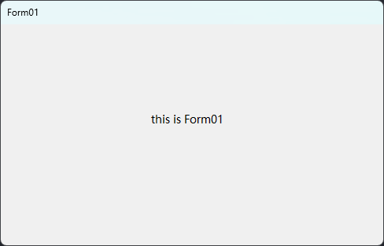
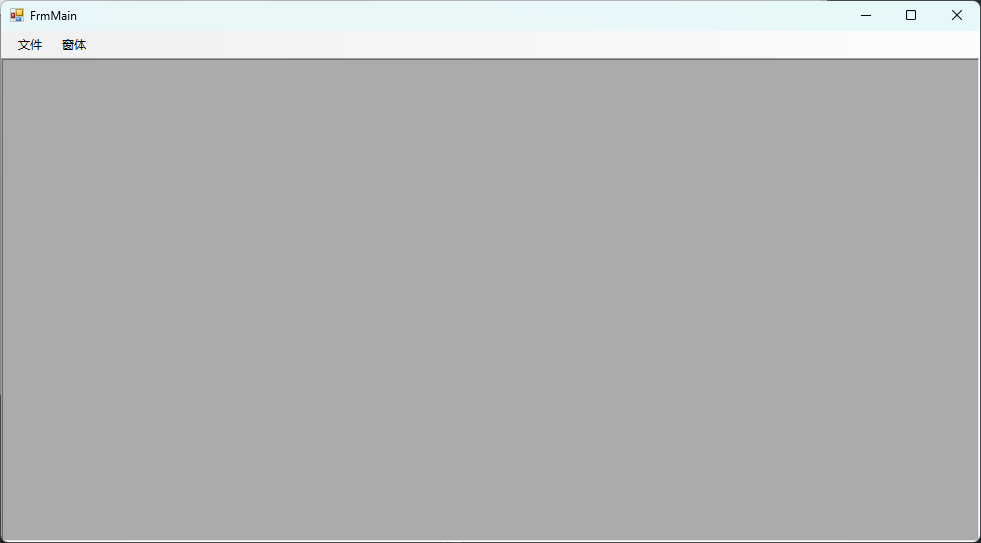

# Form

## 属性介绍

### ControlBox

确认窗体是否有“控件/系统”（最大化、最小化、关闭）菜单。设置为False效果如下：



右上角最大化、最小化、关闭按钮没了。

### IsMdiContainer

窗体是否可以作为Mdi的父容器。设置为True时，窗体的内容区域会变成一个**凹陷、带有立体边框的工作区域**。效果如下：



子窗体要显示在次容器中，需要将`MdiParent`属性设置为当前窗体：

```C#
Form02 form02 = new Form02();
form02.MdiParent = this;
form02.Show();
```

如果有多个窗体要在MDI容器中显示，可通过`LayoutMdi`方法设置窗体排列方法，如：

```C#
 private void form01ToolStripMenuItem_Click(object sender, EventArgs e)
 {
     Form01 form01 = new Form01();
     form01.MdiParent = this;
     form01.Show();
 }

 private void form02ToolStripMenuItem_Click(object sender, EventArgs e)
 {
     Form02 form02 = new Form02();
     form02.MdiParent = this;
     form02.Show();
     LayoutMdi(MdiLayout.TileVertical);
 }
```


### KeyPreview

它控制了键盘事件的传递顺序；当用户按下键盘时，是由**窗体**先接收并处理这个事件，还是直接由当前获得焦点的**控件**来处理。

### WindowState

控制窗体默认显示最大化还是最小化

### StartPosition

控制窗体默认显示位置

## 事件介绍

### FormLoad

窗体加载时触发，可用于初始化资源

### FormClosed

窗体关闭时触发，可用于释放资源

# Button

## 属性介绍

### Flat

控制用户将鼠标移动到控件上并点击时控件的外观

### FlatAppearance

控制用户将鼠标移动到控件上并点击时控件的样式

### TextImageRelation

控制图片和文本的位置关系

| 枚举值            | 说明                                                         |
| :---------------- | :----------------------------------------------------------- |
| `ImageBeforeText` | 图像显示在文本的前方（如果按钮水平布局，通常是图像在左，文字在右）。 |
| `TextBeforeImage` | 文本显示在图像的前方（如果按钮水平布局，通常是文字在左，图像在右）。 |
| `ImageAboveText`  | 图像显示在文本的上方 。                                      |
| `TextAboveImage`  | 文本显示在图像的上方 。                                      |
| `Overlay`         | 图像和文本在按钮的同一区域重叠显示。这是默认值 。            |

## ErrorProvider

错误提示工具，可以在控件旁边显示一个醒目的错误图标；当鼠标放在图标上时，会显示定义的错误信息，使用如下：

```C#
 var result = double.TryParse(txt_num.Text, out double num);
 if (!result)
 {
     // param1：显示的控件
     // param2：显示的错误信息
     errorProvider.SetError(txt_num, "只能输入数字");
 }
 else
 {
     errorProvider.SetError(txt_num, "");
 }
```

