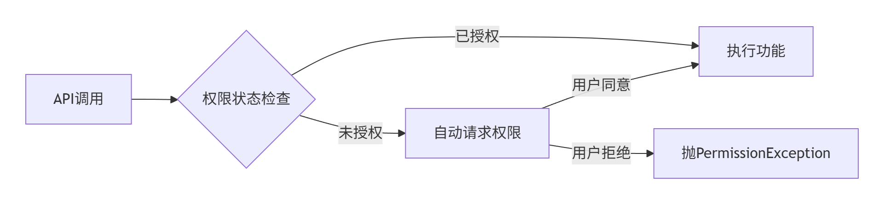

# 官方文档

[微软官方文档](https://learn.microsoft.com/zh-cn/previous-versions/xamarin/get-started/)

# 容器控件

## 一、StackLayout

功能同WPF的`StackPanel`，基本属性如下：

|        属性         |        类型        |   默认值   |     说明     |
| :-----------------: | :----------------: | :--------: | :----------: |
|    `Orientation`    | `StackOrientation` | `Vertical` |   排列方向   |
|      `Spacing`      |      `double`      |    `0`     |  子元素间距  |
|      `Padding`      |    `Thickness`     |    `0`     |    内边距    |
| `HorizontalOptions` |  `LayoutOptions`   |   `Fill`   | 水平对齐方式 |
|  `VerticalOptions`  |  `LayoutOptions`   |   `Fill`   | 垂直对齐方式 |

### `Width/Height`与`WidthRequest/HeightRequest`

在Xamarin中，`Width/Height`通常都是只读的（columnDefinition和rowDefinition还是使用它们定义宽高），这是系统实际渲染尺寸。

Xamarin采用约束布局系统，父容器决定子元素最终尺寸。`WidthRequest/HeightRequest`是开发者建议的值，是可写的

## 二、Grid

作用是WPF的Grid相同，但是在Xamarin中，行列之间有没人空隙，可通过`ColumnSpacing`和`RowSpacing`调整

## 三、AbsoluteLayout

作用类似于WPF中的Canvas，通过给子元素设置附加属性`AbsoluteLayout.LayoutBounds`指定子元素显示位置、大小：

```xaml
<AbsoluteLayout>
    <BoxView AbsoluteLayout.LayoutBounds="0.5,0.5,100,100" AbsoluteLayout.LayoutFlags="PositionProportional" Background="red"/>
</AbsoluteLayout>
```

`AbsoluteLayout.LayoutBounds`是一个`Rectangle`对象。

`AbsoluteLayout.LayoutFlags`是个枚举值，用于指定如何解释LayoutBounds中的值。它有以下几种选项（可以组合使用）：

- `None`：所有值都解释为绝对值（默认）。
- `XProportional`：X值解释为比例值（相对于布局的宽度）。
- `YProportional`：Y值解释为比例值（相对于布局的高度）。
- `WidthProportional`：宽度解释为比例值（相对于布局的宽度）。
- `HeightProportional`：高度解释为比例值（相对于布局的高度）。
- `PositionProportional`：X和Y解释为比例值（相当于XProportional | YProportional）。
- `SizeProportional`：宽度和高度解释为比例值（相当于WidthProportional | HeightProportional）。
- `All`：所有值都解释为比例值（相当于PositionProportional | SizeProportional）。

## 三、RelativeLayout

在RelativeLayout中，每个子视图的位置通过约束（constraints）来定义。这些约束可以是：

- 相对于父布局（RelativeLayout自身）
- 相对于另一个子视图（通过ID引用）

约束包括：

- 水平方向：左边（Left）、右边（Right）、水平中心（CenterHorizontal）
- 垂直方向：顶部（Top）、底部（Bottom）、垂直中心（CenterVertical）
- 基准线（Baseline）：与另一个视图的文本基准线对齐

常用的约束属性（在Xamarin.Forms中，RelativeLayout的约束通过`Constraint`类的静态方法设置）：

1. `RelativeToParent`：相对于父布局的约束。
   - `x => x.Width`：父布局的宽度
   - `x => x.Height`：父布局的高度
2. `RelativeToView`：相对于另一个视图的约束。
   - 需要指定参照的视图和该视图的属性。

### 附加属性说明

**设置位置**：

- `RelativeLayout.XConstraint`：设置X坐标（水平位置）
- `RelativeLayout.YConstraint`：设置Y坐标（垂直位置）

**设置大小**：

- `RelativeLayout.WidthConstraint`：设置宽度
- `RelativeLayout.HeightConstraint`：设置高度

这四个附加属性可以直接填写数值，也可以使用`ConstraintExpression`类定义，它有一下关键属性：

- **Type**：约束类型（常量、相对于父容器、相对于视图）
- **Property**：参考的属性名称（如 Width, Height, X, Y）
- **Factor**：比例因子（乘数）
- **Constant**：常量偏移值
- **ElementName**：引用的视图名称（仅用于 RelativeToView）

示例：

```xaml
<RelativeLayout>
    <BoxView Background="red" RelativeLayout.HeightConstraint="50" x:Name="b1" RelativeLayout.YConstraint="50"
             RelativeLayout.WidthConstraint="50" RelativeLayout.XConstraint="100" />
    <!--相对b1向下偏移50*factory-->
    <BoxView WidthRequest="50" HeightRequest="50"
             RelativeLayout.YConstraint="{ConstraintExpression Type=RelativeToView,ElementName=b1,Property=Y,Factor=2}"
             RelativeLayout.WidthConstraint="{ConstraintExpression Type=RelativeToParent,Property=Height,Factor=0.5}"
             Background="blue">
    </BoxView>
    <!--Constant示例，作用等同于RelativeLayout.YConstraint=50-->
    <BoxView WidthRequest="100" HeightRequest="100" Background="yellow" RelativeLayout.YConstraint="{ConstraintExpression Type=Constant,Constant=150}"/>
    <!-- <BoxView RelativeLayout.BoundsConstraint="{ConstraintExpression}"></BoxView> -->
</RelativeLayout>
```

## 四、FlexLayout

FlexLayout实现了类似 CSS Flexbox 的布局系统。

### 1. FlexLayout 核心概念

#### 1.1 主要特点：

- **灵活的方向控制**：水平(行)或垂直(列)布局
- **自动换行处理**：元素在空间不足时自动换行
- **对齐控制**：精确控制元素在主轴和交叉轴上的对齐方式
- **弹性元素**：元素可以根据可用空间自动伸缩
- **自动间距**：均匀分布元素间的空间

#### 1.2 核心术语：

- **主轴(Main Axis)**：主要布局方向（行或列）
- **交叉轴(Cross Axis)**：垂直于主轴的方向
- **Flex容器(Flex Container)**：包含弹性项目的布局（即 FlexLayout 自身）
- **弹性项目(Flex Item)**：FlexLayout 的直接子元素

### 2. 基础属性（容器级属性）

#### 2.1 布局方向 (`Direction`)

控制弹性项目的排列方向：

- `Column`（默认）：垂直方向，从上到下
- `ColumnReverse`：垂直方向，从下到上
- `Row`：水平方向，从左到右
- `RowReverse`：水平方向，从右到左

#### 2.2 换行行为 (`Wrap`)

控制弹性项目是否换行：

- `NoWrap`（默认）：不换行
- `Wrap`：正常换行（按方向换行）
- `Reverse`：反方向换行

#### 2.3 主轴对齐 (`JustifyContent`)

控制项目在主轴上的分布：

- `Start`（默认）：向起点对齐
- `Center`：居中对齐
- `End`：向终点对齐
- `SpaceBetween`：均匀分布（首尾无间距）
- `SpaceAround`：均匀分布（首尾有间距）
- `SpaceEvenly`：完全均匀分布

#### 2.4 交叉轴对齐 (`AlignItems`)

控制项目在交叉轴上的对齐方式：

- `Stretch`（默认）：拉伸以填满容器
- `Center`：居中对齐
- `Start`：向交叉轴起点对齐
- `End`：向交叉轴终点对齐

#### 2.5 多行对齐 (`AlignContent`)

控制多行项目的在交叉轴上的分布方式（仅当有多行时有效）：

- `Stretch`（默认）：拉伸填满
- `Center`：居中对齐
- `Start`：向起点对齐
- `End`：向终点对齐
- `SpaceBetween`：均匀分布（首尾无间距）
- `SpaceAround`：均匀分布（首尾有间距）

### 3. 子元素属性（项目级属性）

#### 3.1 排列顺序 (`Order`)

控制项目的显示顺序（值越小越靠前）：

```xaml
<Label FlexLayout.Order="2" Text="Third Item"/>
<Label FlexLayout.Order="1" Text="Second Item"/>
<Label FlexLayout.Order="0" Text="First Item"/>
```

#### 3.2 放大比例 (`Grow`)

项目在空间充足时的放大比例（0表示不放大）：

```xaml
<!-- Item1占用1/3空间，Item2占用2/3空间 -->
<BoxView FlexLayout.Grow="1" BackgroundColor="Red"/>
<BoxView FlexLayout.Grow="2" BackgroundColor="Blue"/>
```

#### 3.3 收缩比例 (`Shrink`)

项目在空间不足时的收缩比例（0表示不收缩）：

```xaml
<Label FlexLayout.Shrink="0" Text="Fixed Width"/>
<Label FlexLayout.Shrink="1" Text="Flexible Width"/>
```

#### 3.4 基础尺寸 (`Basis`)

项目在分配多余空间之前的初始尺寸：

```xaml
<Label Text="Half Width" FlexLayout.Basis="50%"/>
<Label Text="100px Height" FlexLayout.Basis="100"/>
```

#### 3.5 项目自对齐 (`AlignSelf`)

覆盖容器级别的对齐设置：

```xaml
<BoxView FlexLayout.AlignSelf="Center"/> <!-- 在交叉轴上居中对齐 -->
<BoxView FlexLayout.AlignSelf="End"/>    <!-- 在交叉轴终点对齐 -->
```

# 基础控件

## 一、BoxView

使用与WPF中的Border差不多，但是BoxView内部不允许放东西

## 二、Frame

在 Xamarin.Forms 中，`Frame` 是一个功能强大的容器控件，用于将内容包裹在带边框、背景、阴影和圆角的视觉框架中。它既是布局容器又是装饰元素，在创建现代UI设计中扮演关键角色。

### 核心特性

#### 1. 装饰功能

- **边框控制**：`BorderColor`、`CornerRadius`
- **视觉层次**：`HasShadow` 属性创建深度感
- **背景控制**：`BackgroundColor` 设置内容区背景

#### 2. 布局功能

- 可作为单一子元素的容器
- 可通过`Content`属性嵌入任何视图
- 自动管理内容尺寸（内建Padding，Padding有默认值）

## 三、Label

使用示例：

```xaml
<Label Text="Hello Xamarin,Hello Xamarin,Hello Xamarin,Hello Xamarin,Hello Xamarin,Hello Xamarin,"
       TextTransform="Lowercase"
       <!--字间距-->
       CharacterSpacing="4"
       <!--删除线与下划线-->
       TextDecorations="Strikethrough,Underline"
       TextColor="Aqua"
       <!--fontsize的倍数，默认是1-->
       LineHeight="2"
       <!--加粗与斜体-->
		
       FontAttributes="Bold, Italic"
       FontSize="30">

<!--使用label加载HTML内容-->
<Label TextType="Html">
    <![CDATA[
        <div>
    <p style="color: red;">1234</p>
    </div>
    ]]>
</Label>
<!--富文本格式-->
<Label>
    <Label.FormattedText>
        <FormattedString>
            <Span Text="加粗文本" FontAttributes="Bold"/>
            <Span Text=" 普通文本 "/>
            <Span Text="红色文本" TextColor="Red"/>
            <Span Text="&#10;"/>
            <Span Text="带下划线的文本" TextDecorations="Underline"/>
        </FormattedString>
    </Label.FormattedText>
</Label>
```

基础属性介绍：

|       属性        |   类型   |      描述      |              示例               |
| :---------------: | :------: | :------------: | :-----------------------------: |
|      `Text`       | `string` | 显示的文本内容 |      `Text="Hello World"`       |
|   `FontFamily`    | `string` |    字体名称    | `FontFamily="OpenSans-Regular"` |
|    `FontSize`     | `double` |    字体大小    |         `FontSize="18"`         |
| `FontAttributes`  |  `enum`  |    字体样式    | `FontAttributes="Bold,Italic"`  |
|    `TextColor`    | `Color`  |    文本颜色    |      `TextColor="#3498db"`      |
| `BackgroundColor` | `Color`  |    背景颜色    |   `BackgroundColor="#f5f5f5"`   |

## 四、Button

### 基本属性

|       属性        |       类型       |           默认值           |     描述     |            示例             |
| :---------------: | :--------------: | :------------------------: | :----------: | :-------------------------: |
|      `Text`       |     `string`     |           `null`           | 按钮显示文本 |        `Text="确认"`        |
|    `TextColor`    |     `Color`      |         设备主题色         |   文本颜色   |     `TextColor="White"`     |
|    `FontSize`     |     `double`     | `Device.GetNamedSize(...)` |   字体大小   |       `FontSize="16"`       |
| `FontAttributes`  | `FontAttributes` |           `None`           |   字体样式   |   `FontAttributes="Bold"`   |
| `BackgroundColor` |     `Color`      |         设备主题色         |   背景颜色   | `BackgroundColor="#4CAF50"` |
|   `BorderColor`   |     `Color`      |      `Color.Default`       |   边框颜色   |    `BorderColor="Gray"`     |
|   `BorderWidth`   |     `double`     |            `0`             |   边框宽度   |      `BorderWidth="1"`      |
|  `CornerRadius`   |      `int`       |       `5` (平台依赖)       |   圆角半径   |     `CornerRadius="10"`     |

### 图像属性

|      属性       |         描述         |             示例              |
| :-------------: | :------------------: | :---------------------------: |
|  `ImageSource`  |      显示的图像      | `ImageSource="icon_user.png"` |
| `ContentLayout` | 图像与文本的相对位置 |   `ContentLayout="Top,10"`    |

### 状态属性

|    属性     |            描述            |
| :---------: | :------------------------: |
| `IsEnabled` | 是否启用按钮（默认`true`） |
| `IsVisible` |        是否可见按钮        |

### 平台差异兼容

1. 在Android项目中添加图片：
   - 将图片添加到 `Resources/drawable` 目录
   - 文件名必须为小写字母和数字（无大写字母、特殊字符或空格）
   - 在图片属性中，生成操作设置为AndroidResource
2. 在iOS项目中添加图片：
   - 图片添加到`Resources` 文件夹
   - 在图片属性中，生成操作设置为BundleResource

```xaml
<Button Text="button" HeightRequest="50">
    <Button.ImageSource>
        <OnPlatform x:TypeArguments="ImageSource">
            <On Platform="iOS" Value="assets/tom.jpg"/>
            <On Platform="Android" Value="tom.jpg"/>
        </OnPlatform>
    </Button.ImageSource>
</Button>
```

## 五、RadioButton与CheckBox

使用示例：

```xaml
<!--CheckBox没有Text或Content属性-->
<StackLayout Orientation="Horizontal">
    <Label Text="启用通知" VerticalOptions="Center"/>
    <CheckBox IsChecked="{Binding NotificationsEnabled}" 
              HorizontalOptions="EndAndExpand"
              VerticalOptions="Center"/>
</StackLayout>

<!--同组互斥-->
<RadioButton GroupName="A" Value="1" Content="A" />
<RadioButton GroupName="A" Value="2" Content="B" />
```

### 触发器

Xamarin的触发器与WPF用法大致相同，在使用属性触发器、数据触发器、多条件触发器时，需要在Trigger标签上设置`TargetType`属性。

使用事件触发器时需要继承`TriggerAction`，如下：

```xaml
<RadioButton GroupName="B" Value="4">
    <RadioButton.Triggers>
        <EventTrigger Event="CheckedChanged">
            <uiControls:CheckedChangedAction/>
        </EventTrigger>
    </RadioButton.Triggers>
</RadioButton>
```

```C#
public class CheckedChangedAction: TriggerAction<RadioButton>
{
    protected override void Invoke(RadioButton sender)
    {
        
    }
}
```

## 六、文本编辑器

Entry就是输入框，相比于WPF，功能丰富了很多。

### Entry-单行文本编辑器

#### 关键属性

|           属性            |          类型           |           默认值           |                描述                |                   示例                    |
| :-----------------------: | :---------------------: | :------------------------: | :--------------------------------: | :---------------------------------------: |
|          `Text`           |        `string`         |           `null`           |              输入文本              |             `Text="John Doe"`             |
|       `Placeholder`       |        `string`         |           `null`           |              提示文本              |          `Placeholder="用户名"`           |
|    `PlaceholderColor`     |         `Color`         |      `Color.Default`       |            提示文本颜色            |         `PlaceholderColor="Gray"`         |
|       `IsPassword`        |         `bool`          |          `false`           |              密码模式              |            `IsPassword="True"`            |
|        `Keyboard`         |       `Keyboard`        |     `Keyboard.Default`     |            输入键盘类型            |            `Keyboard="Email"`             |
|        `MaxLength`        |          `int`          |       `Int.MaxValue`       |            最大输入长度            |             `MaxLength="10"`              |
|       `ReturnType`        |      `ReturnType`       |         `Default`          | 返回键类型，手机键盘上确认按钮内容 |            `ReturnType="Done"`            |
|      `ReturnCommand`      |       `ICommand`        |           `null`           |             返回键命令             | `ReturnCommand="{Binding SubmitCommand}"` |
| `IsTextPredictionEnabled` |         `bool`          |           `true`           |            启用预测文本            |     `IsTextPredictionEnabled="False"`     |
|   `IsSpellCheckEnabled`   |         `bool`          |           `true`           |            启用拼写检查            |       `IsSpellCheckEnabled="False"`       |
|    `CharacterSpacing`     |        `double`         |           `0.0`            |              字符间距              |          `CharacterSpacing="2"`           |
|        `TextColor`        |         `Color`         |      `Color.Default`       |              文本颜色              |            `TextColor="Black"`            |
|        `FontSize`         |        `double`         | `Device.GetNamedSize(...)` |              字体大小              |              `FontSize="16"`              |
|     `FontAttributes`      |    `FontAttributes`     |           `None`           |              字体样式              |          `FontAttributes="Bold"`          |
|     `CursorPosition`      |          `int`          |            `0`             |              光标位置              |           `CursorPosition="5"`            |
|     `SelectionLength`     |          `int`          |            `0`             |            选中文本长度            |           `SelectionLength="3"`           |
|       `IsReadOnly`        |         `bool`          |          `false`           |              是否只读              |            `IsReadOnly="True"`            |
|  `ClearButtonVisibility`  | `ClearButtonVisibility` |          `Never`           |              清除按钮              |  `ClearButtonVisibility="WhileEditing"`   |

#### 常用事件

|     事件      |         描述         |
| :-----------: | :------------------: |
| `TextChanged` |    文本变化时触发    |
|  `Completed`  | 用户按下返回键时触发 |
|   `Focused`   |    获取焦点时触发    |
|  `Unfocused`  |    失去焦点时触发    |

#### 自定义编辑器

```C#
// 在共享代码中
namespace Xamarin.Demo.UIControls
{
    public class CustomerEntry: Entry
    {
    }
}

// 每个平台需要单独写
// 将自定义控件与平台特定的渲染器关联起来
[assembly: ExportRenderer(typeof(CustomerEntry), typeof(CustomerEntryRender))]
namespace Xamarin.Demo.Droid.Render
{
    public class CustomerEntryRender : EntryRenderer
    {
        public CustomerEntryRender(Context context) : base(context)
        {
        }

        protected override void OnElementChanged(ElementChangedEventArgs<Entry> e)
        {
            base.OnElementChanged(e);
            // Control：父类的属性，当前元素
            // 去除entry的下划线
            Control.SetBackgroundColor(global::Android.Graphics.Color.Transparent);
        }
    }
}
```

### Editor-多行文本编辑器

可以设置高度，Entry不行

## 七、CollectionView

CollectionView用于替代传统的 ListView。它提供了更强大的布局能力、更好的性能和更灵活的定制选项，是构建高性能列表界面的首选组件。

**优点：**

1. **高性能虚拟化**：智能回收机制优化内存使用
2. **灵活布局**：支持多种布局方式（列表、网格、瀑布流）
3. **丰富的交互**：内置选择、拖拽、上下文菜单等功能
4. **现代化设计**：符合当代UI设计标准
5. **简化API**：相比ListView更易使用

### 布局控制

#### 垂直列表（默认）

```xaml
<CollectionView.ItemsLayout>
    <LinearItemsLayout Orientation="Vertical" />
</CollectionView.ItemsLayout>
```

#### 水平列表

```xaml
<CollectionView.ItemsLayout>
    <LinearItemsLayout Orientation="Horizontal" />
</CollectionView.ItemsLayout>
```

#### 网格布局

```xaml
<CollectionView.ItemsLayout>
    <GridItemsLayout Orientation="Vertical" Span="2" /> <!-- 垂直列表是2列 -->
</CollectionView.ItemsLayout>
```

### 选择功能

#### 单选模式

```xaml
<CollectionView SelectionMode="Single"
                SelectedItem="{Binding SelectedItem}">
    <!-- 模板 -->
</CollectionView>
```

#### 多选模式

```xaml
<CollectionView SelectionMode="Multiple"
                SelectedItems="{Binding SelectedItems}">
    <!-- 模板 -->
</CollectionView>
```

### RemainingItemsThreshold和RemainingItemsThresholdReached

##### RemainingItemsThreshold

设置触发加载更多事件的阈值，默认值-1。

当 `RemainingItemsThreshold >= 0` 时启用增量加载，值表示距离列表底部还有多少项时触发加载

##### RemainingItemsThresholdReached

当剩余项数达到阈值时触发，执行加载更多数据的逻辑

## 八、RefreshView

RefreshView用于为可滚动内容（如 CollectionView、ListView 或 ScrollView）提供**下拉刷新**功能。

### 关键属性

|        属性        |    类型    |  默认值  |         描述          |
| :----------------: | :--------: | :------: | :-------------------: |
|   `IsRefreshing`   |   `bool`   | `false`  | 刷新状态（读取/设置） |
|     `Command`      | `ICommand` |  `null`  |    触发刷新的命令     |
| `CommandParameter` |  `object`  |  `null`  |   传递给命令的参数    |
|   `RefreshColor`   |  `Color`   | 系统默认 |    刷新指示器颜色     |
|     `Content`      |   `View`   |  `null`  |   包含的可滚动内容    |

## 九、ListView

### 单元格类型 (Cell)

|   单元格类型   |       描述       |                             示例                             |
| :------------: | :--------------: | :----------------------------------------------------------: |
|  **TextCell**  |  基本文本单元格  | `<TextCell Text="{Binding Name}" Detail="{Binding Description}"/>` |
| **ImageCell**  |  带图标的单元格  | `<ImageCell ImageSource="{Binding Icon}" Text="{Binding Name}"/>` |
| **SwitchCell** |  带开关的单元格  |    `<SwitchCell Text="Enable" On="{Binding IsEnabled}"/>`    |
| **EntryCell**  | 带输入框的单元格 |      `<EntryCell Label="Name" Text="{Binding Name}"/>`       |
|  **ViewCell**  | 完全自定义单元格 |                  支持任何Xamarin.Forms视图                   |

在ListView的DataTemplate中，除非用ViewCell包裹，否则只能使用上述几种Cell，不能使用其他标签。

使用示例：

```xaml
<ListView ItemsSource="{Binding Items}">
    <ListView.ItemTemplate>
        <DataTemplate>
            <ViewCell>
                <SwipeView>
                    <!--左滑显示内容-->
                    <SwipeView.LeftItems>
                        <SwipeItem Text="删除" BackgroundColor="Orange" />
                        <SwipeItem Text="编辑" BackgroundColor="GreenYellow"></SwipeItem>
                    </SwipeView.LeftItems>
                    <!--右滑显示内容-->
                    <SwipeView.RightItems>
                        <SwipeItem Text="更新" BackgroundColor="Aqua" />
                        <SwipeItem Text="保存" BackgroundColor="CadetBlue" />
                    </SwipeView.RightItems>
                    <Grid>
                        <Grid.ColumnDefinitions>
                            <ColumnDefinition />
                            <ColumnDefinition />
                        </Grid.ColumnDefinitions>
                        <Label Grid.Column="0" Text="{Binding Name}" />
                        <Label Grid.Column="1" Text="{Binding Description}" />
                    </Grid>
                </SwipeView>
            </ViewCell>
        </DataTemplate>
    </ListView.ItemTemplate>
</ListView>
```

## 十、SwipeView 

SwipeView 是一个**容器控件**，包裹内容项（如列表项、卡片），并通过**滑动手势**显示隐藏的操作菜单（如删除、收藏）。

使用示例：

```xaml
<ListView ItemsSource="{Binding Items}">
    <ListView.ItemTemplate>
        <DataTemplate>
            <ViewCell>
                <SwipeView>
                    <!--左滑显示内容-->
                    <SwipeView.LeftItems>
                        <SwipeItem Text="删除" BackgroundColor="Orange" />
                        <SwipeItem Text="编辑" BackgroundColor="GreenYellow"></SwipeItem>
                    </SwipeView.LeftItems>
                    <!--右滑显示内容-->
                    <SwipeView.RightItems>
                        <SwipeItem Text="更新" BackgroundColor="Aqua" />
                        <SwipeItem Text="保存" BackgroundColor="CadetBlue" />
                    </SwipeView.RightItems>
                    <Grid>
                        <Grid.ColumnDefinitions>
                            <ColumnDefinition />
                            <ColumnDefinition />
                        </Grid.ColumnDefinitions>
                        <Label Grid.Column="0" Text="{Binding Name}" />
                        <Label Grid.Column="1" Text="{Binding Description}" />
                    </Grid>
                </SwipeView>
            </ViewCell>
        </DataTemplate>
    </ListView.ItemTemplate>
</ListView>
```

####  **SwipeView 属性**

|    属性     |                作用                |       示例值       |
| :---------: | :--------------------------------: | :----------------: |
| `Threshold` | 触发滑动的距离阈值（设备无关单位） |  `Threshold=200`   |
| `IsEnabled` |          是否启用滑动功能          | `IsEnabled="True"` |

## 十一、CarouselView

CarouselView 是一个**可滑动的容器控件**，用于在有限空间内展示多个项目（如图片、卡片或自定义内容，类似轮播图功能）。

示例代码：

```xaml
<Grid>
    <CarouselView IndicatorView="iv" ItemsSource="{Binding Items}">
        <CarouselView.ItemTemplate>
            <DataTemplate>
                <Grid>
                    <Image Source="{Binding Name}"></Image>
                    <Label
                        HorizontalOptions="Center"
                        Text="{Binding Description }">
                    </Label>
                </Grid>
            </DataTemplate>
        </CarouselView.ItemTemplate>
    </CarouselView>
    <!--指示器，显示小圆点-->
    <IndicatorView x:Name="iv" VerticalOptions="End" IndicatorColor="Gray" SelectedIndicatorColor="IndianRed"></IndicatorView>
</Grid>
```

### 常用属性

#### **数据绑定与布局**

|     **属性**     |      **类型**       |                          **作用**                           |                           **示例**                           |
| :--------------: | :-----------------: | :---------------------------------------------------------: | :----------------------------------------------------------: |
|  `ItemsSource`   |    `IEnumerable`    | 数据源集合（推荐用 `ObservableCollection<T>` 支持动态更新） |              `ItemsSource="{Binding Monkeys}"`               |
|  `ItemTemplate`  |   `DataTemplate`    |                    定义每个项的 UI 模板                     |                        见下方代码示例                        |
|  `ItemsLayout`   | `LinearItemsLayout` |                  控制滚动方向（水平/垂直）                  | `<ItemsLayout><LinearItemsLayout Orientation="Vertical"/></ItemsLayout>` |
| `PeekAreaInsets` |     `Thickness`     |               部分显示相邻项（提示更多内容）                |         `PeekAreaInsets="100"`（左右预留 100 单位）          |
|      `Loop`      |       `bool`        |             是否启用循环滚动（末项后返回首项）              |                  `Loop="True"`（默认开启）                   |
|                  |                     |                                                             |                                                              |

#### **交互控制**

|     **属性**      |                      **作用**                       |                   **事件/命令**                   |
| :---------------: | :-------------------------------------------------: | :-----------------------------------------------: |
|   `CurrentItem`   |            当前显示的数据项（双向绑定）             |          关联 `CurrentItemChanged` 事件           |
|    `Position`     |        当前项的索引（从 0 开始），可编程跳转        | `PositionChanged` 事件或 `PositionChangedCommand` |
| `IsSwipeEnabled`  |        是否允许滑动手势切换项（默认 `true`）        |                         -                         |
| `IsBounceEnabled` | 滑动到边界时是否弹性回弹（iOS/Android 默认 `true`） |                         -                         |

#### **视觉定制**

**项间距**：通过 `LinearItemsLayout.ItemSpacing` 设置项间空白（默认 0）

```xaml
<CarouselView.ItemsLayout>
    <LinearItemsLayout Orientation="Horizontal" ItemSpacing="20" />
</CarouselView.ItemsLayout>
```

**指示器（IndicatorView）**：需单独添加控件，显示当前位置（非内置属性）。

指示器会根据当前内容匹配当前下标，如果集合元素相同（如内容有重复的字符串），指示器会失效

## 十二、TableView

**TableView**用于展示**分组数据**的可滚动视图控件，适用于需结构化布局但行模板不一致的场景（如设置页、表单）

1. **`TableRoot`** ：根容器，可包含多个 `TableSection`，可选设置标题

2. **`TableSection`**：分组单元，`Title` 属性定义分组标题（如“账户设置”）

3. **单元格类型**  

   - **内置单元格**：`TextCell`（文本）、`ImageCell`（图文）、`EntryCell`（输入框）、`SwitchCell`（开关）

   - **自定义单元格**：继承 `ViewCell`，可嵌入任意控件（如滑块、按钮）

### 常用属性

#### 核心属性

| **属性**        | **类型**      | **作用**                                                     | **示例**                      |
| --------------- | ------------- | ------------------------------------------------------------ | ----------------------------- |
| `Intent`        | `TableIntent` | 控制显示样式，可选值：`Data`（数据）、`Form`（表单）、`Menu`（菜单）、`Settings`（设置） | `Intent=TableIntent.Settings` |
| `RowHeight`     | `int`         | 统一设置行高（单位：设备无关点）                             | `RowHeight=50`                |
| `HasUnevenRows` | `bool`        | 允许行高动态调整（需配合 `ViewCell` 使用）                   | `HasUnevenRows=true`          |

#### 交互控制属性

- **`IsEnabled`**：禁用/启用整个 TableView 的交互[6](@ref)。

- **事件**：    
  - `ItemSelected`：行点击事件（需配合 `TextCell` 等支持点击的单元格）。 
  - `OnChanged`（`SwitchCell`）：开关状态变化事件。

# 其他控件

## 一、Stepper

**Stepper是离散数值选择**的交互控件。用户通过点击 **"+"** 和 **"-"** 按钮，在设定的数值范围内以固定步长增减当前值

### **常用属性详解**

Stepper 定义了 **4 个核心属性**（均为 `double` 类型），均支持数据绑定：

|  **属性**   | **类型** | **默认值** |                           **作用**                           |            **示例**             |
| :---------: | :------: | :--------: | :----------------------------------------------------------: | :-----------------------------: |
|  `Minimum`  | `double` |     0      |             数值范围最小值（必须小于 `Maximum`）             |          `Minimum="0"`          |
|  `Maximum`  | `double` |    100     |             数值范围最大值（必须大于 `Minimum`）             |         `Maximum="360"`         |
| `Increment` | `double` |     1      |                    每次点击按钮的增减步长                    |        `Increment="0.5"`        |
|   `Value`   | `double` |     0      | **当前值**（双向绑定），自动约束在 `[Minimum, Maximum]` 区间内 | `Value="{Binding VolumeLevel}"` |

Stepper最小 最大值默认是0-100，如果先设置最小值，会用最小值和默认值比较，如果最小值大于默认的最大值会报错，所以要设置最大值。

### **事件机制：`ValueChanged`**

当 `Value` 变化时（用户点击或代码赋值），触发 **`ValueChanged` 事件**，传递参数包含：

- **`OldValue`**：变化前的值。
- `NewValue`：当前值（与Value属性实时同步）

#🔘 二、Switch

用于在开/关两种状态间切换

**核心属性**：

- **`IsToggled`**：布尔值，表示当前开关状态（`true`=开，`false`=关）
- **`OnColor`**：开启状态下滑轨的颜色（如 `Color.Green`）
- **`ThumbColor`**：开关按钮（拇指）的颜色
- **`IsEnabled`**：禁用/启用交互（默认为 `true`）

**事件：**

- **`Toggled`**：状态变化时触发，通过 `ToggledEventArgs.Value` 获取新值

### 📊**二、ProgressBar**

水平条形控件，显示任务进度（0%~100%）

**核心属性**：

- **`Progress`**：浮点数（0.0~1.0），表示当前进度（超出范围自动钳制）
- **`ProgressColor`**：进度条填充色（如 `Color.Blue`）
- **`BackgroundColor`**：进度条背景色（需自定义实现）

**方法**：

- **`ProgressTo(value, duration, easing)`**：动画方式过渡到指定进度（如 `ProgressTo(0.8, 1000, Easing.Linear)`）

## ⏳ **三、ActivityIndicator**

旋转动画控件，表示后台任务进行中

**核心属性**：

- **`IsRunning`**：布尔值，控制动画是否播放（`true`=显示）
- **`Color`**：指示器颜色（如 `Color.Red`）

## 📅 **四、DatePicker**

弹出平台原生日期选择对话框，用户选择日期

**核心属性**：

|     **属性**      |  **类型**  |                   **作用**                    |
| :---------------: | :--------: | :-------------------------------------------: |
|    **`Date`**     | `DateTime` |          当前选中的日期（默认今日）           |
| **`MinimumDate`** | `DateTime` |  可选最小日期（如 `new DateTime(2000,1,1)`）  |
| **`MaximumDate`** | `DateTime` | 可选最大日期（如 `DateTime.Now.AddYears(1)`） |
|   **`Format`**    |  `string`  |       日期显示格式（如 `"yyyy-MM-dd"`）       |

**事件**：

- **`DateSelected`**：日期确认时触发

## ⏰ **五、TimePicker**

弹出平台原生时间选择对话框，用户选择时间。
​**​核心属性​**​：

|   **属性**   |  **类型**  |            **作用**             |
| :----------: | :--------: | :-----------------------------: |
|  **`Time`**  | `TimeSpan` | 当前选中的时间（默认当前时间）  |
| **`Format`** |  `string`  | 时间显示格式（如 `"hh:mm tt"`） |

**事件**：

- **`PropertyChanged`**：监听 `Time` 属性变化。

## ⬇️ **六、Picker**

下拉列表控件，用于从选项集合中选择一项。
​**​核心属性​**​：

|      **属性**      |    **类型**     |                      **作用**                      |
| :----------------: | :-------------: | :------------------------------------------------: |
|    **`Items`**     | `IList<string>` | 选项集合（如 `new List<string>{"选项1","选项2"}`） |
| **`SelectedItem`** |    `object`     |                     当前选中项                     |
|    **`Title`**     |    `string`     |                 未选择时的提示文本                 |
| **SelectedIndex**  |       int       |      选中下标，要先设置数据项，再设置选中下标      |


**事件**：

- **`SelectedIndexChanged`**：选项变化时触发。

# 页面导航

## 一、基础导航组件

### 1. NavigationPage（分层导航）

管理页面堆栈（LIFO 结构），提供导航栏（标题 + 返回按钮），实现页面层级跳转。

`PushAsync` 推入新页，`PopAsync` 弹出当前页。

**使用步骤**：

```C#
// 初始化导航堆栈（App.xaml.cs）
MainPage = new NavigationPage(new MainPage());

// 页面跳转（按钮事件）
await Navigation.PushAsync(new DetailPage());

// 返回上一页
await Navigation.PopAsync();
```

### **2. ModalPage（模态导航）**

覆盖当前页面的临时弹窗（如登录框、表单），需手动关闭

**核心方法**：

```C#
await Navigation.PushModalAsync(new ModalPage());  // 打开模态页

await Navigation.PopModalAsync();                 // 关闭模态页
```

## **二、结构化导航容器**

### **1. TabbedPage（选项卡式导航）**

通过底部/顶部选项卡切换多个子页面（如微信首页），iOS 默认底部选项卡，Android 默认顶部（可强制底部）

```xaml
<!-强制在底部显示--->
<TabbedPage xmlns:android="clr-namespace:Xamarin.Forms.PlatformConfiguration.AndroidSpecific;assembly=Xamarin.Forms.Core"
android:TabbedPage.ToolbarPlacement="Bottom">
```

**示例代码**：

```xaml
<?xml version="1.0" encoding="utf-8"?>

<TabbedPage xmlns="http://xamarin.com/schemas/2014/forms"
            xmlns:x="http://schemas.microsoft.com/winfx/2009/xaml"
            xmlns:uiControls="clr-namespace:Xamarin.Demo.UIControls;assembly=Xamarin.Demo"
            xmlns:view="clr-namespace:Xamarin.Demo.View;assembly=Xamarin.Demo"
            xmlns:android="clr-namespace:Xamarin.Forms.PlatformConfiguration.AndroidSpecific;assembly=Xamarin.Forms.Core"
            android:TabbedPage.ToolbarPlacement="Bottom"
            x:Class="Xamarin.Demo.View.MainPage">
    <view:HomePage Title="首页" />
    <view:ShoppingPage Title="购物页" />
    <NavigationPage Title="导航">
        <x:Arguments>
            <view:OtherControlView />
        </x:Arguments>
    </NavigationPage>
</TabbedPage>
```

### 2.CarouselPage - 轮播页面导航

创建可左右滑动的页面轮播，类似视图轮播图。

无 UI 虚拟化，子页面过多易卡顿（官方建议用 `CarouselView` 替代）

**示例代码：**

```xaml
<CarouselPage xmlns="http://xamarin.com/schemas/2014/forms"
              xmlns:x="http://schemas.microsoft.com/winfx/2009/xaml"
              xmlns:view="clr-namespace:Xamarin.Demo.View;assembly=Xamarin.Demo"
              x:Class="Xamarin.Demo.View.CarouselDemoPage">
    <view:HomePage/>
    <view:ShoppingPage/>
</CarouselPage>
```

### **3. FlyoutPage（抽屉导航）**

侧滑抽屉菜单（主菜单 + 详情页），适合复杂应用结构

**示例代码：**

```xaml
<?xml version="1.0" encoding="UTF-8"?>
<FlyoutPage xmlns="http://xamarin.com/schemas/2014/forms" 
             xmlns:x="http://schemas.microsoft.com/winfx/2009/xaml"
             xmlns:view="clr-namespace:Xamarin.Demo.View;assembly=Xamarin.Demo"
             x:Class="Xamarin.Demo.View.FlyoutDemoPage">
    <FlyoutPage.Flyout>
        <view:HomePage Title="主页"/>
    </FlyoutPage.Flyout>
    <FlyoutPage.Detail>
        <NavigationPage>
            <x:Arguments>
                <view:ShoppingPage/>
            </x:Arguments>
        </NavigationPage>
    </FlyoutPage.Detail>
</FlyoutPage>
```


## 三、Shell导航体系

Shell通过分层结构组织应用：

```markdown
Shell
├── FlyoutItem (抽屉菜单项)
│   ├── Tab (标签分组)
│   │   ├── ShellContent (页面内容)
│   │   └── ...
│   └── ...
└── TabBar (底部导航栏)
    ├── Tab (底部标签)
    │   ├── ShellContent 
    │   └── ...
    └── ...
```

### 组件作用

#### 1.**`FlyoutItem`** - 抽屉菜单的顶级项目

**属性：**

- FlyoutDisplayOptions：控制子项展示模式：
  - `AsSingleItem`：折叠子项（默认）
  - `AsMultipleItems`：平铺显示所有子项

**示例代码：**

```xaml
<Shell xmlns="http://xamarin.com/schemas/2014/forms"
       xmlns:x="http://schemas.microsoft.com/winfx/2009/xaml"
       xmlns:view="clr-namespace:Xamarin.Demo.View;assembly=Xamarin.Demo"
       x:Class="Xamarin.Demo.View.ShellDemoPage"
       NavBarIsVisible="True"
       >
    <!--NavBarIsVisible：是否显示左上角导航菜单-->
    
	<FlyoutItem FlyoutDisplayOptions="AsMultipleItems">
	    <ShellContent Title="主页面" ContentTemplate="{DataTemplate view:HomePage}" Route="homePage"/>
	    <Tab Title="社交">
	        <ShellContent Title="主页面" ContentTemplate="{DataTemplate view:HomePage}"/>
	        <ShellContent Title="购物页" ContentTemplate="{DataTemplate view:ShoppingPage}"/>
	    </Tab>
	</FlyoutItem>
</Shell>
```


#### 2.**`Tab`** - 功能分组容器

**位置角色**：

- 在 `FlyoutItem` 内：抽屉分组项
- 在 `TabBar` 内：底部导航项（需特殊声明）

**交互控制**：

```C#
Shell.SetTabBarIsVisible(this, false); // 动态隐藏底部Tab
```

#### 3.**`ShellContent`** - 页面加载单元

**示例代码：**

```xaml
<ShellContent Title="主页面" ContentTemplate="{DataTemplate view:HomePage}" Route="homePage"/>
```

**参数说明：**

##### Route

定义页面的唯一导航地址，支持分层路径（如 `user/profile`），未设置时自动使用类名小写格式。

在代码中通过此标识符导航：

```C#
await Shell.Current.GoToAsync("homePage");
```

##### ContentTemplate

内容模板，延迟页面实例化，提升启动性能，按需加载，减少内存占用

##### Content

立即实例化页面（慎用），适用于极少使用的简单页面

```xaml
<ShellContent>
    <views:HomePage /> <!-- 启动时立即加载 -->
</ShellContent>
```

##### Title

显示标题，在导航栏/选项卡中显示的文本

**平台差异**：

- iOS：导航栏居中显示
- Android：导航栏左侧显示

##### Icon

在选项卡/抽屉菜单中显示的图标，平台特定格式（iOS PDF矢量图，Android PNG）

##### FlyoutIcon

覆盖抽屉菜单中的默认图标

### 导航路由机制

#### 1.路由注册体系

```csharp
// 全局路由注册
Routing.RegisterRoute("user/profile", typeof(ProfilePage));

// 上下文路由注册
Routing.RegisterRoute("posts/detail", typeof(PostDetailPage));
```

#### 2.路径导航语法

**相对路径导航：**

```csharp
await Shell.Current.GoToAsync(state: "user_info");
```

**特点：**

- 没有开头的斜线（`/`）
- 在当前导航上下文基础上查找目标路由
- 在分层结构中向上/向下查找匹配路由

**绝对路径导航：**

```csharp
await Shell.Current.GoToAsync(state: "//user_info");
```

- 以双斜线 (`//`) 开头
- 从根路由开始查找，忽略当前上下文
- 需要完全匹配的路径

**路径操作符：**

| **符号** |    **含义**    |      **示例**      |       **作用**       |
| :------: | :------------: | :----------------: | :------------------: |
|   `//`   |     根路由     |     `//group`      |     导航到主结构     |
|   `/`    |   路径分隔符   | `user_info/detail` |       分层导航       |
|   `..`   |    向上一级    |        `..`        |      返回上一页      |
|  `../`   | 返回上级后导航 |  `../user_detail`  | 返回到父级后向下跳转 |
|   `.`    |    当前层级    |        `.`         |      刷新当前页      |

#### 3.传参

```csharp
// 发送复杂参数
await Shell.Current.GoToAsync($"profile?userId={id}&source=search", 
    new Dictionary<string, object> {
        {"UserInfo", currentUser},
        {"Timestamp", DateTime.Now}
    });

// 接收参数
[QueryProperty(nameof(UserId), "userId")]
public partial class ProfilePage : ContentPage
{
    public string UserId { get; set; }
    
    protected override void OnNavigatedTo(ShellNavigatedEventArgs args)
    {
        // 手动处理复杂参数
        if (args.Parameters.ContainsKey("UserInfo")) 
        {
            var user = args.Parameters["UserInfo"] as User;
        }
    }
}
```

# Xamarin.Essentials

Xamarin.Essentials 是一个专为 Xamarin 开发设计的**跨平台 API 库**，提供统一的 API 访问原生设备功能，简化跨平台开发流程

## 功能模块

### 1. **设备信息类**

|    **功能**    |     **API**     |         **用途**         |
| :------------: | :-------------: | :----------------------: |
|  设备型号信息  |  `DeviceInfo`   | 获取设备型号/厂商/OS版本 |
| 屏幕尺寸与方向 | `DeviceDisplay` |      响应式屏幕适配      |
|    电池状态    |    `Battery`    |  监控电量变化和充电状态  |
|    主题检测    |   `AppTheme`    |  亮色/暗黑模式切换响应   |

获取电量信息需要`BatteryStats`权限，在Android项目`Properties`目录下的`AndroidManifest.xaml`中勾选或者在`AssemblyInfo.cs`中添加

```c#
// 获取电池状态权限
[assembly: UsesPermission(Android.Manifest.Permission.BatteryStats)]

// 获取电池信息快照
var batteryInfo = $"电量: {Battery.ChargeLevel * 100}%\n" +
                  $"状态: {Battery.State}\n" +
                  $"来源: {Battery.PowerSource}";

// 输出示例: "电量: 85%\n状态: Charging\n来源: Usb"

// 订阅电池状态变化事件
Battery.BatteryInfoChanged += OnBatteryInfoChanged;
// 监听节能模式变化
Battery.EnergySaverStatusChanged += OnEnergySaverChanged;
```

### 2. **通信与网络**

|  **功能**  |    **API**     |       **用途**       |
| :--------: | :------------: | :------------------: |
|  拨打电话  | `PhoneDialer`  |   启动系统拨号界面   |
|  发送邮件  |    `Email`     |    调用邮件客户端    |
|  发送短信  |     `Sms`      |   调用系统短信应用   |
| 打开浏览器 |   `Browser`    |    启动系统浏览器    |
|  网络状态  | `Connectivity` | 实时监控网络连接变化 |
|   联系人   |    Contacts    |    获取联系人列表    |

示例代码：

```c#
// 检查是否授权
var status = await Permissions.CheckStatusAsync<Permissions.ContactsRead>();
// 未授权
if (status != PermissionStatus.Granted)
{
    status = await Permissions.RequestAsync<Permissions.ContactsRead>();
}

if (status != PermissionStatus.Granted)
{
    throw new Exception("未授权");
}
// 获取联系人列表
var contacts = await Contacts.GetAllAsync();
if (contacts != null)
{
    foreach (var contact in contacts)
    {
        ContactList.Add(new ContactModel()
        {
            Name = contact.DisplayName,
            Phone = contact.Phones[0].PhoneNumber
        });
    }
}

// 当前网络状态
var access = Connectivity.NetworkAccess;
// 监听网络状态变化
Connectivity.ConnectivityChanged += (obj, args) =>
{
    var networkAccess = args.NetworkAccess;
};
```


### 3. **数据与存储**

|   **功能**   |     **API**     |               **用途**               |
| :----------: | :-------------: | :----------------------------------: |
|  轻量级存储  |  `Preferences`  | 键值对本地存储（类似 `localStorage`) |
|   安全存储   | `SecureStorage` |     加密敏感数据（如令牌、密码）     |
| 文件系统访问 |  `FileSystem`   |        获取应用目录/保存文件         |

### 4. **设备传感器**

| **功能** |     **API**     |       **用途**        |
| :------: | :-------------: | :-------------------: |
| 地理位置 |  `Geolocation`  | GPS 定位（单次/实时） |
|  加速计  | `Accelerometer` |   捕捉设备运动状态    |
|  陀螺仪  |   `Gyroscope`   |     检测设备旋转      |
|  指南针  |    `Compass`    |     获取设备方向      |

示例代码：

```C#
// 获取地理位置所需权限

```


### 5. **多媒体功能**

|    **功能**    |    **API**     |    **用途**    |
| :------------: | :------------: | :------------: |
| 拍照和选择图片 | `MediaPicker`  | 访问相机和图库 |
|   文本转语音   | `TextToSpeech` |  语音播报功能  |
|    振动反馈    |  `Vibration`   |  触觉反馈提醒  |

### 6. **系统交互**

|   **功能**   |   **API**   |         **用途**          |
| :----------: | :---------: | :-----------------------: |
|  剪贴板操作  | `Clipboard` |      读写系统剪贴板       |
|   应用信息   |  `AppInfo`  | 获取版本/包名等应用元数据 |
| 打开系统设置 | `Launcher`  |   跳转到特定系统设置页    |

## 权限策略



手动检查权限：

```C#
// 检查位置权限
var status = await Permissions.CheckStatusAsync<Permissions.LocationWhenInUse>();
if (status != PermissionStatus.Granted)
{
    status = await Permissions.RequestAsync<Permissions.LocationWhenInUse>();
}	
```

