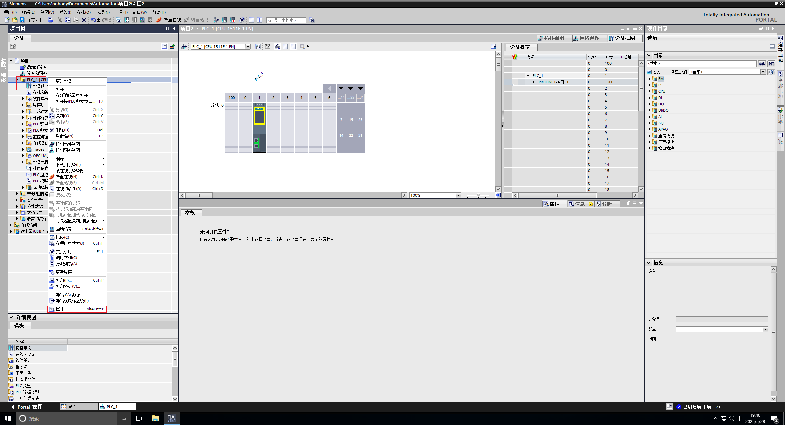
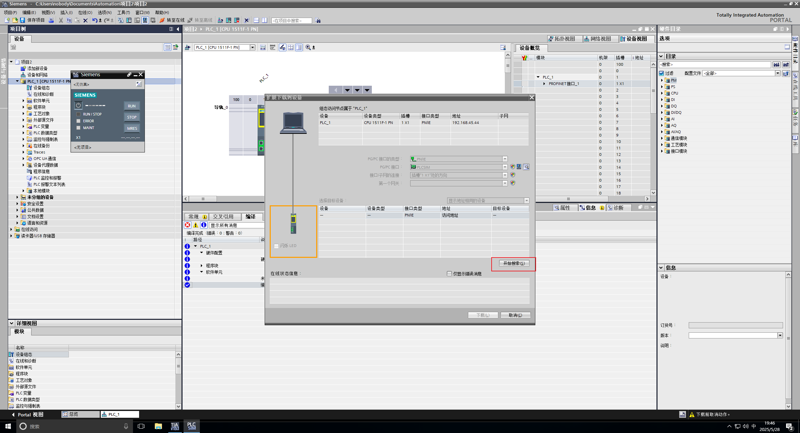
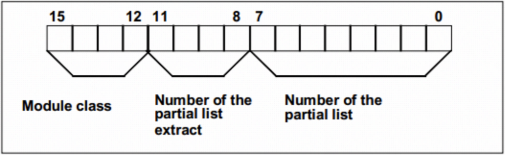
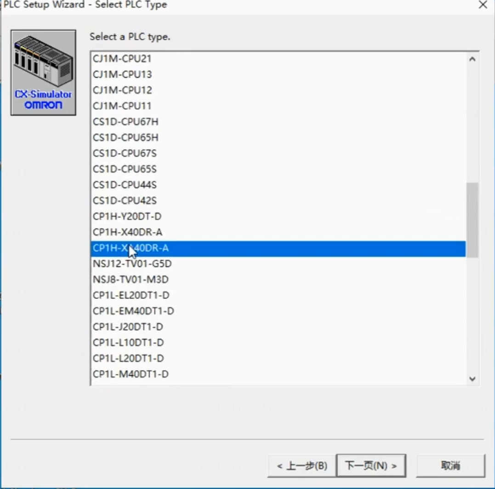
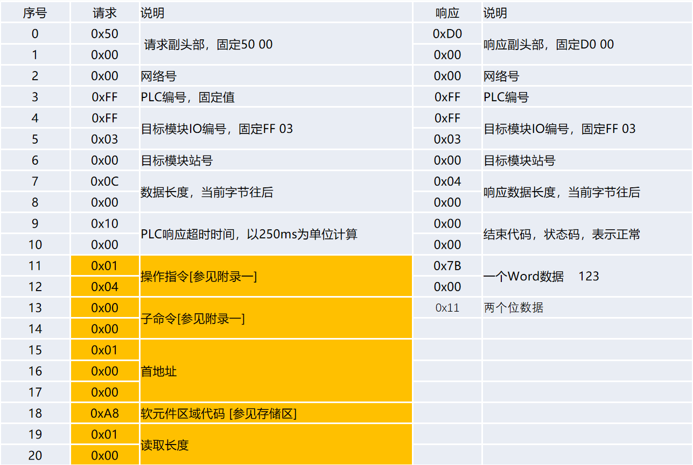

# 通信基础与RS485串口

## 1.1上位机通信接口

### 1.1.1 串口通讯

串口通信是上位机（计算机）和下位机通信常用的选择，PLC和设备通信，也会大量使用串口。想实现串口通信，在硬件上首先计算机必须要有串口硬件接口，然后设备也要有串口的预留，两者通过规定导线连接。

- 串口通讯的概念

串口通讯（Serial Communication）是指计算机和外部设备之间通过数据信号线、地线，按位进行传输数据的一种通讯方式。串口规定了接口的电气标准，没有规定使用协议。

- 串口标准划分

串口按电气标准和协议来划分，包括RS-232、RS-422、RS-485等。

### 1.1.2 以太网通信

以太网通信通常指网口通信。以太网通信速度快，而且应用非常广泛，使用TCP/IP协议。在工业控制中很多PLC都有以太网口。而且硬件设备，尤其是中高端的一般也都有网口

### 1.1.3 RS485串口通信

RS-485总线标准详细定义了总线接口的电气特性，包括两个逻辑状态的界定：当电平处于+2V至+6V之间时，代表一个逻辑状态；而当电平落在-2V至-6V范围内时，则代表另一个逻辑状态。此外，该标准采用差分传输方式来传递数字信号，这一方式能有效降低噪声信号的干扰。


**RS485串口特点：**

1. 通讯距离长：RS485串口的抗干扰能力非常强，可以达到上千米（距离越长，传输速度越慢）
2. 半双工通信：RS485通常采用两线制。以半双工方式工作，也就是收发不能同时进行
3. 以主多从通信：RS485在统一总线上最多可以接32个节点（从设备），实现一主多从

**RS485接口定义**：

1. A或（+）：信号正
2. B或（-）：信号负

### 1.1.4通信模式

1. 单工：数据传输只支持数据在一个方向上传输。
2. 半双工：允许数据在两个方向上传输，但某一时刻只允许数据在一个方向上传输，实际上是一种切换方向的单工通信，不需要独立的接收端和发送端，两者可合并为一个端口。
3. 全双工：允许数据同时在两个方向上传输，因此全双工通信是两个单工方式的结合，需要独立的接收端和发送端。

### 1.1.5 常见的串行通信接口


UART (通用异步收发传输器），英文 Universal Asynchronous Receiver/Transmitter，简称 UART，是异步串行通信接口（串口）的总称，包括 RS232、RS499、RS422 和 RS485 等接口标准规范和总线标准规范。

## 1.2 串口通信原理和数据格式

### 1.2.1 通信原理和要求

通信原理：串行通信方式是将字节（byte）拆分成一个接一个的位（bit）后，再传输出去，收到数据的一方，再将这些位组合成原来的字节。

通信要求：传输格式必须统一，传输方式（节拍/速度）必须一致。

### 1.2.3 通信数据格式和参数

**单字节协议传输过程：**


#### 通信参数

1. 波特率：表示每秒传的位（单位是bit）的个数。也就是每秒传输0和1的个数。常见波特率：4800b/s、9600b/s、19200b/s、38400b/s、115200b/s
2. 起始位：通常用0表示，位于字符帧开头
3. 数据位：通常包括5~8位数据。在起始位置之后，先发送低位，后发送高位。
4. 奇偶校验位：依赖校验数据传输过程中是否有错位，只占1位。奇偶校验包括：偶校验（O）；奇校验（E）；无校验（N）。现在通常都选N，因为抗干扰能力很强了。
5. 停止位：通常用1表示，编译接收端确定下一帧数据的起始位。

通常设置（9600，N，8，1）。

## 1.3 Modbus通信协议

串行通信格式表示一个字节的传输协议（9600，N，8，1），实际应用中数据传送都是几多个串行字节组合到一起。

那么如何识别多个字节？也就是多个串行字节传输和解析的标准怎么规定？

Modbus协议就是这个作用，它规定了多个字节传输的规范。

Modbus就是如何用串口一次连续传输多个有序字节的协议，它规定了一次发送多少个字节，以及字节顺序如何排列。

### 1.3.1 Modbus报文格式

Modbus支持三种传输模式：

1. RTU模式：（Remote Terminal Unit）远程终端单元模式通信，针对通信距离较长和工业现场环境恶劣而设计的通信接口。
2. TCP模式：通过以太网和互联网连接传输数据使用的是TCP/IP协议，称为TCP模式。硬件接口就是以太网接口，TCP模式也是通信的重点。
3. ASCII模式：MG标准信息交换码（0-9，a-z，A-Z），数据中每8个位的字节都用ASCII码发送，用的很少。

所有 Modbus 通信基于 **主从请求-响应模型**，报文由以下部分组成：

| **组成部分** |                      描述                      |
| :----------: | :--------------------------------------------: |
|  **地址域**  |  标识从站设备（RTU/ASCII）或 TCP 会话（TCP）   |
|  **功能码**  |   1字节，指示操作类型（如读寄存器、写线圈）    |
|  **数据域**  |        可变长度，包含请求参数或响应数据        |
|  **校验域**  | 错误检测（RTU用CRC-16，ASCII用LRC，TCP无校验） |

#### **1.3.1.1Modbus RTU 报文格式**

##### 读寄存器消息帧格式 - 0x03、0x04

**请求报文：**

| 字段         | 字节数 | 描述                             |
| ------------ | ------ | -------------------------------- |
| 从站地址     | 1      | 1-247（0为广播地址）             |
| 功能码       | 1      | 操作类型（如 0x03=读保持寄存器） |
| 起始地址高位 | 1      | 起始寄存器地址的高字节           |
| 起始地址低位 | 1      | 起始地址低字节                   |
| 读取长度高位 | 1      |                                  |
| 读取长度低位 | 1      |                                  |
| CRC16        | 2      | 校验码（小端序）                 |

**响应报文：**

| 字段      | 字节数 | 描述                                                         |
| --------- | ------ | ------------------------------------------------------------ |
| 从站地址  | 1      |                                                              |
| 功能码    | 1      | 0x04                                                         |
| 字节数    | 1      | 后续数据的总字节数，不包含CRC校验（10个寄存器×2字节=20=0x14） |
| 寄存器值1 | 2      | 大端序，可以有多个值                                         |
| 寄存器值2 | 2      |                                                              |
| ....      |        |                                                              |
| CRC16     | 2      |                                                              |

##### 读线圈状态消息帧格式 - 0x01

**请求报文：**

| 字段     | 字节数 | 描述 |
| -------- | ------ | ---- |
| 从站地址 | 1      |      |
| 功能码   | 1      | 0x04 |
| 起始地址 | 2      |      |
| 线圈数量 | 2      |      |
| CRC16    | 2      |      |

**响应报文：**

| 字段     | 字节数 | 描述                                            |
| -------- | ------ | ----------------------------------------------- |
| 从站地址 | 1      |                                                 |
| 功能码   | 1      | 0x01，异常时为 `0x81` + 错误码                  |
| 字节数   | 1      | 后续数据字节数（N = ⌈线圈数量/8⌉）              |
| 线圈状态 | N      | 按位打包的线圈状态（1=ON, 0=OFF），**低位在前** |
| RC 校验  | 2      |                                                 |


##### 写单寄存器消息帧格式 – 0x06

**请求报文与响应报文相同：**

| 字段     | 字节数 | 描述   |
| -------- | ------ | ------ |
| 从站地址 | 1      |        |
| 功能码   | 1      | 0x60   |
| 写入地址 | 2      | 大端序 |
| 写入值   | 2      | 大端序 |
| CRC16    | 2      | 小端序 |

##### 写多寄存器消息帧格式 – 0x10

**请求报文：**

| 字段      | 字节数 | 描述                                        |
| --------- | ------ | ------------------------------------------- |
| 从站地址  | 1      |                                             |
| 功能码    | 1      | 0x10                                        |
| 写入地址  | 2      | 大端序                                      |
| 写入数量  | 2      | 大端序                                      |
| 字节数    | 1      | 后续数据的总字节数，不包含CRC（写入数量×2） |
| 寄存器值1 | 2      | 写入属性是多少，寄存器值就有多少个          |
| 寄存器值2 | 2      |                                             |
| ....      |        |                                             |
| CRC16     | 2      | 小端序                                      |

**响应报文：**

| 字段     | 字节数 | 描述 |
| -------- | ------ | ---- |
| 从站地址 | 1      |      |
| 功能码   | 1      | 0x10 |
| 写入地址 | 2      |      |
| 写入数量 | 2      |      |
| CRC16    | 2      |      |

读写线圈的报文格式相同，只是功能码不一样。

##### 写单个线圈状态消息帧格式 - 0x05

**请求报文：**

| 字段     | 字节数 | 描述                           |
| -------- | ------ | ------------------------------ |
| 从站地址 | 1字节  | 目标设备地址                   |
| 功能码   | 1字节  | 0x05，写单个线圈操作码         |
| 起始地址 | 2字节  |                                |
| 写入值   | 2字节  | ON=FF00, OFF=0000 (其他值非法) |
| CRC校验  | 2字节  |                                |

**响应报文：**

| 字段     | 字节数 | 描述                   |
| -------- | ------ | ---------------------- |
| 从站地址 | 1字节  | 目标设备地址           |
| 功能码   | 1字节  | 0x05，写单个线圈操作码 |
| 起始地址 | 2字节  | 同请求                 |
| 写入值   | 2字节  | 同请求                 |
| CRC校验  | 2字节  |                        |

##### 写多个线圈状态消息帧格式 - 0x0F

**请求报文：**

| 字段     | 字节数 | 描述                                                     |
| -------- | ------ | -------------------------------------------------------- |
| 从站地址 | 1字节  | 目标设备地址                                             |
| 功能码   | 1字节  | 0x0F，写单个线圈操作码                                   |
| 起始地址 | 2字节  |                                                          |
| 线圈数量 | 2字节  |                                                          |
| 字节计数 | 1字节  | 后续数据域的字节数（=线圈数量÷8向上取整）                |
| 写入值   | N字节  | 线圈状态打包数据（**低位优先**：字节内bit0对应起始地址） |
| CRC校验  | 2字节  |                                                          |

**响应报文：**

| 字段     | 字节数 | 描述                   |
| -------- | ------ | ---------------------- |
| 从站地址 | 1字节  | 目标设备地址           |
| 功能码   | 1字节  | 0x0F，写单个线圈操作码 |
| 起始地址 | 2字节  | 同请求                 |
| 线圈数量 | 2字节  | 同请求                 |
| CRC校验  | 2字节  |                        |

#### 1.3.1.2Modbus TCP 报文格式

##### 请求报文：

|      字段      | 字节数 |                             描述                             |
| :------------: | :----: | :----------------------------------------------------------: |
| **事务标识符** | 2 字节 |       用于匹配请求与响应，每次请求递增（客户端生成）。       |
| **协议标识符** | 2 字节 |             固定为 `0x0000`，表示 Modbus 协议。              |
|  **长度字段**  | 2 字节 |        表示后续字节总数（从单元标识符到 PDU 结束）。         |
| **单元标识符** | 1 字节 | 标识从站设备地址（通常为 `0x00` 或 `0xFF`，取决于网络配置）。 |
| **Modbus PDU** | N 字节 | 包含功能码和数据（与 Modbus RTU 的 PDU 一致）。功能码+ 数据，无需CRC校验 |

##### 响应报文：

|      字段      | 字节数 |                             描述                             |
| :------------: | :----: | :----------------------------------------------------------: |
| **事务标识符** |   2    |           必须与请求报文一致，用于匹配请求与响应。           |
| **协议标识符** |   2    |             固定为 `0x0000`，表示 Modbus 协议。              |
|  **长度字段**  |   2    |            后续字节总数（单元标识符 + PDU 长度）             |
| **单元标识符** |   1    |             通常与请求报文一致（标识从站设备）。             |
| **Modbus PDU** | N 字节 | 包含功能码和数据（与 Modbus RTU 的 PDU 一致）。功能码+ 数据，无需CRC校验 |

#### 1.3.1.3Modbus ASCII 报文格式

##### 请求报文：

|  字段  |   长度   |          描述           | 示例值 |
| :----: | :------: | :---------------------: | :----: |
| 起始符 |  1 字符  |  固定 `:` (ASCII 0x3A)  |  `:`   |
|  地址  |  2 字符  |    从站地址 (01-F7)     |  `01`  |
| 功能码 |  2 字符  |    操作指令 (01-FF)     |  `03`  |
| 数据域 | N×2 字符 |      可变长度数据       | `0000` |
|  LRC   |  2 字符  |         校验和          |  `2A`  |
| 结束符 |  2 字符  | 固定 `\r\n` (0x0D 0x0A) | `\r\n` |

##### 1.3.1.4 Modbus RTU异常响应报文格式

| 字段       | 长度 | 描述              |
| ---------- | ---- | ----------------- |
| 从站地址   | 1    |                   |
| 异常功能码 | 1    | 原始功能码 + 0x80 |
| 异常码     | 1    | 指示错误类型      |
| CRC校验    | 2    |                   |


### 1.3.2 Modbus数据储存区和功能码

#### 一、线圈的概念

在电气控制中，接触器和中间继电器都是靠得电和失电来控制触点闭合（1）和断开（0），实现两种状态。所以，用线圈表示布尔量（1/0）。因此在协议中，针对硬件设备这两种状态的储存区就用线圈这个概念来表示。

#### 二、寄存器概念

在硬件的储存区中用来储存非布尔量的数据，就用寄存器。读写类型和特点：以西门子PLC为离谱，I和Q都表示线圈，但是它们的分工是不同的，I表示输入，输入意味着该储存区里的值必须由外部设备接入，是只读的。Q表示输出，输出表示输出结果给外部设备，是可读可写的。所以按照这个方法划分后，输入、输出线圈，输入、输出寄存器就构成了储存区的四种类型，如下表示寄存器和协议使用地址对照：

| 读写 | 储存类型 | 储存区名称 | 代号 | 简称 | 寄存器设备地址 | Modbus协议地址 |
| ---- | -------- | ---------- | ---- | ---- | -------------- | -------------- |
| 只读 | 线圈     | 输入线圈   | 1区  | 1x   | 10001-19999    | 0000H-FFFFH    |
| 读写 | 线圈     | 输出线圈   | 0区  | 0x   | 00001-09999    | 0000H-FFFFH    |
| 只读 | 寄存器   | 输入寄存器 | 3区  | 3x   | 30001-39999    | 0000H-FFFFH    |
| 读写 | 寄存器   | 输出寄存器 | 4区  | 4x   | 40001-49999    | 0000H-FFFFH    |

寄存器设备地址：一般采用10进制，通常是5位，第一位表示寄存器类型。

Modbus协议地址：指通信是使用的寄存器寻址地址。注意设备地址是40001对应寻址地址就是0x0000（16进制）；40002对应0x0001。

#### 三、功能码

功能码用来表示对不同的储存区域、执行不同的读写操作。读写两种操作，储存区4个，但是输入线圈和寄存器只能读，不能写，除去这两种，会有6个不同的操作。最后对写入操作又做了4中细分，因此形成8中常见的具体操作。如下所示：

| 功能码 | 名称                    | 功能                                                         |
| ------ | ----------------------- | ------------------------------------------------------------ |
| 01     | 读线圈状态              | 读位（读N个bit）---读从机线圈寄存器，位操作                  |
| 02     | 读输入离散量            | 读位（读N个bit）---读离散输入寄存器，位操作                  |
| 03     | 读多个保持型寄存器      | 读整型、字符型、状态字、浮点型（读N个words）---读保持寄存器，字节操作 |
| 04     | 读多个输入寄存器        | 读整型、状态字、浮点型（读N个words）---读输入寄存器，字节操作 |
| 05     | 写单个线圈              | 写位（写一个bit）---写线圈寄存器，位操作                     |
| 06     | 写单个保持寄存器        | 写整型、字符型、状态字、浮点型（写一个word）---写保持寄存器，字节操作 |
| 07     | 读取异常状态            | 取得8个内部线圈的通断状态，这8个线圈的地址由控制器决定，用户逻辑可以将这些线圈定义，以说明从机状态，短报文适宜于迅速读取状态 |
| 08     | 回送诊断校验            | 把诊断校验报文送从机，以对通信处理进行评鉴                   |
| 09     | 编程（只用于484）       | 使主机模拟编程器作用，修改PC从机逻辑                         |
| 0A     | 控询（只用于484）       | 可使主机与一台正在执行长程序任务从机通信，探询该从机是否已完成其操作任务，仅在含有功能码9的报文发送后，本功能码才发送 |
| 0B     | 读取事件计数            | 可使主机发出单询问，并随即判定操作是否成功，尤其是该命令或其他应答产生通信错误时 |
| 0C     | 读取通讯事件记录        | 可是主机检索每台从机的ModBus事务处理通信事件记录。如果某项事务处理完成，记录会给出有关错误 |
| 0D     | 编程（184/384/484/584） | 可使主机模拟编程器功能修改PC从机逻辑                         |
| 0E     | 探询（184/384/484/584） | 可使主机与正在执行任务的从机通信，定期控询该从机是否已完成其程序操作，仅在含有功能13的报文发送后，本功能码才得发送 |
| 0F     | 写多个线圈              | 可以写多个线圈---强置一串连续逻辑线圈的通断                  |
| 10     | 写多个保持寄存器        | 写多个保持寄存器---把具体的二进制值装入一串连续的保持寄存器  |
| 11     | 报告从机标识            | 可使主机判断编址从机的类型及该从机运行指示灯的状态           |
| 12     | （884和MICRO84）        | 可使主机模拟编程功能，修改PC状态逻辑                         |
| 13     | 重置通信链路            | 发生非可修改错误后，是从机复位于已知状态，可重置顺序字节     |
| 14     | 读取通用参数（584L）    | 显示扩展存储文件中的数据信息                                 |
| 15     | 写入通用参数（584L）    | 把通用参数写入扩展存储文件                                   |
| 16~40  | 保留做扩展功能备用      |                                                              |
| 41~48  | 保留以备用户功能所用    | 留作用户功能的扩展编码                                       |
| 49~77  | 非法功能                |                                                              |
| 78~7F  | 保留                    | 留作内部作用                                                 |
| 80~FF  | 保留                    | 用于异常应答                                                 |

##### 协议异常处理

功能码的高位是1，说明请求出现了异常（1000 0001：非法功能）。

| 代码 | 名称                 | 含义                                                         |
| ---- | -------------------- | ------------------------------------------------------------ |
| 01   | 非法功能             | 对于服务器(或从站)来说，询问中接收到的功能码是不可允许的操作。这也许是因为功能码仅仅适用于新设备而在被选单元中是不可实现的。同时，还指出服务器(或从站)在错误状态中处理这种请求，例如：因为它是未配置的，并且要求返回寄存器值。 |
| 02   | 非法数据地址         | 对于服务器(或从站)来说，询问中接收到的数据地址是不可允许的地址。特别是，参考号和传输长度的组合是无效的。对于带有100 个寄存器的控制器来说，带有偏移量96 和长度4的请求会成功，带有偏移量96和长度5的请求将产生异常码02。 |
| 03   | 非法数据值           | 对于服务器(或从站)来说，询问中包括的值是不可允许的值。这个值指示了组合请求剩余结构中的故障，例如：隐含长度是不正确的。并不意味着，因为MODBUS 协议不知道任何特殊寄存器的任何特殊值的重要意义，寄存器中被提交存储的数据项有一个应用程序期望之外的值。 |
| 04   | 从站设备故障         | 当服务器(或从站)正在设法执行请求的操作时，产生不可重新获得的差错。 |
| 05   | 确认                 | 与编程命令一起使用。服务器(或从站)已经接受请求，并切正在处理这个请求，但是需要长的持续时间进行这些操作。返回这个响应防止在客户机(或主站)中发生超时错误。客户机(或主站)可以继续发送轮询程序完成报文来确定是否完成处理。 |
| 06   | 从属设备忙           | 与编程命令一起使用。服务器(或从站)正在处理长持续时间的程序命令。张服务器(或从站)空闲时，用户(或主站)应该稍后重新传输报文。 |
| 08   | 存储奇偶性差错       | 与功能码20和21 以及参考类型6一起使用，指示扩展文件区不能通过一致性校验。服务器(或从站)设法读取记录文件，但是在存储器中发现一个奇偶校验错误。客户机(或主方)可以重新发送请求，但可以在服务器(或从站)设备上要求服务。 |
| 0A   | 不可用网关路径       | 与网关一起使用，指示网关不能为处理请求分配输入端口至输出端口的内部通信路径。通常意味着网关是错误配置的或过载的。 |
| 0B   | 网关目标设备响应失败 | 与网关一起使用，指示没有从目标设备中获得响应。通常意味着设备未在网络中。 |


##### 请求频率异常

请求频率异常，设备会无法响应（前提是报文格式正确）。

RTU报文请求间隔：3.5个字符时间（波特率为9600的前提下）。

一个字符 = 1个起始位+8个数据位+1个校验位 + 1停止位

3.5个字符=1000ms / 9600 * (1个起始位+8个数据位+1个校验位 + 1停止位) * 3.5 = 4.01ms。

串口线路一个时刻只能有一个数据传输，如果时间间隔设置4.01ms，从站有响应报文（主站只发不接收），那么会与发送的报文冲突。

仿真软件时间间隔并不真实，不是真正的时间间隔

##### 读写冲突问题

实际情况中，读操作可能是通过一个while死循环进行，写操作可能实在某一个不确定的时刻去写，而串口链路同一时刻只能有一个数据传输，这会产生冲突。

解决方案：定义两个队列，一个读操作队列，一个写操作队列，当有写操作时先执行写操作，写操作队列为空时再执行读操作。

## 1.5 通信工具的使用

### 1.5.1 Slave从站模拟软件

从站就是硬件设备。很多时候我们手里只有一个文档，没有硬件，那就必须按照文档先做模拟测试，模拟测试成功了，将来使用硬件也是完全一致的。

Slave软件安装完成启动后如下：


#### 软件配置

1. 从Connection菜单中选择Connect子菜单，打开连接串口设置窗口：

   

2. 选择Serial Port，表示当前使用串口通信

3. Serial Settings选择虚拟串口COM18-COM19，表示一对虚拟串口，如果在Slave中选择COM18-COM19，那在Poll中间就要选择COM18-COM18，因为虚拟串口就好比一个导线的两端，数据从一端传递到另一端

   

4. 其他参数按照正常设置即可

   

5. 点击OK，连接成功

   

   上面的设置指示实现了从站设备和串口的模拟连接，接下来在从站模拟软件Slave中，开辟对应的**储存区**，并存放一定的数据，这样主站上位机才能读取从站的数据，实现完整的模拟。

6. 点击Setup菜单，选择Slave Definition子菜单，然后做如下设置：

   

   - Slave ID：设备的地址，任何串口通信设备都要设置，一般在1-254之间选择。
   - Function：功能码，03表示输出寄存器
   - Address mode：地址模式，十进制或十六进制
   - Address：寄存器开始地址
   - Quantity：寄存器的数量，也就是要模拟几个寄存器。（一个寄存器=2字节）

   其他设置默认即可。点击Ok如下图所示：

   

### 1.5.2 Poll主站模拟软件

#### 软件配置

1. 与Slave一样，先配置Connection，Serial Settings选择与Slave相对的，其他配置相同

   

2. 连接成功，可能会提示非法地址，这时候需要配置Read/Write Definition

   

   

   Slave ID、Function、Address、Quantity都要和从站一致。如果Address和Quantity和从站不一致就会出现Illegal Data Address提示。

如果连接成功，从站的数据修改就会同步到Poll。

### 1.5.3 总结

1. 串口号：正确选择通信端口号（串口号），在实际硬件通信中端口号是什么就选什么，没有成对说法，成对说法只是在模拟环境下才有
2. Slave ID：必须要知道从站设备ID
3. 功能码：表示对那个寄存器执行什么样的操作
4. 寄存器开始地址：表示从哪里开始读取
5. 寄存器属性：要连续读取多少个寄存器（一个寄存器占2字节）

## 1.6 IO采集控制器使用

### 1.6.1 采集控制器各种接口说明

采集控制器集成了数字量、模拟量和串口，硬件模块逻辑图如下：


- DO数量输出端子

  当前设备输出是基于继电器的，所以数字量输出端子输出相当于一根导线一样，直接接通或断开。如在红色公共端接入24V，那么其他四个端子可以根据逻辑输出24V；如果公共端接220V交流电，那么其他四个端子也会输出交流电，可以通过DO直接控制继电器、接触器或者开关设备

- ID数字量输入端子

  黑色公共端接入的是0V，然后其他四个端子接入的是24V，可以通过按钮、或其他传感器开关实现接入

- 电源正负极端子

  右上角两个分别接入24V正极和0V即可

- AI模拟量输入端子

  黑色公共端可以不接，其他两个是4~20ma电流输入

- 温湿度采集传感器

  这两个是集成在控制器里面的，不需要接线，获取的时候直接通过输出寄存器来获取具体数据就可以了

- Type-C接口

  直接用手机数据线插入，可以直接仿真出一个串口

- RS485接线端子

  如果想测试更多的设备和接线，通常会会将RS485的A和B和具体的硬件串口连接

### 1.6.2 采集控制器Modbus地址表

##### 数字量输入DI（1x输入线圈）

| 地址（Dec） | PLC地址 | 地址说明        |
| ----------- | ------- | --------------- |
| 0           | 10001   | DI1状态         |
| 1           | 10002   | DI2状态         |
| 2           | 10003   | DI3状态         |
| 3           | 10004   | DI4状态         |
| 4           | 10005   | DI5状态（备用） |
| 5           | 10006   | DI6状态（备用） |
| 6           | 10007   | DI7状态（备用） |
| 7           | 10008   | DI8状态（备用） |

##### 数字量输出DO（0x输出线圈）

| 地址（Dec） | PLC地址 | 地址说明        |
| ----------- | ------- | --------------- |
| 0           | 00001   | DO1状态         |
| 1           | 00002   | DO2状态         |
| 2           | 00003   | DO3状态         |
| 3           | 00004   | DO4状态         |
| 4           | 00005   | DO5状态（备用） |
| 5           | 00006   | DO6状态（备用） |
| 6           | 00007   | DO7状态（备用） |
| 7           | 00008   | DO8状态（备用） |

##### 模拟输入量AI（3x输入寄存器）

| 地址（Dec | PLC地址 | 地址说明        |
| --------- | ------- | --------------- |
| 0         | 30001   | AI1数值         |
| 1         | 30002   | AI2数值         |
| 2         | 30003   | AI3数值（备用） |
| 3         | 30004   | AI4数值（备用） |
| 4         | 30005   | AI5数值（备用） |
| 5         | 30006   | AI6数值（备用） |
| 6         | 30007   | AI7数值【备用】 |
| 7         | 30008   | AI8数值【备用】 |

##### 温湿度采集（4x保持寄存器）（需要除以10）

| 地址(Dec) | PLC地址 | 地址说明        |
| --------- | ------- | --------------- |
| 0         | 40001   | 1号温度         |
| 1         | 40002   | 1号湿度         |
| 2         | 40003   | 2号温度         |
| 3         | 40004   | 2号湿度         |
| 4         | 40005   | 3号温度【备用】 |
| 5         | 40006   | 3号湿度【备用】 |
| 6         | 40007   | 4号温度【备用】 |
| 7         | 40008   | 4号湿度【备用】 |
| 8         | 40009   | DI输入（16位）  |
| 9         | 40010   | DI输出（16位）  |
| 10        | 40011   | AI1数值         |
| 11        | 40012   | AI2数值         |
| 12        | 40013   | AI3数值         |
| 13        | 40014   | AI4数值         |
| 14        | 40015   | AI5数值         |
| 15        | 40016   | AI6数值         |
| 16        | 40017   | AI7数值         |
| 17        | 40018   | AI8数值         |
| 18        | 40019   | 从站地址        |
| 19        | 40020   | 波特率          |

##### 波特率说明

| 0    | 9600   |
| ---- | ------ |
| 1    | 14400  |
| 2    | 19200  |
| 3    | 38400  |
| 4    | 56000  |
| 5    | 57600  |
| 6    | 115200 |

# PLC仿真软件使用

## 博图使用

1. 创建项目

   

2. 选择打开项目视图

   

3. 双击添加新设备

   

4. 选择设备

   

5. 配置以太网地址，与当前设备同网段

   

   

6. 设置连接机制

   

   

7. 配置项目，编译时支持仿真

   

   

8. 编译

   

9. 启动仿真

   

10. 搜索到当前设备，然后下载、装载

    

    

## S7-PLCSIM Advanced V3.0使用

1. 打开控制面板，设置PG/PC接口

   

   

2. 打开S7-PLCSIM Advanced V3.0，生成模拟PLC

   

   

3. 打开博图，打开项目，选择程序块下的Main，双击

   

4. 将此拖拽到程序段，然后直接确认

   

   

   

   

5. 编辑连接信息

   

   

   

   1. InterfaceId：接口Id，按一下步骤找到填写：

      

      

   2. ID：从站ID，0-255任意填写

   3. ConnectionType：不需要修改

   4. ActiveEstablished：是否需要主动连接，当前为从站，不需要

   5. RemoteAddress：远程连接地址，不用修改，默认0.0.0.0

   6. RemoteAddress：远程连接端口，默认0

   7. RemotePort：当前端口，配置502

6. 设置刚才配置的连接信息

   

7. 编译、下载并启动

   

   ​	

   

   


# S7COMM协议

S7COMM（S7 Communication）是西门子公司为其 SIMATIC S7 系列 PLC 设计的专有工业通信协议，用于 PLC 与编程设备（如 STEP 7）、HMI 人机界面及其他自动化设备之间的数据交换。它是工业控制系统中应用最广泛的协议之一。

----

### S7COMM 协议核心特性

| 特性         | 说明                                        |
| :----------- | :------------------------------------------ |
| **应用层级** | OSI 第 7 层（应用层）                       |
| **底层传输** | ISO-on-TCP (RFC 1006) / TCP/IP              |
| **默认端口** | TCP 102                                     |
| **数据编码** | 二进制（大端字节序）                        |
| **通信模式** | 客户端/服务器架构                           |
| **主要功能** | PLC 数据读写、程序下载/上传、诊断、PLC 控制 |
| **安全机制** | 无内置加密（最新版本支持 TLS）              |

### S7COMM 协议栈结构

```
+-------------------------+
|       S7COMM PDU        |  ← 应用层协议
+-------------------------+
|         COTP            |  ← 连接管理 (ISO 8073)
+-------------------------+
|         TPKT            |  ← 数据传输 (RFC 1006)
+-------------------------+
|          TCP            |
+-------------------------+
|          IP             |
+-------------------------+
```

### 建立连接过程

**通信建立流程**


**数据读取流程**


**程序下载流程**


## S7COMM-COTP报文格式


### 1. TPKT (4 字节)

| 偏移量 | 字节数 | 发送      | 说明                       | 响应 | 说明                       |
| ------ | ------ | --------- | -------------------------- | ---- | -------------------------- |
| 0      | 1      | 0x03      | Version，默认3             | 0x30 | Version，默认3             |
| 1      | 1      | 0x00      | Reserved，保留，默认0      | 0x00 | Reserved，保留，默认0      |
| 2-3    | 2      | 0x00 0x16 | 整个请求字节数，包含当前头 | 0x16 | 整个请求字节数，包含当前头 |

### 2. COTP（6字节）

| 偏移量 | 字节数 | 发送      | 说明                                                     | 响应      | 说明                                 |
| ------ | ------ | --------- | -------------------------------------------------------- | --------- | ------------------------------------ |
| 4      | 1      | 0x11      | 当前字节以后的字节数（COTP报文段，不包含其他报文字节数） | 0x11      | 当前字节以后的字节数                 |
| 5      | 1      | 0xe0      | PDU Type，连接请求                                       | 0xe0      | PDU Type，连接请求                   |
| 6-7    | 2      | 0x00 0x00 | 目标引用（连接时分配）,DST reference                     | 0x00 0x00 | 目标引用（连接时分配）,DST reference |
| 8-9    | 2      | 0x00 0x01 | 源引用（连接时分配）,SRC reference                       | 0x00 0x01 | 源引用（连接时分配）,SRC reference   |
| 10     | 1      | 0x00      | Class，通用类别，通常为0x00                              | 0x00      | Class，通用类别                      |

#### PDU Type：

| 值   | 说明                                    |
| ---- | --------------------------------------- |
| 0xe0 | 连接请求（CR - Connection Request）     |
| 0xd0 | 连接确认（CC - Connection Confirm）     |
| 0x08 | 数据（DT - Data）                       |
| 0x0c | 断开连接请求（DR - Disconnect Request） |
| 0xC0 | 断开连接确认（DC - Disconnect Confirm） |
| 0x05 | 解决访问                                |
| 0x01 | 加急数据                                |
| 0x02 | 加急确认数据                            |
| 0x04 | 用户数据                                |
| 0x07 | TPDU错误                                |
| 0xf0 | 数据传输                                |

#### **Class字段**

该字段分为两部分：

1. **协议类别（Class）**：占用低4位（bits 0-3）
2. **选项（Option）**：占用高4位（bits 4-7）

##### **协议类别（Class）**

协议类别定义了传输服务的质量，包括错误恢复和分段功能。共有4种类别：

|  类别   |  值  |                             说明                             |
| :-----: | :--: | :----------------------------------------------------------: |
| Class 0 | 0x0  | **基本错误恢复类**：提供最简单的连接，不提供错误恢复和分段重组。 |
| Class 1 | 0x1  | **基本错误恢复类**：提供错误恢复（如TPDU丢失检测和重传），但不保证顺序。 |
| Class 2 | 0x2  |      **复用类**：提供流量控制和复用，但不提供错误恢复。      |
| Class 3 | 0x3  | **错误恢复与复用类**：结合Class 1和Class 2，提供错误恢复、流量控制和复用。 |
| Class 4 | 0x4  | **错误检测与恢复类**：提供全面的错误检测、恢复、流量控制和分段重组（这是TCP的传输类别）。 |

##### **选项位 (Option) - 高4位 (4-7)**

|  位  |         名称          |   功能   | 激活值 | S7默认 |
| :--: | :-------------------: | :------: | :----: | :----: |
|  4   |   Extended Formats    | 扩展格式 |   1    |   0    |
|  5   |       Checksum        |  校验和  |   1    |   0    |
|  6   | Explicit Flow Control | 显式流控 |   1    |   0    |
|  7   |     Segmentation      | 分段重组 |   1    |   0    |

### 3.COTP参数列表

| 偏移量 | 字节数 | 发送      | 说明                                                         | 响应      | 说明 |
| ------ | ------ | --------- | ------------------------------------------------------------ | --------- | ---- |
| 11     | 1      | 0xc0      | 指定最大TPDU大小（传输协议数据单元）                         | 0xc0      |      |
| 12     | 1      | 0x01      | 值长度1字节                                                  | 0x01      |      |
| 13     | 1      | 0x0a      | TPDU大小，通常1024                                           | 0x0a      |      |
| 14     | 1      | 0xc1      | 固定标识，当前源的相关参数（通信模式；机架和插槽）           | 0xc1      |      |
| 15     | 1      | 0x02      | 值长度2字节                                                  | 0x02      |      |
| 16-17  | 2      | 0x01 0x00 | 高位为通信模式，低8位为机架和插槽号，发送端为PC不需要机架、插槽号 | 0x10 0x00 |      |
| 18     | 1      | 0xc2      | 固定值，目标的相关参数                                       | 0xc2      |      |
| 19     | 1      | 0x02      | 值长度2字节                                                  | 0x02      |      |
| 20-21  | 2      | 0x03 0x01 | 高字节机架号，低字节插槽号                                   | 0x01 0x02 |      |

##### 通信模式

| 值   | 说明                                                         | 典型应用场景                            |
| ---- | ------------------------------------------------------------ | --------------------------------------- |
| 0x01 | PG模式；编程器通信、最高权限访问、读写所有区域               | STEP 7/TIA Portal<br/>PLC 编程与调试    |
| 0x02 | OP模式<br/>操作面板通信<br/>HMI 专用通道<br/>受限数据访问    | 触摸屏(HMI)<br/>监控系统<br/>数据可视化 |
| 0x03 | S7单边（服务器模式）<br/>高级通信模式<br/>支持冗余系统<br/>特殊功能 | 容错系统<br/>PLC-PLC通信<br/>诊断服务   |
| 0x10 | S7双边<br/>既可以做服务端，也可以做客户端                    |                                         |

##### 机架号、插槽号

计算规则：

```python
# S7-300/400
TSAP = (机架号 × 32) + 槽号

# S7-1200/1500
TSAP = 0x0100 + (机架号 × 16) + 槽号
```

## S7COMM-Setup报文格式

### 1.TPKT

同S7COMM-COTP，**整个请求字节数变成了`0x19`**

| 偏移量 | 字节数 | 发送 | 说明                   | 响应 | 说明                  |
| ------ | ------ | ---- | ---------------------- | ---- | --------------------- |
| 0      | 1      | 0x03 | Version，默认3         | 0x30 | Version，默认3        |
| 1      | 1      | 0x00 | Reserved，保留，默认0  | 0x00 | Reserved，保留，默认0 |
| 2      | 1      | 0x00 | 整个请求字节数，高位   | 0x00 |                       |
| 3      | 1      | 0x19 | 整个请求字节数，低位位 | 0x19 |                       |

### 2.COTP

| 偏移量 | 字节数 | 发送 | 说明                                     | 响应 | 说明 |
| ------ | ------ | ---- | ---------------------------------------- | ---- | ---- |
| 4      | 1      | 0x02 | 当前字节以后的字节数（仅指COTP这段报文） | 0x02 |      |
| 5      | 1      | 0xf0 | PDU Type，同7COMM-COTP，这是是数据传输   | 0xf0 |      |
| 6      | 1      | 0x80 | 结束标识，固定写法                       | 0x80 |      |

### 3.S7-Header

| 偏移量 | 字节数 | 发送 | 说明                                    | 响应 | 说明                                    |
| ------ | ------ | ---- | --------------------------------------- | ---- | --------------------------------------- |
| 7      | 1      | 0x32 | Protocol Id，默认                       | 0x32 | Protocol Id，默认                       |
| 8      | 1      | 0x01 | ROSCTR：JOB，主站发送请求               | 0x03 | 从站响应请求并带有数据                  |
| 9      | 1      | 0x00 | redundancy identification，保留字段高位 | 0x00 | redundancy identification，保留字段高位 |
| 10     | 1      | 0x00 | redundancy identification，保留字段低位 | 0x00 | redundancy identification，保留字段低位 |
| 11     | 1      | 0x00 | PDU Reference，高位                     | 0x00 | PDU Reference，高位                     |
| 12     | 1      | 0x00 | PDU Reference，低位                     | 0x00 | PDU Reference，低位                     |
| 13     | 1      | 0x00 | 参数长度高位，默认8字节                 | 0x00 | 参数长度高位，默认8字节                 |
| 14     | 1      | 0x08 | 参数长度低位，默认8字节                 | 0x08 | 参数长度低位，默认8字节                 |
| 15     | 1      | 0x00 | 数据长度高位，固定0                     | 0x00 | 数据长度高位，固定0                     |
| 16     | 1      | 0x00 | 数据长度低位，固定0                     | 0x00 | 数据长度低位，固定0                     |


##### S7 Header -> ROSCTR已知枚举值

| 值   | 说明                                                         |
| ---- | ------------------------------------------------------------ |
| 0x01 | Job request，主站发送请求                                    |
| 0x02 | Ack，从站响应请求，不带数据                                  |
| 0x03 | Ack_Data，从站响应请求并带有数据                             |
| 0x07 | Userdata，原始协议的拓展，读取编程/调试、SZL读取、安全功能、时间设置 |

### 4.S7-Parameter

| 偏移量 | 字节数 | 发送 | 说明                                         | 响应 | 说明                                         |
| ------ | ------ | ---- | -------------------------------------------- | ---- | -------------------------------------------- |
| 17     | 1      | 0x0f | Function，设置通信                           | 0x00 | 错误类型，没有错误：0x00                     |
| 18     | 1      | 0x00 | 保留字段                                     | 0x00 | 错误码                                       |
| 19     | 1      | 0x00 | Max AMQ Calling 高位，客户端最大未完成请求数 | 0xf0 | Function                                     |
| 20     | 1      | 0x03 | Max AMQ Calling 低位，客户端最大未完成请求数 | 0x00 | 保留字段                                     |
| 21     | 1      | 0x00 | Max AMQ Calling 高位，服务端最大未完成请求数 | 0x00 | Max AMQ Calling 高位，客户端最大未完成请求数 |
| 22     | 1      | 0x03 | Max AMQ Calling 低位，服务端最大未完成请求数 | 0x01 | Max AMQ Calling 低位，客户端最大未完成请求数 |
| 23     | 1      | 0x03 | PDU长度高位                                  | 0x00 | Max AMQ Calling 高位，服务端最大未完成请求数 |
| 24     | 1      | 0xc0 | PDU长度低位                                  | 0x03 | Max AMQ Calling 低位，服务端最大未完成请求数 |
| 25     |        |      |                                              | 0x00 | PLC真实PDU长度高位，值240                    |
|        |        |      |                                              | 0xf0 | PLC真实PDU长度低位，值240                    |


##### Function已知枚举值

| 值   | 说明     |
| ---- | -------- |
| 0x00 | CPU服务  |
| 0xF0 | 设置通信 |
| 0x04 | 读取变量 |
| 0x05 | 写变量   |
| 0x1A | 请求下载 |
| 0x1B | 下载块   |
| 0x1C | 下载结束 |
| 0x1D | 开始上传 |
| 0x1E | 上传     |
| 0x1F | 结束上传 |
| 0x28 | PLC 控制 |
| 0x29 | PLC 停止 |

##### Error Class 已知枚举值

| 值   | 说明                           |
| ---- | ------------------------------ |
| 0x00 | 无错误                         |
| 0x81 | 应用程序关系错误               |
| 0x82 | 对象定义错误                   |
| 0x83 | 无资源可用错误                 |
| 0x84 | 服务处理错误                   |
| 0x85 | 请求错误（如果有错，此码较多） |
| 0x87 | 访问错误                       |

##### Error code已知枚举值

| 值     | 说明                    |
| ------ | ----------------------- |
| 0x0000 | 无错误                  |
| 0x0110 | 无效块类型编号          |
| 0x0112 | 无效参数                |
| 0x011A | PG资源错误              |
| 0x011B | PLC重新外包错误         |
| 0x011C | 协议错误                |
| 0x011F | 用户缓冲区太短          |
| 0x0141 | 请求错误                |
| 0x01C0 | 版本不匹配              |
| 0x01F0 | 末实施                  |
| 0x8001 | L7无效CPU状态           |
| 0x8500 | L7PDU大小错误           |
| 0xD401 | L7无效SZL ID            |
| 0xD402 | L7无效索引              |
| 0xD403 | L7 DGS连接已宣布        |
| 0xD404 | L7 最大用户NB           |
| 0xD405 | L7 DGS功能参数语法错误  |
| 0xD406 | L7无信息                |
| 0xD601 | L7 PRT 函数参数语法错误 |
| 0xD801 | L7 无效变量地址         |
| 0xD802 | L7 未知请求             |
| 0xD803 | L7 无效请求状态         |

## S7COMM-读

### 1.TPKT

请求字节数为`0x1f`（Item Count为1），不固定

### 2.COTP头

同S7COMM-Setup

### 3.S7-Header

请求parameter length为`0x0e`（Item Count为1），不固定

因为是读数据，所以响应的ROSCT值为`0x03`

### 4.S7-Parameter

| 偏移量 | 字节数 | 发送 | 说明               | 响应 | 说明                     |
| ------ | ------ | ---- | ------------------ | ---- | ------------------------ |
| 17     | 1      | 0x04 | Function，读取变量 | 0x00 | 错误类型，没有错误：0x00 |
| 18     | 1      | 0x01 | 后续Item个数       | 0x00 | 错误码                   |

### 5.S7-Parameter-Item[0]

| 偏移量 | 字节数 | 发送 | 说明                                                         | 响应 | 说明                       |
| ------ | ------ | ---- | ------------------------------------------------------------ | ---- | -------------------------- |
| 19     | 1      | 0x12 | 结构标识，一般默认0x12                                       | 0x04 | Function，读取变量         |
| 20     | 1      | 0x0a | 此字节往后的字节数，只包含当前item字节数                     | 0x01 | 请求Item个数               |
| 21     | 1      | 0x10 | Syntax Id：S7ANY                                             | 0xff | Return Code                |
| 22     | 1      | 0x02 | Transport Size，要读的数据类型，此处为Byte                   | 0x04 | Transport Size             |
| 23     | 1      | 0x00 | 数据长度高位，指传输数据单位为多少字节                       | 0x00 | 数据长度高位               |
| 24     | 1      | 0x01 | 数据长度低位，指传输数据单位为多少字节                       | 0x01 | 数据长度低位               |
| 25     | 1      | 0x00 | 数据块编号高位，如0x01指读取DB1，如果不是数据块值为0x00      | 0x00 | 读取的数据，不固定长度与值 |
| 26     | 1      | 0x01 | 数据块编号低位高位，如0x01指读取DB1，如果不是数据块值为0x00  |      |                            |
| 27     | 1      | 0x84 | Area，读取数据区域                                           |      |                            |
| 28-30  | 3      |      | 18-3位表示Byte Address，读取数据地址；2-0位表示Bit Address，读取哪个位，如果读取的是byte，则为0 |      |                            |


#### Transport size常见值


#### Item Area常见值


#### Return Code常见值


## S7 COMM-写

### 1.TPKT

请求字节数为`0x24`（Item Count为1），不固定

### 2.COTP头

同上

### 3.S7-Header

| 偏移量 | 字节数 | 发送 | 说明                                    | 响应 | 说明                                    |
| ------ | ------ | ---- | --------------------------------------- | ---- | --------------------------------------- |
| 7      | 1      | 0x32 | Protocol Id，默认                       | 0x32 | Protocol Id，默认                       |
| 8      | 1      | 0x01 | ROSCTR：JOB，主站发送请求               | 0x03 | 从站响应请求并带有数据                  |
| 9      | 1      | 0x00 | redundancy identification，保留字段高位 | 0x00 | redundancy identification，保留字段高位 |
| 10     | 1      | 0x00 | redundancy identification，保留字段低位 | 0x00 | redundancy identification，保留字段低位 |
| 11     | 1      | 0x00 | PDU Reference，高位                     | 0x00 | PDU Reference，高位                     |
| 12     | 1      | 0x00 | PDU Reference，低位                     | 0x00 | PDU Reference，低位                     |
| 13     | 1      | 0x00 | 参数长度高位，随参数长度而定            | 0x00 | 参数长度高位                            |
| 14     | 1      | 0x0e | 参数长度低位，随参数长度而定            | 0x02 | 参数长度低位                            |
| 15     | 1      | 0x00 | 数据长度高位，随写数据个数而定          | 0x00 | 数据长度高位                            |
| 16     | 1      | 0x05 | 数据长度低位，随写数据个数而定          | 0x01 | 数据长度低位                            |

#### 4.S7 Parameter

| 偏移量 | 字节数 | 发送 | 说明     | 响应 | 说明                  |
| ------ | ------ | ---- | -------- | ---- | --------------------- |
| 17     | 1      | 0x05 | Function | 0x00 | Error Class，错误类型 |
| 18     | 1      | 0x01 | item数量 | 0x00 | Error Code            |

### S7-Item[0]

| 偏移量 | 字节数 | 发送 | 说明                                                         | 响应 | 说明                                                 |
| ------ | ------ | ---- | ------------------------------------------------------------ | ---- | ---------------------------------------------------- |
| 19     | 1      | 0x12 | 结构标识，一般默认0x12                                       | 0x04 | Function，读取变量                                   |
| 20     | 1      | 0x0a | 此字节往后的字节数，只包含当前item字节数                     | 0x01 | 请求Item个数                                         |
| 21     | 1      | 0x10 | Syntax Id：S7ANY                                             | 0xff | Data Item[0] Return Code，有多少个item，就返回多少个 |
| 22     | 1      | 0x02 | Transport Size，要写的数据类型，此处为Byte                   |      |                                                      |
| 23     | 1      | 0x00 | 数据长度高位，指传输数据单位为多少字节                       |      |                                                      |
| 24     | 1      | 0x01 | 数据长度低位，指传输数据单位为多少字节                       |      |                                                      |
| 25     | 1      | 0x00 | 数据块编号高位，如0x01指读取DB1，如果不是数据块值为0x00      |      |                                                      |
| 26     | 1      | 0x84 | Area，读取数据区域                                           |      |                                                      |
| 27-29  | 3      |      | 18-3位表示Byte Address，读取数据地址；2-0位表示Bit Address，读取哪个位，如果读取的是byte，则为0 |      |                                                      |


### S7-Data-Item[0]

| 偏移量 | 字节数 | 发送      | 说明           | 响应 | 说明 |
| ------ | ------ | --------- | -------------- | ---- | ---- |
| 30     | 1      | 0x00      | Return Code    |      |      |
| 31     | 1      | 0x02      | Transport Size |      |      |
| 32     | 2      | 0x00 0x01 | 数据所占位数   |      |      |
| 33     | n      | 数据      |                |      |      |

## S7COMM-SZL系统状态列表

系统状态列表（德语：System-ZustandsListen，英语：System Status Lists）用于描述PLC的当前状态，系统状态列表的内容只能读取不能修改。系列状态列表包含了如下信息：

- 系统数据
- 模块状态数据
- 模块诊断数据
- 模块诊断缓冲区信息

西门子S7comm协议Read SZL解析 ：[资料连接](https://blog.nsfocus.net/s7comm-readszl-0427/)

### 1.TPKT

同上

### 2.COTP

同上

### 3.S7-Header

此处ROSCTR为Userdata （`0x07`），parameter length与Data length都是0x0008

### 4.S7-Paramete

| 偏移量 | 字节数 | 发送     | 说明                                               | 响应     | 说明                                               |
| ------ | ------ | -------- | -------------------------------------------------- | -------- | -------------------------------------------------- |
| 17-19  | 3      | 0x000112 | Parameter Header                                   | 0x000112 | Parameter Header                                   |
| 20     | 1      | 0X04     | Parameter length                                   | 0X04     | Parameter length                                   |
| 21     | 1      | 0x11     | Method（request/response）：req 0x11               | 0x12     | Method（request/response）：resp 0x12              |
| 22     | 1      | 0x44     | 高4位为Type（0100），低4位为Function Group（0100） | 0x44     | 高4位为Type（0100），低4位为Function Group（0100） |
| 23     | 1      | 0x01     | Sub Function                                       | 0x01     | Sub Function                                       |
| 24     | 1      | 0x01     | Sequence number: 1                                 | 0x00     | Sequence number                                    |

#### 常见功能组

| 功能组代码 | 含义                                    |
| ---------- | --------------------------------------- |
| 0x0        | 转换工作模式（Mode-transition）         |
| 0x1        | 工程师调试命令（Programmer commands）   |
| 0x2        | 循环读取（Cyclic data）                 |
| 0x3        | 块功能（Block functions）               |
| 0x4        | CPU功能（CPU functions）                |
| 0x5        | 安全功能（Security）                    |
| 0x6        | 可编程块函数发送接收（PBC BSEND/BRECV） |
| 0x7        | 时间功能（Time functions）              |
| 0xf        | NC编程（NC programming）                |

#### 0x4 CPU功能的子功能码

| 功能组代码  | 子功能码 | 含义                           |
| ----------- | -------- | ------------------------------ |
| 0x4 CPU功能 | 0x01     | 读系统状态列表（Read SZL）     |
|             | 0x02     | 消息服务（Message service）    |
|             | 0x03     | 诊断消息（Diagnostic message） |
|             | 0x05     | 显示ALARM                      |
|             | 0x06     | 显示NOTIFY                     |
|             | 0x07     | 锁定ALARM                      |
|             | 0x08     | 取消锁定ALARM                  |
|             | 0x09     | 显示SCAN                       |
|             | 0x0b     | 确认ALARM                      |
|             | 0x0c     | 确认显示ALARM                  |
|             | 0x0d     | 锁定显示ALARM                  |
|             | 0x0e     | 取消锁定显示ALARM              |
|             | 0x11     | 显示ALARM_SQ                   |
|             | 0x12     | 显示ALARM_S                    |
|             | 0x13     | 查询ALARM                      |
|             | 0x16     | 显示NOTIFY                     |

### 5.Data

| 偏移量   | 字节数 | 发送   | 说明             | 响应   | 说明                                                         |
| -------- | ------ | ------ | ---------------- | ------ | ------------------------------------------------------------ |
| 25       | 1      | 0xff   | Return code      | 0xff   | Return code                                                  |
| 26       | 1      | 0x09   | Transport size   | 0x09   | Transport size                                               |
| 27-28    | 2      | 0x0004 | 此字节后序字节数 | 0x0024 | 此字节后序字节数                                             |
| 29-30    | 2      | 0x0111 | SZL-ID           | 0x0111 | SZL-ID                                                       |
| 31-32    | 2      | 0x0001 | SZL-Index        | 0x0001 | SZL-Index                                                    |
| 33-34    | 2      |        |                  | 0x001c | SZL partial list length in bytes: 28                         |
| 35-36    | 2      |        |                  | 0x0001 | SZL partial list count: 1                                    |
| 37-38    | 2      |        |                  | 0x0001 | Index: Identification of the module (0x0001)                 |
| 39-n     |        |        |                  | xxxx   | SZL-Index所对应的数据                                        |
| n+1--n+2 | 2      |        |                  | 0x00c0 | BGType(Module type ID)： 0x00c0                              |
| n+3--n+4 | 2      |        |                  | 0x0003 | Ausbg (Version of the module or release of the operating system): 3 |
| n+5--n+6 | 2      |        |                  | 0x0001 | Ausbe (Release of the PG description file): 1                |

#### SZL-ID字段

以上报文结构中出现了SZL-ID字段，该字段标识每个状态列表部分的代码编号，利用该编号与紧接的SZL-index可索引出完整的列表或者摘录。SZL-ID由部分列表的编号、部分列表摘录编号和模块等级组成。结构如下图：



模块等级如下所示：


对于CPU模块从12~15bit填充的0000，因此后续对于CPU模块的SZL请求组装报文时该部分均为0。

部分列表摘录编号，该字段的含义取决于特定的系统状态列表，有的状态列表该字段为2#0001，有的为2#0000，也会出现2#1111，具体取决于读取的状态列表。

部分列表的编号，该字段表示要索引的系统状态列表，也可以理解为要读取的具体向导码。

下表列出了可能使用到的编号，该表中是一个合集，有的编号在具体的CPU模块中可能失效，如利用W#16#xy75 （Switched DP slaves in the H-system）访问普通的CPU模块是不成功的。

| 部分列表                                                     | SZL-ID    |
| ------------------------------------------------------------ | --------- |
| 模块标识 （Module identification）                           | W#16#xy11 |
| CPU特征 （CPU characteristics）                              | W#16#xy12 |
| 用户存储区 （User memory areas）                             | W#16#xy13 |
| 系统区域 （System areas）                                    | W#16#xy14 |
| 块类型 （Block types）                                       | W#16#xy15 |
| 组件标识（Component Identification）                         | W#16#xy1C |
| 中断状态 （Interrupt status）                                | W#16#xy22 |
| 运行状态（Modes status ）                                    | W#16#xy24 |
| 过程映像分区和OB之间的分配 （Assignment between process image partitions and OBs） | W#16#xy25 |
| 通讯状态数据 （Communication status data）                   | W#16#xy32 |
| H CPU组信息 （H CPU group information）                      | W#16#xy71 |
| 模块LED的状态 （Status of the module LEDs）                  | W#16#xy74 |
| 在H系统中切换的DP从站 （Switched DP slaves in the H-system） | W#16#xy75 |
| DP主站的系统信息（DP Master System Information）             | W#16#xy90 |
| 模块状态信息 （Module status information）                   | W#16#xy91 |
| 机架/站的状态信息（ Rack / station status information）      | W#16#xy92 |
| 机架/站的状态信息 （ Rack / station status information）     | W#16#0x94 |
| 扩展DP主站/PROFINET IO系统信息 （Extended DP master system / PROFINET IO system information） | W#16#xy95 |
| 模块状态信息（PROFINET IO&PROFIBUS DP） Module status information | W#16#xy96 |
| 工具更换信息Tool changer information (PROFINET IO)           | W#16#xy9C |
| CPU的诊断缓冲区 （Diagnostic buffer of the CPU）             | W#16#xyA0 |
| 模块诊断信息（数据记录 0）（Module diagnostic information）  | W#16#00B1 |
| 模块诊断信息（数据记录 1）、地理地址 （Module diagnostic information geographical address） | W#16#00B2 |
| 模块诊断信息（数据记录 1）、逻辑地址 （Module diagnostic information logical address） | W#16#00B3 |
| DP从站的诊断数据 （Diagnostic data of a DP slave）           | W#16#00B4 |


#### SZL-ID和SZL-index可获取到不同的模块资产信息

| SZL-ID    | SZL-index | 含义                                                  |
| --------- | --------- | ----------------------------------------------------- |
| W#16#0011 | 任意值    | 读取CPU模块全部信息（模块名称、硬件版本、固件版本等） |
| W#16#0111 | W#16#0001 | 读取CPU模块订货号                                     |
| W#16#0111 | W#16#0006 | 读取CPU模块基础硬件版本                               |
| W#16#0111 | W#16#0007 | 读取CPU模块固件版本                                   |

----


# FinsTCP协议

FINS 协议最早由欧姆龙在 1980 年代为工厂自动化设计，最初基于**串行通信**（如 RS-232/RS-485），称为“FINS Serial”。随着工业以太网的普及，欧姆龙将其扩展为基于 TCP/IP 的版本（FinsTCP），保留了 FINS 协议的高效性，同时借助 TCP/IP 的广域网能力，实现了跨车间、跨厂区的设备互联。

Fins在建立连接的过程中，除了TCP/IP三次握手，还需要一次应用层协议的握手，才可以正常通信。

## 仿真软件使用

### 一、配置CX-Simulator

新建PLC程序


CPU型号一般选择CP1H



配置串口信息


双击


选择Real comms


配置好后点击Connect

### 二、配置CX-Programer（监控PLC程序内存）

新建项目


设备类型要与CX-Simulator一直，网络类型controller link与fins gateway都可


点击网络类型的设定，网络号与节点要与XC-Simulator一致


创建好后选择在线工作连接到PLC


运行


监听内存


设置串口，单元号要与程序设置一致


将设置与程序数据传到PLC


其余数据无法传送到PLC


----


## 说明

目前所使用的两个程序是为了搭建欧姆龙PLC仿真环境，但是它是使用串口进行通信的，FinsTCP是基于TCP通信的，所以需要一个中间服务，接收FinsTCP请求，再将请求转成串口通讯。

## 储存区说明

欧姆龙储存区分为以下几种：

1. CIO：I/O继电器区
2. DM：数据区
3. WR：工作区，内部继电器
4. HR：保持继电器
5. AR：是模拟通道
6. C：计数器
7. T：定时器

欧姆龙PLC一个寄存器是一个字（2字节）。

##### 监控变量

在操作模式中选择监视，就会编程监视模式


设置值需要打开监视模式，否则无法设置


在地址这里输入CIO10，他会变成10，表示监视CIO0010地址，**其他区同理**


在设置值后，切回到CIO这里，点击监视，就可以看到值的变化


----

监视位：


10.1表示监视监视CIO0010地址的第一位，10.2同理


## FinsTCP报文格式

### 一、FinsTCP握手报文


### 二、FinsTCP读报文


**目标网络地址：**`0x00`表示本地网络，`0x01-0xff`表示远程网络

**目标单位地址：**与Work CX-Simulator中Unit address一直

**源网络地址与源单位地址**：填写`0x00`即可

**读取数据类型是Bit时，返回的每个位都是用一个字节表示**

### 三、FinsTCP写报文


### 四、FinsTCP填充报文

**填充与写入的区别：**填充是将一片地址写入指定数据，对应的数据为所需要填充的数据，写入个数为填充数量，从起始地址开始填充。

### 五、FinsTCP数据转移报文

数据转移是将一片连续的内存区域转移到指定的储存区。命令字节码部分与之前有所不同，其他字节码意义都相同

| 偏移量 | 字节数 | 名称     | 值        | 说明               |
| ------ | ------ | -------- | --------- | ------------------ |
| 26-27  | 2      | 命令     | 0x01 0x05 | 转移数据           |
| 28     | 1      | Area     | 0x82      | 源储存区           |
| 29-30  | 2      | 起始地址 | 0x00 0x00 | 转移源数据起始地址 |
| 31     | 1      | 位地址   | 0x00      | 默认0              |
| 32     | 1      | Area     | 0xb0      | 目标存储区         |
| 33-34  | 2      | 起始地址 | 0x00 0x00 | 转移到目标起始地址 |
| 35     | 1      | 位地址   | 0x00      | 默认0              |
| 36-37  | 2      | 数量     | 0x00 0x02 | 转移数据数量       |

六、FinsTCP时间读写报文

#### 获取时间报文

获取时间报文Command字节部分只需要传入命令字节码即可，后续字节都不需要。

响应报文格式如下：


响应的时间数据都是用16进制所字面量所描述的值

#### 设置时间报文

在获取时间响应报文中，响应的时间数据都是用16进制所字面量所描述的值，同理设置时间的报文也是。

命令码后紧跟要设置的时间

### 六、操作模式切换报文

| 偏移量 | 字节数 | 名称       | 值        | 说明                               |
| ------ | ------ | ---------- | --------- | ---------------------------------- |
| 26-27  | 2      | 命令       | 0x04 0x01 | 命令码（启动），`0x04 0x03`Restart |
| 28-29  | 2      | Program No | 0xff 0xff | 固定值                             |
| 30     | 1      | 模式       | 0x01      | 0x01 Debug模式、0x02监控模式       |

暂停和重启只需要命令字节即可

### 七、CPU状态报文


### 附录

#### 附录一-FinsTCP Header功能码


#### 附录二-FinsTCP Header错误码


#### 附录三-命令码


#### 附录四-Memory Area Code


# 三菱-MELSE

## 仿真软件环境搭建


新建项目


启动仿真


选择监视窗口


批量监视，监视D0及后续的所有地址值


安装MXComponent，序列号570-986818410，安装之后以管理员身份运行：


启动后点击


输入编号


配置好后如下


测试与仿真软件通信是否正常


通信组件需要使用到下面两个参数


运行MC协议仿真服务器（本机必须安装MXComponent）

## 三菱PLC储存区说明


## QnA-3E介绍

QnA-3E是三菱电机为其MELSEC-Q/L系列PLC设计的**高级以太网通信协议**，属于MC协议家族的最新演进版本。作为三菱当前主流的工业通信标准，它替代了早期的A-1E协议，成为现代自动化系统的首选通信方案。


**它具有以下优点：**

1. **高性能传输**：支持千兆以太网
2. **大规模寻址**：32位地址空间
3. **操作多样性**：批量/随机/混合读写
4. **跨平台兼容**：支持Windows/Linux/嵌入式系统
5. **工业级可靠**：CRC校验+超时重试

### 协议格式

三菱字节序使用的是**小端序**。

**附录的字节序是大端序**

##### 点数说明

寄存器单位是字：一个点数 = 一个寄存器

寄存器单位是位：一个点数 = 16个连续寄存器

#### 一、成批读出报文



#### 二、随机成批读出报文


##### 响应数据注意事项

例响应数据为`0x87 0x44`，转成二进制为`1000 0111 0100 01001`，如果读取的数据类型是bit，第0位则是`0x87`的第一位，第8为则是0x45的第一位

#### 三、多块成批读出


#### 四、成批写入报文

 

多个点数，后续跟多少数据。

如果写入的数据是位，如X储存区的第0位和第1为，写入数据为`0x10`，则第0位值为1，第1位值为0。

#### 五、随机写报文


#### 六、多块成批写入报文


#### 七、启停报文


### 附录

#### 附录一 命令代码


#### 附录二 异常代码


----

# OPC

## OPC基础

**OPC (OLE for Process Control)** 是工业自动化领域的一种**开放通信标准**，允许各种工业设备和应用程序以标准化方式进行数据交换。它的核心作用是将特定硬件（如PLC、传感器）的专用协议转换为通用接口。

OPC的演化历程：


核心作用：

|   **功能维度**   |                         **应用场景**                         |                  **技术价值**                   |
| :--------------: | :----------------------------------------------------------: | :---------------------------------------------: |
|  **协议标准化**  |        PLC（可编程控制器）与 SCADA/MES/HMI 系统间通信        | 消除设备商锁定，降低集成成本（降低60%开发时间） |
| **实时数据采集** |   监控传感器数据（温度/压力/流量）、设备状态（启停/故障）    |        毫秒级数据刷新，满足过程控制需求         |
| **历史数据存储** |  生产过程追溯（批次记录）、质量分析（CPK计算）、设备OEE计算  |   兼容SQL/时序数据库，保留原始时间戳和质量码    |
| **报警事件管理** |         设备异常预警、安全联锁触发、生产条件变更通知         |         分布式事件分发，多级严重度分类          |
|   **命令控制**   |       远程启停设备、设定工艺参数（PID调节）、配方下发        |           双向通信保证，操作权限控制            |
|  **信息模型化**  | 将设备原始地址（如DB100.DBX10.0）映射为有意义的对象（"冷却泵_状态"） |         面向对象设计，支持复杂数据结构          |

OPC技术架构演进：


- 缺点：
  - **DCOM配置复杂**：需配置防火墙端口（135, 1024-65535）
  - **Windows依赖**：无法部署在Linux/嵌入式系统
  - **安全脆弱**：只支持Windows账户验证

OPC UA统一架构--现代工业标准：


- 突破性创新：
  - **跨平台**：基于标准 TCP/IP，支持 Windows/Linux/嵌入式系统
  - **信息建模**：可扩展对象模型（节点/属性/方法/事件）
  - 端到端安全：
    - X.509 证书认证
    - AES-256 加密
    - 消息签名防篡改
  - **复合传输**：支持 TCP、HTTPS、MQTT（IoT场景）
  - **内聚功能**：整合 DA/HDA/A&E 到单架构中

## OPC技术规格

### OPC规范

**OPC DA (Data Access)**

- 实时数据访问（1ms ~ 10s 更新周期）
- 支持同步/异步读写
- 基础数据变更通知

**OPC HDA (Historical Data Access)**

- 按时间范围查询历史数据
- 支持原始值、插值、聚合计算
- 时间序列数据库访问

** OPC A&E (Alarms & Events)**

- 状态变化和报警通知
- 条件跟踪和事件确认
- 严重度分级（1~1000）

**OPC UA (Unified Architecture)**

- 统一架构整合前三者
- 平台无关（Windows/Linux/Embedded）
- 端到端加密安全模型

####  OPC 与 OPC UA 关键对比

| 特性 |  OPC (Classic)  |     OPC UA     |
| :--: | :-------------: | :------------: |
| 架构 |    COM/DCOM     | 面向服务(SOA)  |
| 平台 |  Windows only   |     跨平台     |
| 安全 |  DCOM安全策略   | X.509证书/加密 |
| 传输 |   二进制 DCOM   | TCP/HTTPS/AMQP |
| 建模 |  扁平标签结构   | 对象型信息模型 |
| 许可 | 需OPC基金会会员 |  开源参考实现  |

### Group与Item


#### Gruop的作用

|     功能     |       说明        |           工业应用价值           |
| :----------: | :---------------: | :------------------------------: |
| **逻辑分组** | 关联相关设备/信号 |      整条产线或设备单元监控      |
| **通信控制** | 统一数据更新频率  | 关键设备快速采样，普通设备慢采样 |
| **安全隔离** |   分组访问权限    |      操作员/工程师权限区分       |
| **资源优化** |   共享通信通道    |        减少 PLC 通信负载         |
|  **批处理**  |   批量读写操作    |         配方参数整组下发         |

#### Item的特性

|    特性    |     说明     |        数据示例         |
| :--------: | :----------: | :---------------------: |
| 数据源绑定 | 映射物理信号 |     PLC DB100.DBD20     |
|   元数据   |   描述信息   |   工程单位/量程/精度    |
|   实时值   |   当前数据   |       温度=75.2°C       |
|   时间戳   | 最后更新时间 | 2023-08-25 14:30:45.235 |
|   质量戳   |  数据可靠性  |       0xC0 (良好)       |

#### Group-Item交互机制

**数据更新流程**


**添加参数示例**

```csharp
// 创建温度监控组
OPCGroup tempGroup = groups.Add("TemperatureControl");
tempGroup.UpdateRate = 200; // 200ms更新频率
tempGroup.IsActive = true;

// 添加关联温度项
// 参数一：指定数据源在OPC服务器中的唯一标识符路径
// 参数二：客户端定义的唯一整数标识，用于在数据变更事件中快速匹配，确保在当前组内唯一
tempGroup.OPCItems.AddItem("Channel1.Device1.Temp", 101);
tempGroup.OPCItems.AddItem("Channel1.Device1.TempSetpoint", 102);
```


### OPC DA基础API

**核心对象模型：**

```C#
OPCServer server = new OPCServer();       // OPC服务器实例
OPCGroups groups = server.OPCGroups;       // 组集合
OPCGroup group = groups.Add("Group1");    // 数据组
OPCItems items = group.OPCItems;           // 标签集合
```

**服务器连接：**

```C#
// 获取可用OPC服务器列表
Array serverList = server.GetOPCServers();
foreach (string name in serverList)
    Console.WriteLine($"可用服务器: {name}");

// 连接Kepware服务器
server.Connect("Kepware.KEPServerEX.V6");

// 检查连接状态
if (server.ServerState == (int)OPCServerState.OPCRunning)
    Console.WriteLine("服务器连接成功！");
```

**浏览器对象：**

```C#
// 创建浏览器实例
IOPCBrowse browser = (IOPCBrowse)server.CreateBrowser();
//不调用无法显示
// 显示分支
browser.ShowBranches();
// 显示当前分支下的子节点，参数表示是否显示系统项
browser.ShowLeafs(true);
```


## OPC UA

### OPC UA设置

KEPserverEX 6配置这里，右键项目，选择OPC UA，可以选择是否运行匿名用户登录。


打开KEPserverEX 6设置


添加用户；Administrator用户权限太大，一般不适用此用户，并且在开发环境最后不要设置密码，不然修改一般的操作都要输入密码


打开OPC UA配置


如果没有端点，点击添加；可将所有安全策略添加


最后重新初始化


### OPC UA API示例

**应用程序描述**

```csharp
var applicationDescription = new ApplicationDescription {
    ApplicationName = "Smart Factory Monitor",   // 应用在服务器上的显示名称
    ApplicationUri = "urn:mycompany:factorymonitor",  // 唯一标识符(推荐格式:urn:公司:应用)
    ApplicationType = ApplicationType.Client,   // 应用类型（客户端）
    ProductUri = "com.mycompany.factorymonitor", // 产品唯一标识符
    GatewayServerUri = null,                     // 可选网关地址
    DiscoveryProfileUri = null,                  // 发现配置
    DiscoveryUrls = new StringCollection {       // 发现URL列表
        "opc.tcp://factoryserver:4840",
        "https://factoryserver:4841"
    }
};
```

**安全配置**

```csharp
var securityConfig = new SecurityConfiguration {
    // 应用程序证书配置
    ApplicationCertificate = new CertificateIdentifier {
        StoreType = "Directory", // 证书存储类型 (Directory或X509Store)
        StorePath = @"C:\OPC_Certs\ClientCerts", // 证书路径
        SubjectName = "CN=FactoryMonitorClient" // 证书主题名称
    },
    
    // 信任的证书列表
    TrustedPeerCertificates = new CertificateTrustList {
        StoreType = "Directory",
        StorePath = @"C:\OPC_Certs\TrustedCerts" // 信任证书存放目录
    },
    
    // 被拒绝的证书列表
    RejectedCertificateStore = new CertificateTrustList {
        StoreType = "Directory",
        StorePath = @"C:\OPC_Certs\RejectedCerts"
    },
    
    // 签发机构证书
    TrustedIssuerCertificates = new CertificateTrustList {
        StoreType = "Directory",
        StorePath = @"C:\OPC_Certs\IssuerCerts"
    },
    
    // 信任的用户证书
    TrustedUserCertificates = new CertificateTrustList {
        StoreType = "Directory",
        StorePath = @"C:\OPC_Certs\UserCerts"
    },
    
    // 是否自动接受未信任证书（仅限开发环境）
    AutoAcceptUntrustedCertificates = true,
    
    // 是否拒绝使用DNS域名证书
    RejectSHA1SignedCertificates = true,
    
    // 最小证书密钥长度
    MinimumCertificateKeySize = 2048,
    
    // 安全策略过滤器
    SecurityPolicies = new SecurityPoliciesCollection {
        SecurityPolicy.Basic256Sha256,
        SecurityPolicy.Aes128_Sha256_RsaOaep
    }
};
```

**传输配置**

```csharp
var transportQuotas = new TransportQuotas {
    OperationTimeout = 60_000,            // 操作超时时间(ms)
    MaxStringLength = 1_048_576,           // 最大字符串长度(1MB)
    MaxByteStringLength = 16_777_216,      // 最大字节串长度(16MB)
    MaxArrayLength = 16_777_216,           // 最大数组长度(16MB)
    MaxMessageSize = 67_108_864,           // 最大消息大小(64MB)
    MaxBufferSize = 16_777_216,            // 最大缓冲大小(16MB)
    ChannelLifetime = 600_000,             // 通道生命周期(10分钟)
    SecurityTokenLifetime = 3_600_000      // 安全令牌生命周期(1小时)
};
```

**创建应用配置**

```csharp
var config = new ApplicationConfiguration {
    ApplicationName = "FactoryMonitor",
    ApplicationUri = applicationDescription.ApplicationUri,
    ApplicationType = ApplicationType.Client,
    ProductUri = applicationDescription.ProductUri,
    SecurityConfiguration = securityConfig,
    TransportQuotas = transportQuotas,
    
    // 客户端特定配置
    ClientConfiguration = new ClientConfiguration {
        DefaultSessionTimeout = 120_000,     // 会话超时时间
        MinSubscriptionLifetime = 10_000,     // 最小订阅生命周期
        WellKnownDiscoveryUrls = new StringCollection {
            "opc.tcp://opcua.demo-this.com:26543" // 知名发现URL
        }
    },
    
    // 服务器配置（如同时构建服务端）
    ServerConfiguration = null,
    
    // 禁用服务端限制检查
    DisableHiResClock = false,
    
    // 日志记录配置
    TraceConfiguration = new TraceConfiguration {
        OutputFilePath = @"C:\Logs\OpcClient.log",
        DeleteOnLoad = true,
        TraceMasks = Utils.TraceMasks.Error | Utils.TraceMasks.Security,
        TraceToLogFile = true
    }
};

// 验证配置
config.Validate(ApplicationType.Client).Wait();
```

**证书配置**

```csharp
// 创建证书管理器
var certificateStore = new CertificateStoreIdentifier {
    StoreType = config.SecurityConfiguration.ApplicationCertificate.StoreType,
    StorePath = config.SecurityConfiguration.ApplicationCertificate.StorePath
};

// 确保证书存在，参数true：返回证书必须包含私有key
bool certValid = await config.SecurityConfiguration.ApplicationCertificate.Find(true);
if (!certValid)
{
    Console.WriteLine("证书无效或缺失，将创建新证书...");
    await config.SecurityConfiguration.ApplicationCertificate.Create(
        certificateStore.StorePath, 
        "CN=" + applicationDescription.ApplicationName, 
        null, 
        2048, 
        60 * 24 * 365 // 1年有效期
    );
}

// 初始化证书验证器
config.CertificateValidator = new CertificateValidator();
config.CertificateValidator.CertificateValidation += OnCertificateValidation;

void OnCertificateValidation(CertificateValidator validator, CertificateValidationEventArgs e)
{
    if (config.SecurityConfiguration.AutoAcceptUntrustedCertificates)
    {
        Console.WriteLine($"自动接受证书: {e.Certificate.Subject}");
        e.Accept = true;
    }
    else
    {
        Console.WriteLine($"未知证书: {e.Certificate.Subject}");
        Console.Write("是否信任此证书? (y/n)");
        e.Accept = (Console.ReadKey().Key == ConsoleKey.Y);
    }
}
```

**发现可用端点**

```csharp
// 创建发现客户端
var discoveryClient = DiscoveryClient.Create(
    new Uri("opc.tcp://factory-server:4840")
);

// 获取端点列表
EndpointDescriptionCollection endpoints;
try
{
    endpoints = await discoveryClient.GetEndpointsAsync();
}
catch (Exception ex)
{
    Console.WriteLine($"发现端点失败: {ex.Message}");
    return;
}

// 选择最安全端点，可省略条件过滤
var selectedEndpoint = endpoints
    .Where(e => 
        e.SecurityMode == MessageSecurityMode.SignAndEncrypt &&
        e.SecurityPolicyUri == SecurityPolicies.Basic256Sha256)
    .OrderByDescending(e => e.SecurityLevel)
    .FirstOrDefault();

if (selectedEndpoint == null)
{
    Console.WriteLine("未找到符合条件的端点");
    return;
}
```

**创建安全会话**

```csharp
// 配置端点
var endpointConfig = new ConfiguredEndpoint(null, selectedEndpoint, EndpointConfiguration.Create(config));

// 用户身份验证方式
UserIdentity userIdentity;
if (useUsernamePassword)
    userIdentity = new UserIdentity(username, password);
else
    userIdentity = new UserIdentity(new AnonymousIdentityToken());

// 创建会话
var session = await Session.Create(
    config,               // 应用配置
    endpointConfig,       // 选择的端点配置
    updateBeforeConnect: true,
    sessionName: "FactoryMonitoringSession",
    sessionTimeout: config.ClientConfiguration.DefaultSessionTimeout,
    userIdentity,         // 用户身份
    preferredLocales: new string[] { "en-US" } // 首选语言
);
```

#### **使用证书连接完整示例**

```csharp
string appName = "SoftingOPCClient";
var appDesc = new ApplicationDescription()
{
    ApplicationType = ApplicationType.Client,
    ApplicationName = appName,
    ApplicationUri = $"urn:{Dns.GetHostName()}:{appName}"
};
// app config
var appConfig = new ApplicationConfiguration()
{
    ApplicationName = appName,
    ApplicationType = appDesc.ApplicationType,
    ApplicationUri = appDesc.ApplicationUri,
    ClientConfiguration = new ClientConfiguration()
};
var securityConfig = new SecurityConfiguration()
{
    ApplicationCertificate = new CertificateIdentifier()
    {
        StoreType = CertificateStoreType.X509Store,
        StorePath = "CurrentUser\\" + appName,
        SubjectName = "Softing OPC Client"
    },
    RejectSHA1SignedCertificates = false,
    MinimumCertificateKeySize = 1024,
};
appConfig.SecurityConfiguration = securityConfig;
var certificateValidator = new CertificateValidator();
certificateValidator.CertificateValidation += (sender, args) =>
{
    args.Accept = true;
};
appConfig.CertificateValidator = certificateValidator;
await appConfig.Validate(ApplicationType.Client);

var appInstance = new ApplicationInstance()
{
    ApplicationConfiguration = appConfig
};
// 检查证书是否存在，如不存在则创建，以及验证证书的有效性
var state = await appInstance.CheckApplicationInstanceCertificate(true, 1024, 600);

var endpoint = CoreClientUtils.SelectEndpoint(appConfig, "opc.tcp://127.0.0.1:49320", true);
var endpointConfig = new ConfiguredEndpoint(null, endpoint, EndpointConfiguration.Create(appConfig));

var session = await Session.Create(appConfig, endpointConfig, false, "nobody", 6000, new UserIdentity(), []);
```

在第一次创建证书时，OPC服务端的证书时不被信任的（如Softing OPC Client），需要手动信任


证书生命周期：


#### **StoreType**

- **X509Store**：这是 Windows 系统中用于存储 X.509 证书的标准机制。它与 Windows 证书存储库集成，提供了系统级别的证书管理功能。例如，应用程序可以利用 Windows 的证书管理工具（如 MMC 证书管理单元）来查看和管理存储在 X509Store 中的证书。
- **Directory**：这种存储类型将证书存储在文件系统的指定目录中。每个证书通常以文件形式存在，适用于在非 Windows 系统或需要自定义证书存储位置的场景。例如，在 Linux 系统上运行的 OPC UA 应用程序可能会选择将证书存储在特定的目录下，便于管理和迁移。

----

#### **StorePath**

##### `StoreType`是`X509Store`类型

当`StoreType`是`X509Store`类型时，`StorePath` 遵循特定的格式：

```markdown
CurrentUser / My
↑             ↑
存储位置      存储名称
```

存储位置：证书存储的作用域，可选值：`CurrentUser`、 `LocalMachine`两个值，

存储名称：具体的逻辑存储分区，可选值：`My`, `Root`, `TrustedPeople`, `Disallowed` 等

**储存位置说明：**

|      存储位置      |        描述        |                         物理路径示例                         |
| :----------------: | :----------------: | :----------------------------------------------------------: |
| **`CurrentUser`**  | 用户特定的证书存储 | `C:\Users\用户名\AppData\Roaming\Microsoft\SystemCertificates` |
| **`LocalMachine`** |  系统级的证书存储  |         `C:\ProgramData\Microsoft\Crypto\SystemKeys`         |

**储存名称说明：**

|      存储名称      |         描述         |          典型用途          |
| :----------------: | :------------------: | :------------------------: |
|        `My`        |     个人证书存储     | 存储当前应用程序的身份证书 |
|       `Root`       | 信任的根证书颁发机构 |     操作系统信任的根CA     |
|  `TrustedPeople`   |    信任的个人证书    |   OPC UA中信任的对端证书   |
| `TrustedPublisher` |     信任的发布者     |        代码签名信任        |
|    `Disallowed`    |     不信任的证书     |     吊销或不可信的证书     |
|     `AuthRoot`     |     第三方根证书     |    非Microsoft的根证书     |
|        `CA`        |   中级证书颁发机构   |         企业中间CA         |
|     `Request`      |       证书请求       |      待处理的CSR文件       |

##### `StoreType`是`Directory`类型

储存证书目录规则：


OPC UA 要求目录存储必须包含以下子目录结构：

```markdown
指定路径/
├── certs/       # 存放证书文件 (.der)
├── private/     # 存放私钥文件 (.pfx)
├── trusted/     # 受信任的证书
├── issuers/     # 证书颁发机构
├── crl/         # 证书吊销列表
└── rejected/    # 拒绝的证书 (可选)
```

有效路径示例：

|    径类型    |                   有效示例                    |            无效示例             |
| :----------: | :-------------------------------------------: | :-----------------------------: |
| **Windows**  |       `C:\ProgramData\MyApp\CertStore`        |     `C:\Windows\System32\`      |
|              |            `\\NetworkShare\Certs`             |       `C:\Insecure\Path`        |
|  **Linux**   |           `/etc/opcua/certificates`           |         `/root/secure`          |
|              |             `/mnt/nas/opc_certs`              |           `/var/tmp`            |
| **相对路径** | `App_Data/CertStore` (需确保应用工作目录正确) | `../relative/path` (避免跨目录) |


#### 浏览服务器节点

在 OPC UA 服务器中，RootFolder (`ns=0;i=84`) 下面通常有三个标准子节点：Objects、Views 和 Types。这三个节点构成了 OPC UA 地址空间的骨干结构


通过Browser获取节点：

```csharp
var browser = new Browser(session);
//root节点下固定有这三个节点：Objects、Types、Views
//这里browser.Browse(ObjectIds.RootFolder)会返回四个节点，因为它的下标是从1开始的
var collection = browser.Browse(ObjectIds.RootFolder);
foreach (var item in collection)
{
    Console.WriteLine(item);
}
// 输出
// FolderType
// Objects
// Types
// Views
```

### 读操作

#### 同步读

**`Session.Read`方法介绍**

```csharp
public void Read(
    RequestHeader requestHeader,
    double maxAge,
    TimestampsToReturn timestampsToReturn,
    ReadValueIdCollection nodesToRead,
    out DataValueCollection results,
    out DiagnosticInfoCollection diagnosticInfos
)
```

**参数说明**：

1. `requestHeader`：请求头，通常可以传递null，使用默认设置。

2. `maxAge`：以毫秒为单位的最大“年龄”。如果设置为0，表示从服务器获取最新值；如果设置一个正数，服务器可能返回缓存的值（如果缓存的数据在指定时间内刷新过）。

3. ```
   timestampsToReturn
   ```

   ：指定返回的时间戳类型，可以是以下几种：

   - `Source`：返回源时间戳（即服务器接收到数据的时间）
   - `Server`：返回服务器时间戳（即数据源变化时的时间）
   - `Both`：同时返回源时间戳和服务器时间戳
   - `Neither`：不返回时间戳

4. `nodesToRead`：一个`ReadValueIdCollection`集合，包含要读取的节点和属性。每个`ReadValueId`对象包含：

   - `NodeId`：要读取的节点ID。
   - `AttributeId`：要读取的属性ID（如`Attributes.Value`表示读取节点的值，`Attributes.DisplayName`表示读取节点的显示名等）。
   - `IndexRange`：如果读取数组中的部分元素，可以指定索引范围（如"1:5"）。
   - `DataEncoding`：如果读取的值需要特殊编码，可以指定编码名称。

5. `results`：输出参数，返回读取到的数据值的集合。

6. `diagnosticInfos`：输出参数，返回诊断信息集合（一般用于调试，正常时可能为null）。

`Session.ReadValue()`和`Session.ReadValues()`简化参数的传递。

返回的`DataValueCollection`中的数据有可能是一个集合，可通过`result.WrappedValue.TypeInfo.ValueRank`判断该元素是否是集合：

```csharp
var req = new RequestHeader();
var valueIdCollection = new ReadValueIdCollection();
valueIdCollection.Add(new ReadValueId()
{
    NodeId = new NodeId("Modbus RTU.Test Device.转速", 2),
    AttributeId = Attributes.Value
});
valueIdCollection.Add(new ReadValueId()
{
    NodeId = new NodeId("数据类型示例.8 位设备.R 寄存器.ByteArray", 2),
    AttributeId = Attributes.Value
});
valueIdCollection.Add(new ReadValueId()
{
    NodeId = new NodeId("数据类型示例.8 位设备.R 寄存器.DoubleArray", 2),
    AttributeId = Attributes.Value
});
// maxAge：以毫秒为单位的最大“年龄”。如果设置为0，表示从服务器获取最新值；如果设置一个正数，服务器可能返回缓存的值（如果缓存的数据在指定时间内刷新过）
var responseHeader = session.Read(
    req, 0,
    TimestampsToReturn.Both, valueIdCollection,
    out DataValueCollection values,
    out DiagnosticInfoCollection diagnosticInfos);
foreach (var value in values)
{
    if (value.WrappedValue.TypeInfo.ValueRank == -1)
    {
        Console.WriteLine(value);
    }
    // 1为集合
    else if (value.WrappedValue.TypeInfo.ValueRank == 1)
    {
        dynamic arr = null;
        var type = value.WrappedValue.TypeInfo.BuiltInType;
        if (type == BuiltInType.Byte)
        {
            arr = (byte[])(value.WrappedValue.Value);
        }
        else if (type == BuiltInType.Int16)
        {
            arr = (ushort[])(value.WrappedValue.Value);
        }
        else if (type == BuiltInType.Int32)
        {
            arr = (int[])(value.WrappedValue.Value);
        }
        else if (type == BuiltInType.Double)
        {
            arr = (double[])(value.WrappedValue.Value);
        }

        if (arr != null) 
        {
            foreach (var val in arr)
            {
                Console.Write($"{val}--");
            }
        }
    }
}
```

#### 异步读


代码如下：

```csharp
private static async Task OPCUAAsyncRead(Session session)
{
    Console.WriteLine("-----async read-----");
    var ct = CancellationToken.None;
    var valueIds = new ReadValueIdCollection();
    valueIds.Add(new ReadValueId()
    {
        NodeId = new NodeId("Modbus RTU.Test Device.转速", 2),
        AttributeId = Attributes.Value
    });
    valueIds.Add(new ReadValueId()
    {
        NodeId = new NodeId("数据类型示例.8 位设备.R 寄存器.ByteArray", 2),
        AttributeId = Attributes.Value
    });
    valueIds.Add(new ReadValueId()
    {
        NodeId = new NodeId("数据类型示例.8 位设备.R 寄存器.DoubleArray", 2),
        AttributeId = Attributes.Value
    });
    var reqHeader = new RequestHeader();
    // TAP模式，推荐使用
    var res = await session.ReadAsync(reqHeader, 0, TimestampsToReturn.Both, valueIds, CancellationToken.None);
    DataValueCollection results = res.Results;
    // 传统APM模式，通过回调获取值
    // session.BeginRead(
    //     new RequestHeader(),
    //     0,
    //     TimestampsToReturn.Both,
    //     valueIds,
    //     DoEndRead,
    //     session
    // );
}

private static void DoEndRead(IAsyncResult result)
{
    var session = result.AsyncState as Session;
    var responseHeader = session.EndRead(result, out DataValueCollection results, out var infos);
    
}
```

### 订阅模式


**使用示例：**

```csharp
static void Subscription(Session session)
{
    var item = new MonitoredItem()
    {
        StartNodeId = "ns=2;s=模拟器示例.函数.Ramp1",
        AttributeId = Attributes.Value
    };
    item.Notification += ItemOnNotification;
    var subscription = new Subscription(session.DefaultSubscription);
    subscription.AddItem(item);
    session.AddSubscription(subscription);
    // 激活订阅
    subscription.Create();
}

static void ItemOnNotification(MonitoredItem monitoreditem, MonitoredItemNotificationEventArgs e)
{
    MonitoredItemNotification lastValue = (MonitoredItemNotification)monitoreditem.LastValue;
    Console.WriteLine(lastValue.Value);
}
```

**在创建好订阅关系后，必须调用`subscription.Create()`（或异步）激活订阅，这样服务器才会分配资源**


#### Subscription (订阅)

```csharp
var subscription = new Subscription {
    PublishingInterval = 1000,        // 每秒发布
    KeepAliveCount = 5,              // 5次保持连接
    LifetimeCount = 30,              // 30次超时失效
    PublishingEnabled = true,         // 启用发布
    Priority = 100,                  // 优先级
    MaxNotificationsPerPublish = 1000 // 每包1000个通知
};

session.AddSubscription(subscription);
await subscription.CreateAsync();
```

##### `PublishingInterval`


服务器尝试发送通知的最小时间间隔，单位毫秒

**建议值**:

- 高实时性: 100-500ms
- 一般监控: 1000-5000ms
- 配置数据: >10000ms

**特殊值**:

- 0.0: 尽可能快（但受服务器限制）
- -1.0: 使用服务器默认值

##### `KeepAliveCount`

当没有数据变化时，服务器发送保持活动消息的间隔周期数，推荐值5-10（通常基于网络延迟设置）

**计算公式**: `KeepAliveInterval = PublishingInterval * KeepAliveCount`

**网络影响**:

- 低延迟网络: 3-5
- 高延迟网络: 10-30
- 移动网络: 50-100

##### `LifetimeCount `

服务器等待客户端响应的时间长度

**计算公式**: `MaxKeepAliveTime = PublishingInterval * LifetimeCount`

**默认值**: 通常是 KeepAliveCount 的 3-6 倍

**关键规则**: `LifetimeCount > KeepAliveCount`

##### `MaxNotificationsPerPublish `

单个发布响应中包含的最大通知数

**推荐值**:

- 小型系统: 100-500
- 中型系统: 1000
- 大型系统: 5000-10000

**优化建议**: 设置为 0 表示无限制（谨慎使用）

##### `Priority` 

服务器资源紧张时处理订阅的优先级

**范围**: 0-255

**建议分配**:

- 0: 非关键数据
- 128: 正常监控数据
- 255: 关键控制数据

**服务器行为**: 高优先级订阅可能抢占低优先级资源

##### `PublishingEnabled `

启用或暂停订阅

##### `SequentialPublishing `

是否保证消息顺序

**特殊场景**: 严格时序要求的系统（如交易系统）设为 true

##### `MaxMessageCount `

客户端队列中未处理消息的最大数量，默认10，通常无需修改

**网络不稳定**: 可增加到 50-100

#### MonitoredItem (监控项)


```csharp
var monitoredItem = new MonitoredItem {
    StartNodeId = new NodeId("ns=2;s=Temperature"), // 监控节点
    AttributeId = Attributes.Value,                // 监控属性
    SamplingInterval = 500,                       // 采样间隔(ms)
    QueueSize = 10,                              // 队列大小
    DiscardOldest = true,                         // 丢弃旧数据
    MonitoringMode = MonitoringMode.Reporting,    // 报告模式
    Filter = new DataChangeFilter {                // 变化过滤器
        DeadbandValue = 0.5,                      // 0.5%死区
        DeadbandType = DeadbandType.Percent,
        Trigger = DataChangeTrigger.StatusValueTimestamp // 触发条件
    }
};

subscription.AddItem(monitoredItem);
```

##### `StartNodeId `

要监控的节点的唯一标识符

##### `AttributeId `

枚举值，如下：

|   ID   |       常量        |        描述        |
| :----: | :---------------: | :----------------: |
|   1    |    `NodeClass`    |      节点类型      |
|   4    |   `BrowseName`    |      浏览名称      |
|   5    |   `DisplayName`   |      显示名称      |
|   6    |   `Description`   |        描述        |
| **13** |      `Value`      | **节点值(最常用)** |
|   15   | `ArrayDimensions` |      数组维度      |
|   16   |   `Historizing`   |     历史化标志     |

##### `IndexRange `

指定数组变量的元素范围，格式如下：

```csharp
"0:9"   // 前10个元素
"5"     // 第6个元素（0开始）
":"     // 全部元素
"1,3,5" // 特定元素
```

##### `DataEncoding`

指定数据编码格式，**可选值**:

- `DefaultBinary`
- `DefaultXml`
- `UA+JSON` (OPC UA 1.04+)

##### `MonitoringMode `

**枚举值**，如下：

|     值      |        描述        |
| :---------: | :----------------: |
| `Disabled`  |      禁用监控      |
| `Sampling`  |    采样但不报告    |
| `Reporting` | 采样并报告（常用） |

##### `SamplingInterval `

服务器以该频率检查值变化，实际报告频率受 PublishingInterval 影响。**特殊值**:

- `0`: 使用关联订阅的发布间隔
- `-1`: 使用服务器默认值

##### `QueueSize`

服务器缓存的值变化队列大小，**优化公式：**

```markdown
推荐大小 = (最大变化率 × PublishingInterval) / 1000
```

**建议**:

- 慢变数据: 1-3
- 中速数据: 5-10
- 高速数据: 50-100

##### `DiscardOldes`

队列满时的处理策略，**选择：**

|   值    |   行为   |     适用场景     |
| :-----: | :------: | :--------------: |
| `true`  | 丢弃最旧 |   关注最新数据   |
| `false` | 丢弃最新 | 防止丢失重要变化 |

##### `Filter`

**主要类型**:

- DataChangeFilter: 数据变化过滤

  ```csharp
  new DataChangeFilter {
      DeadbandValue = 0.5,
      DeadbandType = DeadbandType.Percent,
      Trigger = DataChangeTrigger.StatusValue
  }
  ```

- EventFilter: 事件过滤

  ```csharp
  new EventFilter {
      SelectClauses = { /* 字段选择 */ },
      WhereClause = new ContentFilter { /* 条件 */ }
  }
  ```

- **AggregateFilter**: 聚合计算

##### `ClientHandle` 

客户端句柄，在通知中标识监控项的客户端标识符

**最佳实践：**

```csharp
// 创建连续的唯一ID
private uint _nextClientHandle = 1000;

var item = new MonitoredItem {
    ClientHandle = _nextClientHandle++,
    // ... 其他设置
};
```

##### `MinimumSamplingInterval `

最小采样间隔，服务器支持的最小采样间隔

**典型值**:

- PLC: 50-100ms
- DCS: 100-500ms
- 云平台: 1000ms

----

#### 优化公示表

|       参数       |                    优化公式                    |           说明            |
| :--------------: | :--------------------------------------------: | :-----------------------: |
|  KeepAliveCount  | `ceil(网络往返时间 / PublishingInterval * 2)`  | 确保网络延迟不会导致超时  |
|    QueueSize     | `(最大变化率 * PublishingInterval) / 1000 + 2` | 容纳至少2个发布周期的变化 |
|  LifetimeCount   |            `KeepAliveCount * 3 ~ 6`            |    为临时断开提供缓冲     |
| SamplingInterval |      `min(需求间隔, 服务器支持最小间隔)`       |  避免请求超出服务器能力   |
|  DeadbandValue   |            `(可接受误差/量程)*100`             |   基于设备精度设置死区    |

### 写操作

**示例代码：**

```csharp
WriteValueCollection writeValues = new WriteValueCollection();
var writeValue = new WriteValue();
writeValue.NodeId = "ns=2;s=通道 1.设备 1.标记 2";
writeValue.AttributeId = Attributes.Value;
// 要与设备的类型一致，否则会报错
writeValue.Value.Value = (ushort)123;
writeValues.Add(writeValue);
var responseHeader = session.Write(new RequestHeader(), writeValues, out StatusCodeCollection results,
    out DiagnosticInfoCollection diagnosticInfos);
foreach (var statusCode in results)
{
    // 判断是否成功
    Console.WriteLine(StatusCode.IsGood(statusCode));
}
```

异步操作与写操作逻辑差不多

## OPC UA Helper

见文档：[opc uc helper](https://github.com/dathlin/OpcUaHelper)

# CAN

## 标准帧与扩展帧格式

### 标准帧格式

|        字段         | 长度（位） |                             说明                             |
| :-----------------: | :--------: | :----------------------------------------------------------: |
|    SOF（帧起始）    |     1      |                 显性位（0），表示帧的开始。                  |
|    标识符（ID）     |     11     |     帧的ID，用于决定帧的优先级（数值越小，优先级越高）。     |
| RTR（远程传输请求） |     1      |      0表示数据帧，1表示远程帧（请求其他节点发送数据）。      |
|  IDE（标识符扩展）  |     1      |        显性位（0），表示是标准帧（没有扩展标识符）。         |
|    r0（保留位）     |     1      |                 保留位，必须为显性位（0）。                  |
|  DLC（数据长度码）  |     4      |                表示数据字段的字节数（0-8）。                 |
|      数据字段       |    0-64    |                  实际数据，长度由DLC决定。                   |
|       CRC序列       |     15     |                       循环冗余校验码。                       |
|      CRC界定符      |     1      |               隐性位（1），表示CRC序列的结束。               |
|  ACK槽（ACK Slot）  |     1      | 发送方发送隐性位（1），接收方用显性位（0）覆盖，表示确认收到。 |
|      ACK界定符      |     1      |                  隐性位（1），表示ACK结束。                  |
|    EOF（帧结束）    |     7      |                 7个隐性位（1），表示帧结束。                 |

### 扩展帧格式

|        字段         | 长度（位） |                             说明                             |
| :-----------------: | :--------: | :----------------------------------------------------------: |
|    SOF（帧起始）    |     1      |                 显性位（0），表示帧的开始。                  |
|   标识符A（ID A）   |     11     |                       帧的ID的前11位。                       |
| SRR（替代远程请求） |     1      |          隐性位（1），用于扩展帧中代替RTR位的位置。          |
|  IDE（标识符扩展）  |     1      |      隐性位（1），表示接下来是扩展帧的标识符扩展部分。       |
|   标识符B（ID B）   |     18     |                       帧的ID的后18位。                       |
| RTR（远程传输请求） |     1      |                  0表示数据帧，1表示远程帧。                  |
|  r1, r0（保留位）   |     2      |                 保留位，必须为显性位（0）。                  |
|  DLC（数据长度码）  |     4      |                表示数据字段的字节数（0-8）。                 |
|      数据字段       |    0-64    |                  实际数据，长度由DLC决定。                   |
|       CRC序列       |     15     |                       循环冗余校验码。                       |
|      CRC界定符      |     1      |               隐性位（1），表示CRC序列的结束。               |
|  ACK槽（ACK Slot）  |     1      | 发送方发送隐性位（1），接收方用显性位（0）覆盖，表示确认收到。 |
|      ACK界定符      |     1      |                  隐性位（1），表示ACK结束。                  |
|    EOF（帧结束）    |     7      |                 7个隐性位（1），表示帧结束。                 |

## 基于CAN控制器

前提：主板上有CAN控制模块，如WinCE系统。

```csharp
/// <summary>
/// Windows CE 平台下的 CAN 总线通信驱动封装类
/// 通过 P/Invoke 调用 coredll.dll 原生 API 访问底层硬件
/// 专为 Windows CE 嵌入式系统设计，用于直接控制 CAN 控制器硬件
/// </summary>
public class CanDriver
{
    /// <summary>
    /// 打开或创建 CAN 设备文件
    /// </summary>
    /// <param name="lpFileName">设备名称（如 "CAN1:"）</param>
    /// <param name="dwDesiredAccess">访问权限标志（读写组合）</param>
    /// <param name="dwShareMode">共享模式（0=独占，FILE_SHARE_READ/FILE_SHARE_WRITE=共享）</param>
    /// <param name="lpSecurityAttributes">安全属性（WinCE中通常为 IntPtr.Zero）</param>
    /// <param name="dwCreationDisposition">创建选项（必须为 OPEN_EXISTING）</param>
    /// <param name="dwFlagsAndAttributes">文件属性和标志（0 或 FILE_FLAG_OVERLAPPED）</param>
    /// <param name="hTemplateFile">模板文件句柄（通常为 IntPtr.Zero）</param>
    /// <returns>成功返回设备句柄，失败返回 IntPtr.Zero 或 (IntPtr)(-1)</returns>
    /// <remarks>
    /// 在 Windows CE 中打开硬件设备，必须使用设备名称加冒号的形式（如 "CAN1:"）
    /// 必须指定 OPEN_EXISTING 标志，因为设备已由操作系统注册
    /// </remarks>
    [DllImport("coredll.dll", SetLastError = true)]
    public static extern IntPtr CreateFile(
        string lpFileName,
        uint dwDesiredAccess,
        uint dwShareMode,
        IntPtr lpSecurityAttributes,
        uint dwCreationDisposition,
        uint dwFlagsAndAttributes,
        IntPtr hTemplateFile);

    /// <summary>
    /// 向设备发送控制命令
    /// </summary>
    /// <param name="hDevice">设备句柄（CreateFile 返回）</param>
    /// <param name="dwIoControlCode">I/O 控制码（自定义命令）</param>
    /// <param name="lpInBuffer">输入缓冲区指针</param>
    /// <param name="nInBufferSize">输入缓冲区大小</param>
    /// <param name="lpOutBuffer">输出缓冲区指针</param>
    /// <param name="nOutBufferSize">输出缓冲区大小</param>
    /// <param name="lpBytesReturned">返回的实际字节数</param>
    /// <param name="lpOverlapped">异步操作结构（WinCE中通常为 IntPtr.Zero）</param>
    /// <returns>操作成功返回 true，失败返回 false</returns>
    /// <remarks>
    /// 用于配置 CAN 控制器参数和执行特定操作
    /// WinCE 平台不支持重叠I/O（异步操作），此参数应设为 IntPtr.Zero
    /// </remarks>
    [DllImport("coredll.dll", SetLastError = true)]
    public static extern bool DeviceIoControl(
        IntPtr hDevice,
        uint dwIoControlCode,
        IntPtr lpInBuffer,
        int nInBufferSize,
        IntPtr lpOutBuffer,
        int nOutBufferSize,
        out int lpBytesReturned,
        IntPtr lpOverlapped);

    /// <summary>
    /// 从设备读取数据
    /// </summary>
    /// <param name="hFile">设备句柄</param>
    /// <param name="lpBuffer">接收数据缓冲区</param>
    /// <param name="nNumberOfBytesToRead">要读取的字节数</param>
    /// <param name="lpNumberOfBytesRead">实际读取的字节数</param>
    /// <param name="lpOverlapped">异步操作结构（WinCE中通常为 IntPtr.Zero）</param>
    /// <returns>操作成功返回 true，失败返回 false</returns>
    /// <remarks>
    /// 从 CAN 控制器接收数据，缓冲区大小应为 CanFrame 结构大小（13字节）
    /// 在阻塞模式下，此函数会一直等待直到有数据可读
    /// </remarks>
    [DllImport("coredll.dll", SetLastError = true)]
    public static extern bool ReadFile(
        IntPtr hFile,
        byte[] lpBuffer,
        int nNumberOfBytesToRead,
        out int lpNumberOfBytesRead,
        IntPtr lpOverlapped);

    /// <summary>
    /// 向设备写入数据
    /// </summary>
    /// <param name="hFile">设备句柄</param>
    /// <param name="lpBuffer">要写入的数据缓冲区</param>
    /// <param name="nNumberOfBytesToWrite">要写入的字节数</param>
    /// <param name="lpNumberOfBytesWritten">实际写入的字节数</param>
    /// <param name="lpOverlapped">异步操作结构（WinCE中通常为 IntPtr.Zero）</param>
    /// <returns>操作成功返回 true，失败返回 false</returns>
    /// <remarks>
    /// 发送 CAN 数据帧，缓冲区内容应为完整的 CanFrame 结构
    /// 在典型应用中，应确保 nNumberOfBytesToWrite 等于 CanFrame 结构大小
    /// </remarks>
    [DllImport("coredll.dll", SetLastError = true)]
    public static extern bool WriteFile(
        IntPtr hFile,
        byte[] lpBuffer,
        int nNumberOfBytesToWrite,
        out int lpNumberOfBytesWritten,
        IntPtr lpOverlapped);

    /// <summary>
    /// 关闭设备句柄并释放资源
    /// </summary>
    /// <param name="hObject">要关闭的设备句柄</param>
    /// <returns>操作成功返回 true，失败返回 false</returns>
    /// <remarks>
    /// 在不再需要访问设备时调用，释放系统资源
    /// 对于 Windows CE 设备，及时关闭句柄尤为重要以避免资源泄漏
    /// </remarks>
    [DllImport("coredll.dll", SetLastError = true)]
    public static extern bool CloseHandle(IntPtr hObject);

    // ---------------------------
    // 常量定义区
    // ---------------------------
    
    /// <summary>
    /// 通用读访问权限标志
    /// </summary>
    public const uint GENERIC_READ = 0x80000000;
    
    /// <summary>
    /// 通用写访问权限标志
    /// </summary>
    public const uint GENERIC_WRITE = 0x40000000;
    
    /// <summary>
    /// 文件读共享标志
    /// </summary>
    public const uint FILE_SHARE_READ = 0x00000001;
    
    /// <summary>
    /// 文件写共享标志
    /// </summary>
    public const uint FILE_SHARE_WRITE = 0x00000002;
    
    /// <summary>
    /// 打开现有文件/设备标志
    /// </summary>
    public const uint OPEN_EXISTING = 3;
    
    // ---------------------------
    // CAN 设备自定义控制码
    // ---------------------------
    
    /// <summary>
    /// 设置 CAN 波特率命令
    /// 输入参数类型：int（波特率值，如 500000 表示 500kbps）
    /// 无输出数据
    /// </summary>
    public const uint IOCTL_CAN_SET_BITRATE = 0x00000001;
    
    /// <summary>
    /// 设置 CAN 接收过滤器命令
    /// 输入参数类型：CanFilter（包含验收码和屏蔽码）
    /// 无输出数据
    /// </summary>
    public const uint IOCTL_CAN_SET_FILTER = 0x00000002;
    
    // ---------------------------
    // CAN 数据结构定义
    // ---------------------------
    
    /// <summary>
    /// CAN 数据帧结构（WinCE 平台的典型实现）
    /// 结构大小：13 字节（uint:4 + byte:1 + byte[8]:8）
    /// </summary>
    [StructLayout(LayoutKind.Sequential, Pack = 1)]
    public struct CanFrame
    {
        /// <summary>
        /// CAN 帧标识符
        /// - 标准帧：11 位（0x000-0x7FF）
        /// - 扩展帧：29 位（0x00000000-0x1FFFFFFF）
        /// </summary>
        public uint CanId;
        
        /// <summary>
        /// 数据长度码（0-8）
        /// 表示 Data 数组中实际有效字节数
        /// </summary>
        public byte Dlc;
        
        /// <summary>
        /// 数据字段（固定8字节数组）
        /// 根据 Dlc 值，实际有效数据可能小于8字节
        /// </summary>
        [MarshalAs(UnmanagedType.ByValArray, SizeConst = 8)]
        public byte[] Data;
    }
    
    /// <summary>
    /// CAN 过滤器结构（用于 IOCTL_CAN_SET_FILTER）
    /// </summary>
    [StructLayout(LayoutKind.Sequential)]
    public struct CanFilter
    {
        /// <summary>
        /// 验收码（ACR）指定必须匹配的位模式
        /// </summary>
        public uint AcceptanceCode;
        
        /// <summary>
        /// 屏蔽码（AMR）指定哪些位需要匹配
        /// - 1：忽略该位
        /// - 0：需要匹配 AcceptanceCode 中的对应位
        /// </summary>
        public uint AcceptanceMask;
    }
}
```

## Kvaser虚拟CAN环境

### 环境装备

安装**kvaser_canking**和**kvaser_drivers**

安装好之后打开Kvaser Device Guide，可以看到两个虚拟的Channel，如果有真实CAN控制卡，也会在这里显示。


打开Kvaser CanKing，创建一个新的项目，选择2 CAN channels，创建好后如下：


打开CAN Message，选择Universal


发送消息前需要再主控制启动


查看历史


双击历史消息，可以看到如下页面，这里可以设置重复发送该条消息，Transmission Mode要选择`Cyclic`


## 使用C#开发

创建的项目需要引入` Kvaser.CanLib.dll`，它就是对`canlib32.dll`的封装

```C#
// 初始化
Canlib.canInitializeLibrary();
// 打开虚拟通道，返回值本质上是托管封装的非托管资源句柄
// 参数channel相当于Kvaser Device Guide中的Canlib Channel
// 如果打开失败，返回一个负数
var handle = Canlib.canOpenChannel(0, Canlib.canOPEN_ACCEPT_VIRTUAL);
Console.WriteLine(handle);
// 设置波特率500k，可选操作
Canlib.canSetBitrate(handle, 500_00);
// 打开总线
Canlib.canBusOn(handle);
var writeMsg = new byte[] { 0x00, 0x01, 0x02, 0x03, 0x04, 0x05 ,0x06,0x08};
// 发送
// 参数flag默认为0，发送实际上都是广播
Canlib.canWrite(handle, 12, writeMsg, 8, 0);
// 接收
var readMsg = new byte[] { 0x00, 0x00, 0x00, 0x00, 0x00, 0x00, 0x00, 0x00 };
Canlib.canRead(handle, out int id, readMsg, out int dlc, out int flag, out long time);
// 接受指定ID的消息
Canlib.canReadSpecific(handle, 11, readMsg, out dlc, out flag, out time);

// 关闭
Canlib.canBusOff(handle);
Canlib.canClose(handle);
```

## CAN FD

CAN FD（Flexible Data Rate）在传统CAN的基础上进行了扩展，支持更高的数据传输速率和更大的数据负载，最多可传输64字节数据。

它的报文格式如下：

```markdown
┌───┬───────┬───┬───┬───┬──────┬──────────┬───────────┬──────┬──────┐
│   │       │   │   │   │      │          │           │      │      │
│SOF│ ID    │FDF│rrs│BRS│ESI   │DLC       │ 数据段     │ CRC  │ ACK  │EOF
│1  │11/29bt│1bt│1bt│1bt│1bt   │4bt       │0-512位    │17/21bt│1bt   │7bt
└───┴───────┴───┴───┴───┴──────┴──────────┴───────────┴──────┴──────┘
```

FDF（FD Format）- FD格式位：

- **显性(0)**: 经典CAN帧
- **隐性(1)**: CAN FD帧

----

RRS (Reserved Bit) - 保留位

----

BRS (Bit Rate Switch) - 位速率切换：

- **显性(0)**: 保持仲裁速率
- **隐性(1)**: 切换到高速数据速率

----

ESI (Error State Indicator) - 错误状态指示

- **显性(0)**: 发送方处于错误主动状态
- **隐性(1)**: 发送方处于错误被动状态

## DBC通信文件解析

DBC文件（Database for CAN）是汽车ECU通信的核心蓝图，它以文本格式定义了CAN总线上所有节点如何交换信息。作为CAN通信的**元数据描述文件**，DBC包含了信号位置、物理值转换规则以及各ECU之间的通信协议。

### Version

版本号，自定义

### NS_

New Symbol，Name Space ，创建文件时默认添加的东西

### BU_

网络节点，示例：

```markdown
BU_: Receiver    ChassisBus    VehicleBus     PartyBus
```

### BO_

报文帧定义，示例：

```markdown
BO_ 12 ID00CUI_status: 8 VehicleBus
```

内容解析：

- 12：MessageID 	       
- ID00CUI_status：Message名称                  
- 8：字节数                  
- VehicleBus：报文的发送者

### SG_

信号定义，示例：

```markdown
SG_ UI_audioActive : 1|1    @   1+ (1,0) [0|1] ""  Receiver
```

- UI_audioActive：信号的名称
- 空：普通信号；M：多路选择器，如M50
- 1|1：前面的1表示起始位，后面的1表示信号长度
- @：分隔符，无意义
- 1：信号的字节序，表示Intel格式（小端序），0表示Motorola格式（大端序）
- +：数据的符号类型，表示无符号，`-`表示有符号
- (1,0)：1表示转换因子，0表示偏移量，数据值=通信值 * 转换因子 + 偏移量
- [0,1]：表示最大最小值
- `“”`：单位
- Receiver：信号的接收节点，如果没有指定的接收节点： Vector__XXX

### CM_

注解，示例：

```markdown
CM_ SG_ 577 VCFRONT_coolantFlowPTActual "Powertrain Coolant Flow";
CM_ BO_ 1367 "swapped with 5D7 in old firmware";
```

- ` SG_/BO_`：标注的对象类型
- `577/ 1367`：MessageID，如果描述SG的时候   ID指的是SG所在的BO   ID
- VCFRONT_coolantFlowPTActual：当是SG的时候，对象的名称
- “Powertrain Coolant Flow”：注解的文本信息

### BA_

特性属性，示例：

```markdown
BA_ “GenMsgCycleTime” BO_ 530 100; 
```

相当于`BO_ 530`这条消息的`GenMsgCycleTime`的默认值是100

示例：

```markdown
BA_DEF_ BO_  “GenMsgDelayTime” INT 0 0;
```

定义GenMsgDelayTime数据类型为INT，以及最大最小值

示例：

```markdown
BA_DEF_DEF_  "GenMsgDelayTime"  0;
```

针对`GenMsgDelayTime`变量的默认值

### VAL_

数据定义，示例：

```markdown
VAL_ 1016 UI_lssElkEnabled 0 "ELK_OFF" 1 "ELK_ON" ;
```

- 1016：message id
- UI_lssElkEnabled：信号描述
- `0 "ELK_OFF" 1 "ELK_ON"`：值描述

## J1939应用层协议说明

J1939协议在**29位CAN扩展帧**基础上构建了完整的通信体系，每个报文都承载特定功能的数据，其核心结构由标识符（ID）和数据域（Data Field）组成，共同构成高效的车辆通信系统。

```markdown
┌──────────┬───────┬─────┬─────┬───────┬─────────┐
│ SOF      │ 29位ID│ RTR │ IDE  │ 保留位 │ DLC     │
├──────────┼───────┼─────┼─────┼───────┼─────────┤
│ 1位       │ 29位  │ 1位 │ 1位  │ 2位    │ 4位     │
└──────────┴───────┴─────┴─────┴───────┴─────────┘
↓
┌───────────────────┬──────────────┬──────────────┐
│ 数据域 (0-8字节)   │ CRC域        │ ACK域        │
├───────────────────┼──────────────┼──────────────┤
│ 0-64位           │ 15位         │ 2位          │
└───────────────────┴──────────────┴──────────────┘
```

在J1939中，RTR固定位0，所有传输必须使用数据帧，1为远程帧

IDE固定位1，表示为拓展帧

### 29位标识符结构

J1939协议对29位CAN ID进行了精确定义，每部分承载特定功能：

```markdown
┌───┬───┬──────┬──────┬──────┐
│ P │ R │ PF   │ PS   │ SA   │
├───┼───┼──────┼──────┼──────┤
│3位 │1位│8位   │8位   	│8位   │
└───┴───┴──────┴──────┴──────┘
```

第0位固定是0，保留位。

#### 1.优先级（Priority） - 3位

控制总线访问优先级，数值越低优先级越高

- `000` (0) - 最高优先级：刹车控制、转向命令
- `001` (1) - 关键数据：发动机控制命令
- `011` (3) - 重要数据：变速箱状态
- `111` (7) - 最低优先级：诊断信息、日志记录

#### 2.保留位（Reserved） - 1位

固定为1（隐性），为协议未来扩展预留

#### 3.PDU格式（PDU Format - PF） - 8位

决定报文类型和寻址模式：

- **0-239 (0x00-0xEF)**: 目标地址通信（点对点）
- **240-255 (0xF0-0xFF)**: 广播通信（全局）

#### 4.PDU特定（PDU Specific - PS） - 8位

根据PF值不同而具备双重含义：

- **当PF < 240时**: 目标地址（Destination Address）
- **当PF ≥ 240时**: 组扩展（Group Extension）

#### 5.源地址（Source Address - SA） - 8位

唯一标识发送节点，地址范围：

- **0-253**: ECU设备地址
- **254**: 全局请求地址
- **255**: 空地址（禁止使用）

### PGN参数组号构建逻辑

PGN（Parameter Group Number）是J1939协议的灵魂，24位编码整合多个相关信号：

```markdown
             PGN结构（24位）
┌──────────────┬─────────────────┐
│PDU Format(PF)│ PDU Specific(PS)│
└──────────────┴─────────────────┘
        16位          8位
```

#### PGN解析规则：

1. **点对点通信 (PF < 240)**：

   ```csharp
   PGN = (PF << 8)  # 低8位自动置0
   ```

   例如：PF=234 → PGN=234<<8=0xEA00

2. **广播通信 (PF ≥ 240)**：

   ```csharp
   PGN = (PF << 8) | PS  # 组合完整PGN
   ```

   例如：PF=240, PS=5 → PGN=(240<<8)|5=0xF005

#### 常用PGN示例：

|  PGN   |       名称       |          说明           |
| :----: | :--------------: | :---------------------: |
| 0xF004 |    发动机控制    |   扭矩/转速/油门控制    |
| 0xFEEE |   产品识别信息   |   制造商/型号/序列号    |
| 0xFECA |    诊断消息2     |      历史故障记录       |
| 0xF003 | 电子发动机控制器 | 油门踏板位置/发动机参数 |

### 典型报文实例剖析

#### 实例1：车速报文 (PGN 65267)

```markdown
ID：0x0CFFE5 (P=3, PF=254, PS=229, SA=229)
数据：00 00 7C 00 00 00 FF FF
```

- 信号解码：
  - 字节0-1：发动机转速 = 0 × 0.125 = 0 rpm
  - 字节2-3：车速 = 124 × 0.00390625 = 0.484 km/h
  - 字节4：油门位置 = 0%
  - 字节5：发动机负载 = 0%

#### 实例2：诊断消息DM1 (PGN 65226)

```markdown
ID：0x18FEDA (P=3, PF=254, PS=218, SA=218)
数据：04 FF FF FF FF FF FF
```

**诊断解码**：

- 字节0：警告灯状态 = 0x04 (红色停止灯)
- 字节1-2：SPN=65535 (无效参数)
- 字节3：故障模式=255 (未知错误)

#### 实例3：地址声明请求

```markdown
ID：0x18EEFF (P=3, PF=238, PS=255, SA=255)
数据：45 00 F0 9C 54 00 02 09
```

- 源MAC：0x45 00 F0 9C 54 00
- 软件标识：0x0209 

## CANopen

ANopen是建立在CAN总线上的高层通信协议（EN 50325-4标准），它定义了一套完整的应用层规范，包括设备建模、数据传输、网络管理等核心内容。其核心价值在于：

- **设备互操作性**：不同厂商设备无缝协作
- **标准化接口**：预定义通信对象
- **灵活配置**：EDS/XML设备描述文件
- **实时性能**：满足工业控制时序要求

### 1.帧结构

它使用的是CAN标准帧格式（11位标识符）。

```markdown
┌───┬───────┬───┬───┬───────┬───────────┐
│SOF│ 11位ID│RTR│IDE│ 保留位 │ DLC (4位) │
├───┼───────┼───┼───┼───────┼───────────┤
│ 1位│ 11位  │ 1 │ 0 │  2位  │   4位     │
└───┴───────┴───┴───┴───────┴───────────┘
↓
┌───────────────────┬────────────┬────────────┐
│ 数据域 (0-8字节)    │ CRC域      │ ACK域      │
├───────────────────┼────────────┼────────────┤
│ 1-8字节            │ 15位       │ 2位        	│
└───────────────────┴────────────┴────────────┘
```

### 2.COB-ID：通信对象标识符

COB-ID由11位标识符组成：

```markdown
┌────────────┬──────────────┐
│ 功能码 (4位) │ 节点ID (7位) │
└────────────┴──────────────┘
```


***ID范围为1-127，0为广播地址***

### 3.CANopen通信机制

1. 主从概念：
   - CANopen网络中有且仅有一个NMT主设备（NMT Master），负责管理整个网络的运行状态。
   - 其他设备均为从设备（Slave节点），每个从设备都有一个唯一的节点ID（1-127）。
   - NMT主设备可以对从设备进行状态控制（启动、停止、复位等），也可以配置从设备参数。
2. 上线（Initialization）与心跳（Heartbeat）：
   - 当一个从设备上电后，它会自动进入“初始化（Initialization）”状态，然后自动进入“预操作状态（Pre-operational）”。
   - 从设备在进入预操作状态后，会发送一个“启动消息”（Boot-up message），这个消息的COB-ID为700h+NodeID，数据为0（表示状态为预操作）。
   - 心跳机制：从设备（也可以配置主设备）周期性地发送心跳报文（Heartbeat message），报文的COB-ID为700h+NodeID，数据为1字节的状态字（0=启动中，4=停止，5=运行，127=预操作）。主设备通过监控心跳来判断从设备的状态。
3. 指令与状态：
   - NMT指令：由NMT主设备广播发送，控制从设备的状态转换。NMT指令的COB-ID为0，数据域为两个字节：第一个字节是命令（01h=启动，02h=停止，80h=进入预操作状态，81h=复位节点，82h=复位通信），第二个字节是节点ID（0表示所有节点）。
   - 设备状态：CANopen设备状态机有四个状态：初始化（Initializing）、停止（Stopped）、预操作（Pre-operational）、操作（Operational）。状态转换由NMT指令触发。
   - 在预操作状态下，设备可以接受配置（通过SDO），但不能发送或接收PDO（过程数据对象）。
   - 在操作状态下，设备可以正常发送和接收PDO，进行实时数据交换。
4. 通信对象：
   - PDO（过程数据对象）：用于实时传输数据，分为TPDO（发送PDO）和RPDO（接收PDO）。每个PDO都有特定的COB-ID，可由用户配置。
   - SDO（服务数据对象）：用于设备之间的参数配置和读取，采用客户端-服务器模型（主设备是客户端，从设备是服务器）。
   - NMT（网络管理对象）：用于管理网络状态。
   - 特殊功能对象：如EMCY（紧急事件）、SYNC（同步对象）等。

#### 心跳机制

CANopen的心跳分为主动心跳与被动心跳。

如果是主动心跳，设备在通电后会立马发送一个心跳报文；

如果是被动心跳，需要主设备发送一个设置从设备心跳报文产生周期的报文，具体参考对象字典

##### **心跳报文示例**：

```markdown
服务端>>客户端：705 01 7f
```

当设备通电时，会向客户端发送一个报文，报文解析如下：

- `705`：`0x705`-->  `0x07 0x05`，表示这是id为5的心跳报文
- `01`：DLC，数据字节数
- `7f`：当前节点为预操作状态

##### 切换报文示例：

```markdown
客户端>>服务端：000 02 01 05
```

- `000`：`0x000`--> `0x00 0x00`，客户端发送广播，NodeId为0表示广播
- `0x`：DLC
- `01`：启动节点进入可操作状态
- `05`：设备id

**心跳状态枚举值：**

| 值   | 意义   |
| ---- | ------ |
| 0x04 | 停止   |
| 0x05 | 可操作 |
| 0x7F | 预操作 |

#### 服务数据对象(SDO)


SDO报文结构示例：

```markdown
┌──────┬──────┬──────┬──────┬──────┬──────┬──────┬──────┐
│ 11bit│1byte │ 1byte│ 1byte│ 1byte│ 1byte│ ...  │ ...  │
├──────┼──────┼──────┼──────┼──────┼──────┼──────┼──────┤
│ COB  │ DLC  │ cmd  │ idx-L│ idx-H│subidx│ ...  │ ...  │
└──────┴──────┴──────┴──────┴──────┴──────┴──────┴──────
```

- COB

  4bit功能码+7bit NodeId

- DLC

  后续数据字节数

- cmd

  命令符，枚举值如下：

  | 编号 | 意义                   |
  | ---- | ---------------------- |
  | 0x01 | 启动节点进入可操作状态 |
  | 0x02 | 停止远程节点           |
  | 0x80 | 使节点进入预操作状态   |
  | 0x81 | 复位节点               |
  | 0x82 | 复位通讯               |
  | 0x2F | 写一个字节             |
  | 0x2B | 写两个字节             |
  | 0x27 | 写三个字节             |
  | 0x23 | 写四个字节             |
  | 0x40 | 读取                   |
  | 0x4F | 读响应一个字节         |
  | 0x4B | 读响应两个字节         |
  | 0x47 | 读响应三个字节         |
  | 0x43 | 读响应四个字节         |
  | 0x60 | 写成功应答             |
  | 0x80 | 异常响应               |

- idx

  对象字节索引

- subidx

  对象字典字索引

DLC是多少，后续就需要多少字节，不够用0补齐。

##### 异常响应示例：

```markdown
服务端>>客户端：585 08 80 17 10 00 00 00 02 06
```

-`585`：COB-ID

`08`：DLC

`80`：响应异常

`17 10`：索引，这里是小端序，实际为`0x1017`

`00`：子索引

`00 00`：补齐8字节

`02 06`：--> `0x0602`，异常码

##### 异常码


##### 对象字典

说明：

1. 0x1000 ~ 0x1029 Communication Parameters（通讯参数）
2. 0x1200 ~ 0x12FF SDO Parameters（SDO通讯参数）
3. 0x1400 ~ 0x15FF Receive PDO Parameters（RPDO参数）
4. 0x1600 ~ 0x17FF Receive PDO Mapping（RPDO映射）
5. 0x1800 ~ 0x19FF Transmit PDO Parameters（TPDO参数）
6. 0x1A00 ~ 0x1BFF Transmit PDO Mapping（TPDO映射）
7. 0x2000 ~ 0x5FFF Manufacturer Specific（制造商特定）


#### 过程数据对象（PDO）

##### PDO操作的三种执行模式

- 内部事件驱动或内部定时器触发模式
  - **触发机制**：当设备内部发生特定事件时，如数字 I/O 口状态改变、模拟量超过预先设定的值、定时器中断等，节点会触发发送一个 PDO。也可以通过设置内部定时器，当定时器时间到达设定值时触发 PDO 发送。
  - **特点**：可使总线负载达到最小，在相对低的波特率下也能获得比较高的通讯特性。能及时响应设备内部状态变化，实时性较好，适用于需要快速反馈设备状态变化的场景，如设备的报警信号传输、关键参数突变通知等。
  - **应用场景**：在工业自动化生产线中，用于实时监测设备的故障状态，当设备出现故障时，通过事件驱动立即发送 PDO 通知控制系统。
- 同步触发模式
  - **触发机制**：CANopen 节点收到由管理节点发出的同步报文（Sync）之后，根据触发报文条件向总线发出 PDO 报文。分为周期性和非周期性，周期性是指 CANopen 节点接收到一定数量的同步报文之后才开始发送；非周期性 PDO 是指 PDO 触发条件成立之后，当收到下一个同步对象后马上发送 PDO。
  - **特点**：便于实现多个节点之间的同步操作，使各节点的数据传输在时间上保持一致，有利于系统的协调运行。可根据实际需求灵活配置同步周期和触发条件，满足不同设备的数据更新频率要求。
  - **应用场景**：在多轴运动控制系统中，用于确保各个电机的运动控制指令同步发送，使多个电机能够协同工作，实现精确的运动控制。
- 远程请求触发模式
  - **触发机制**：PDO 消费者向 PDO 生产者发送远程 PDO 请求，PDO 生产者接收到远程帧后，会对远程请求做出响应，向总线上发送相应的 PDO 数据。
  - **特点**：允许节点根据自身需求灵活地请求其他节点的数据，而不是被动地接收数据，提高了数据获取的灵活性。适用于需要按需获取数据的场景，避免了不必要的数据传输，节省了总线资源。
  - **应用场景**：在监控系统中，监控设备可以根据用户的操作或特定的监控策略，远程请求各个被监控设备的状态数据，实现对系统的灵活监测和管理。

##### 映射

在CANopen中，**映射（Mapping）** 是一种预定义规则，它建立**对象字典中的特定数据项**与**PDO数据字段**之间的直接关联。这种机制如同在数据源（对象字典）与通信管道（PDO）之间搭建了一座高速公路，实现了自动化的数据流通。


映射的作用：

1. **实时响应**：
   - 消除协议解析延迟（SDO命令处理需要3-5ms，映射PDO只需0.1-0.5ms）
2. **确定性保证**：
   - 固定数据布局确保接收方无需运行时解析
3. **系统资源优化**：
   - CPU无需干预数据传输
   - CAN带宽利用率提升300%
4. **工业标准合规**：
   - 符合IEC 61158工业实时通信规范
   - 满足机器安全标准ISO 13849性能等级要求

**示例1：**

```markdown
客户端>>服务端：605 08 23 00 1a 01 20 00 30 40
```

修改NodeId为5的节点索引为`0x1a 00`，子索引为`0x1a`的映射地址为：`0x00 0x20 0x40 0x30`

`0x23`是命令符，写入四个字节

**示例2：**

```markdown
客户端>>服务端：608 08 2f 00 1a 00 02 00 00 00
```

修改NodeId为5的节点映射对象个数为2，后面三个`0x00`补齐8字节

**示例3-TPDO:**

TPDO：从站发送数据到主站

```markdown
服务端>>客户端：185 08 0a 86 01 00 01 00 00 00
```

服务端发送NodeId为5节点的两个数据（4字节为一个数据），`0x08`是DLC，后面8字节都是数据

# MQTT

## 环境搭建

### 一、apache-apollo使用（需要安装JDK）

切换到apache-apollo的bin目录下，运行如下命令：

```cmd
apollo.cmd create G:\dev_app\apache-apollo-1.7.1\bin
```

create是创建一个broker实例，放在指定目录下

切换创建实例的bin目录下，运行：

```cmd
apollo-broker.cmd run
```

成功启动如下：

```cmd
Loading configuration file 'G:\dev_app\apache-apollo-1.7.1\bin\etc\apollo.xml'.
INFO  | OS     : Windows 10 10.0
INFO  | JVM    : Java HotSpot(TM) 64-Bit Server VM 1.8.0_202 (Oracle Corporation)
INFO  | Apollo : 1.7.1 (at: G:\dev_app\apache-apollo-1.7.1)
INFO  | Starting store: leveldb store at G:\dev_app\apache-apollo-1.7.1\bin\data
INFO  | Accepting connections at: tcp://0.0.0.0:61613 
INFO  | Accepting connections at: tls://0.0.0.0:61614
INFO  | Accepting connections at: ws://0.0.0.0:61623/
INFO  | Accepting connections at: wss://0.0.0.0:61624/
INFO  | Administration interface available at: https://127.0.0.1:61681/
INFO  | Administration interface available at: http://127.0.0.1:61680/
```

上面连接地址可以在`etc\apollo.xml`中修改。

使用MQTT连接时需要输入用户名和密码，这个信息保存在`ect/users.properties`中

### 二、代码实现MQTT服务

安装MQTTnet，使用查看官方文档：[MQTTnet](https://github.com/dotnet/MQTTnet/wiki/Server#preparation)

## MQTT协议详解

### 一、固定报头


**DUP**：重发标志 (QoS >0 时有效)

**QoS**：2位表示服务质量等级

- `00`：QoS 0
- `01`：QoS 1
- `10`：QoS 2
- `11`：保留

**RETAIN**：保留消息标志

#### Remaining Length

| **实际长度** | **编码（十六进制）** |                   **二进制解析**                   |                **计算过程**                |
| :----------: | :------------------: | :------------------------------------------------: | :----------------------------------------: |
|      0       |         `00`         |                     `00000000`                     |                     0                      |
|     127      |         `7F`         |                     `01111111`                     |                    127                     |
|     128      |       `80 01`        |           `10000000` → 需继续 `00000001`           |            (0 + 1 * 128) = 128             |
|    16,383    |       `FF 7F`        |           `11111111` → 需继续 `01111111`           |          127 + 127 * 128 = 16,383          |
|    16,384    |      `80 80 01`      | `10000000` → 需继续 `10000000` → 需继续 `00000001` |    (0 + 0 * 128 + 1 * 16,384) = 16,384     |
|  2,097,151   |      `FF FF 7F`      |          `11111111`→`11111111`→`01111111`          | 127 + 127 * 128 + 127 * 16,384 = 2,097,151 |

相当于变成128进制

#### 消息类型

|  值  |  报文类型   | 方向 |         说明         |
| :--: | :---------: | :--: | :------------------: |
|  1   |   CONNECT   | C→S  |    客户端连接请求    |
|  2   |   CONNACK   | S→C  |       连接确认       |
|  3   |   PUBLISH   | C↔S  | 发布消息（核心报文） |
|  4   |   PUBACK    | C↔S  |    QoS 1 消息确认    |
|  5   |   PUBREC    | C↔S  |    QoS 2 接收确认    |
|  6   |   PUBREL    | C↔S  |    QoS 2 释放消息    |
|  7   |   PUBCOMP   | C↔S  |    QoS 2 完成确认    |
|  8   |  SUBSCRIBE  | C→S  |       订阅请求       |
|  9   |   SUBACK    | S→C  |       订阅确认       |
|  10  | UNSUBSCRIBE | C→S  |       取消订阅       |
|  11  |  UNSUBACK   | S→C  |     取消订阅确认     |
|  12  |   PINGREQ   | C→S  |       心跳请求       |
|  13  |  PINGRESP   | S→C  |       心跳响应       |
|  14  | DISCONNECT  | C↔S  |       断开连接       |
|  15  |    AUTH     | C↔S  | 认证交换（MQTT 5.0） |
