# 视觉系统

## 视觉相同组成

一个典型的机器视觉相同包括以下五大块：

- **照明（光源）**

  照明是影响机器视觉系统输入的重要因素，直接影响输入数据的质量和应用效果。由于没有通用的机器视觉照明设备，所以针对每个特定的应用实例，要选择相应的照明装置，以达到最佳效果。

- **镜头**

  镜头的基本功能就是实现光束变换（调制），在机器视觉系统中，镜头的主要作用是将成像目标在图像传感器的光敏面上。镜头的质量直接影响到机器视觉系统的整体性能，合理地选择和安装镜头，是机器视觉系统设计的重要环节。

- **相机**

  按照不同标准可分为：标准分辨率数字相机和模拟相机等。要根据不同的实际应用场合选不同的相机和高分辨率相机：扫描CCD和面阵（拍照）CCD；单色相机和彩色相机，CMOS相机

- 图像采集卡：图像采集卡只是完整的机器视觉系统的一个部件，图像采集卡直接决定了摄像头的接口：黑色、彩色、模拟、数字等

- **软件相应开发模块**

影响视觉的因素：

- 高相同精度。控制因素：视野、相机分辨率
- 清晰成像。控制因素：镜头、灯源
- 避免畸形。控制因素：镜头、系统标定
- 保持待测物体在成像中大小一直，控制因素：视野、拍照角度、待测物位置
- 反差最大化。控制因素：灯源
- 恰当的照明与曝光。控制因素：灯源、镜头

## 部件一：光源

选择光源的目的就是：

1. 增强待处理的物体特征；
2. 减弱不需要关注的物体和噪声的干扰；
3. 不会引入额外的干扰

以获取高品质、高对比度的图像。

### 光源类型

常见的光源类型主要根据光路照射角度以及反射方式区分：

被光源、四面可调光源、同轴光源、条形光源、原定无影光源、点光源、AOI设备专用光源、环形光源

#### 1.被光源

被测物在相机与光源之间，光源在物体后面，可以获得高清晰的轮廓，常用于物体外形检测、尺寸检测等。

检测范围：

1. 外形轮廓测量
2. 加工尺寸测量
3. 玻璃瓶破损、异物检查
4. 透明物体表面划痕、污渍或内部异物、破损等检测

#### 2.同轴光

LED的高强度均匀光线通过半镜面后成为与镜头同轴的光。具有特殊涂层的半镜面可以抑制反光和消除图像中的重影，特别适合检测镜面物体上的划痕。

检测范围：

1. 检测晶片上的激光标注
2. 检测金属表面、轴承、饮料瓶上刻印字符
3. 检测金属、玻璃瓶上印刷的二维码

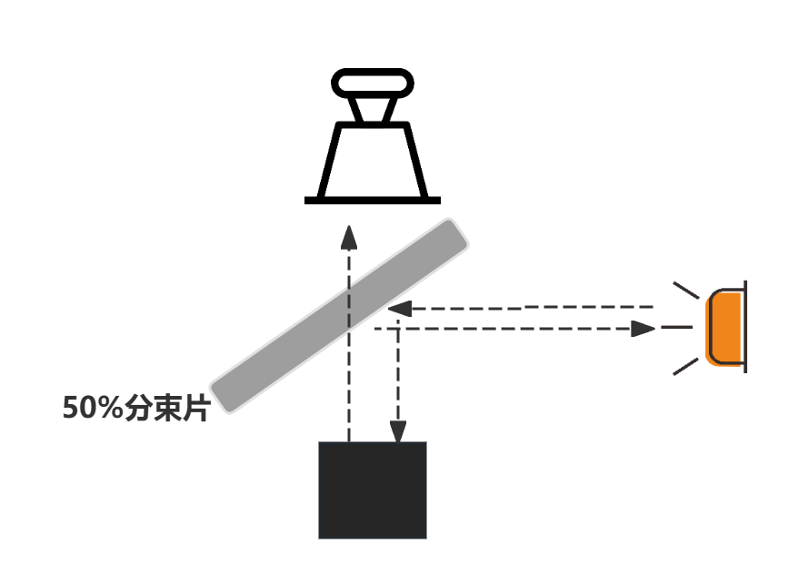

#### 3.高角度环形光源

照明方式的有点是亮度大、灵活、容易适应包装要求；缺点是：阴影和反光；常见应用是：检查平面和有纹理的表面。

检测范围：

1. IC等半导体产品外观字符检测
2. PCB电路基板与元件检测
3. 产品包装外观、标签检测
4. 药片破损、缺片检测


#### 4.低角度环形光源

低角度方式下，光源以解决180角度照明物体，容易突出被检测物的边缘和高度变化。这种照明方式的优点是凸显表面结构，增强图像的拓扑结构，缺点是热点和极度阴影，常见的应用是检测平面和有纹理的表面

检测范围：

1. 边缘特征提取

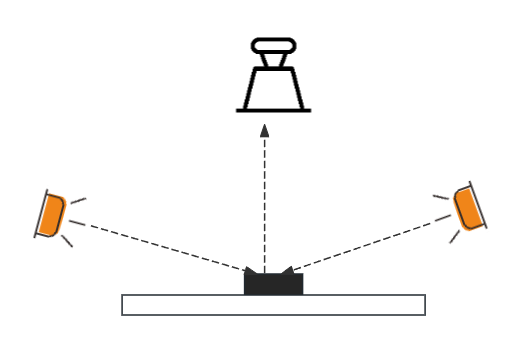

#### 5.条形光

条形方式常用的是LED条形光源，条形方式除具备高亮度的优点外，其安装角度还可以按照需要进行调节。通过调节光线角度和方向，可以检测到被测物表面是否有光泽，是否有纹路，也可以检测到表面特征

检测范围：

1. 检测包装破损
2. 检测LCD字符，定位标记，液晶元件
3. 检测膨胀胶片破损，伸展胶片破损，遮蔽胶带破损
4. 检测连接器引脚平整度
5. 检测大面积物体表面划痕

## 部件二：镜头

工业相机和接口必须匹配。常见的标准包括C口和CS接口。两者螺纹相同，但法兰距（镜头安装基准面到传感器成像面的距离）不同，C接口是17.526mm，CS接口是12.5mm。混用时可能需要转接环 

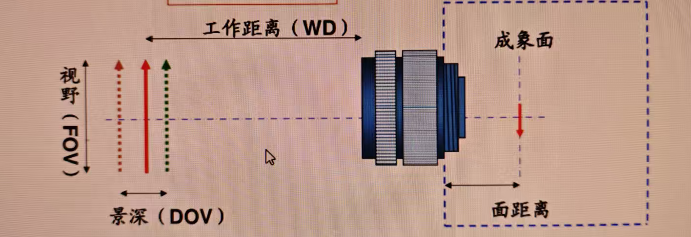

#### 镜头基本参数

1、视野(FOV)
图像采集设备所能够覆盖的范围，它可以是在监视器上可以见到的范围，也可以使设备所输出的数字图像所能覆盖的最大范围。

2、最大/最小工作距离(Work Distance)

从物镜到被检测物体的距离的范围，小于最小工作距离大于最大工作距离系统均不能正确成像。

3、景深(Depth Of Field)
在某个调焦位置上，景深内的物体都可以清晰成像。

4、畸变
几何畸变指的是由于镜头方面的原因导致的图像范围内不同位置上的放大率存在的差异。几何畸变主要包括径向畸变和切向畸变。如枕形或桶形失真。

5、镜头接口
(1)C-MOUNT镜头的标准接口之一，镜头的接口螺纹参数:

​	公称直径:1

​	螺距:32牙

(2)CS-Mount是C-Mount的一个变种，区别仅仅在于镜头定位面到图像传感器光敏面的距离的不同，C-Mount是17.5mm，CS-Mount是12.5mm。

(3)C/CS能够匹配的最大的图像传感器的尺寸不超过1

6、成像面
可以在镜头的像面上清晰成像的物方平面

7、光圈与F值
光圈是一个用来控制镜头通光量装置，它通常是在镜头内。表达光圈大小我们是用F值，如f1.4，f2，f2.8etc。
8、焦距焦距是像方主面到像方焦点的距离。如16mm，25mm

#### 镜头参数关系

1、工作距离、焦距
工作距离和焦距往往结合起来考虑。一般地，可以采用这个思路:先明确系统的分辨率，结合CCD像素尺寸就能知道放大倍率，再结合空间结构约束就能知道大概的物像距离，进一步估算工业镜头的焦距。所以工业镜头的焦距是和工业镜头的工作距离、系统分辨率(及CCD像素尺寸)相关的。

2、特殊要求优先考虑

结合实际的应用特点，可能会有特殊的要求，应该先予明确下来。例如是否有测量功能，是否需要使用远心镜头，成像的景深是否很大等等。景深往往不被重视，但是它却是任何成像系统都必须考虑的。

3、变焦与否

工业镜头是否需要变焦先确定下来的，成像过程中需要改变放大率的应用，采用变焦镜头，否则采用定焦镜头就可以了

4、成像畸变要小

##### 景深和光圈的关系(Linking Depth of Field and Aperture)

景深和光圈的大小有直接关系，光圈越大，景深越短，光图越小，景深越长。这个原因很容易理解。如果光圈小到针孔左右，能够通过的光线全部都是近轴光，有没有镜头都没有关系了，实际上形成了一个针孔像机，景深是无穷大，不管景物远近成象都是清晰的；随着光圈增大，远轴光开始起作用，只有一定范围内的光线能够清晰成像，光圈放大到F3.4 时，大约景深只有几毫米了。

##### 景深和焦距的关系(Linking Depth of Field and Focal Length)

焦距越大，景深越短，反之亦然。例如，f=80mm 的镜头的景深很短，而35mm 焦距的镜头景深较长。从几何成像的基本公式可以看出，如果镜头的焦距很短，物距大到一定范围时，像距近似等于焦距，也就是说，一定距离以外的物体成像都在焦平面附近，10m 远的物体和100m 远的物体成像的位置是一样的，景深很长。而焦距较大时，这个结论不能成立，只有在一定范围内，物体才能清晰成像，所以景深焦短。

#### 镜头主要参数

1.焦距(Focal Length)
焦距是从镜头的中心点到胶平面上所形成的清晰影像之间的距离。焦距的大小决定着视角的大小，焦距数值小，视角大，所观察的范围也大;焦距数值大，视角小，观察范围小。根据焦距能否调节可分为定焦镜头和变焦镜头两大类。

2.光圏(Iris)
用F表示，以镜头焦距f和通光孔径D的比值来衡量。每个镜头上都标有最大F值,例如 8mm /F1.4代表最大孔径为 5.7毫米F 值越小，光圈越大，F 值越大，光圈越小。

3.对应最大 CCD 尺寸(Sensor Size)

镜头成像直径可覆盖的最大 CCD 芯片尺寸。主要有:1/2”、2/3”、1”和 1”以上。

4 接口(Mount)
镜头与相机的连接方式。常用的包括C、CS、F、V、T2、Leica、、M42x1、M75x0.75 等。

5.景深(Depth of Field, DOF)
景深是指在被摄物体聚焦清楚后，在物体前后一定距离内，其影像仍然清晰的范围。景深随镜头的光圈值、焦距、拍摄距离而变化。光圈越大，景深越小;光圈越小、景深越大。焦距越长，景深越小;

焦距越短，景深越大。距离拍摄体越近时，景深越小;距离拍摄体越远时，景深越大

6.分辨率(Resolution)
分辨率代表镜头记录物体细节的能力，以每毫米里面能够分辨黑白对线的数量为计量单位:“线对/毫米”(1p/mm)。分辨率越高的镜头成像越清晰。

7.工作距离（Working distance，WD）

镜头第一个工作面到被测物体的距离

8.视野范围（Field of View，FOV）

相机实际拍到区域的尺寸

9.光学放大倍数（Magnification，β）

CCD/FOV，即芯片尺寸除以视野范围

10、数值孔径(Numerical Aperture, NA)

数值孔径等于由物体与物镜间媒质的折射率n与物镜孔径角的一半(a\2)的正弦值的乘积，计算公式为N.A=n*sin a/2。数值孔径与其它光学参数有着密切的关系，它与分辨率成正比，与放大率成正比。也就是说数值孔径，直接决定了镜头分辨率，数值孔径越大分辨率越高，否则反之。

#### 选择镜头焦距

**公式如下：**

$$\frac{f}{WD}$$=$$\frac{Sensor Size(V) or (H)}{FOV(V) or a(H)}$$

---

**Sensor Size**：传感器靶面尺寸

**FOV**：视野范围

**WD**：工作距离

**f**：焦距

#### 选择镜头光圈

镜头的光圈大小决定图像的亮度，在拍摄高速运动物体、曝光时间很短的应用中，应该选用大光圈镜头，以提高图像亮度

#### 选择远心镜头

远心镜头是为纠正传统镜头的视差而特殊设计的镜头，它可以在一定的物距范围内，使得到的图像放大倍率不会随物距的变化而变化。 

## 部件三：相机类别

### 常见相机分类：

1. 按照芯片类型可以分为CCD相机、CMOS相机:
2. 按照传感器的结构特性可以分为线阵相机、面阵相机;
3. 按照扫描方式可以分为隔行扫描相机、逐行扫描相机;
4. 按照分辨率大小可以分为普通分辨率相机、高分辨率相机:
5. 按照输出信号力式可以分为模拟相机、数字相机;
6. 按照输出色彩可以分为单色(黑白)相机、彩色相机:

### 相机的基本参数

1、像素数:指的是工业相机CCD传感器的电大像素数，对于一定尺寸的CCD 芯片，像素数越多则意味着每一像素单元的面积越小，因而由该芯片构成的工业相机的分辨率也就越高;

2、分辨率:是衡量工业相机优劣的一个重要参数，它指的是当工业相机摄取等间隔排列的黑白相间条纹时，在监视器上能够看到的最多线数。最低照度:也是衡量工业相机优劣的一个重要参数，有时省掉“最低”两个字而直接简称照度。它指的是当被摄景物的光亮度低到一定程度而使工业相机输出的视频信号电平低到某一规定值时的景物光亮度值;

3、信噪比:也是工业相机的一个主要参数。其基本定义是信号对于噪声的比值乘以20log 。CCD工业相机的信噪比的典型值一般为45---55dB

4、电子快门:是比照照相机的机械快门功能提出的一个术语，它相当于控制CCD 图像传感器的感光时间;

5、自动增益控制:工业相机输出的视频信号必须达到电视传输规定的标准电平，即0.7VPP，为了能在不同的景物照度条件下都能输出0.7VPP的标准视频信号，必须使放大器的增益能够在较大的范围内进行调节。这种增益调节通常都是通过检测视频信号的平均电平而自动完成的，实现此功能的电路称为自动增益控制电路，简称AGC 电路;

### 相机选择注意事项

选择工业相机前，首先要清楚自己的检测任务，是静态拍照还是动态拍照，拍照的频率是多少，是做缺陷检测还是尺寸测量，或者是定位，产品的大小(视野)是多少，需要达到多少精度，所用软件的性能，现场环境情况如何，有没有其它的特殊要求等。
如果是动态拍照，运动速度是多少，根据运动速度选择最小曝光时间，以及确认是否需要逐行扫描的相机。而相机的率(最高拍照频率)跟像素有关，通常分辨率越高桢率越低，不同品牌的工业相机的率略有不同。根据检测任务的不同，根据产品的大小、需要达到的分辨率，以及所用软件的性能可以计算出所需工业相机的分辨率。现场环境首先要考虑的是温度、湿度、干扰情况以及光照条件等因素来选择不同的工业相机。

例:如检测任务是尺寸测量，产品大小是18mm*10mm，精度要求是0.01mm，流水线作业，检测速度是10件/秒，现场环境是普通工业环境，不考虑干扰问题。首先知道是流水线作业，速度比较快，因此选用逐行扫描相机;视野大小我们可以设定为20mm*12mm(考虑每次机械定位的误差，将视野比物体适当放大)，假如能够取到很好的图像(比如可以打背光)，而且我们软件的测量精度可以考虑1/2亚像素精度，那么我们需要的相机分辨率就是20/0.01/2=1000pixcel(像素)，另一方向是1210.01/2=600pixcel，也就是说我们相机的分辨率至少需要1000*600pixcel，桢率在10桢/秒，因此选择1024*768像素(软件性能和机械精度不能精确的情况下也可以考虑1280*1024pixcel)，桢率在10桢秒以上的即可。CCD的成像质量优于CMOS，但是其成本也远高于CMOS.
选择相机时，第一需要注意相机的接口要与镜头匹配;第二，需要选择合适的分辨率，通常系统的像素精度等于视场(长或宽)除以相机分辨率(长或宽)。如视场为10mmx7.5mm，使用130万像素的相机，则相机分辨率为1280x960Pixel，则像素精度为10mm:1280Pixel=0.0078mm/Pixel:第三，需要注意传感器的尺寸与类型。相机的传感器尺寸应小于等于镜头的传感器，优先选择传感器尺寸大的，有利于成像质量的提高;第四，相机的帧率。当对测试测量有速度要求时，我们需要重点考虑相机的速率;
第五，相机的视频输出接口，不同的输出接口有不同的输出带宽，从而影响帧率;第六，相机的颜色。


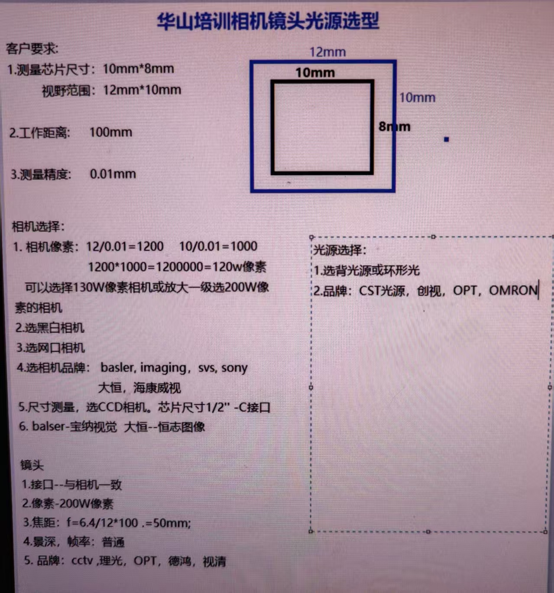


# MVTec HALCON HDevelop使用

界面说明：

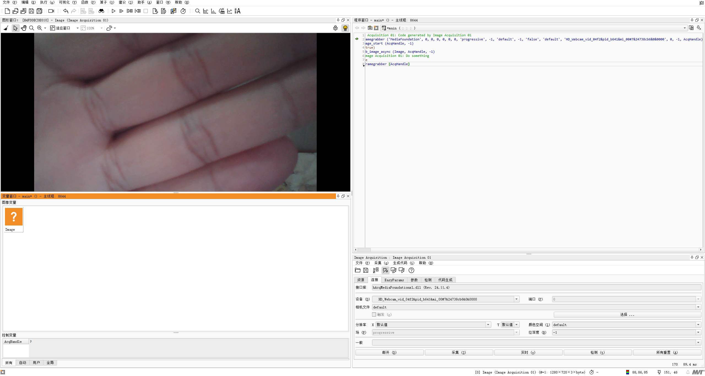

通过助手连接监控设备：

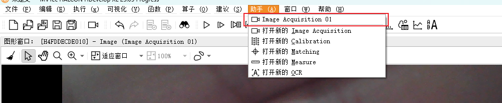

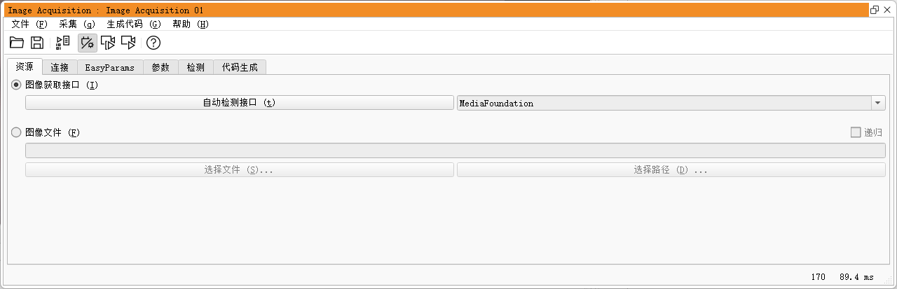

点击`资源->自动检测接口`。点击连接，再点击下面的连接，连接到设备；采集是采集一帧的数据，实时是录像。

也可以通过选择图像文件，对单独一个图片进行采集

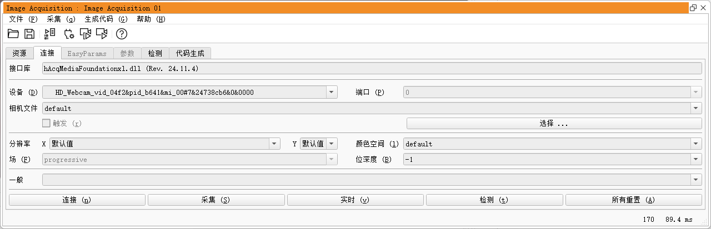

---

通过参数界面，可以调节相机参数：

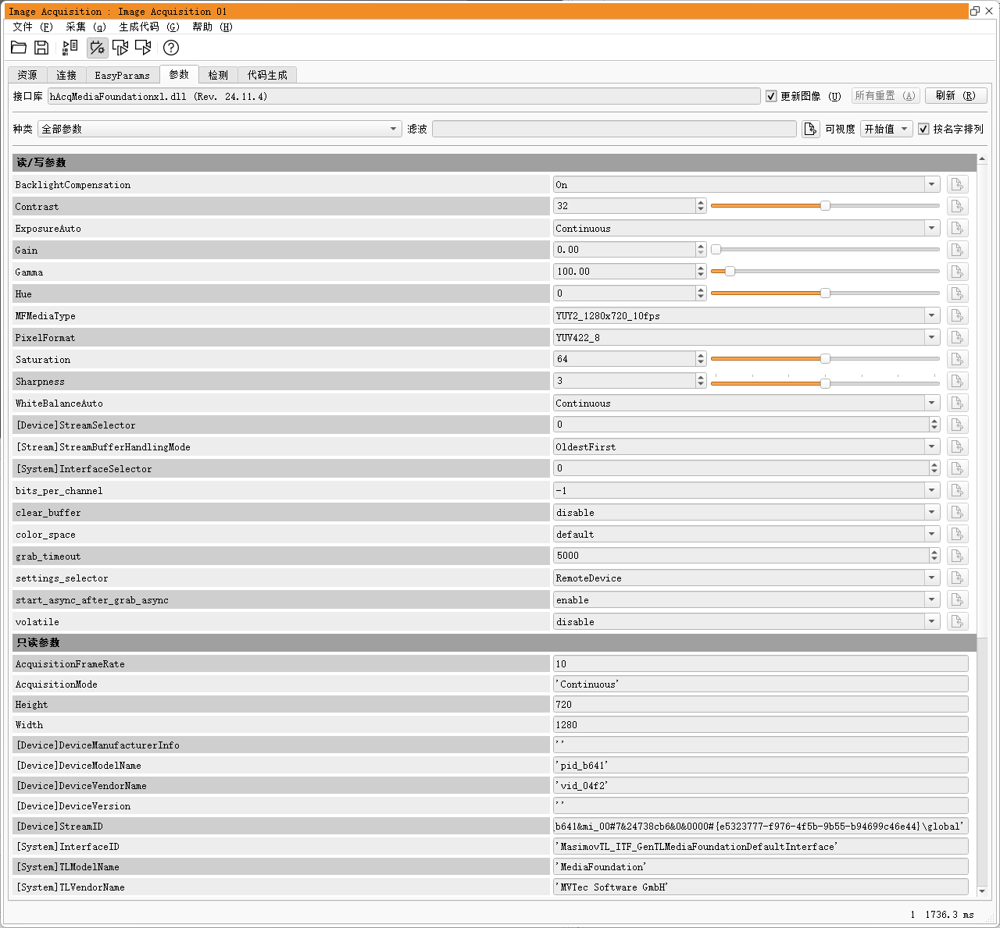

相机参数分为以下几类：

- **核心图像质量参数（最常调整）**

这些参数直接决定你看到的图像是什么样子。

| 参数名                  | 当前值 | 作用说明                                                     |
| :---------------------- | :----- | :----------------------------------------------------------- |
| **Contrast (对比度)**   | 32     | 调整图像中明暗区域之间的差异。值越高，明暗对比越强烈。       |
| **Gamma (伽马值)**      | 100.00 | 调整图像的灰度系数，影响图像的中间调亮度。值大于100会使中间调更亮（对比度曲线变缓），小于100会使中间调更暗（对比度曲线变陡）。它不改变最黑和最白的地方，主要用于校正显示非线性。 |
| **Saturation (饱和度)** | 64     | 控制图像色彩的鲜艳程度。值越高，颜色越鲜艳；值为0时，图像变为灰度图。 |
| **Sharpness (锐度)**    | 3      | 增强图像的边缘，使图像看起来更清晰。但过度增强会产生不自然的白边（伪影）。 |
| **Hue (色调)**          | 0      | 调整图像的整体色彩偏向，类似于色相环。通常保持为0（默认）即可。 |

- **自动控制参数（决定相机是否自动调整）**

这些参数让相机自动适应环境变化，对于光照不稳定的场景非常有用。

| 参数名                               | 当前值     | 作用说明                                                     |
| :----------------------------------- | :--------- | :----------------------------------------------------------- |
| **ExposureAuto (自动曝光)**          | Continuous | **重要参数**。控制曝光时间（图像传感器感光的时间）是否自动调整。 • **`Continuous`**：相机持续自动调整曝光，以适应环境光变化。适合动态场景。 • **`Once`**：相机根据当前场景调整一次曝光，然后锁定。 • **`Off`**：关闭自动曝光，此时需要使用`ExposureTime`（曝光时间）参数手动设置一个固定值。 |
| **Gain (增益)**                      | 0.00       | **模拟增益**。在曝光不足时，放大电信号以提高图像整体亮度。**副作用是会增加图像噪点**。通常先在自动曝光下调整，如果帧率或亮度仍不满足，再适当增加增益。 |
| **WhiteBalanceAuto (自动白平衡)**    | Continuous | 校正不同光源（如日光、白炽灯）下的颜色，使白色物体看起来是真正的白色。 • **`Continuous`**：持续自动校正。 • **`Once`** / **`Off`**：同自动曝光。 |
| **BacklightCompensation (背光补偿)** | On         | 当场景中有强背景光（逆光）时，开启此功能可以提亮前景主体，防止主体因曝光不足而变黑。 |

- **采集流程与格式参数（决定如何获取图像）**

这些参数控制着采集的底层流程和数据格式。

| 参数名                               | 当前值                         | 作用说明                                                     |
| :----------------------------------- | :----------------------------- | :----------------------------------------------------------- |
| **MFMediaType / PixelFormat**        | YUY2_1280x720_10fps / YUV422_8 | 定义了采集流的**分辨率（1280x720）、帧率（10fps）和色彩编码格式（YUV）**。这是采集的基础设置。 |
| **color_space**                      | default                        | 输出给Halcon的图像颜色空间。`default`通常意味着Halcon会根据 `PixelFormat`自动转换为灰度（`'gray'`）或RGB（`'rgb'`）。 |
| **grab_timeout**                     | 5000                           | 采集图像的超时时间（毫秒）。如果5000毫秒（5秒）内没有收到图像，采集操作会报错。 |
| **start_async_after_grab_async**     | enable                         | **高性能关键参数**。启用后，在执行一次异步采集（`grab_image_async`）后，会自动启动下一次采集。这样可以实现“流水线”作业，最大限度地提高帧率。 |
| **clear_buffer**                     | disable                        | 连接相机时是否清除硬件缓冲区中的旧图像。通常禁用（`disable`），以免丢失图像。 |
| **[Stream]StreamBufferHandlingMode** | OldestFirst                    | 当计算机处理速度跟不上相机采集速度时，缓冲区策略。 • **`OldestFirst`**：丢弃最旧的图像，保留最新的图像。这是机器视觉中的常见设置，以保证处理的实时性。 |

- **设备信息参数（只读，用于识别和设备状态）**

这些参数是只读的，用于显示设备信息和当前状态，帮助你确认连接和配置。

| 参数名                       | 当前值     | 作用说明                                                     |
| :--------------------------- | :--------- | :----------------------------------------------------------- |
| **Width / Height**           | 1280 / 720 | 当前采集图像的实际宽度和高度（像素）。                       |
| **AcquisitionFrameRate**     | 10         | 相机实际正在运行的采集帧率（帧/秒）。这个值可能会受曝光时间、传输带宽限制而低于媒体类型中设定的理论值。 |
| **[Device]DeviceModelName**  | 'pid_b641' | 设备的物理ID，用于识别具体相机型号。                         |
| **[Device]DeviceVendorName** | 'vid_04f2' | 设备制造商的ID。`vid_04f2`通常代表Chicony（群光）。          |

---

通过`生成代码->插入代码`，可在程序窗口中生成代码进行调试

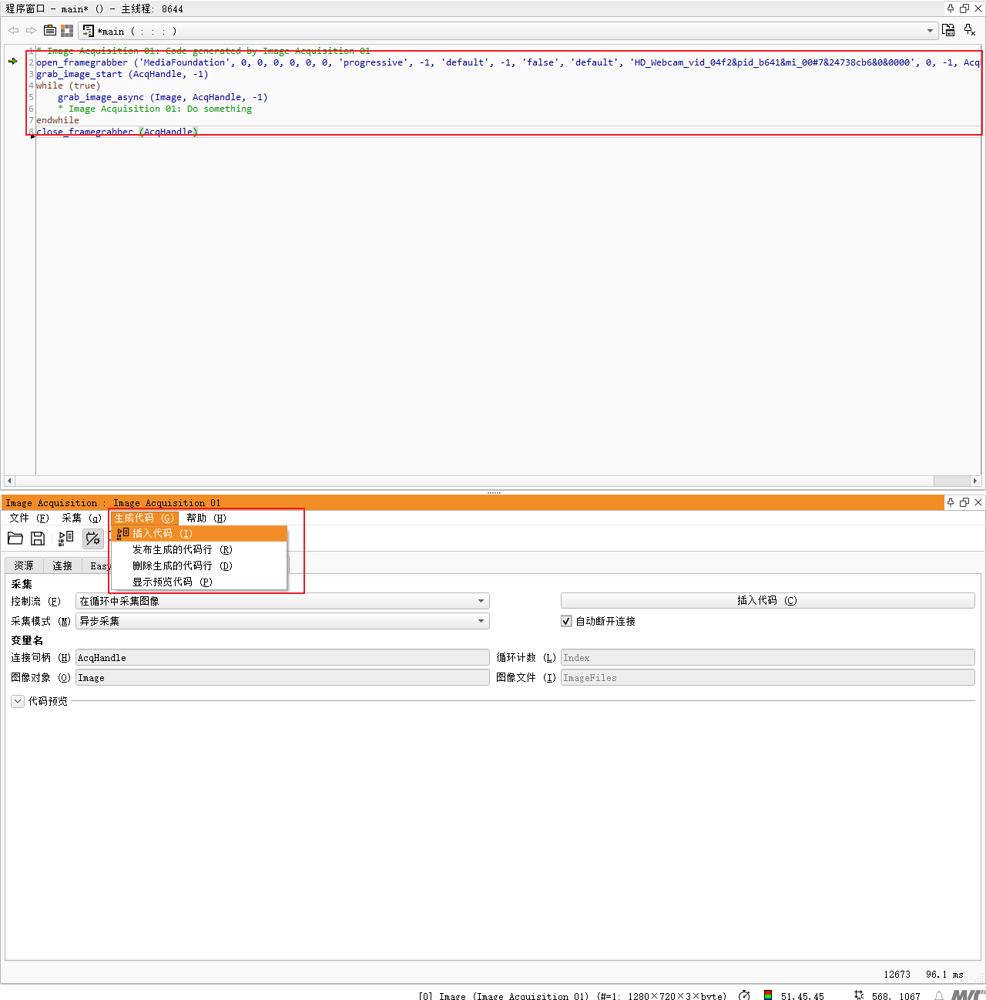

---

在程序窗口中，将光标放在函数上，`鼠标右键->打开算子窗口`，可以看到函数的介绍以及参数

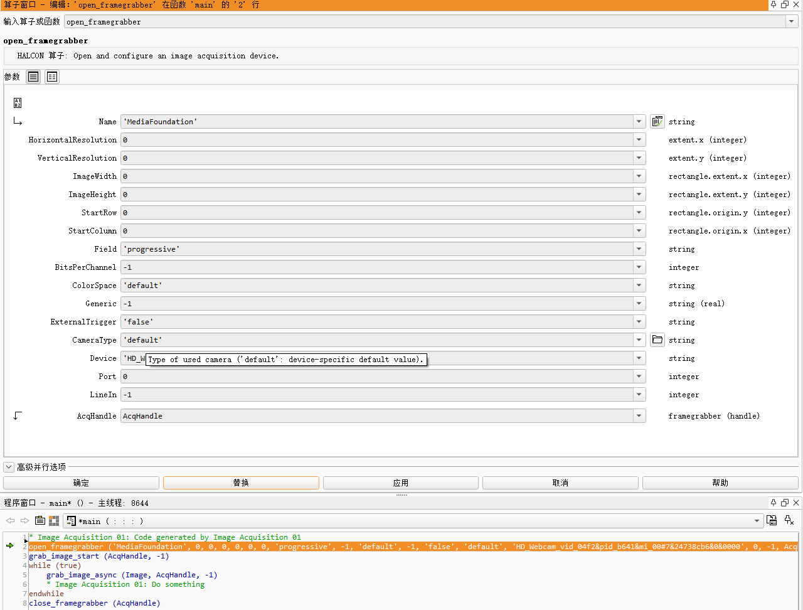

```c++
* Image Acquisition 01: Code generated by Image Acquisition 01
* 初始化与连接设备
open_framegrabber ('MediaFoundation', 0, 0, 0, 0, 0, 0, 'progressive', -1, 'default', -1, 'false', 'default', 'HD_Webcam_vid_04f2&pid_b641&mi_00#7&24738cb6&0&0000', 0, -1, AcqHandle)
* 从指定的图像采集设备开始异步抓取。
grab_image_start (AcqHandle, -1)
* 获取图形窗口对象
dev_get_window(CurrentWindow)
* 初始化一个名为Button的变量，用于记录鼠标按钮的状态。0通常代表“未有按钮按下”。
Button:=0
* 当button != 1
while (Button#1)
    * 临时关闭错误检查​​
    dev_set_check('~give_error')
    get_mposition(CurrentWindow,Row,Column,Button)
    * 恢复正常的错误检查机制​​
    dev_set_check ('give_error')
    * 获取​​最新的一帧图像​​，并立即命令摄像头开始采集下一帧
    grab_image_async (Image, AcqHandle, -1)
    * Image Acquisition 01: Do something
endwhile
* 清理资源
close_framegrabber (AcqHandle)
```

---

导出C#文件：

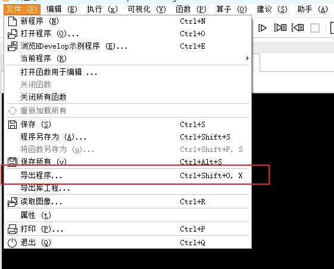

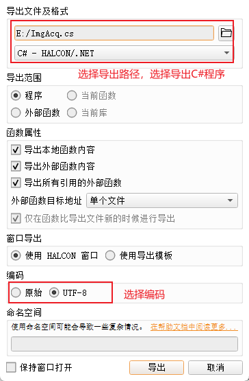

使用VS创建一个WinForm应用程序，添加现有项将导出的文件添加到程序中。然后添加Halcon引用，在安装目录下`\MVTec\HALCON-25.05-Progress\bin\dotnet35\halcondotnet.dll`。

将生成的代码修改一下，如下：

```C#
public class HDevelopExport
{
    public HDevelopExport()
    {
        HOperatorSet.SetSystem("width", 512);
        HOperatorSet.SetSystem("height", 512);
        if (HalconAPI.isWindows)
            HOperatorSet.SetSystem("use_window_thread","true");
    }
    HTuple hv_AcqHandle = new HTuple();
    HTuple hv_Button = new HTuple();
    HTuple hv_Row = new HTuple();
    HTuple hv_Column = new HTuple();
    HObject ho_Image = null;
    private HTuple currentWindow;
    public void action(HTuple hv_CurrentWindow)
    {
        currentWindow = hv_CurrentWindow;


        hv_Button.Dispose();
            hv_Button = 0;
            while ((int)(new HTuple(hv_Button.TupleNotEqual(1))) != 0)
            {
                try
                {
                    hv_Row.Dispose();hv_Column.Dispose();hv_Button.Dispose();
                    HOperatorSet.GetMposition(hv_CurrentWindow, out hv_Row, out hv_Column, out hv_Button);
                }
                catch(HalconException e)
                {
                    int error = e.GetErrorCode();
                    if (error < 0)
                    throw e;
                }
                ho_Image.Dispose();
                HOperatorSet.GrabImageAsync(out ho_Image, hv_AcqHandle, -1);
            // 显示图像到当前窗口，必须加上
            HOperatorSet.DispObj(ho_Image, currentWindow);
            }
        }
// 自己创建的方法，不是生成的
    public void Open()
    {
        
        //Image Acquisition 01: Code generated by Image Acquisition 01
        hv_AcqHandle.Dispose();
        HOperatorSet.OpenFramegrabber("MediaFoundation", 0, 0, 0, 0, 0, 0, "progressive",
        -1, "default", -1, "false", "default", "HD_Webcam_vid_04f2&pid_b641&mi_00#7&24738cb6&0&0000",
        0, -1, out hv_AcqHandle);
        HOperatorSet.GrabImageStart(hv_AcqHandle, -1);
        HOperatorSet.GenEmptyObj(out ho_Image);
    }
	// 自己创建的方法，不是生成的
    public void Close()
    {
        HOperatorSet.CloseFramegrabber(hv_AcqHandle);
        ho_Image.Dispose();

        hv_AcqHandle.Dispose();
        currentWindow.Dispose();
        hv_Button.Dispose();
        hv_Row.Dispose();
        hv_Column.Dispose();
    }
}
```


将`HWindowControl`组件拖拽到页面中

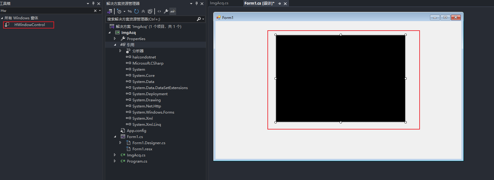

如果没有此组件，将`halcondotnet.dll`拖拽到工具箱。

# 图像分割

**需求：**将纽扣中心的小方块取出来

**读取图片：**


代码如下：

```c++
* 读取图片
read_image(Image, 'G:/资料/给网课学员类库及资料作业/华山培训视觉修正坐标类库/Floppies.jpg')
* 获取图片大小
get_image_size (Image, Width, Height)
* 关闭显示窗体
dev_close_window()
* 根据图像大小打开显示窗体
dev_open_window_fit_size(0, 0, Width, Height, -1, -1, WindowHandle)
* 显示图像
dev_display(Image)
* 使用全局阈值对图像进行分割
threshold (Image, Regions, 119, 255)
```

## 使用灰度直方图

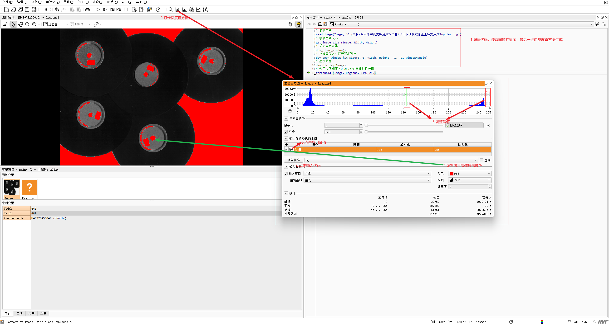

插入代码后会生成最后一行代码`threshold (Image, Regions, 119, 255)`

### 打散区域

操作代码：`connection(Regions, ConnectedRegions)`

未打散前：

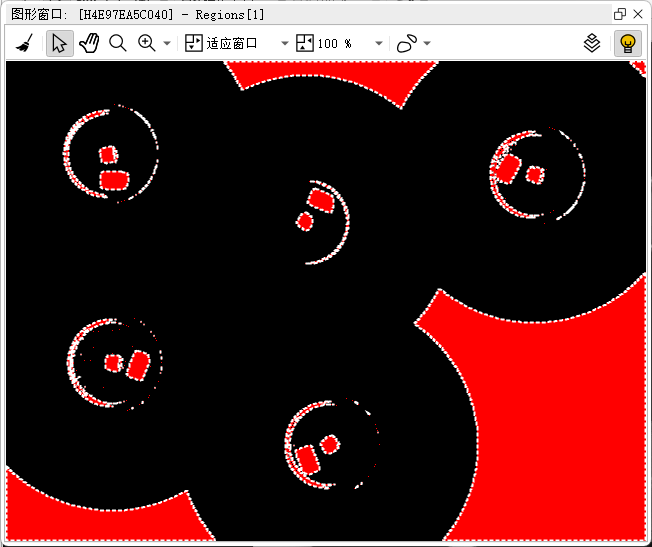

打散后：

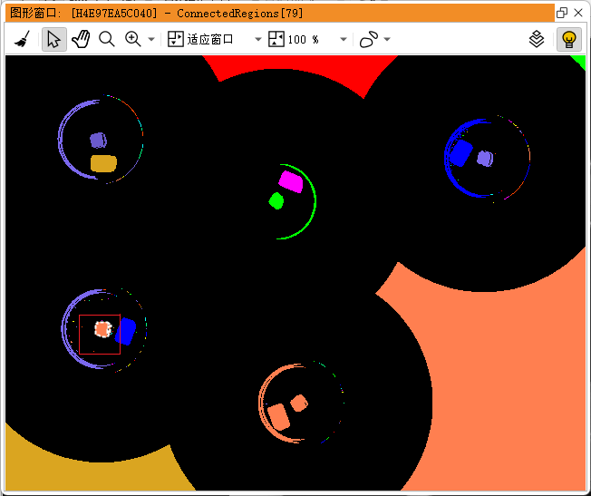

可以单独选择一个区域

## 使用特征直方图

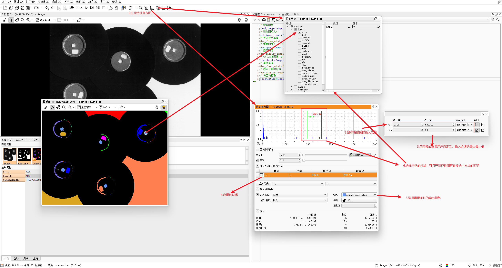

点击生成代码，会在最后一行添加：`select_shape (ConnectedRegions, SelectedRegions, 'area', 'and', 195.6, 258.64)`

将选中的区域显示：

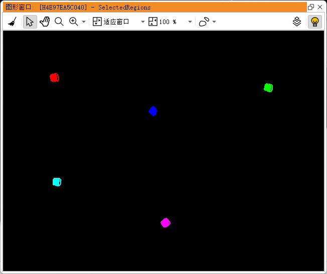

如果还有其他不是想要的区域，则可以添加其他特征过滤，如：

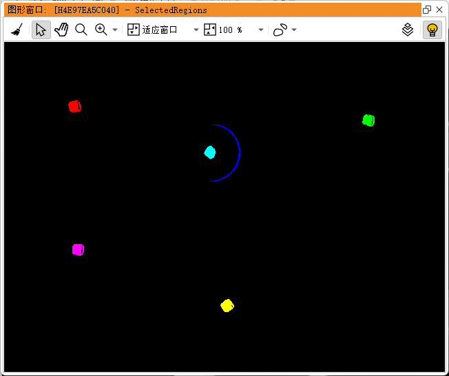

再次打开特征直方图，选择圆度（roundness）过滤：

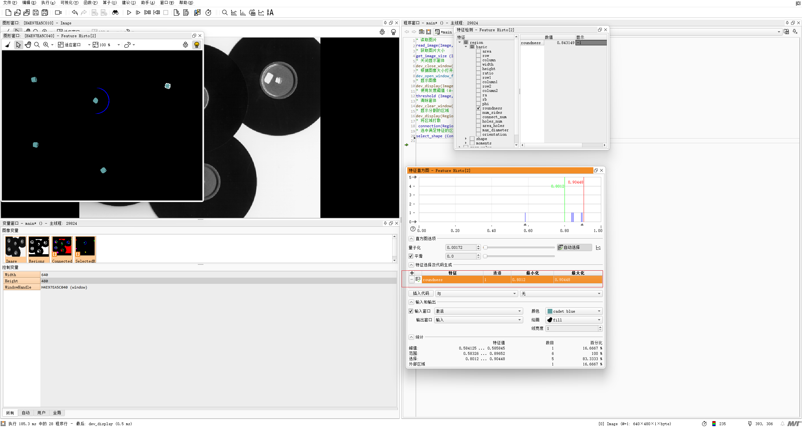

直方图要选择合适的范围，否则不好过滤；

可通过特征检测，选中目标区域查看它的圆度范围：

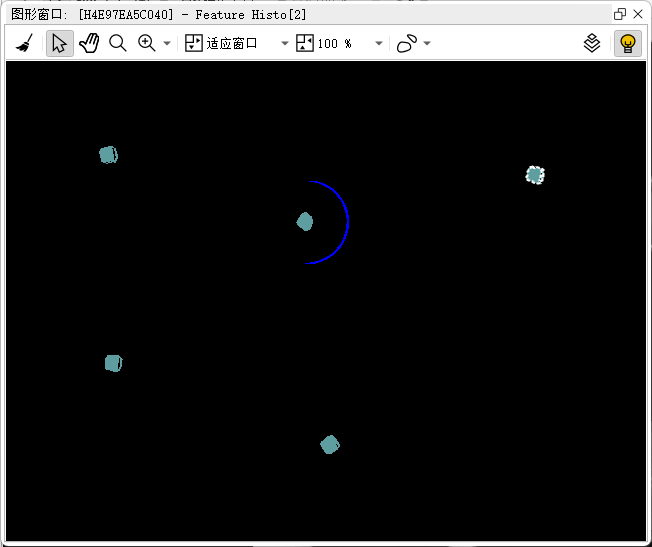

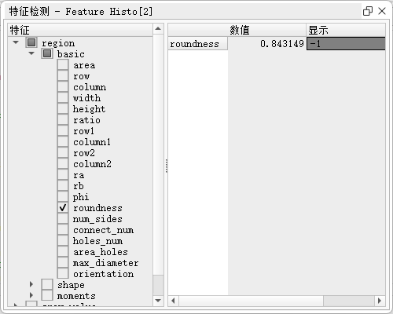

完整代码如下：

```c++
* 读取图片
read_image(Image, 'G:/资料/给网课学员类库及资料作业/华山培训视觉修正坐标类库/Floppies.jpg')
* 获取图片大小
get_image_size (Image, Width, Height)
* 关闭显示窗体
dev_close_window()
* 根据图像大小打开显示窗体
dev_open_window_fit_size(0, 0, Width, Height, -1, -1, WindowHandle)
* 显示图像
dev_display(Image)
* 使用灰度阈值（0-255）对图像进行分割
threshold (Image, Regions, 119, 255)
* 清除窗体
dev_clear_window()
* 显示分割的区域
dev_display(Regions)
* 将区域打散
 connection(Regions, ConnectedRegions)
* 选中满足特征的区域，根据面积来选择
select_shape (ConnectedRegions, SelectedRegions, 'area', 'and', 191, 283.65)
select_shape (SelectedRegions, SelectedRegions1, 'roundness', 'and', 0.8012, 0.90448)
dev_clear_window()
* 将原始图像作为背景显示在窗口中
dev_display(Image)
* 设置绘制颜色
dev_set_color('red')
dev_display(SelectedRegions1)
```

最后显示图像：

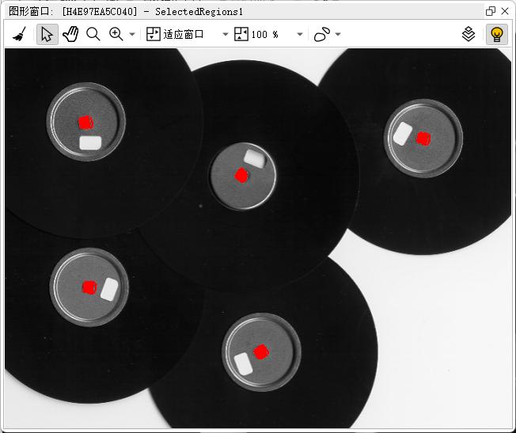

## 相关算子说明

#### `threshold`

**全局阈值分割**算子，用于根据灰度值从图像中提取感兴趣的区域；参数说明：

1. 输入参数-`Image`：待处理的单通道图像。
2. 输出参数-`Region`：分割后得到的区域，包含了所有满足灰度条件的像素。
3. 输入参数-`MinGray`：**灰度下限**。要提取的像素灰度值的最小值。
4. 输入参数-`MaxGray`：**灰度上限**。要提取的像素灰度值的最大值。

#### connection

将分割后可能包含多个独立物体的区域，根据连通性分解成一个个独立的区域对象；参数说明：

1. 输入参数-`Region`：要进行连通域分析的输入区域
2. 输出参数-`ConnectedRegions`：输出**区域集合**，集合中的每个独立区域都对应输入区域中一个连通的部分

#### `select_shape`

根据你设定的形状、大小等特征，从一大堆区域中挑选目标：参数说明：

1. 输入参数-`Regions`：**待筛选的区域集合**
2. 输出参数-`SelectedRegions`：**筛选后的区域集合**。所有符合设定条件的区域会输出到这里
3. 输入参数-`Features`：**形状特征**。这是最重要的参数，指定你要根据哪个或哪些特征来筛选。如面积area、圆度roundness；也可以是多个特征组成的数组（如`['area', 'circularity']`）
4. 输入参数-`Operation`：**逻辑操作符**。当指定了多个`Features`时，用于定义这些条件之间的关系。主要有两种：`'and'`（与，所有条件必须**同时满足**）和 `'or'`（或，满足**任一**条件即可）
5. 输入参数-`Min`： **特征下限值**。希望筛选的特征的**最小值**。可以是一个数值，或者与`Features`数组对应的数值数组
6. 输入参数-`Max`：**特征上限值**。希望筛选的特征的**最大值**。可以是一个数值，或者与`Features`数组对应的数值数组

# ROI制作

先读取图像并显示到窗口：

```c++
read_image(Image, '../Halcon素材/Floppies.jpg')
get_image_size(Image, Width, Height)
dev_close_window()
dev_open_window_fit_size(0, 0, Width, Height, -1, -1, WindowHandle)
dev_display(Image)
```

### 一、使用图像界面提供的工具绘制

如下：

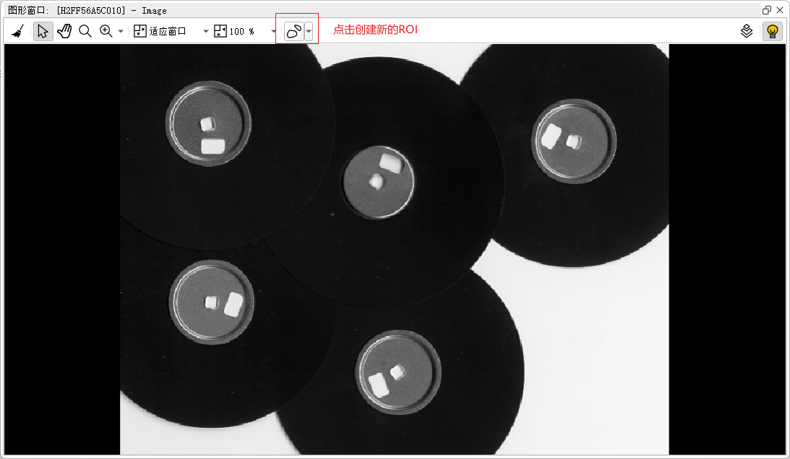

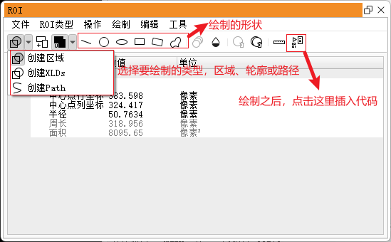

绘制之后，鼠标右键即可生成，运行代码：

```c++
read_image(Image, '../Halcon素材/Floppies.jpg')
get_image_size(Image, Width, Height)
dev_close_window()
dev_open_window_fit_size(0, 0, Width, Height, -1, -1, WindowHandle)
dev_display(Image)
* 生成一个圆形ROI区域
gen_circle (ROI_0, 383.598, 324.417, 52.9679)
* 生成一个圆形ROI轮廓
gen_circle_contour_xld (ROI_0, 300.975, 107.069, 50.3561, 0, 6.28318, 'positive', 1)
* 生成一个可旋转矩形ROI区域
gen_rectangle2 (ROI_0, 139.664, 317.533, rad(-19.6562), 14.6207, 8.72452)
* 生成一个矩形轮廓
gen_contour_polygon_xld (ROI_0, [111,111,127,127,111], [93,122,122,93,93])
```


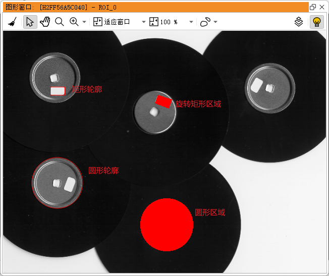

### 二、使用算子绘制

除了打开ROI窗口绘制，还可以直接调用算子，在图形窗口绘制：

```c++
* 显示图像代码略
    
* 只显示轮廓    
dev_set_draw('margin')
* 用鼠标绘制一个矩形区域
draw_rectangle1(WindowHandle, Row1, Column1, Row2, Column2)
* 生成绘制的区域
gen_rectangle1(Rectangle, Row1, Column1, Row2, Column2)
```

绘制的区域会将原来的图像挡住，可通过代码`dev_set_draw('margin')`，只绘制轮廓

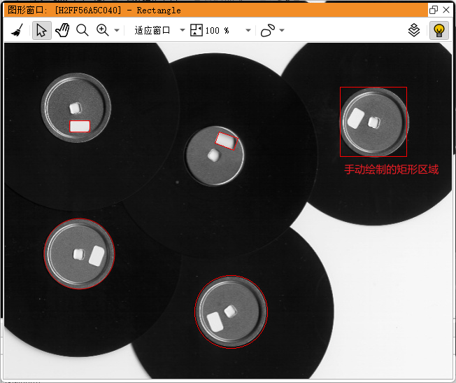

提取手动绘制的ROI区域，并保存到指定位置：

```c++
* 提取图像中的ROI区域
reduce_domain(Image, Rectangle, ImageReduced)
```

提取的ROI区域如下：

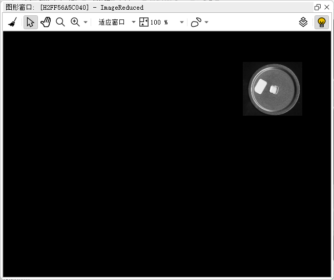

这里提取的是手动绘制的右上角的纽扣，出了绘制的ROI区域，其他地方都是黑色的，如果只想提取绘制的区域，可执行如下代码：

```c++
* 剪切区域图像，并输出到窗口
crop_domain(ImageReduced, ImagePart)
* 将图片保存到指定为止，第三参数默认为0
write_image(ImageReduced, 'png', 0, './roi')
```

效果如下：

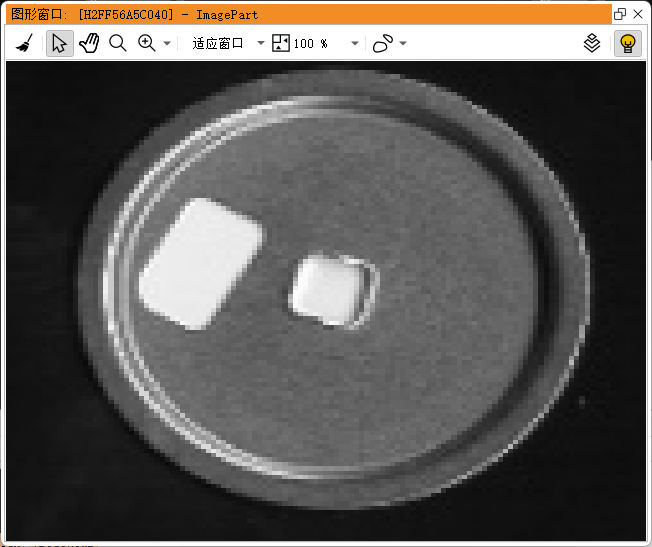

### 三、合并感兴趣区域

使用`union2`可将多个区域合并为感兴趣区域，代码如下：

```c++
* 显示图像代码略

draw_rectangle1(WindowHandle, Row11, Column11, Row21, Column21)
gen_rectangle1(Rectangle1, Row11, Column11, Row21, Column21)

draw_circle(WindowHandle, Row, Column, Radius)
gen_circle(Circle, Row, Column, Radius)

* 合并区域
union2(Rectangle1, Circle, RegionUnion)
* 提取感兴趣区域，并保存
reduce_domain(Image, RegionUnion, ImageReduced1)
crop_domain(ImageReduced1, ImagePart)
write_image(ImagePart, 'png', 0, 'union_part')
```

将一下两个块合并为感兴趣区域：

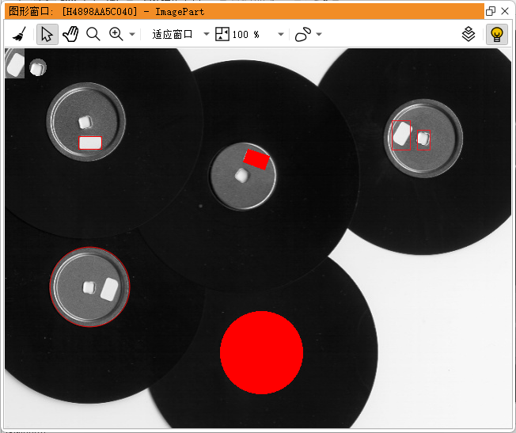

合并后图像如下：

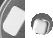

### 四、不关注区域

每个纽扣中心旁边都有一个长方形，并且他们的方位都不一致，如果想去掉这部分区域，可通过`difference`算子实现：

```c++
read_image(Image,'../Halcon素材/Floppies.jpg')
get_image_size(Image, Width, Height)
dev_close_window()
dev_open_window_fit_size(0, 0, Width, Height, -1, -1, WindowHandle)
dev_display(Image)

dev_set_color('red')
dev_set_draw('margin')

draw_circle(WindowHandle, Row, Column, Radius)
gen_circle(Circle, Row, Column, Radius)

draw_rectangle1(WindowHandle, Row1, Column1, Row2, Column2)
gen_rectangle1(Rectangle, Row1, Column1, Row2, Column2)
* 求两个区域差
difference(Circle, Rectangle, RegionDifference)

reduce_domain(Image, RegionDifference, ImageReduced)

dev_clear_window()

dev_display(ImageReduced)
```

效果如下：

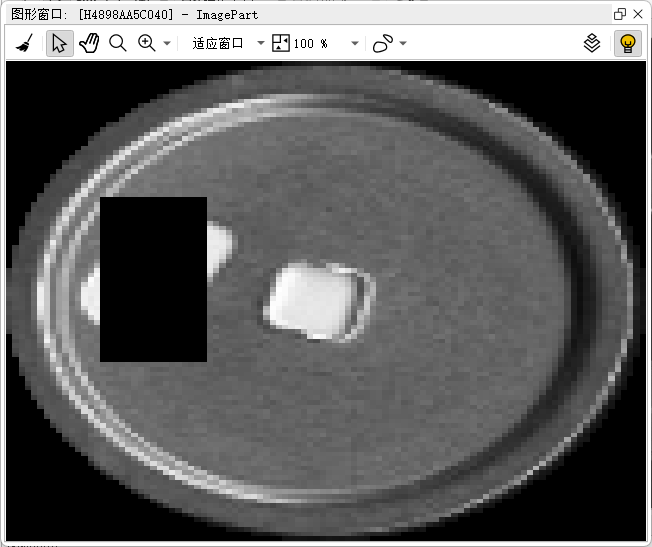

### 五、绘制任意区域

使用`draw_region`可以绘制任意区域：

```c++
draw_region (Region, WindowHandle)
* 提取绘制的区域
reduce_domain(Image, Region, ImageRegion)
crop_domain(ImageRegion, ImagePart)
write_image(ImagePart, 'png', 0, 'roi_region')
```

绘制的区域

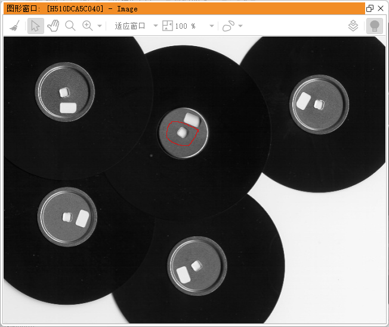

提取后的效果：

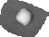

### 六、创建可拉伸圆形

创建可拉伸圆形这个代码执行过程中，没有用户交互，直接执行到最后保存了；可通过`while`循环来实现交互

代码如下：

```c++
read_image(Image, '../Halcon素材/Floppies.jpg')
get_image_size (Image, Width, Height)

dev_close_window()
dev_open_window_fit_size(0, 0, Width, Height, -1, -1, WindowHandle)

dev_display(Image)
dev_set_draw('margin')
* 设置绘制线条宽度
dev_set_line_width(1)
* 创建可拉伸圆形区域
create_drawing_object_circle(100, 100, 80, DrawID)
* 将该区域显示在窗口
attach_drawing_object_to_window(WindowHandle, DrawID)
    
  
* 获取该区域参数
get_drawing_object_params(DrawID, ['row','column','radius'], ParamValues)
* 根据参数绘制
gen_circle(Circle, ParamValues[0], ParamValues[1], ParamValues[2])
* 提取绘制区域
reduce_domain(Image, Circle, ImageReduced)
* 截取绘制区域
crop_domain(ImageReduced, ImagePart)

write_image(ImagePart, 'png', 0, 'drawing_object')
```

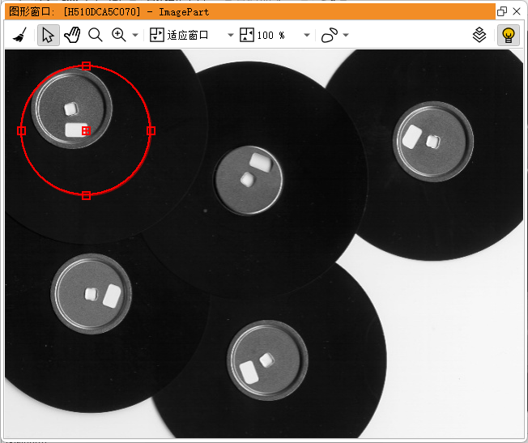

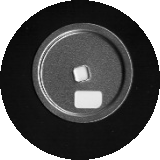

# 图像匹配

## 形状模型匹配

形状模型匹配是一种基于物体边缘轮廓特征的匹配方法。它通过提取模板图像中物体的轮廓信息，构建一个多分辨率的金字塔模型（即形状模型），
然后在待检测图像中利用该模型进行搜索，找到与模型相似的实例位置（包括坐标、旋转角度和缩放比例等）。

形状匹配的主要特点：

1. 对光照变化不敏感：因为使用边缘梯度信息，所以光照变化对匹配结果影响较小。
2. 支持旋转和缩放：可以在创建模型时指定旋转角度范围和缩放范围，从而匹配不同姿态和大小的物体。
3. 抗遮挡能力：即使目标被部分遮挡，仍然可能匹配成功。
4. 速度快：利用图像金字塔，在低分辨率层快速定位候选区域，然后在高分辨率层精确定位。

### 使用图形界面

首先在助手中打开Matching窗口

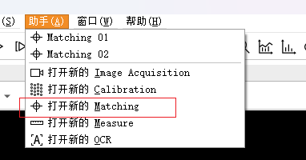

导入图片，并选择感兴趣区域：

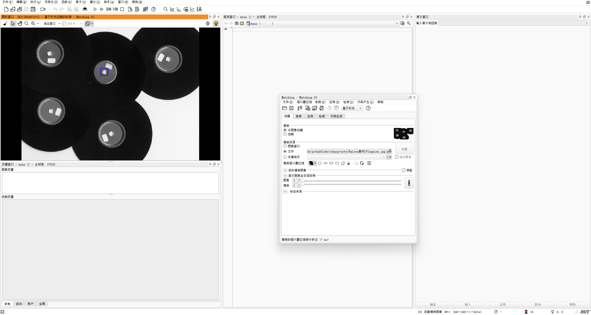

蓝色框是使用ROI绘制的感兴趣区域，红色轮廓是Halcon识别到的模板；通过参数页面的参数，可以控制如何从选定的感兴趣区域提取和匹配轮廓特征：

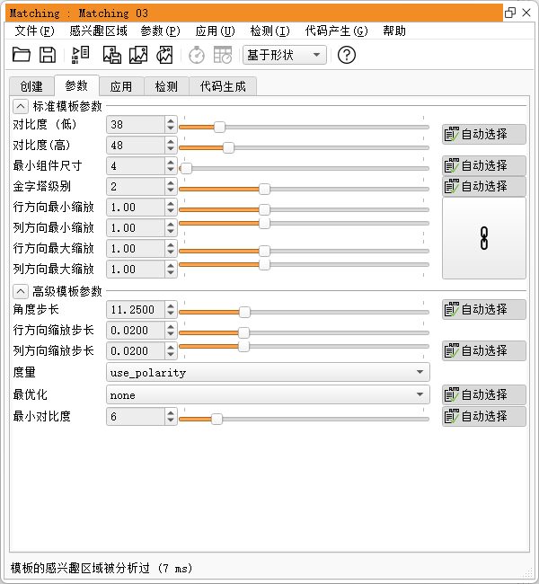

### 详细输入参数

#### 1. NumLevels（金字塔层级数）

参数`NumLevels`用于确定图像金字塔的层级数量，应尽可能选择较大的值以减少后续查找目标的时间，但需保证模型在金字塔最高层级上仍可识别且包含至少 4 个点（可通过`inspect_shape_model`验证）。

- 若生成的模型点数不足，算子会自动减少金字塔层级；若最低层级点数仍不足，返回错误。
- 设为`'auto'`（或 0，兼容旧版本）时，算子自动确定层级数，结果可通过`get_shape_model_params`查询。
- 自动层级数可能过大（导致模型不可识别，需降低`MinScore`或`Greediness`）或过小（增加查找耗时），此时需参考`inspect_shape_model`手动调整。

#### 2. AngleStart、AngleExtent、AngleStep（旋转参数）

- `AngleStart`（起始角度）和`AngleExtent`（角度范围）：确定模型可能出现的旋转角度范围，`find_shape_model`仅在此范围内查找。
- `AngleStep`（角度步长）：决定角度识别精度（非亚像素模式下），需根据目标大小调整（小目标用大步长）。

若`AngleExtent`不是`AngleStep`的整数倍，算子会自动调整`AngleStep`。为确保能返回 0.0 旋转角，若`AngleStart + n×AngleStep`无法等于 0.0，则调整`AngleStart`（减小最多`AngleStep`）和`AngleExtent`（增加`AngleStep`）。

#### 3. Optimization（优化方式）

控制模型点数的减少及是否预生成模型：

- 模型点数优化：
  - `'none'`：保留所有点。
  - `'point_reduction_low'`/`'medium'`/`'high'`：按低 / 中 / 高比例减少点数（可能需降低`find_shape_model`的`Greediness`）。
  - `'auto'`：自动决定减少比例。
- 预生成模式（可作为第二个值传入）：
  - `'pregeneration'`：完整预生成（减少运行时耗时，但增加内存和创建时间）。
  - `'no_pregeneration'`：不预生成（运行时动态变换模型，耗时略增）。
  - 未指定时，由`set_system('pregenerate_shape_models',...)`决定（默认不预生成）。

#### 4. Metric（匹配度量）

决定模型识别的对比度条件，支持单通道和多通道图像：

| 取值                       | 功能描述                                              | 适用图像                                            | 性能影响                   |
| -------------------------- | ----------------------------------------------------- | --------------------------------------------------- | -------------------------- |
| `'use_polarity'`           | 目标与模型对比度必须相同（如亮目标在暗背景上）        | 单通道（多通道仅用第一通道）                        | -                          |
| `'ignore_global_polarity'` | 允许全局对比度反转（如亮目标变为暗目标）              | 单通道（多通道仅用第一通道）                        | `find_shape_model`耗时略增 |
| `'ignore_local_polarity'`  | 允许局部对比度变化（如中等灰度区域内有亮 / 暗子区域） | 单通道（多通道仅用第一通道）                        | 耗时显著增加               |
| `'ignore_color_polarity'`  | 允许局部颜色对比度变化（如部分区域变色）              | 任意通道数（单通道等效于`'ignore_local_polarity'`） | 耗时可能显著增加           |

`'ignore_color_polarity'`支持模型与搜索图像通道数不同，通道可非光谱数据（如不同光照方向的图像）。

#### 5. Contrast（模型对比度阈值）

指定模型点需满足的对比度，影响模型特征的提取：

- 取值形式：
  - 单值：直接作为对比度阈值。
  - 两值元组：滞后阈值（下阈值、上阈值，类似`edges_image`）。
  - 三值元组：前两值为滞后阈值，第三值为最小组件尺寸（小于该值的组件被抑制，各层级阈值减半）。
- 自动模式：
  - `'auto'`：自动确定三值。
  - 可单独指定自动项（如`'auto_contrast'`仅自动计算对比度），其余值手动补充（如`['auto_min_size',20,30]`）。
- 建议：通过`determine_shape_model_params`自动计算，再用`inspect_shape_model`验证。`MinContrast`会影响自动估计结果。

#### 6. MinContrast（最小匹配对比度）

指定`find_shape_model`识别时模型需满足的最低对比度（区分模型与噪声）：

- 取值建议：设为图像噪声的灰度波动范围（如噪声波动 10 级，设为 10）。
- 多通道 +`'ignore_color_polarity'`时，需将单通道噪声乘以通道数的平方根（如 3 通道噪声 10 级，设为 17）。
- 必须小于`Contrast`；低对比度场景设小值，抗遮挡场景设为略大于噪声波动。
- `'auto'`：基于模型图像噪声自动计算（仅适用于识别时噪声相似的场景），结果可通过`get_shape_model_params`查询。

### 模型完整预生成说明

- **预生成特点**：模型在指定角度范围内预生成并存储，运行时无需变换，耗时略低，但内存和创建时间显著增加。
- **内存限制**：内存占用与角度步数和模型点数成正比，若内存不足需增大`AngleStep`或减小`AngleExtent`。
- **角度步长**：亚像素模式下，直径 < 200 像素的模型可设`AngleStep≥1`；`'auto'`（或 0）时自动计算（可通过`get_shape_model_params`查询）。
- **注意事项**：预生成模型与特定图像尺寸绑定，并行搜索不同尺寸图像需使用模型副本，否则可能崩溃。

### 图像匹配算子说明

#### `create_shape_model`

将输入图像`Template`中的模板预处理为用于匹配的形状模型，返回形状模型的句柄，后续调用`find_shape_model`（形状模型匹配算子）时需使用此句柄。

##### 参数说明

- `Template`：输入参数，模型的感兴趣区域。
- `NumLevels`：输入参数，金字塔最大层级数
- `AngleStart`：输入参数，模型最小旋转角度，弧度
-  `AngleExtent`：输入参数，旋转角度范围，最大360
- `AngleStep`：输入参数，旋转角度步长
- `Optimization`：输入参数，最优化
- `Metric`：输入参数，度量
- `Contrast`：输入参数，对比度阈值，如`[34,56]`
- `MinContrast`：输入参数，模型匹配最小对比度阈值
- `ModelID`：输出参数，形状模型句柄

#### `get_shape_model_contours`

通过形状模型句柄返回模型轮廓。

##### 参数说明：

- `ModelContours`：输出参数，形状模型的轮廓
- `ModelID`：形状模型句柄
- `Level`：要返回其轮廓表示的金字塔层级

#### `find_shape_model`

在输入图像`Image`中，查找形状模型`ModelID`的最多`NumMatches`个最佳匹配实例。

##### 参数说明：

- `Image`：输入参数，搜索模型的输入图像

- `ModelID`：输入参数，形状模型句柄

- `AngleStart`：输入参数，同`create_shape_model`，值也要相同

- `AngleExtent`：输入参数，同`create_shape_model`，值也要相同

- `MinScore`：输入参数，匹配得分的最小值。只有匹配得分大于或等于该值的结果才会被视为有效匹配。该参数用于控制匹配的严格程度。

- `NumMatches`：输入参数，最多返回的匹配实例数量。找到的高分得实例超过`NumMatches`，仅返回得分最高的`NumMatches`个；若不足，则返回实际数量（`MinScore`优先级高于`NumMatches`）。

- `MaxOverlap`：输入参数，用于限制匹配结果之间的最大重叠程度。当图像中可能存在多个部分重叠的匹配目标时，该参数可避免返回过多重叠的匹配结果。取值范围为 0 到 1，数值越低，允许的重叠程度越小。例如设置为 0.5，表示两个匹配结果之间的重叠部分不能超过 50%。

- `SubPixel`：`SubPixel`控制匹配实例的精度及是否容忍目标形变，支持两种配置维度：亚像素模式和最大形变。

  | 取值                            | 功能描述                                           | 耗时与精度                   |
  | ------------------------------- | -------------------------------------------------- | ---------------------------- |
  | `'none'`（或`'false'`）         | 仅像素级精度，角度分辨率同`create_shape_model`设置 | 最快，精度最低               |
  | `'interpolation'`（或`'true'`） | 位置与角度均亚像素级，基于得分函数插值计算         | 耗时极低，精度满足多数场景   |
  | `'least_squares'`               | 基于最小二乘法（最小化模型点与图像点距离）优化     | 耗时中等，精度高，性价比最优 |
  | `'least_squares_high'`          | 更高精度的最小二乘法                               | 耗时较高，精度更高           |
  | `'least_squares_very_high'`     | 极高精度的最小二乘法                               | 耗时最高，精度极高           |

- `NumLevels`：金字塔层级。若设为 0，使用`create_shape_model`中指定的层级数；若设为其他整数（如 3），直接使用该层级数。；格式为`[LevelMax, LevelMin]`，表示 “从 LevelMax 层级开始搜索，跟踪到 LevelMin 层级”（最低层级为 1）

- `Greediness`：搜索贪婪度。控制搜索启发式的 “激进程度”，取值 0-1：

  - `0`：安全模式，只要模型可见且参数合理，必能找到，但耗时最长。
  - `1`：快速模式，可能遗漏匹配（极少情况），但速度最快。
  - 推荐值`0.9`：兼顾速度与可靠性，几乎不会遗漏匹配。

- `Row`：输出参数，匹配实例的行坐标

- `Column`：输出参数，匹配实例的列坐标

- `Angle`：输出参数，匹配实例的旋转角度（弧度）

- `Score`：输出参数，匹配得分（普通模式）/ [匹配得分，杂波得分]（杂波模式）

#### `hom_mat2d_identity`

算子`hom_mat2d_identity`生成描述二维恒等变换的齐次变换矩阵`HomMat2DIdentity`，其数学形式为：

$\begin{bmatrix} 1 & 0 & 0 \\ 0 & 1 & 0 \\ 0 & 0 & 1 \\ \end{bmatrix}$

恒等变换的作用是保持原始点或区域的位置、角度和大小不变，即对输入的坐标或图形不产生任何改变。

在 HALCON 中，齐次矩阵以**行优先**的方式存储为元组，且由于所有描述仿射变换的齐次矩阵的最后一行均为`[0,0,1]`，因此存储时会省略最后一行。因此，`HomMat2DIdentity`在 HALCON 中表示为元组`[1,0,0,0,1,0]`。

#### `hom_mat2d_rotate`

算子`hom_mat2d_rotate`向输入的二维齐次变换矩阵`HomMat2D`中添加一个角度为`Phi`的旋转操作，并将结果矩阵存储在`HomMat2DRotate`中。

##### 参数说明

| 参数名称       | 类型     | 描述                              | 约束与默认值                                                 |
| -------------- | -------- | --------------------------------- | ------------------------------------------------------------ |
| HomMat2D       | 输入控制 | 输入的齐次变换矩阵                | 仿射或投影变换矩阵（实数数组）                               |
| Phi            | 输入控制 | 旋转角度（弧度）                  | 实数 / 整数，默认 0.78；建议值 0.1, 0.78 (≈45°), 1.57 (≈90°), 3.14 (≈180°)；范围 0≤Phi≤6.283185（≈2π） |
| Px             | 输入控制 | 固定点的 x 坐标（对应图像列坐标） | 实数 / 整数，默认 0；建议值 0,16,32,64,128 等                |
| Py             | 输入控制 | 固定点的 y 坐标（对应图像行坐标） | 实数 / 整数，默认 0；建议值 0,16,32,64,128 等                |
| HomMat2DRotate | 输出控制 | 添加旋转后的齐次变换矩阵          | 与输入矩阵类型一致（仿射或投影）                             |

#### `hom_mat2d_translate`

算子`hom_mat2d_translate`向输入的二维齐次变换矩阵`HomMat2D`中添加一个平移向量`t = (Tx, Ty)`，并将结果矩阵存储在`HomMat2DTranslate`中。

##### 参数说明

| 参数名称          | 类型     | 描述                               | 约束与默认值                                   |
| ----------------- | -------- | ---------------------------------- | ---------------------------------------------- |
| HomMat2D          | 输入控制 | 输入的齐次变换矩阵                 | 仿射或投影变换矩阵（实数数组）                 |
| Tx                | 输入控制 | x 轴方向的平移量（对应图像列方向） | 实数 / 整数，默认 64；建议值 0,16,32,64,128 等 |
| Ty                | 输入控制 | y 轴方向的平移量（对应图像行方向） | 实数 / 整数，默认 64；建议值 0,16,32,64,128 等 |
| HomMat2DTranslate | 输出控制 | 添加平移后的齐次变换矩阵           | 与输入矩阵类型一致（仿射或投影）               |

### 完整代码

```c++

* Matching 01: Obtain the model image
read_image (Image, '../Halcon素材/Floppies.jpg')
dev_close_window()
get_image_size(Image, Width, Height)
dev_open_window_fit_size(0, 0, Width, Height, -1, -1, WindowHandle)
dev_display(Image)
* 
* Matching 01: Build the ROI from basic regions
gen_rectangle2 (ModelRegion, 158.807, 298.374, rad(145.487), 16.1506, 14.1379)
* 
* Matching 01: Reduce the model template
reduce_domain (Image, ModelRegion, TemplateImage)

*创建形状模型，返回它的句柄
create_shape_model(TemplateImage, 2, rad(0), rad(360), rad(7.04), ['none','no_pregeneration'], 'use_polarity', [54,86,6], 6, ModelID)

find_shape_model(Image, ModelID, rad(0), rad(360), 0.79, 5, 0.5, 'least_squares', [2,1], 0.9, Row, Column, Angle, ModelScore)
*从形状模型句柄中提取轮廓
get_shape_model_contours (ModelContours, ModelID, 1)

for index := 0 to |ModelScore| - 1 by 1
    * 定义一个仿射变换矩阵
    hom_mat2d_identity (HomMat)
    * 旋转矩阵
    hom_mat2d_rotate(HomMat, Angle[index], 0, 0, HomMat)
    * 平移(平移的是坐标轴原点)
    hom_mat2d_translate(HomMat, Row[index], Column[index], HomMat)
    * 使用构建好的变换矩阵，实际计算模板轮廓的新坐标
    affine_trans_contour_xld(ModelContours, ContoursAffineTrans, HomMat)
endfor
* 关闭句柄
clear_shape_model(ModelID)
```

## NCC匹配

NCC匹配，全称是**归一化互相关匹配**，是一种基于灰度信息的模板匹配方法，它通过计算模板图像与待检测图像之间的归一化互相关系数来定位目标，对光照变化不敏感，在应对线性光照变化、轻微模糊或失焦、以及目标的轻微形变时表现稳健。

NCC匹配特别适合以下场景：

- 对**光照变化敏感**，尤其是线性光照变化的场景。
- 图像存在**轻微模糊**或**失焦**。
- 目标有**轻微的形变**或**复杂的纹理**。

### 示例代码

```C++
read_image(Image, '../Halcon素材/圆点.jpg')
rgb1_to_gray(Image, GrayImage)
count_channels(GrayImage, Channels)
get_image_size(GrayImage, Width, Height)
dev_close_window()
dev_open_window_fit_size (0, 0, Width, Height, -1, -1, WindowHandle)
* 控制程序执行期间是否自动将图形输出对象（如图像、区域、轮廓）显示在活动的图形窗口中
dev_update_window('off')
dev_set_draw('margin')
dev_display(GrayImage)

draw_circle(WindowHandle, Row1, Column1, Radius)
gen_circle(Circle, Row1, Column1, Radius)
* 计算输入区域的面积和中心坐标
area_center(Circle, Area, CenterY, CenterX)
* 保留感兴趣区域
reduce_domain (GrayImage, Circle, ImageReduced)

* 创建用于匹配的NCC模型
create_ncc_model (ImageReduced, 'auto', 0, 0, 'auto', 'use_polarity', ModelID)
    
* 使用阈值分割，获取中心圆
threshold(ImageReduced, Region, 0,100)
* 对圆进行膨胀
dilation_circle (Region, RegionDilation, 5.5)
* 将区域转成轮廓对象
gen_contour_region_xld(Region, Contours, 'border')
* 通过圆逼近输入的轮廓，生成一个圆
fit_circle_contour_xld (Contours, 'algebraic', -1, 0, 0, 3, 2, Row2, Column2, Radius1, StartPhi, EndPhi, PointOrder)
dev_clear_window ()
dev_display(Image)
gen_circle(Circle1, Row2, Column2, Radius1)
dev_display(Circle)
Rows := []
Columns := []

find_ncc_model(GrayImage, ModelID, 0, 0, 0.5, 5, 0.5, 'true', [4,1], Row, Column, Angle, Score)

dev_update_window('on')
for Index := 0 to |Score| - 1 by 1
    * 通过一组对应点和两个对应角度，计算出一个刚性仿射变换  ，并以齐次变换矩阵HomMat2D的形式返回。
    vector_angle_to_rigid (CenterY, CenterX, 0, Row[Index], Column[Index], 0, HomMat2D)
    * 将原始的圆形模板区域应用上述变换，使其与图像中匹配目标的位置和方向对齐
    affine_trans_region (Circle, RegionAffineTrans, HomMat2D, 'nearest_neighbor')
    dev_display(RegionAffineTrans)
    * 在匹配中心点生成一个十字形轮廓标记，其方向与匹配角度一致
    gen_cross_contour_xld(Cross, Row[Index], Column[Index], 12, Angle[Index])
    dev_set_color('white')
    gen_cross_contour_xld(Cross2, Row2, Column2, 12, Angle[Index])

endfor
stop()
clear_ncc_model (ModelID)
```

手动绘制圆的圆心不一定和目标圆的圆心位置一直，通过阈值分割获取到黑色圆这部分区域，然后通过`dilation_circle `算子，使用圆形结构对这区域进行膨胀，再通过`gen_contour_region_xld`获取这个膨胀圆的轮廓，最后通过`fit_circle_contour_xld`算子，将膨胀圆的轮廓生成一个标准圆的轮廓，并且可以获取到这个圆的圆心、半径。

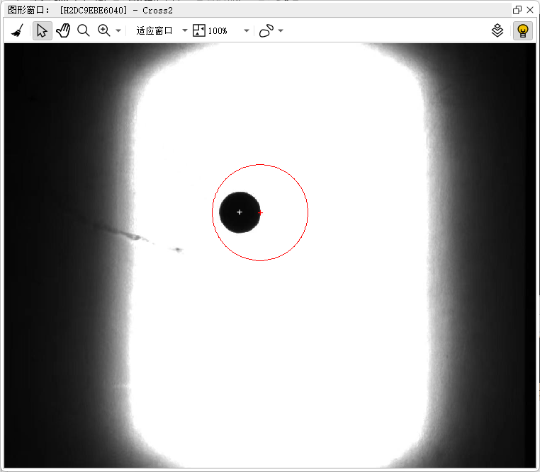

### 算子说明

#### dilation_circle

使用圆形结构元素对区域进行膨胀操作。该算子的作用效果包括：

- 使区域面积扩大；
- 使区域边界变得平滑；
- 闭合区域内部小于圆形模板的孔洞。

为避免区域发生偏移，建议将 “半径（Radius）” 参数值设置为 3.5、5.5 等非整数。因为整数半径会导致圆形的重心为非整数，最终会被舍入到相邻的整数位置，从而引发区域偏移。

##### 参数表

| 参数名称       | 类型                           | 说明                 |
| -------------- | ------------------------------ | -------------------- |
| Region         | 输入对象（region/region 数组） | 待膨胀的区域。       |
| RegionDilation | 输出对象（region/region 数组） | 膨胀后的区域。       |
| Radius         | 输入控制（实数 / 整数）        | 圆形结构元素的半径。 |

#### gen_contour_region_xld

该算子的核心作用是**将一个或多个区域（Region）转换为其边界的 XLD 轮廓（Contour）**。简单来说，它能从一个实心的区域对象中，精确地提取出构成其边缘的点序列。

##### 参数详解

**1.Mode**

Mode 为生成模式参数，可取值如下：

- center：以边界像素的中心点作为轮廓点。
- border：以边界像素的外边缘作为轮廓点。
- border_holes：除输入区域的外边缘外，还会生成所有孔洞的轮廓。

##### 参数表

| 参数名称 | 类型                   | 说明                                         |
| -------- | ---------------------- | -------------------------------------------- |
| Regions  | 输入对象（region数组） | 输入区域                                     |
| Contours | xld_cont（数组）       | 对象生成的轮廓                               |
|          | 字符串                 | 取值列表：'border'、'border_holes'、'center' |

#### fit_circle_contour_xld

fit_circle_contour_xld 算子通过圆对输入的 XLD 轮廓（Contours）进行逼近。该算子不对输入轮廓执行分割操作，因此需要确保每个输入轮廓仅对应一个圆。算子会为每个轮廓返回圆心（行坐标 Row、列坐标 Column）和半径（Radius）。

##### 参数表

| 参数名称          | 类型                             | 说明                                                       | 取值约束                                                     | 默认值      |
| ----------------- | -------------------------------- | ---------------------------------------------------------- | ------------------------------------------------------------ | ----------- |
| Contours          | 输入对象（xld_cont 数组）        | 输入的 XLD 轮廓                                            | -                                                            | -           |
| Algorithm         | 输入控制（字符串）               | 圆拟合所使用的算法                                         | 可选值：'ahuber'/'algebraic'/'atukey'/'geohuber'/'geometric'/'geotukey' | 'algebraic' |
| MaxNumPoints      | 输入控制（整数）                 | 用于计算的最大轮廓点数（-1 表示使用所有点）                | MaxNumPoints ≥ 3                                             | -1          |
| MaxClosureDist    | 输入控制（实数）                 | 判定轮廓为 “闭合” 的最大端点距离                           | MaxClosureDist ≥ 0.0                                         | 0.0         |
| ClippingEndPoints | 输入控制（整数）                 | 轮廓两端需排除的点数（不参与拟合）                         | ClippingEndPoints ≥ 0                                        | 0           |
| Iterations        | 输入控制（整数）                 | 稳健加权拟合的最大迭代次数                                 | Iterations ≥ 0                                               | 3           |
| ClippingFactor    | 输入控制（实数）                 | 用于剔除异常值的裁剪因子（典型值：休伯法 1.0，图基法 2.0） | ClippingFactor > 0                                           | 2.0         |
| Row               | 输出控制（圆中心点 Y 坐标数组）  | 拟合圆中心点的行坐标                                       | -                                                            | -           |
| Column            | 输出控制（圆中心点 X 坐标数组）  | 拟合圆中心点的列坐标                                       | -                                                            | -           |
| Radius            | 输出控制（圆半径数组）           | 拟合圆的半径                                               | -                                                            | -           |
| StartPhi          | 输出控制（角度数组，单位：弧度） | 圆弧起点的角度（单位：弧度）                               | -                                                            | -           |
| EndPhi            | 输出控制（角度数组，单位：弧度） | 圆弧终点的角度（单位：弧度）                               | -                                                            | -           |
| PointOrder        | 输出控制（字符串数组）           | 沿轮廓边界的点顺序                                         | 可选值：'negative'（负向）/'positive'（正向）                | -           |

#### `create_ncc_model`

算子`create_ncc_model`将输入图像`Template`中的模板预处理为基于归一化互相关（NCC）的匹配模型，模型的感兴趣区域（ROI）通过`Template`的定义域（domain）传入。

该模型通过多幅图像金字塔层级生成，且在每个层级上会生成多个旋转版本，最终存储在内存中。输出参数`ModelID`是该模型的句柄，后续调用`find_ncc_model`（NCC 模型匹配算子）时需使用此句柄。

##### 详细输入参数

**1.`NumLevels`（金字塔层级数）**

参数`NumLevels`用于确定图像金字塔的层级数量，应尽可能选择较大的值，因为这能显著减少后续查找目标的时间。但同时需注意，`NumLevels`的选择需保证模型在金字塔最高层级上仍可识别，且包含足够数量的点（至少 8 个），这一条件可通过`gen_gauss_pyramid`（生成高斯金字塔）输出图像的定义域来验证。

若生成的模型点数不足，算子会在内部自动减少金字塔层级，直到最高层级上的模型点数满足要求；若此过程导致模型无金字塔层级可用（即最低金字塔层级上的模型点数已过少），`create_ncc_model`会返回错误信息。

- 若将`NumLevels`设为`'auto'`（或 0），算子会自动确定金字塔层级数量，自动计算的层级数可通过`get_ncc_model_params`（获取 NCC 模型参数算子）查询。
- 极少数情况下，算子自动确定的层级数可能过大或过小：
  - 层级数过大：模型可能无法在图像中被识别，或需在`find_ncc_model`中将`MinScore`（最小匹配得分）设为极低值才能找到模型。
  - 层级数过小：`find_ncc_model`中查找模型的耗时会增加。
- 若出现上述情况，应通过`gen_gauss_pyramid`（设置`Mode = 'constant'`且`Scale = 0.5`）的输出来手动选择金字塔层级数。

**2.`AngleStart`、`AngleExtent`、`AngleStep`（旋转参数）**

- `AngleStart`（起始角度）和`AngleExtent`（角度范围）：共同确定模型在图像中可能出现的旋转角度范围，`find_ncc_model`仅能在此角度范围内查找模型。
- `AngleStep`（角度步长）：确定所选角度范围内的步长大小。若`find_ncc_model`中未指定亚像素精度，此参数直接决定角度识别精度。

`AngleStep`的选择需基于目标物体大小：较小的模型在图像中可区分的离散旋转角度较少，因此需选择较大的`AngleStep`。若`AngleExtent`不是`AngleStep`的整数倍，算子会自动调整`AngleStep`。

为确保旋转角度范围的采样不受`AngleStart`影响，算子会对旋转角度范围进行如下调整：若不存在正整数`n`使得 “`AngleStart + n×AngleStep`” 恰好等于 0.0，则将`AngleStart`减小最多`AngleStep`的数值，并将`AngleExtent`增加`AngleStep`的数值。

- 模型会针对选定的角度范围预生成并存储在内存中，内存占用与 “角度步数” 和 “模型点数” 成正比。若`AngleStep`过小或`AngleExtent`过大导致内存不足，需增大`AngleStep`或减小`AngleExtent`。
- 为避免操作系统分页导致的耗时增加，应确保模型完全存入主内存。
- 若`find_ncc_model`支持亚像素角度分辨率，对于直径小于 200 像素的模型，`AngleStep`可设为≥1。
- 若`AngleStep = 'auto'`（或 0），算子会基于模型大小自动确定合适的角度步长，结果可通过`get_ncc_model_params`查询。

**3. `Metric`（匹配度量）**

参数`Metric`用于确定模型在图像中被识别的对比度条件：

| 取值                       | 功能描述                                                     | 性能影响                           |
| -------------------------- | ------------------------------------------------------------ | ---------------------------------- |
| `'use_polarity'`           | 图像中的目标与模型必须具有**相同对比度**。例如：若模型是 “深色背景上的亮色物体”，则仅当图像中目标也是 “亮色物体” 时才能匹配 | -                                  |
| `'ignore_global_polarity'` | 允许**全局对比度反转**。例如：“深色背景上的亮色物体” 模型，也能匹配 “亮色背景上的深色物体” | `find_ncc_model`运行时间会略有增加 |

##### 参数表

| 参数名称    | 类型     | 描述                                       | 默认值           | 可选值 / 限制                                                |
| ----------- | -------- | ------------------------------------------ | ---------------- | ------------------------------------------------------------ |
| Template    | 输入对象 | 用于创建模型的输入图像（定义域为模型 ROI） | -                | 单通道图像（byte/uint2 类型）                                |
| NumLevels   | 输入控制 | 金字塔最大层级数                           | `'auto'`         | 0,1,...,10,'auto'                                            |
| AngleStart  | 输入控制 | 模型最小旋转角度（弧度）                   | -0.39            | 例如：-3.14, -1.57, 0.0 等                                   |
| AngleExtent | 输入控制 | 旋转角度范围（弧度）                       | 0.79             | 实数，需满足`AngleExtent >= 0`；例如：6.29, 3.14 等          |
| AngleStep   | 输入控制 | 旋转角度步长（弧度）                       | `'auto'`         | 实数或`'auto'`，需满足`0 <= AngleStep <= pi/16`；例如：0.0175, 0.0349 等 |
| Metric      | 输入控制 | 匹配度量方式                               | `'use_polarity'` | `'use_polarity'`, `'ignore_global_polarity'`                 |
| ModelID     | 输出控制 | NCC 模型句柄                               | -                | 句柄类型（ncc_model）                                        |

#### `find_ncc_model`

算子`find_ncc_model`在输入图像`Image`中，查找 NCC 模型`ModelID`的最多`NumMatches`个最佳匹配实例。该模型需提前通过`create_ncc_model`（创建 NCC 模型）或`read_ncc_model`（读取 NCC 模型）生成。

找到的模型实例的位置和旋转信息通过`Row`（行坐标）、`Column`（列坐标）和`Angle`（旋转角度）返回；每个实例的匹配得分通过`Score`返回。

##### 详细输入参数

**1.Image 及其定义域（搜索空间）**

图像`Image`的定义域决定了模型参考点的搜索范围，参考点为创建模型时（`create_ncc_model`）所用图像定义域（区域）的重心，通过`set_ncc_model_origin`设置的自定义原点不影响搜索空间。

- 算子仅在 “模型完全位于图像内部” 的定义域位置搜索模型，若模型超出图像边界，即使得分高于`MinScore`也无法被找到。
- 注意：由于舍入误差，匹配结果可能位于图像外部最多 0.5 像素处。

**2.AngleStart 与 AngleExtent（旋转搜索范围）**

`AngleStart`（起始角度）和`AngleExtent`（角度范围）共同确定模型的旋转搜索范围，该范围会被自动裁剪为 “创建模型时（`create_ncc_model`）指定的旋转范围”。

**3.MinScore（最小匹配得分）**

`MinScore`指定潜在匹配实例需满足的最低得分（0-1 之间），得分越高，搜索速度越快。

**4. NumMatches（最大匹配数量）**

`NumMatches`指定最多返回的匹配实例数量：

- 若找到的高分实例超过`NumMatches`，仅返回得分最高的`NumMatches`个；若不足，则返回实际数量（`MinScore`优先级高于`NumMatches`）。
- 若需返回所有得分高于`MinScore`的实例，需将`NumMatches`设为 0。

**5. MaxOverlap（最大重叠率）**

`MaxOverlap`用于处理模型对称性或重复结构导致的 “重复匹配”，取值 0-1（表示重叠比例）：

- 若两个实例的最小外接旋转矩形（见`smallest_rectangle2`）重叠率超过`MaxOverlap`，仅保留得分更高的实例；`MaxOverlap=0`表示不允许重叠，`MaxOverlap=1`表示保留所有实例。

**6.SubPixel（亚像素精度）**

`SubPixel`控制匹配实例的精度：

- `'false'`：仅像素级精度，角度分辨率同`create_ncc_model`设置。
- `'true'`：位置与角度均亚像素级，基于得分函数插值计算（耗时极低，精度高，推荐使用）。

**注意**：亚像素级精度仅在匹配实例距离 “最低使用金字塔层级的图像边界” 至少 2 像素时有效；若距离更近，即使`SubPixel='true'`，也仅返回像素级精度结果。

**7.NumLevels（金字塔层级配置）**

`NumLevels`控制搜索使用的金字塔层级，支持两种配置方式，最终层级会被裁剪为 “创建模型时指定的层级范围”。

（1）单值配置（默认）

- 若设为 0，使用`create_ncc_model`中指定的层级数；若设为其他整数（如 3），直接使用该层级数。
- 问题与解决：若自动计算的层级数过高，可能导致 “高得分实例在最高层级被误删”，此时可通过`get_ncc_model_params`查询原层级数，手动设置更小值（如原 4 级改为 3 级），兼顾速度与鲁棒性。

（2）双值配置（[最高层级，最低跟踪层级]）

- 格式为`[LevelMax, LevelMin]`，表示 “从 LevelMax 层级开始搜索，跟踪到 LevelMin 层级”（最低层级为 1）。
  - 示例：`[4,2]`表示从 4 级开始，跟踪到 2 级停止，可减少耗时，但精度会降低。
- 注意：若`LevelMin`过大，可能因高层级模型特征不足导致精度下降或误匹配，需调小`LevelMin`。

##### 详细输出参数

**1. Row、Column、Angle（位置与旋转）**

- `Row`和`Column`：模型原点在搜索图像中的坐标，经过优化以适合生成变换矩阵（用于对齐或可视化，与 HALCON 图标变换逻辑相关，见`affine_trans_pixel`）。
- `Angle`：模型实例的旋转角度（弧度）。
- 模型原点默认是 “创建模型时所用图像定义域的重心”，可通过`set_ncc_model_origin`修改。

**2.Score（匹配得分）**

##### 参数表

| 参数名称    | 类型     | 描述                                                 | 默认值   | 关键限制 / 建议值                                 |
| ----------- | -------- | ---------------------------------------------------- | -------- | ------------------------------------------------- |
| Image       | 输入对象 | 搜索模型的输入图像                                   | -        | 单通道图像（byte/uint2 类型，支持 OpenCL 设备）   |
| ModelID     | 输入控制 | NCC 模型句柄                                         | -        | 需提前通过`create_ncc_model`/`read_ncc_model`生成 |
| AngleStart  | 输入控制 | 最小旋转角度（弧度）                                 | -0.39    | -3.14, -1.57, 0.0 等                              |
| AngleExtent | 输入控制 | 旋转角度范围（弧度）                                 | 0.79     | ≥0；6.29, 3.14 等                                 |
| MinScore    | 输入控制 | 最小匹配得分                                         | 0.8      | 0≤值≤1；0.3-0.9 等                                |
| NumMatches  | 输入控制 | 最大匹配数量（0 表示全部）                           | 1        | 0,1,2,...,20 等                                   |
| MaxOverlap  | 输入控制 | 最大重叠率                                           | 0.5      | 0≤值≤1；0.0-1.0 等                                |
| SubPixel    | 输入控制 | 亚像素精度开关                                       | `'true'` | `'false'`, `'true'`                               |
| NumLevels   | 输入控制 | 金字塔层级（单值）/ [最高层级，最低跟踪层级]（双值） | 0        | 0-10                                              |
| Row         | 输出控制 | 匹配实例的行坐标                                     | -        | 实数数组                                          |
| Column      | 输出控制 | 匹配实例的列坐标                                     | -        | 实数数组                                          |
| Angle       | 输出控制 | 匹配实例的旋转角度（弧度）                           | -        | 实数数组                                          |
| Score       | 输出控制 | 匹配实例的得分                                       | -        | 实数数组（范围 [-1,1]）                           |

#### vector_angle_to_rigid

算子`vector_angle_to_rigid`通过一组对应点和两个对应角度，计算出一个**刚性仿射变换**（仅包含旋转和平移，不包含缩放或剪切），并以齐次变换矩阵`HomMat2D`的形式返回。

该变换矩阵由两部分组成：旋转矩阵`R`和平移向量`t`（相关概念可参考`hom_mat2d_rotate`旋转算子和`hom_mat2d_translate`平移算子）。

坐标与角度对应关系：

- 原始点的坐标为`(Row1, Column1)`，对应的角度为`Angle1`。
- 变换后点的坐标为`(Row2, Column2)`，对应的角度为`Angle2`。

该算子特别适用于从匹配算子（如`find_ncc_model`、`find_shape_model`等）的结果中构建刚性变换矩阵，具体包括：

- 将参考图像变换到当前图像（使用匹配得到的当前点和角度作为目标）。
- 将当前图像变换到参考图像（交换原始点和目标点的参数顺序）。

##### 参数表

| 参数名称 | 类型     | 描述                   | 数据类型             |
| -------- | -------- | ---------------------- | -------------------- |
| Row1     | 输入控制 | 原始点的行坐标         | 实数 / 整数          |
| Column1  | 输入控制 | 原始点的列坐标         | 实数 / 整数          |
| Angle1   | 输入控制 | 原始点的角度（弧度）   | 实数 / 整数          |
| Row2     | 输入控制 | 变换后点的行坐标       | 实数 / 整数          |
| Column2  | 输入控制 | 变换后点的列坐标       | 实数 / 整数          |
| Angle2   | 输入控制 | 变换后点的角度（弧度） | 实数 / 整数          |
| HomMat2D | 输出控制 | 输出的刚性变换矩阵     | 实数数组（齐次矩阵） |

#### affine_trans_region 

算子`affine_trans_region`对输入区域`Region`应用任意二维仿射变换（包括缩放、旋转、平移、倾斜 / 剪切），并将变换后的区域输出到`RegionAffineTrans`。

仿射变换由齐次变换矩阵`HomMat2D`描述，该矩阵可通过以下方式生成：

- 基础变换算子（如`hom_mat2d_identity`恒等矩阵、`hom_mat2d_scale`缩放、`hom_mat2d_rotate`旋转、`hom_mat2d_translate`平移等）组合生成。
- 匹配或变换计算算子（如`vector_angle_to_rigid`刚性变换矩阵）的输出结果。

##### 关键参数说明

**1. Interpolate（插值方式）**

控制变换过程中是否使用插值，影响区域边界的平滑度和运算效率：

- `'nearest_neighbor'`（最近邻插值）：直接采用最邻近像素的属性，速度快，边界可能有锯齿。
- `'constant'`（常量插值）：对区域外的像素使用常量填充，效果与最近邻类似，但实现方式不同。

**特点**：插值可使放大后的区域边界更平滑，但会显著增加运行时间。

**2. HomMat2D（变换矩阵）**

输入的齐次变换矩阵，需为仿射变换矩阵（非投影变换），否则算子会异常。

##### 注意事项

**1.变换的不可逆性**

由于旋转、缩放过程中存在裁剪和离散化处理，`affine_trans_region`的变换通常是不可逆的。

**2.坐标系统差异**

该算子不使用 HALCON 标准坐标系统（原点在左上角像素中心），而是采用与`affine_trans_pixel`一致的坐标系统：**原点在左上角像素的左上角**。

这可能导致基于区域坐标（如`area_center`计算的重心）创建的变换出现偏差。例如，对旋转对称区域绕其重心旋转后，结果可能偏离预期位置。

##### 参数表

| 参数名称          | 类型     | 描述                     | 约束与默认值                                                 |
| ----------------- | -------- | ------------------------ | ------------------------------------------------------------ |
| Region            | 输入对象 | 待变换的区域（可多区域） | 区域数组                                                     |
| RegionAffineTrans | 输出对象 | 变换后的区域             | 与输入区域数量相同                                           |
| HomMat2D          | 输入控制 | 仿射变换矩阵             | 齐次矩阵（实数数组）                                         |
| Interpolate       | 输入控制 | 插值方式                 | 默认`'nearest_neighbor'`；可选`'constant'`、`'nearest_neighbor'` |

#### gen_cross_contour_xld

算子`gen_cross_contour_xld`为每个输入点`(Row, Col)`生成一个十字形的 XLD 轮廓（交叉线轮廓），并将结果存储在`Cross`中。

##### 参数表

| 参数名称 | 类型     | 描述                              | 约束与默认值                                                 |
| -------- | -------- | --------------------------------- | ------------------------------------------------------------ |
| Cross    | 输出对象 | 生成的十字形 XLD 轮廓（可多轮廓） | XLD 轮廓数组，数量与输入点一致                               |
| Row      | 输入控制 | 输入点的行坐标（可多值）          | 实数 / 整数数组                                              |
| Col      | 输入控制 | 输入点的列坐标（可多值）          | 实数 / 整数数组，需满足`number(Col) == number(Row)`（与行坐标数量一致） |
| Size     | 输入控制 | 十字线段的长度                    | 实数 / 整数，默认 6.0；建议值 4.0, 6.0, 8.0, 10.0；需满足`Size >= 0.0` |
| Angle    | 输入控制 | 十字的朝向（弧度）                | 实数，默认 0.785398（约 45 度）；建议值 0.0（水平垂直）、0.785398（45 度倾斜） |

## 缩放匹配

### 示例代码

```c++
read_image (ModelImage, '../Halcon素材/ringsAndNuts.png')
* 返回指定图像的当一个通道数据的指针
get_image_pointer1(ModelImage, Pointer, Type, Width, Height)

dev_close_window()
dev_open_window(0, 0, Width, Height, 'white', WindowHandle)
* 设置在图形窗口中显示的图像区域
dev_set_part(0, 0, Height - 1, Width - 1)
dev_display(ModelImage)

dev_set_color('cyan')
dev_set_draw('margin')
dev_set_line_width (2)

set_display_font(WindowHandle, 16, 'mono', 'true', 'false')
* 用于在右下角提示用户点击 “运行” 按钮或按 F5 键以继续执行程序
disp_continue_message(WindowHandle, 'black', 'true')

* 大圆圆心于半径
Row := 324
Column := 279
Radius := 60

gen_circle(ROI1, Row, Column, Radius)
gen_circle(ROI2,Row,Column,0.5 * Radius)
difference(ROI1, ROI2, ModelROI)
dev_display(ModelImage)
dev_display(ModelROI)

* 上下箭头的坐标
RowUpperPoint := 282
ColUpperPoint := 278
RowLowerPoint := 364
ColLowerPoint := 278

area_center(ModelROI, Area, CenterROIRow, CenterROIColumn)

* 箭头相对圆心的坐标
RowUpperPointRef := RowUpperPoint - CenterROIRow
ColumnUpperPointRef := ColUpperPoint - CenterROIColumn
RowLowerPointRef := RowLowerPoint - CenterROIRow
ColumnLowerPointRef := ColLowerPoint - CenterROIColumn

* 显示箭头
disp_arrow(WindowHandle, RowUpperPoint  - 25, ColUpperPoint, RowUpperPoint, ColUpperPoint, 2)
disp_arrow(WindowHandle, RowLowerPoint  + 25, ColLowerPoint, RowLowerPoint, ColLowerPoint, 2)

reduce_domain(ModelImage, ModelROI, ImageReduced)
* 创建一个形状模型的可视化表示
inspect_shape_model(ImageReduced, ShapeModelImage, ModelRegions, 1, 30)

dev_clear_window ()
dev_display(ShapeModelImage)

create_scaled_shape_model(ShapeModelImage, 'auto', -rad(30), rad(60), 'auto', 0.6, 1.4, 'auto', 'none', 'use_polarity', 60, 10, ModelID)

get_shape_model_contours(ShapeModel, ModelID, 1)

copy_image(ModelImage, SearchImage)

find_scaled_shape_model(SearchImage, ModelID, -rad(30),rad(60), 0.6, 1.4, 0.65, 0, 0, 'least_squares', 0, 0.8, RowCheck, ColumnCheck, AngleCheck, ScaleCheck, ScoreCheck)

for i := 0 to |ScoreCheck| - 1 by 1
    vector_angle_to_rigid(0,0,0, RowCheck[i], ColumnCheck[i], AngleCheck[i], MovementOfObject)
    hom_mat2d_scale(MovementOfObject, ScaleCheck[i],ScaleCheck[i],RowCheck[i],ColumnCheck[i],MoveAndScalingOfObject)
   
    affine_trans_contour_xld (ShapeModel, MoveAtNewPosition, MoveAndScalingOfObject)
    * 对像素坐标应用任意二维仿射变换。
    affine_trans_pixel(MoveAndScalingOfObject, RowUpperPointRef, ColumnUpperPointRef, RowUpperPointCheck, ColUpperPointCheck)
    affine_trans_pixel(MoveAndScalingOfObject, RowLowerPointRef, ColumnLowerPointRef, RowLowerPointCheck, ColLowerPointCheck)
    
    disp_arrow (WindowHandle, RowUpperPointCheck - 25 * cos(AngleCheck[i]), ColUpperPointCheck - 25 * sin(AngleCheck[i]), RowUpperPointCheck, ColUpperPointCheck, 2)
    disp_arrow (WindowHandle, RowLowerPointCheck + 25 * cos(AngleCheck[i]), ColLowerPointCheck + 25 * sin(AngleCheck[i]), RowLowerPointCheck, ColLowerPointCheck, 2)
endfor
```

### 算子介绍

#### inspect_shape_model

inspect_shape_model 算子用于创建形状模型的表示形式。该算子的核心价值在于，能快速、便捷地确定后续在 `create_shape_model`、`create_scaled_shape_model` 或 `create_aniso_shape_model` 算子中需使用的 **金字塔层数（NumLevels）** 和 **对比度（Contrast）** 这两个关键参数。

形状模型的表示形式会在多个图像金字塔层级上创建，层级数量由 `NumLevels` 决定。与上述三个创建形状模型的算子不同，`inspect_shape_model` 仅针对输入图像中目标物体的**原始姿态（旋转角度为 0°、缩放比例为 1）** 创建模型，而非生成多姿态的模型库。

##### 参数表

| 参数名称     | 类型                        | 说明                                                         | 取值约束与默认值                                             |
| ------------ | --------------------------- | ------------------------------------------------------------ | ------------------------------------------------------------ |
| Image        | 输入对象（多通道图像）      | 用于创建形状模型的输入图像                                   | 数据类型支持：byte（8 位无符号整数）、uint2（16 位无符号整数） |
| ModelImages  | 输出对象（多通道图像数组）  | 输入图像对应的图像金字塔 —— 存储各层级的模型图像             | 数据类型与输入图像 `Image` 一致                              |
| ModelRegions | 输出对象（区域数组）        | 各金字塔层级对应的模型区域 —— 每个区域代表对应层级的形状模型 | -                                                            |
| NumLevels    | 输入控制（整数）            | 图像金字塔的层级数量                                         | 默认值：4；可选值：1、2、3、4、5、6、7、8、9、10             |
| Contrast     | 输入控制（数值 / 数值数组） | 图像中目标物体对比度的阈值（或滞后阈值），可选包含模型组件的最小尺寸阈值 | 默认值：30；建议值：10、20、30、40、60、80、100、120、140、160；数据类型为整数 |

---

在NCC匹配中，`vector_angle_to_rigid`算子传入的坐标是感兴趣区域的中心坐标，而缩放匹配传入的是原点的坐标，这是因为在缩放匹配代码中，`get_shape_model_contours`算子返回的模型轮廓中心在坐标原点；而NCC匹配中的模板是图像中有的一个实际位置。

# 视觉测量

## 九点标定法

`../Halcon代码/9点标定法.hdev`

#### 算子说明

##### affine_trans_point_2d 

affine_trans_point_2d 会对输入坐标点（Px, Py）应用任意二维仿射变换，包括缩放、旋转、平移和倾斜（扭曲），并在（Qx, Qy）中返回变换后的坐标点。

| 参数名称 | 类型     | 说明                | 取值约束与默认值 |
| -------- | -------- | ------------------- | ---------------- |
| HomMat2d | 输入控制 | 输入的变换矩阵      |                  |
| Px       | 输入控制 | 输入坐标点的x坐标   | 数组             |
| Py       | 输入控制 | 输入左边点的y坐标   | 数组             |
| Qx       | 输出控制 | 输出坐标点的 x 坐标 | 数组             |
| Qy       | 输出控制 | 输出坐标点的 y 坐标 | 数组             |

## Measure使用

在助手中打开新的Measure

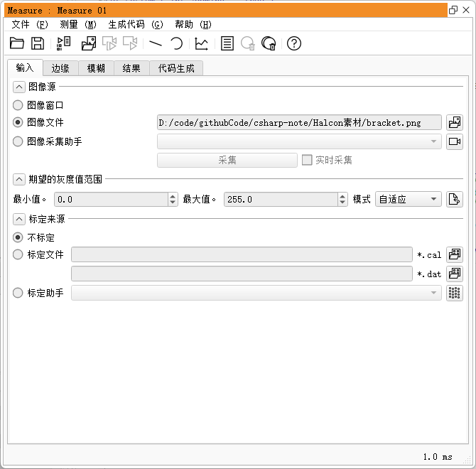

点击图像文件选择图片，读取图片如下：

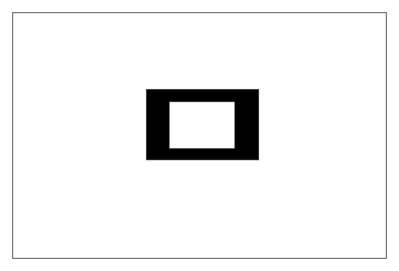

点击测量，选择绘制线段

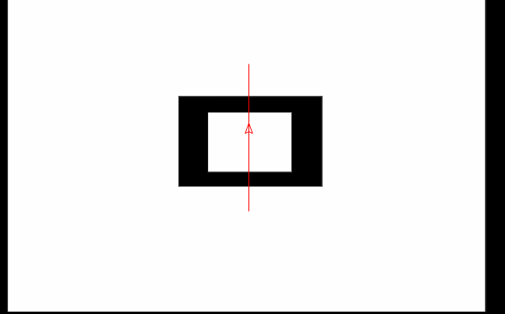

绘制的线条是有方向的，它表示边缘变化的方向（白到黑）；右键确认，点击边缘

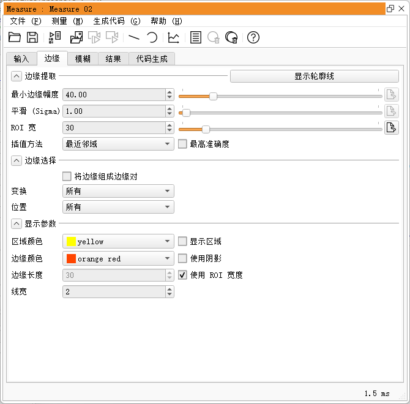

点击显示轮廓线，可以看到边缘的变化过程：

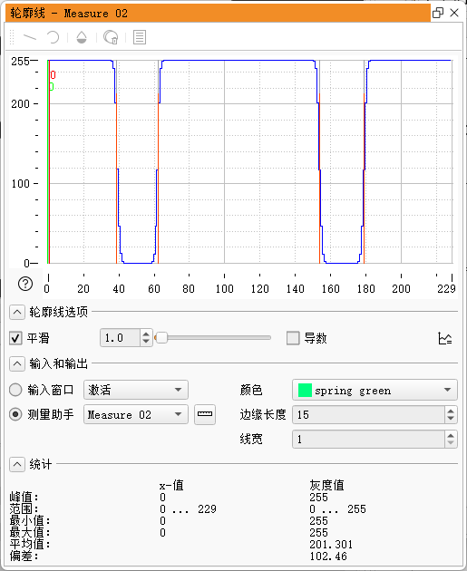

### 边缘提取参数介绍

**1.最小边缘幅度**

这个幅度值量化了该点灰度变化的剧烈程度，只有幅度值**高于**这个阈值的边缘点才会被最终确认为有效边缘。**值越大**，只找对比度非常强烈的边缘，抗噪性好，但可能漏掉弱边缘。**值越小**，能找到更多边缘，但也更容易受噪声干扰

如从白到黑，像素的灰度值上升或下降了40，这个部分就可以作为边缘。

**2.平滑（Sigma）**

**【抗噪声与平滑度】**控制对图像数据的平滑程度。**值越大**，平滑效果越强，能有效抑制噪声，但也可能使边缘位置轻微模糊。**值越小**，保留的细节越多，边缘定位更尖锐，但对噪声更敏感。

**3.ROI宽**

**【搜索范围】** 这定义了每条“法线”（搜索线）的**长度**（以像素为单位）。测量助手会在ROI内生成一系列垂直于长边的法线，算法沿着这些法线搜索边缘。这个宽度需要设置得足够宽，以确保能完整覆盖到边缘的过渡区域。

**4.插值方法**

**【像素灰度值估算方法】** 当在法线上采样点时，由于边缘可能位于像素之间，需要通过插值来估算亚像素位置的灰度值。**`最近邻域`** 速度最快，但精度最低，它直接取最邻近像素的灰度值。**`双线性`** 是精度和速度的良好平衡，通常为首选。**`最高准确度`** 勾选后使用双三次插值，精度最高但速度最慢。

**5.将边缘组成边缘对**

“边缘组成边缘对”就是将两个极性相反、位置相邻的边缘点配对成一个逻辑单元。优点：

一是能直接测量物体宽度（通过IntraDistance参数）；

二是提高抗干扰能力（避免误检单一边缘）；

三是能区分相邻物体（通过InterDistance参数）。

**6.变换（Translate，边缘极性）**

定义要寻找的边缘类型，即灰度值变化的方向。可选值：

- all：不区分方向，找出所有边缘。
- positive：**正向边缘**，指从**暗到亮**（黑到白）的过渡。
- negative：**负向边缘**，指从**亮到暗**（白到黑）的过渡。

**7.位置（Select）**

当在同一条测量法线上找到多个符合条件的边缘时，**选择哪一个**作为输出结果。可选值：

- all：**全部**，输出所有找到的边缘点。适用于需要分析整个边缘分布的场景。
- first：第一个，选择从测量矩形**起始边**开始，**第一个遇到**的边缘。
- last：最后一个，选择从测量矩形起始边开始，**最后一个遇到**的边缘。

### 边缘测量结果

在边缘窗口中勾选了**将边缘组成边缘对**显示结果

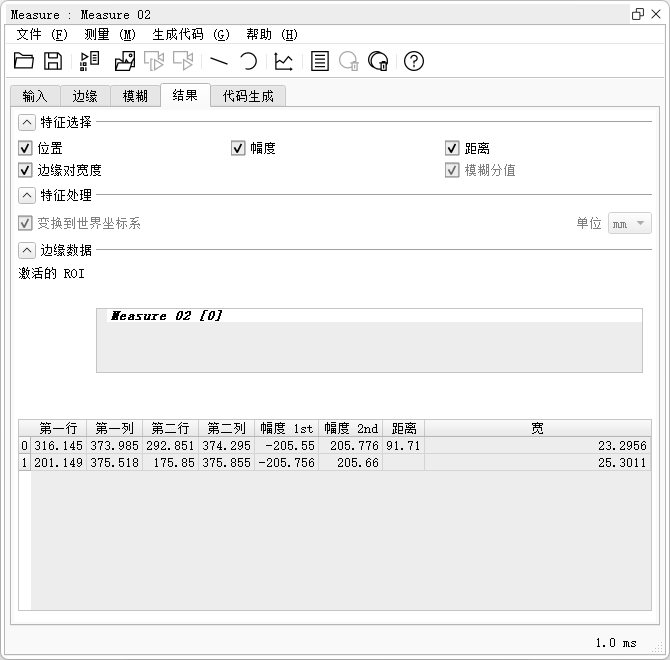

不勾选

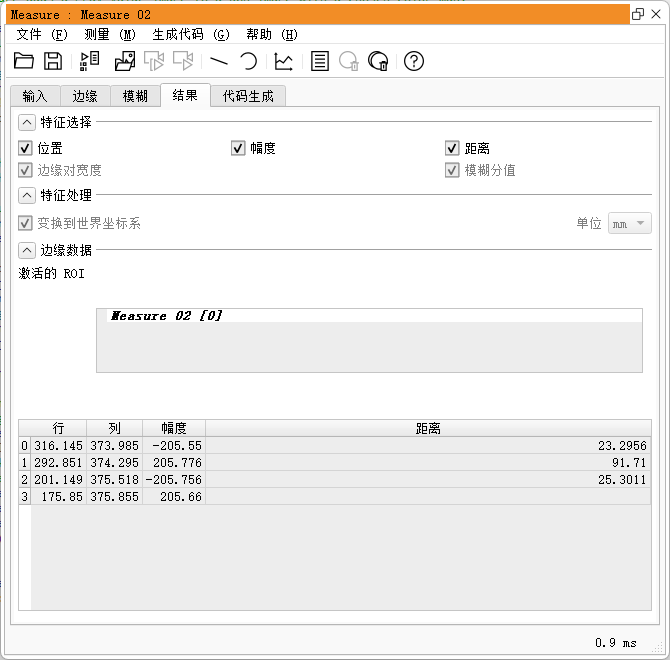

这里的行列坐标是法线的中心点坐标，即法线与测量线的交点；

幅度是灰度变化的值；距离指的是两个点之间的距离；宽指的是同一组边缘线的宽度。

### 代码示例

`边缘测量.hdev`


### 算子说明

#### gen_measure_rectangle2

用于准备提取与矩形主轴垂直的直边缘。返回测量对象的句柄。

**注意事项**

1. 使用双线性或双三次插值时，不仅测量矩形本身，矩形周围的边距也必须完全位于图像内。边距宽度（四个方向均需满足）要求：双线性插值至少 1 个像素，双三次插值至少 2 个像素。对于不满足该条件的投影线，无法计算灰度值，因此也无法在这些位置提取边缘。
2. 需注意，矩形的中心坐标会在内部进行取整处理，确保中心落在像素网格上。此操作是为了保证一致性。

##### 参数表

| 参数名称      | 控制类型 | 数据类型       | 说明                                                         |
| ------------- | -------- | -------------- | ------------------------------------------------------------ |
| Row           | 输入控制 | real / integer | 矩形中心的行坐标。默认值：300.0；建议值：10.0、20.0 等；取值范围：0.0 ≤ Row ≤ 511.0；最小增量：1.0；推荐增量：10.0 |
| Column        | 输入控制 | real / integer | 矩形中心的列坐标。默认值：200.0；建议值：10.0、20.0 等；取值范围：0.0 ≤ Column ≤ 511.0；最小增量：1.0；推荐增量：10.0 |
| Phi           | 输入控制 | real / integer | 矩形纵轴与水平线的夹角（单位：弧度）。默认值：0.0；建议值：-1.178097、-0.785398 等；取值范围：无限制；最小增量：0.001；推荐增量：0.1 |
| Length1       | 输入控制 | real / integer | 矩形的半宽度。默认值：100.0；建议值：3.0、5.0 等；取值范围：1.0 ≤ Length1；最小增量：1.0；推荐增量：10.0 |
| Length2       | 输入控制 | real / integer | 矩形的半高度。默认值：20.0；建议值：1.0、2.0 等；取值范围：0.0 ≤ Length2；最小增量：1.0；推荐增量：10.0 |
| Width         | 输入控制 | integer        | 后续待处理图像的宽度。默认值：512；建议值：128、160 等；取值范围：0 ≤ Width；最小增量：1；推荐增量：16 |
| Height        | 输入控制 | integer        | 后续待处理图像的高度。默认值：512；建议值：120、128 等；取值范围：0 ≤ Height；最小增量：1；推荐增量：16 |
| Interpolation | 输入控制 | string         | 所用插值类型。默认值：'nearest_neighbor'；可选值：'bicubic'、'bilinear'、'nearest_neighbor' |
| MeasureHandle | 输出控制 | handle         | 测量对象句柄                                                 |

#### measure_pos 

提取那些与矩形或环形弧的**主轴**垂直的直边缘。

提取到的边缘以位于矩形或弧的主轴上的单点形式，在 `RowEdge` 和 `ColumnEdge` 中返回其中心的行和列坐标。对应的边缘幅度在 `Amplitude` 中返回。此外，连续边缘点之间的距离在 `Distance` 中返回。

##### 注意

`measure_pos` 只有在满足 “边缘是直的” 且 “边缘与矩形或弧的主轴垂直” 这两个假设时，才能返回有意义的结果。因此，例如，它不应用于从弯曲物体上提取边缘。此外，用户应确保矩形或弧尽可能接近与图像中的边缘垂直。另外，`Sigma` 的值不应大于大约 `0.5 * Length1`

| 参数名        | 控制类型 | 数据类型          | 说明                                                         |
| ------------- | -------- | ----------------- | ------------------------------------------------------------ |
| Image         | 输入控制 | byte /uint2 /real | 输入图像                                                     |
| MeasureHandle | 输入控制 | handle            | 测量对象句柄                                                 |
|               | 输入控制 | real              | 高斯平滑的标准差                                             |
| threshold     | 输入控制 | real              | 最小边缘幅度                                                 |
| Transition    | 输入控制 | string            | 定义要寻找的边缘类型，即灰度值变化的方向；可选值：all（找出所有边缘）、positive（由暗到亮）、negative（由亮到暗） |
| Select        | 输入控制 | string            | 当在同一条测量法线上找到多个符合条件的边缘时，**选择哪一个**作为输出结果；可选值：all（所有）、first（第一条）、last（最后一条） |
| RowEdge       | 输出控制 | array/real        | 边缘中心点的行坐标                                           |
| Column        | 输出控制 | array/real        | 边缘中心点的列坐标                                           |
| Amplitude     | 输出控制 | array/real        | 边缘的幅度                                                   |
| Distance      | 输出控制 | array/real        | 连续边缘之间的距离                                           |

#### measure_pairs 

用于提取与矩形或环形弧主轴垂直的直边缘对。

measure_pairs 的提取算法与 measure_pos 完全相同，额外增加了将边缘分组为边缘对的步骤，具体规则如下：

- 若 Transition = 'positive'（正过渡），则沿矩形主轴方向呈 “暗到亮” 过渡的边缘点，会在 RowEdgeFirst（第一边缘行坐标）和 ColumnEdgeFirst（第一边缘列坐标）中返回；对应的 “亮到暗” 过渡边缘，会在 RowEdgeSecond（第二边缘行坐标）和 ColumnEdgeSecond（第二边缘列坐标）中返回。
- 若 Transition = 'negative'（负过渡），则上述边缘返回规则完全相反。
- 若 Transition = 'all'（所有过渡），则首个检测到的边缘会定义 RowEdgeFirst 和 ColumnEdgeFirst 的过渡类型。即根据测量对象的位置，会返回 “亮 - 暗 - 亮” 过渡的边缘对，或 “暗 - 亮 - 暗” 过渡的边缘对。这种模式适用于测量与背景亮度不同的物体。

若检测到多个连续且过渡类型相同的边缘，仅会将首个边缘作为边缘对的组成部分。

##### 参数表

| 参数名称         | 控制类型 | 数据类型                                           | 说明                                                         |
| ---------------- | -------- | -------------------------------------------------- | ------------------------------------------------------------ |
| Image            | 输入对象 | singlechannelimage → object（byte / uint2 / real） | 输入图像                                                     |
| MeasureHandle    | 输入控制 | measure →（handle）                                | 测量对象句柄                                                 |
| Sigma            | 输入控制 | number →（real）                                   | 高斯平滑的标准差默认值：1.0建议值：0.4、0.6、0.8、1.0、1.5、2.0、3.0、4.0、5.0、7.0、10.0取值范围：0.4 ≤ Sigma ≤ 100（线性刻度）最小增量：0.01推荐增量：0.1 |
| Threshold        | 输入控制 | number →（real）                                   | 最小边缘幅度默认值：30.0建议值：5.0、10.0、20.0、30.0、40.0、50.0、60.0、70.0、90.0、110.0取值范围：1 ≤ Threshold ≤ 255（线性刻度）最小增量：0.5推荐增量：2 |
| Transition       | 输入控制 | string →（string）                                 | 用于确定边缘如何分组为边缘对的灰度过渡类型默认值：'all'可选值：'all'、'all_strongest'、'negative'、'negative_strongest'、'positive'、'positive_strongest' |
| Select           | 输入控制 | string →（string）                                 | 边缘对的选择方式默认值：'all'可选值：'all'、'first'、'last'  |
| RowEdgeFirst     | 输出控制 | point.y-array →（real）                            | 第一边缘中心的行坐标                                         |
| ColumnEdgeFirst  | 输出控制 | point.x-array →（real）                            | 第一边缘中心的列坐标                                         |
| AmplitudeFirst   | 输出控制 | real-array →（real）                               | 第一边缘的幅度（带符号）                                     |
| RowEdgeSecond    | 输出控制 | point.y-array →（real）                            | 第二边缘中心的行坐标                                         |
| ColumnEdgeSecond | 输出控制 | point.x-array →（real）                            | 第二边缘中心的列坐标                                         |
| AmplitudeSecond  | 输出控制 | real-array →（real）                               | 第二边缘的幅度（带符号）                                     |
| IntraDistance    | 输出控制 | real-array →（real）                               | 同一边缘对中两条边缘的间距                                   |
| InterDistance    | 输出控制 | real-array →（real）                               | 连续两个边缘对之间的间距                                     |

