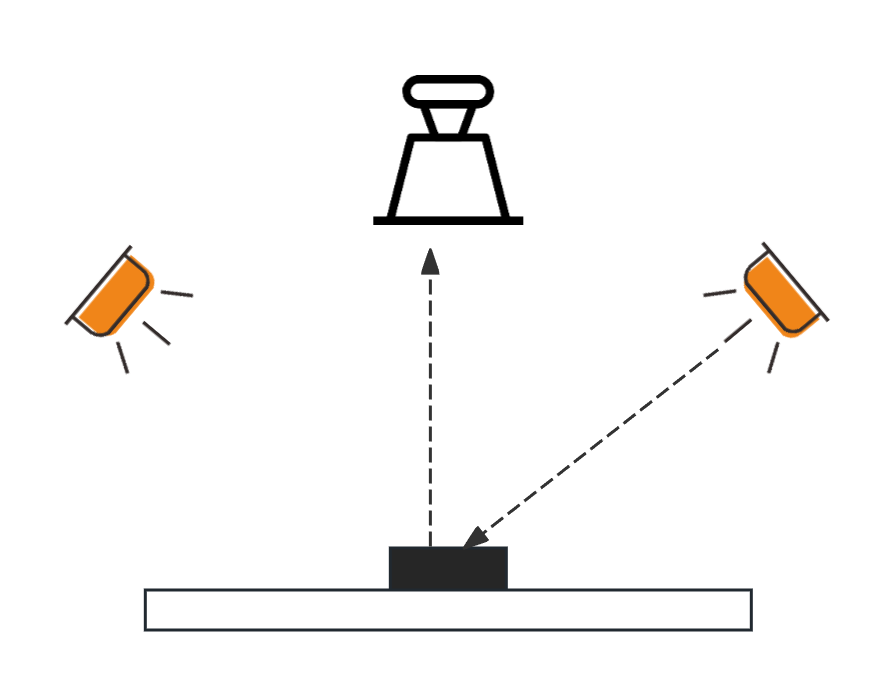

# 视觉系统

## 视觉相同组成

一个典型的机器视觉相同包括以下五大块：

- **照明（光源）**

  照明是影响机器视觉系统输入的重要因素，直接影响输入数据的质量和应用效果。由于没有通用的机器视觉照明设备，所以针对每个特定的应用实例，要选择相应的照明装置，以达到最佳效果。

- **镜头**

  镜头的基本功能就是实现光束变换（调制），在机器视觉系统中，镜头的主要作用是将成像目标在图像传感器的光敏面上。镜头的质量直接影响到机器视觉系统的整体性能，合理地选择和安装镜头，是机器视觉系统设计的重要环节。

- **相机**

  按照不同标准可分为：标准分辨率数字相机和模拟相机等。要根据不同的实际应用场合选不同的相机和高分辨率相机：扫描CCD和面阵（拍照）CCD；单色相机和彩色相机，CMOS相机

- 图像采集卡：图像采集卡只是完整的机器视觉系统的一个部件，图像采集卡直接决定了摄像头的接口：黑色、彩色、模拟、数字等

- **软件相应开发模块**

影响视觉的因素：

- 高相同精度。控制因素：视野、相机分辨率
- 清晰成像。控制因素：镜头、灯源
- 避免畸形。控制因素：镜头、系统标定
- 保持待测物体在成像中大小一直，控制因素：视野、拍照角度、待测物位置
- 反差最大化。控制因素：灯源
- 恰当的照明与曝光。控制因素：灯源、镜头

## 部件一：光源

选择光源的目的就是：

1. 增强待处理的物体特征；
2. 减弱不需要关注的物体和噪声的干扰；
3. 不会引入额外的干扰

以获取高品质、高对比度的图像。

### 光源类型

常见的光源类型主要根据光路照射角度以及反射方式区分：

被光源、四面可调光源、同轴光源、条形光源、原定无影光源、点光源、AOI设备专用光源、环形光源

#### 1.被光源

被测物在相机与光源之间，光源在物体后面，可以获得高清晰的轮廓，常用于物体外形检测、尺寸检测等。

检测范围：

1. 外形轮廓测量
2. 加工尺寸测量
3. 玻璃瓶破损、异物检查
4. 透明物体表面划痕、污渍或内部异物、破损等检测

#### 2.同轴光

LED的高强度均匀光线通过半镜面后成为与镜头同轴的光。具有特殊涂层的半镜面可以抑制反光和消除图像中的重影，特别适合检测镜面物体上的划痕。

检测范围：

1. 检测晶片上的激光标注
2. 检测金属表面、轴承、饮料瓶上刻印字符
3. 检测金属、玻璃瓶上印刷的二维码


#### 3.高角度环形光源

照明方式的有点是亮度大、灵活、容易适应包装要求；缺点是：阴影和反光；常见应用是：检查平面和有纹理的表面。

检测范围：

1. IC等半导体产品外观字符检测
2. PCB电路基板与元件检测
3. 产品包装外观、标签检测
4. 药片破损、缺片检测



#### 4.低角度环形光源

低角度方式下，光源以解决180角度照明物体，容易突出被检测物的边缘和高度变化。这种照明方式的优点是凸显表面结构，增强图像的拓扑结构，缺点是热点和极度阴影，常见的应用是检测平面和有纹理的表面

检测范围：

1. 边缘特征提取


#### 5.条形光

条形方式常用的是LED条形光源，条形方式除具备高亮度的优点外，其安装角度还可以按照需要进行调节。通过调节光线角度和方向，可以检测到被测物表面是否有光泽，是否有纹路，也可以检测到表面特征

检测范围：

1. 检测包装破损
2. 检测LCD字符，定位标记，液晶元件
3. 检测膨胀胶片破损，伸展胶片破损，遮蔽胶带破损
4. 检测连接器引脚平整度
5. 检测大面积物体表面划痕

## 部件二：镜头

工业相机和接口必须匹配。常见的标准包括C口和CS接口。两者螺纹相同，但法兰距（镜头安装基准面到传感器成像面的距离）不同，C接口是17.526mm，CS接口是12.5mm。混用时可能需要转接环 


#### 镜头基本参数

1、视野(FOV)
图像采集设备所能够覆盖的范围，它可以是在监视器上可以见到的范围，也可以使设备所输出的数字图像所能覆盖的最大范围。

2、最大/最小工作距离(Work Distance)

从物镜到被检测物体的距离的范围，小于最小工作距离大于最大工作距离系统均不能正确成像。

3、景深(Depth Of Field)
在某个调焦位置上，景深内的物体都可以清晰成像。

4、畸变
几何畸变指的是由于镜头方面的原因导致的图像范围内不同位置上的放大率存在的差异。几何畸变主要包括径向畸变和切向畸变。如枕形或桶形失真。

5、镜头接口
(1)C-MOUNT镜头的标准接口之一，镜头的接口螺纹参数:

​	公称直径:1

​	螺距:32牙

(2)CS-Mount是C-Mount的一个变种，区别仅仅在于镜头定位面到图像传感器光敏面的距离的不同，C-Mount是17.5mm，CS-Mount是12.5mm。

(3)C/CS能够匹配的最大的图像传感器的尺寸不超过1

6、成像面
可以在镜头的像面上清晰成像的物方平面

7、光圈与F值
光圈是一个用来控制镜头通光量装置，它通常是在镜头内。表达光圈大小我们是用F值，如f1.4，f2，f2.8etc。
8、焦距焦距是像方主面到像方焦点的距离。如16mm，25mm

#### 镜头参数关系

1、工作距离、焦距
工作距离和焦距往往结合起来考虑。一般地，可以采用这个思路:先明确系统的分辨率，结合CCD像素尺寸就能知道放大倍率，再结合空间结构约束就能知道大概的物像距离，进一步估算工业镜头的焦距。所以工业镜头的焦距是和工业镜头的工作距离、系统分辨率(及CCD像素尺寸)相关的。

2、特殊要求优先考虑

结合实际的应用特点，可能会有特殊的要求，应该先予明确下来。例如是否有测量功能，是否需要使用远心镜头，成像的景深是否很大等等。景深往往不被重视，但是它却是任何成像系统都必须考虑的。

3、变焦与否

工业镜头是否需要变焦先确定下来的，成像过程中需要改变放大率的应用，采用变焦镜头，否则采用定焦镜头就可以了

4、成像畸变要小

##### 景深和光圈的关系(Linking Depth of Field and Aperture)

景深和光圈的大小有直接关系，光圈越大，景深越短，光图越小，景深越长。这个原因很容易理解。如果光圈小到针孔左右，能够通过的光线全部都是近轴光，有没有镜头都没有关系了，实际上形成了一个针孔像机，景深是无穷大，不管景物远近成象都是清晰的；随着光圈增大，远轴光开始起作用，只有一定范围内的光线能够清晰成像，光圈放大到F3.4 时，大约景深只有几毫米了。

##### 景深和焦距的关系(Linking Depth of Field and Focal Length)

焦距越大，景深越短，反之亦然。例如，f=80mm 的镜头的景深很短，而35mm 焦距的镜头景深较长。从几何成像的基本公式可以看出，如果镜头的焦距很短，物距大到一定范围时，像距近似等于焦距，也就是说，一定距离以外的物体成像都在焦平面附近，10m 远的物体和100m 远的物体成像的位置是一样的，景深很长。而焦距较大时，这个结论不能成立，只有在一定范围内，物体才能清晰成像，所以景深焦短。

#### 镜头主要参数

1.焦距(Focal Length)
焦距是从镜头的中心点到胶平面上所形成的清晰影像之间的距离。焦距的大小决定着视角的大小，焦距数值小，视角大，所观察的范围也大;焦距数值大，视角小，观察范围小。根据焦距能否调节可分为定焦镜头和变焦镜头两大类。

2.光圏(Iris)
用F表示，以镜头焦距f和通光孔径D的比值来衡量。每个镜头上都标有最大F值,例如 8mm /F1.4代表最大孔径为 5.7毫米F 值越小，光圈越大，F 值越大，光圈越小。

3.对应最大 CCD 尺寸(Sensor Size)

镜头成像直径可覆盖的最大 CCD 芯片尺寸。主要有:1/2”、2/3”、1”和 1”以上。

4 接口(Mount)
镜头与相机的连接方式。常用的包括C、CS、F、V、T2、Leica、、M42x1、M75x0.75 等。

5.景深(Depth of Field, DOF)
景深是指在被摄物体聚焦清楚后，在物体前后一定距离内，其影像仍然清晰的范围。景深随镜头的光圈值、焦距、拍摄距离而变化。光圈越大，景深越小;光圈越小、景深越大。焦距越长，景深越小;

焦距越短，景深越大。距离拍摄体越近时，景深越小;距离拍摄体越远时，景深越大

6.分辨率(Resolution)
分辨率代表镜头记录物体细节的能力，以每毫米里面能够分辨黑白对线的数量为计量单位:“线对/毫米”(1p/mm)。分辨率越高的镜头成像越清晰。

7.工作距离（Working distance，WD）

镜头第一个工作面到被测物体的距离

8.视野范围（Field of View，FOV）

相机实际拍到区域的尺寸

9.光学放大倍数（Magnification，β）

CCD/FOV，即芯片尺寸除以视野范围

10、数值孔径(Numerical Aperture, NA)

数值孔径等于由物体与物镜间媒质的折射率n与物镜孔径角的一半(a\2)的正弦值的乘积，计算公式为N.A=n*sin a/2。数值孔径与其它光学参数有着密切的关系，它与分辨率成正比，与放大率成正比。也就是说数值孔径，直接决定了镜头分辨率，数值孔径越大分辨率越高，否则反之。

#### 选择镜头焦距

**公式如下：**

$$\frac{f}{WD}$$=$$\frac{Sensor Size(V) or (H)}{FOV(V) or a(H)}$$

---

**Sensor Size**：传感器靶面尺寸

**FOV**：视野范围

**WD**：工作距离

**f**：焦距

#### 选择镜头光圈

镜头的光圈大小决定图像的亮度，在拍摄高速运动物体、曝光时间很短的应用中，应该选用大光圈镜头，以提高图像亮度

#### 选择远心镜头

远心镜头是为纠正传统镜头的视差而特殊设计的镜头，它可以在一定的物距范围内，使得到的图像放大倍率不会随物距的变化而变化。 

## 部件三：相机类别

### 常见相机分类：

1. 按照芯片类型可以分为CCD相机、CMOS相机:
2. 按照传感器的结构特性可以分为线阵相机、面阵相机;
3. 按照扫描方式可以分为隔行扫描相机、逐行扫描相机;
4. 按照分辨率大小可以分为普通分辨率相机、高分辨率相机:
5. 按照输出信号力式可以分为模拟相机、数字相机;
6. 按照输出色彩可以分为单色(黑白)相机、彩色相机:

### 相机的基本参数

1、像素数:指的是工业相机CCD传感器的电大像素数，对于一定尺寸的CCD 芯片，像素数越多则意味着每一像素单元的面积越小，因而由该芯片构成的工业相机的分辨率也就越高;

2、分辨率:是衡量工业相机优劣的一个重要参数，它指的是当工业相机摄取等间隔排列的黑白相间条纹时，在监视器上能够看到的最多线数。最低照度:也是衡量工业相机优劣的一个重要参数，有时省掉“最低”两个字而直接简称照度。它指的是当被摄景物的光亮度低到一定程度而使工业相机输出的视频信号电平低到某一规定值时的景物光亮度值;

3、信噪比:也是工业相机的一个主要参数。其基本定义是信号对于噪声的比值乘以20log 。CCD工业相机的信噪比的典型值一般为45---55dB

4、电子快门:是比照照相机的机械快门功能提出的一个术语，它相当于控制CCD 图像传感器的感光时间;

5、自动增益控制:工业相机输出的视频信号必须达到电视传输规定的标准电平，即0.7VPP，为了能在不同的景物照度条件下都能输出0.7VPP的标准视频信号，必须使放大器的增益能够在较大的范围内进行调节。这种增益调节通常都是通过检测视频信号的平均电平而自动完成的，实现此功能的电路称为自动增益控制电路，简称AGC 电路;

### 相机选择注意事项

选择工业相机前，首先要清楚自己的检测任务，是静态拍照还是动态拍照，拍照的频率是多少，是做缺陷检测还是尺寸测量，或者是定位，产品的大小(视野)是多少，需要达到多少精度，所用软件的性能，现场环境情况如何，有没有其它的特殊要求等。
如果是动态拍照，运动速度是多少，根据运动速度选择最小曝光时间，以及确认是否需要逐行扫描的相机。而相机的率(最高拍照频率)跟像素有关，通常分辨率越高桢率越低，不同品牌的工业相机的率略有不同。根据检测任务的不同，根据产品的大小、需要达到的分辨率，以及所用软件的性能可以计算出所需工业相机的分辨率。现场环境首先要考虑的是温度、湿度、干扰情况以及光照条件等因素来选择不同的工业相机。

例:如检测任务是尺寸测量，产品大小是18mm*10mm，精度要求是0.01mm，流水线作业，检测速度是10件/秒，现场环境是普通工业环境，不考虑干扰问题。首先知道是流水线作业，速度比较快，因此选用逐行扫描相机;视野大小我们可以设定为20mm*12mm(考虑每次机械定位的误差，将视野比物体适当放大)，假如能够取到很好的图像(比如可以打背光)，而且我们软件的测量精度可以考虑1/2亚像素精度，那么我们需要的相机分辨率就是20/0.01/2=1000pixcel(像素)，另一方向是1210.01/2=600pixcel，也就是说我们相机的分辨率至少需要1000*600pixcel，桢率在10桢/秒，因此选择1024*768像素(软件性能和机械精度不能精确的情况下也可以考虑1280*1024pixcel)，桢率在10桢秒以上的即可。CCD的成像质量优于CMOS，但是其成本也远高于CMOS.
选择相机时，第一需要注意相机的接口要与镜头匹配;第二，需要选择合适的分辨率，通常系统的像素精度等于视场(长或宽)除以相机分辨率(长或宽)。如视场为10mmx7.5mm，使用130万像素的相机，则相机分辨率为1280x960Pixel，则像素精度为10mm:1280Pixel=0.0078mm/Pixel:第三，需要注意传感器的尺寸与类型。相机的传感器尺寸应小于等于镜头的传感器，优先选择传感器尺寸大的，有利于成像质量的提高;第四，相机的帧率。当对测试测量有速度要求时，我们需要重点考虑相机的速率;
第五，相机的视频输出接口，不同的输出接口有不同的输出带宽，从而影响帧率;第六，相机的颜色。


---

# Halcon

## MVTec HALCON HDevelop使用

界面说明：


通过助手连接监控设备：


点击`资源->自动检测接口`。点击连接，再点击下面的连接，连接到设备；采集是采集一帧的数据，实时是录像。

也可以通过选择图像文件，对单独一个图片进行采集


---

通过参数界面，可以调节相机参数：


相机参数分为以下几类：

- **核心图像质量参数（最常调整）**

这些参数直接决定你看到的图像是什么样子。

| 参数名                  | 当前值 | 作用说明                                                     |
| :---------------------- | :----- | :----------------------------------------------------------- |
| **Contrast (对比度)**   | 32     | 调整图像中明暗区域之间的差异。值越高，明暗对比越强烈。       |
| **Gamma (伽马值)**      | 100.00 | 调整图像的灰度系数，影响图像的中间调亮度。值大于100会使中间调更亮（对比度曲线变缓），小于100会使中间调更暗（对比度曲线变陡）。它不改变最黑和最白的地方，主要用于校正显示非线性。 |
| **Saturation (饱和度)** | 64     | 控制图像色彩的鲜艳程度。值越高，颜色越鲜艳；值为0时，图像变为灰度图。 |
| **Sharpness (锐度)**    | 3      | 增强图像的边缘，使图像看起来更清晰。但过度增强会产生不自然的白边（伪影）。 |
| **Hue (色调)**          | 0      | 调整图像的整体色彩偏向，类似于色相环。通常保持为0（默认）即可。 |

- **自动控制参数（决定相机是否自动调整）**

这些参数让相机自动适应环境变化，对于光照不稳定的场景非常有用。

| 参数名                               | 当前值     | 作用说明                                                     |
| :----------------------------------- | :--------- | :----------------------------------------------------------- |
| **ExposureAuto (自动曝光)**          | Continuous | **重要参数**。控制曝光时间（图像传感器感光的时间）是否自动调整。 • **`Continuous`**：相机持续自动调整曝光，以适应环境光变化。适合动态场景。 • **`Once`**：相机根据当前场景调整一次曝光，然后锁定。 • **`Off`**：关闭自动曝光，此时需要使用`ExposureTime`（曝光时间）参数手动设置一个固定值。 |
| **Gain (增益)**                      | 0.00       | **模拟增益**。在曝光不足时，放大电信号以提高图像整体亮度。**副作用是会增加图像噪点**。通常先在自动曝光下调整，如果帧率或亮度仍不满足，再适当增加增益。 |
| **WhiteBalanceAuto (自动白平衡)**    | Continuous | 校正不同光源（如日光、白炽灯）下的颜色，使白色物体看起来是真正的白色。 • **`Continuous`**：持续自动校正。 • **`Once`** / **`Off`**：同自动曝光。 |
| **BacklightCompensation (背光补偿)** | On         | 当场景中有强背景光（逆光）时，开启此功能可以提亮前景主体，防止主体因曝光不足而变黑。 |

- **采集流程与格式参数（决定如何获取图像）**

这些参数控制着采集的底层流程和数据格式。

| 参数名                               | 当前值                         | 作用说明                                                     |
| :----------------------------------- | :----------------------------- | :----------------------------------------------------------- |
| **MFMediaType / PixelFormat**        | YUY2_1280x720_10fps / YUV422_8 | 定义了采集流的**分辨率（1280x720）、帧率（10fps）和色彩编码格式（YUV）**。这是采集的基础设置。 |
| **color_space**                      | default                        | 输出给Halcon的图像颜色空间。`default`通常意味着Halcon会根据 `PixelFormat`自动转换为灰度（`'gray'`）或RGB（`'rgb'`）。 |
| **grab_timeout**                     | 5000                           | 采集图像的超时时间（毫秒）。如果5000毫秒（5秒）内没有收到图像，采集操作会报错。 |
| **start_async_after_grab_async**     | enable                         | **高性能关键参数**。启用后，在执行一次异步采集（`grab_image_async`）后，会自动启动下一次采集。这样可以实现“流水线”作业，最大限度地提高帧率。 |
| **clear_buffer**                     | disable                        | 连接相机时是否清除硬件缓冲区中的旧图像。通常禁用（`disable`），以免丢失图像。 |
| **[Stream]StreamBufferHandlingMode** | OldestFirst                    | 当计算机处理速度跟不上相机采集速度时，缓冲区策略。 • **`OldestFirst`**：丢弃最旧的图像，保留最新的图像。这是机器视觉中的常见设置，以保证处理的实时性。 |

- **设备信息参数（只读，用于识别和设备状态）**

这些参数是只读的，用于显示设备信息和当前状态，帮助你确认连接和配置。

| 参数名                       | 当前值     | 作用说明                                                     |
| :--------------------------- | :--------- | :----------------------------------------------------------- |
| **Width / Height**           | 1280 / 720 | 当前采集图像的实际宽度和高度（像素）。                       |
| **AcquisitionFrameRate**     | 10         | 相机实际正在运行的采集帧率（帧/秒）。这个值可能会受曝光时间、传输带宽限制而低于媒体类型中设定的理论值。 |
| **[Device]DeviceModelName**  | 'pid_b641' | 设备的物理ID，用于识别具体相机型号。                         |
| **[Device]DeviceVendorName** | 'vid_04f2' | 设备制造商的ID。`vid_04f2`通常代表Chicony（群光）。          |

---

通过`生成代码->插入代码`，可在程序窗口中生成代码进行调试


---

在程序窗口中，将光标放在函数上，`鼠标右键->打开算子窗口`，可以看到函数的介绍以及参数


```c++
* Image Acquisition 01: Code generated by Image Acquisition 01
* 初始化与连接设备
open_framegrabber ('MediaFoundation', 0, 0, 0, 0, 0, 0, 'progressive', -1, 'default', -1, 'false', 'default', 'HD_Webcam_vid_04f2&pid_b641&mi_00#7&24738cb6&0&0000', 0, -1, AcqHandle)
* 从指定的图像采集设备开始异步抓取。
grab_image_start (AcqHandle, -1)
* 获取图形窗口对象
dev_get_window(CurrentWindow)
* 初始化一个名为Button的变量，用于记录鼠标按钮的状态。0通常代表“未有按钮按下”。
Button:=0
* 当button != 1
while (Button#1)
    * 临时关闭错误检查​​
    dev_set_check('~give_error')
    get_mposition(CurrentWindow,Row,Column,Button)
    * 恢复正常的错误检查机制​​
    dev_set_check ('give_error')
    * 获取​​最新的一帧图像​​，并立即命令摄像头开始采集下一帧
    grab_image_async (Image, AcqHandle, -1)
    * Image Acquisition 01: Do something
endwhile
* 清理资源
close_framegrabber (AcqHandle)
```

---

导出C#文件：


使用VS创建一个WinForm应用程序，添加现有项将导出的文件添加到程序中。然后添加Halcon引用，在安装目录下`\MVTec\HALCON-25.05-Progress\bin\dotnet35\halcondotnet.dll`。

将生成的代码修改一下，如下：

```C#
public class HDevelopExport
{
    public HDevelopExport()
    {
        HOperatorSet.SetSystem("width", 512);
        HOperatorSet.SetSystem("height", 512);
        if (HalconAPI.isWindows)
            HOperatorSet.SetSystem("use_window_thread","true");
    }
    HTuple hv_AcqHandle = new HTuple();
    HTuple hv_Button = new HTuple();
    HTuple hv_Row = new HTuple();
    HTuple hv_Column = new HTuple();
    HObject ho_Image = null;
    private HTuple currentWindow;
    public void action(HTuple hv_CurrentWindow)
    {
        currentWindow = hv_CurrentWindow;


        hv_Button.Dispose();
            hv_Button = 0;
            while ((int)(new HTuple(hv_Button.TupleNotEqual(1))) != 0)
            {
                try
                {
                    hv_Row.Dispose();hv_Column.Dispose();hv_Button.Dispose();
                    HOperatorSet.GetMposition(hv_CurrentWindow, out hv_Row, out hv_Column, out hv_Button);
                }
                catch(HalconException e)
                {
                    int error = e.GetErrorCode();
                    if (error < 0)
                    throw e;
                }
                ho_Image.Dispose();
                HOperatorSet.GrabImageAsync(out ho_Image, hv_AcqHandle, -1);
            // 显示图像到当前窗口，必须加上
            HOperatorSet.DispObj(ho_Image, currentWindow);
            }
        }
// 自己创建的方法，不是生成的
    public void Open()
    {
        
        //Image Acquisition 01: Code generated by Image Acquisition 01
        hv_AcqHandle.Dispose();
        HOperatorSet.OpenFramegrabber("MediaFoundation", 0, 0, 0, 0, 0, 0, "progressive",
        -1, "default", -1, "false", "default", "HD_Webcam_vid_04f2&pid_b641&mi_00#7&24738cb6&0&0000",
        0, -1, out hv_AcqHandle);
        HOperatorSet.GrabImageStart(hv_AcqHandle, -1);
        HOperatorSet.GenEmptyObj(out ho_Image);
    }
	// 自己创建的方法，不是生成的
    public void Close()
    {
        HOperatorSet.CloseFramegrabber(hv_AcqHandle);
        ho_Image.Dispose();

        hv_AcqHandle.Dispose();
        currentWindow.Dispose();
        hv_Button.Dispose();
        hv_Row.Dispose();
        hv_Column.Dispose();
    }
}
```


将`HWindowControl`组件拖拽到页面中


如果没有此组件，将`halcondotnet.dll`拖拽到工具箱。

